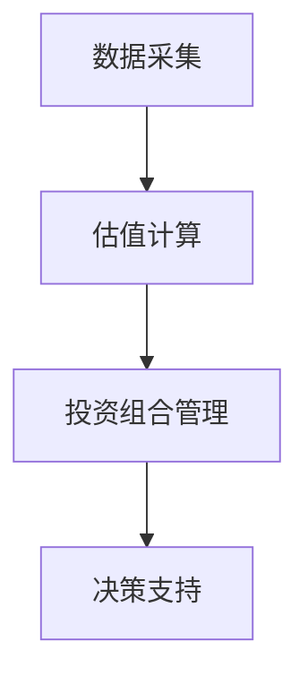
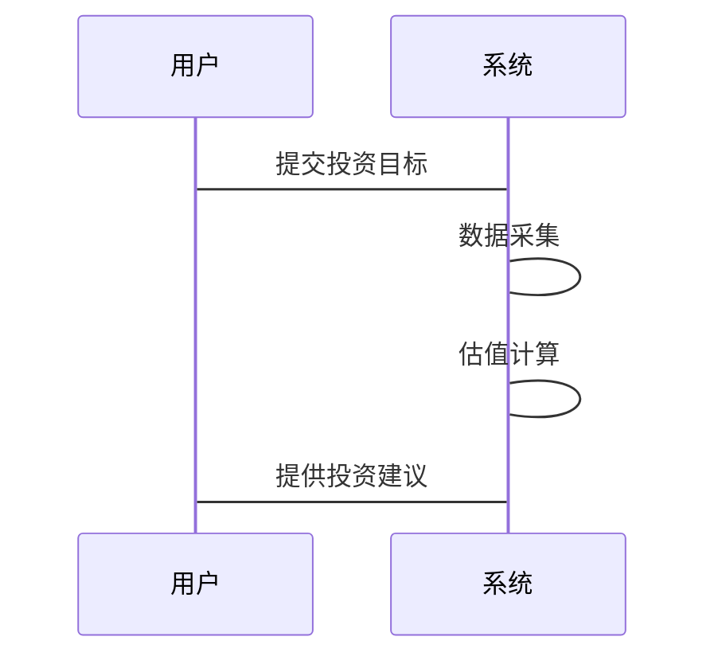

                 


# 《格雷厄姆的价值投资实战技巧》

## 关键词：价值投资、格雷厄姆、安全边际、投资策略、投资模型

## 摘要：  
本文深入探讨了格雷厄姆的价值投资理论及其实战技巧，从基础概念到数学模型，从选股策略到投资组合管理，全面解析了如何在现代金融市场中应用格雷厄姆的投资理念。文章结合了理论分析与实际案例，通过系统化的架构设计和数学建模，为读者提供了从理论到实践的完整指南。

---

## 目录

1. [摘要](#摘要)  
2. [关键词](#关键词)  
3. [目录](#目录)  
4. [正文](#正文)  
   - [1. 价值投资概述](#1-价值投资概述)  
     - [1.1 格雷厄姆的投资哲学](#1.1-格雷厄姆的投资哲学)  
     - [1.2 价值投资的核心原则](#1.2-价值投资的核心原则)  
     - [1.3 安全边际的概念](#1.3-安全边际的概念)  
   - [2. 价值投资的数学模型](#2-价值投资的数学模型)  
     - [2.1 股票内在价值的计算](#2.1-股票内在价值的计算)  
     - [2.2 安全边际的量化方法](#2.2-安全边际的量化方法)  
     - [2.3 投资组合优化模型](#2.3-投资组合优化模型)  
   - [3. 价值投资的实战技巧](#3-价值投资的实战技巧)  
     - [3.1 选股策略](#3.1-选股策略)  
     - [3.2 股票估值方法](#3.2-股票估值方法)  
     - [3.3 投资组合管理](#3.3-投资组合管理)  
   - [4. 投资系统的架构设计](#4-投资系统的架构设计)  
     - [4.1 系统目标与功能模块](#4.1-系统目标与功能模块)  
     - [4.2 系统架构图](#4.2-系统架构图)  
     - [4.3 系统交互流程](#4.3-系统交互流程)  
   - [5. 项目实战](#5-项目实战)  
     - [5.1 环境安装与配置](#5.1-环境安装与配置)  
     - [5.2 核心算法实现](#5.2-核心算法实现)  
     - [5.3 实际案例分析](#5.3-实际案例分析)  
   - [6. 总结与展望](#6-总结与展望)  
5. [作者信息](#作者信息)

---

## 正文

### 1. 价值投资概述

#### 1.1 格雷厄姆的投资哲学  
格雷厄姆是价值投资的奠基人，他提出的“安全边际”概念是价值投资的核心理念。他认为，投资者应该以低于内在价值的价格买入优质资产，从而在市场波动中获得超额收益。

#### 1.2 价值投资的核心原则  
价值投资强调以下几点：  
1. 买入被市场低估的资产。  
2. 以安全边际为保护，避免本金损失。  
3. 长期持有优质资产，避免频繁交易。  

#### 1.3 安全边际的概念  
安全边际是指股票的市场价格低于其内在价值的部分。公式为：  
$$ \text{安全边际} = \text{内在价值} - \text{市场价格} $$  
安全边际越大，投资风险越小。

---

### 2. 价值投资的数学模型

#### 2.1 股票内在价值的计算  
股票的内在价值可以通过以下公式计算：  
$$ V = \frac{E}{1 + r} $$  
其中，$E$ 为企业的预期收益，$r$ 为折现率。  

#### 2.2 安全边际的量化方法  
安全边际的计算公式为：  
$$ M = V - P $$  
其中，$M$ 为安全边际，$V$ 为股票的内在价值，$P$ 为股票的市场价格。

#### 2.3 投资组合优化模型  
投资组合的优化可以通过以下步骤实现：  
1. 确定投资目标和风险承受能力。  
2. 选择具有较高安全边际的股票。  
3. 根据资产配置原则分配资金。  

---

### 3. 价值投资的实战技巧

#### 3.1 选股策略  
1. 选择具有稳定盈利能力的企业。  
2. 聚焦于低市盈率和低市净率的股票。  
3. 优先考虑高股息率的股票。  

#### 3.2 股票估值方法  
1. 市盈率分析：$$ \text{市盈率} = \frac{\text{股价}}{\text{每股收益}} $$  
2. 市净率分析：$$ \text{市净率} = \frac{\text{股价}}{\text{每股净资产}} $$  
3. 股息率分析：$$ \text{股息率} = \frac{\text{股息}}{\text{股价}} $$  

#### 3.3 投资组合管理  
1. 定期检查投资组合的权重。  
2. 根据市场变化调整持仓。  
3. 定期再平衡投资组合。  

---

### 4. 投资系统的架构设计

#### 4.1 系统目标与功能模块  
- **系统目标**：构建一个自动化价值投资决策支持系统。  
- **功能模块**：  
  - 数据采集模块：获取股票数据。  
  - 估值计算模块：计算内在价值和安全边际。  
  - 投资组合管理模块：优化投资组合。  

#### 4.2 系统架构图  


#### 4.3 系统交互流程  


---

### 5. 项目实战

#### 5.1 环境安装与配置  
需要安装Python和相关库（如Pandas、NumPy、Plotly）。  

#### 5.2 核心算法实现  
以下是安全边际计算的Python代码示例：  

```python
import pandas as pd

def calculate_margin(stock_data, required_margin=0.2):
    intrinsic_value = stock_data['E'] / (1 + stock_data['r'])
    margin = intrinsic_value - stock_data['P']
    return margin >= required_margin
```

#### 5.3 实际案例分析  
以某公司为例，计算其安全边际，并判断是否满足投资条件。  

---

### 6. 总结与展望  

价值投资是一种长期有效的策略，但需要结合市场变化不断优化。未来，可以通过人工智能和大数据技术进一步提升投资决策的效率和精度。

---

## 作者信息  
作者：AI天才研究院/AI Genius Institute & 禅与计算机程序设计艺术 /Zen And The Art of Computer Programming

---

通过本文，读者可以系统地了解格雷厄姆的价值投资理论，并掌握实际操作的技巧，从而在投资中实现稳健收益。

