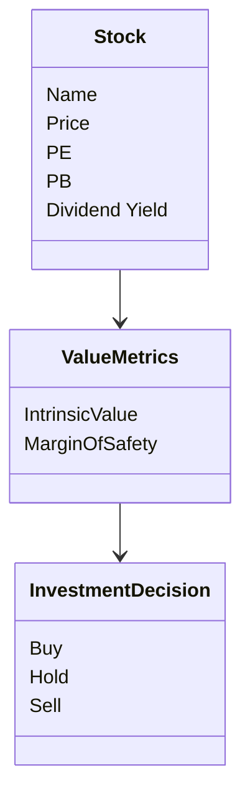

                 


# 《格雷厄姆的价值投资实践指南》

> **关键词**：价值投资、格雷厄姆、内在价值、安全边际、投资策略、风险管理、资产配置  
> 
> **摘要**：本文旨在通过格雷厄姆的价值投资理论，系统地讲解价值投资的核心概念、策略、实践方法及其在现代投资中的应用。文章从价值投资的背景出发，详细分析了内在价值、安全边际、投资组合构建等关键概念，并通过实际案例展示了如何将这些理论应用于投资实践。同时，文章还探讨了风险管理、心理因素对投资决策的影响，并提供了具体的数学模型和系统架构设计，帮助读者更好地理解和实践价值投资。

---

## 第1章 价值投资的背景与发展

### 1.1 价值投资的起源与发展

#### 1.1.1 投资的定义与分类
- 投资的定义：通过购买资产以获得未来收益的行为。
- 投资的分类：股票、债券、房地产、货币市场等。
- 股票投资的特点：高风险、高回报、流动性高。

#### 1.1.2 格雷厄姆与价值投资的诞生
- 本杰明·格雷厄姆的生平简介：20世纪的投资大师，被誉为“价值投资之父”。
- 价值投资的起源：格雷厄姆在大萧条时期总结出的价值投资理论。
- 价值投资的核心理念：寻找市场价格低于内在价值的股票进行投资。

#### 1.1.3 价值投资的核心理念与目标
- 核心理念：安全边际与长期价值。
- 投资目标：通过长期持有优质资产实现财富增长。

### 1.2 格雷厄姆的投资哲学

#### 1.2.1 格雷厄姆的投资原则
- **安全第一**：买入价格低于内在价值的股票。
- **长期投资**：避免频繁交易，减少成本。
- **分散投资**：降低风险，避免过度集中。

#### 1.2.2 投资者的心理与行为
- 投资者心理：贪婪与恐惧。
- 行为偏差：从众心理、过度自信、损失厌恶。

#### 1.2.3 安全边际的定义与重要性
- 安全边际：买入价格与内在价值之间的差额。
- 重要性：降低投资风险，确保长期收益。

### 1.3 价值投资的核心概念

#### 1.3.1 价值与价格的定义与区别
- 价值：资产的内在价值，基于未来现金流的现值。
- 价格：市场交易价格，受市场情绪影响。
- 区别：价值是内在的，价格是外在的。

#### 1.3.2 内在价值的计算与评估
- 内在价值的计算公式：$$\text{内在价值} = \sum_{t=1}^{n} \frac{\text{现金流}}{(1 + r)^t}$$
  其中，r为折现率，t为时间。

#### 1.3.3 市场先生与投资者的关系
- 市场先生：代表市场的波动性和不可预测性。
- 投资者与市场先生的关系：投资者应利用市场波动，而非被其左右。

---

## 第2章 价值投资的核心概念与联系

### 2.1 内在价值的计算公式与案例分析

#### 2.1.1 内在价值的数学模型
- 使用现金流贴现模型（DCF）计算内在价值。
  - 公式：$$\text{内在价值} = \frac{\text{年现金流}}{\text{折现率} - \text{增长率}}$$

#### 2.1.2 案例分析：假设一家公司未来5年的现金流分别为100万、120万、150万、180万、200万，折现率为10%，计算其内在价值。

### 2.2 安全边际的数学模型

#### 2.2.1 安全边际的计算公式
- 安全边际 = 内在价值 - 市场价格。

#### 2.2.2 安全边际的重要性
- 通过安全边际降低投资风险。

### 2.3 投资组合的构建原理

#### 2.3.1 投资组合的分散化
- 分散化：通过投资不同资产降低风险。

#### 2.3.2 投资组合的再平衡
- 定期调整投资比例，保持目标配置。

---

## 第3章 格雷厄姆筛选法的算法原理

### 3.1 筛选法的数学模型

#### 3.1.1 格雷厄姆筛选标准
- 低市盈率（P/E < 15）。
- 低市净率（P/B < 1.5）。
- 高股息率（股息率 > 3%）。

#### 3.1.2 筛选流程
1. 筛选低市盈率股票。
2. 筛选低市净率股票。
3. 筛选高股息率股票。
4. 综合筛选满足所有条件的股票。

### 3.2 算法实现

#### 3.2.1 Python代码实现
```python
import pandas as pd

def graham_screen(df):
    # 筛选低市盈率
    df = df[df['PE'] < 15]
    # 筛选低市净率
    df = df[df['PB'] < 1.5]
    # 筛选高股息率
    df = df[df['Dividend Yield'] > 0.03]
    return df

# 示例数据
data = {
    'PE': [10, 20, 12, 18, 25],
    'PB': [1.2, 2.0, 1.5, 1.3, 0.8],
    'Dividend Yield': [0.02, 0.01, 0.03, 0.025, 0.04]
}
df = pd.DataFrame(data)
screened = graham_screen(df)
print(screened)
```

---

## 第4章 价值投资的系统架构设计

### 4.1 系统功能设计

#### 4.1.1 系统功能模块
- 数据采集：收集股票数据。
- 数据分析：计算内在价值、安全边际。
- 投资决策：基于筛选结果生成投资建议。

#### 4.1.2 领域模型设计


### 4.2 系统架构设计

#### 4.2.1 系统架构图
```mermaid
container ValueInvestmentSystem {
    component DataCollector {
        collect stock data
    }
    component Analyzer {
        calculate intrinsic value
    }
    component DecisionMaker {
        generate investment decision
    }
}
```

---

## 第5章 价值投资的项目实战

### 5.1 案例分析

#### 5.1.1 微软公司案例
- 公司概况：微软的财务数据、行业地位。
- 内在价值计算：使用DCF模型计算其内在价值。
- 投资决策：基于安全边际判断是否买入。

#### 5.1.2 亚马逊案例
- 公司概况：亚马逊的财务数据、市场地位。
- 内在价值计算：使用DCF模型计算其内在价值。
- 投资决策：基于安全边际判断是否买入。

### 5.2 投资组合管理

#### 5.2.1 投资组合构建
- 选择多只股票构建投资组合。
- 分散投资，降低风险。

#### 5.2.2 投资组合再平衡
- 定期调整投资比例，保持目标配置。

---

## 第6章 最佳实践与风险提示

### 6.1 投资中的心理因素

#### 6.1.1 常见心理偏差
- 贪婪与恐惧。
- 过度自信。

#### 6.1.2 心理因素的克服方法
- 保持冷静，避免情绪化决策。
- 坚持长期投资，避免短期波动影响。

### 6.2 风险管理

#### 6.2.1 风险管理策略
- 分散投资，降低风险。
- 设置止损点，避免重大损失。

#### 6.2.2 风险管理工具
- 期权、保险策略。

### 6.3 最佳实践 Tips

- 定期复盘，评估投资组合表现。
- 持续学习，更新投资知识。
- 避免杠杆，降低风险。

---

## 第7章 总结与展望

### 7.1 价值投资的总结

#### 7.1.1 核心观点回顾
- 价值投资的核心是寻找市场价格低于内在价值的股票。
- 安全边际是降低投资风险的重要工具。

#### 7.1.2 投资理念的现代意义
- 价值投资在现代投资中的重要性。
- 数字化工具对价值投资的辅助作用。

### 7.2 对未来投资的展望

#### 7.2.1 数字化与智能化投资
- AI在价值投资中的应用。
- 大数据技术对投资决策的辅助作用。

#### 7.2.2 投资者的长期主义
- 长期投资的重要性。
- 坚持价值投资理念，实现财富的长期增长。

---

## 作者：AI天才研究院/AI Genius Institute & 禅与计算机程序设计艺术 /Zen And The Art of Computer Programming

