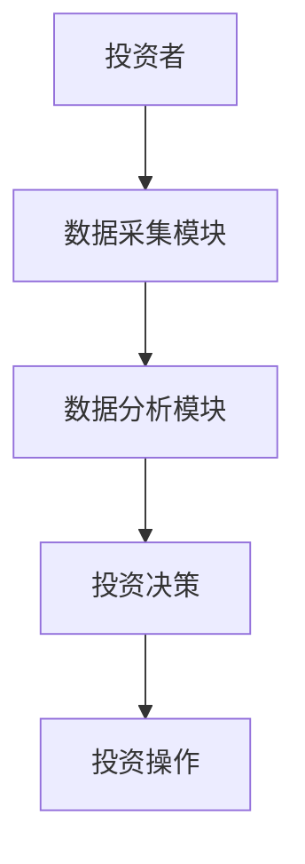
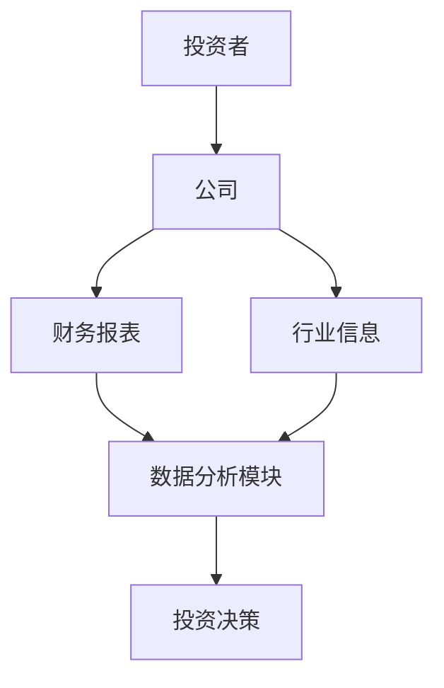
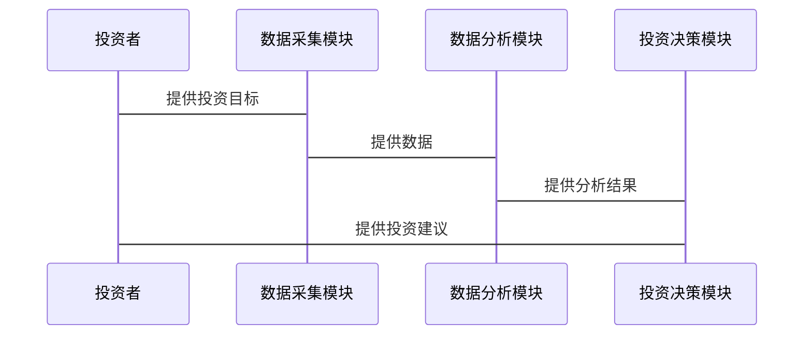

                 

# 《格雷厄姆的价值投资实践案例》

> 关键词：价值投资，格雷厄姆，内在价值，安全边际，投资策略，基本面分析

> 摘要：  
本文深入探讨了格雷厄姆的价值投资理论，并通过实际案例分析展示了如何在实践中应用这些理念。文章从价值投资的背景与核心理念出发，详细讲解了价值投资的分析框架、数学模型与工具，以及系统架构与流程设计。通过具体的股票分析案例，本文展示了如何利用格雷厄姆的选股标准和内在价值计算方法进行投资决策，并总结了价值投资的最佳实践和注意事项。

----------------------------------------------------------------

# 第一部分: 价值投资的背景与核心理念

## 第1章: 价值投资的起源与核心理念

### 1.1 价值投资的起源

#### 1.1.1 投资学的起源与发展
投资学作为一门学科，起源于20世纪初。早期的投资理论主要关注市场的短期波动和投机行为，但随着市场的不断发展，投资者逐渐意识到长期稳健投资的重要性。格雷厄姆的价值投资理论正是在这一背景下诞生的。

#### 1.1.2 格雷厄姆与价值投资的诞生
本杰明·格雷厄姆（Benjamin Graham）被誉为“价值投资之父”。他在20世纪20年代提出了价值投资的理念，强调以低于内在价值的价格买入优质股票，并长期持有。格雷厄姆的理论为后来的价值投资奠定了基础。

#### 1.1.3 价值投资的核心理念与目标
价值投资的核心理念是寻找市场价格低于内在价值的股票，并通过长期持有实现稳健的投资回报。其目标是通过安全边际的保护，降低投资风险，同时追求长期的资本增值。

### 1.2 价值投资的核心概念

#### 1.2.1 投资的定义与分类
投资是指将资金投入到能够产生收益的资产中，以实现财富增值的行为。根据资产类型，投资可以分为股票、债券、房地产等多种形式。在股票投资中，价值投资是一种基于基本面分析的投资策略。

#### 1.2.2 格雷厄姆的价值投资理论
格雷厄姆的价值投资理论强调以下几点：
1. **安全边际**：买入价格低于内在价值的股票，以降低投资风险。
2. **内在价值**：股票的真实价值基于其盈利能力、资产质量和行业地位。
3. **长期持有**：避免短期市场波动的影响，通过长期持有实现价值回归。

#### 1.2.3 安全边际的概念与重要性
安全边际是指股票的市场价格低于其内在价值的部分。通过买入具有较大安全边际的股票，投资者可以在市场波动中降低风险，并为未来的价格回归留出空间。

### 1.3 价值投资的适用场景与边界

#### 1.3.1 价值投资的适用领域
价值投资适用于那些具有稳定盈利能力、良好资产质量和较高股息率的公司。特别适合那些被市场低估的蓝筹股和成长股。

#### 1.3.2 价值投资的边界与限制
尽管价值投资具有许多优势，但也有一些限制：
1. **市场周期**：在市场过热时，价值投资可能表现不佳。
2. **行业选择**：某些行业（如高科技行业）可能不适合价值投资策略。
3. **短期波动**：价值投资需要长期持有，不适合追求短期收益的投资者。

#### 1.3.3 价值投资与其他投资策略的对比
与成长投资、指数投资等策略相比，价值投资更注重安全性和稳定性。成长投资关注公司未来的增长潜力，指数投资则通过分散化降低风险。价值投资则通过寻找低估股票，追求长期稳健的回报。

## 第2章: 价值投资的分析框架

### 2.1 基本面分析的核心要素

#### 2.1.1 财务报表分析
财务报表分析是价值投资的重要组成部分。通过分析公司的利润表、资产负债表和现金流量表，可以评估公司的盈利能力、资产质量和财务健康状况。

#### 2.1.2 行业分析与竞争优势
行业分析帮助投资者了解公司所在行业的竞争格局和未来发展趋势。竞争优势分析则关注公司在行业中的地位、核心竞争力和护城河。

#### 2.1.3 管理层分析
管理层的素质和战略决策能力对公司的长期发展至关重要。价值投资者通常会关注管理层的背景、决策历史和企业治理结构。

### 2.2 格雷厄姆的选股标准

#### 2.2.1 低市盈率与低市净率
格雷厄姆建议投资者关注市盈率（P/E）和市净率（P/B）等估值指标。通常，市盈率低于15倍，市净率低于2倍的股票具有较高的投资价值。

#### 2.2.2 高股息率与盈利能力
高股息率通常意味着公司具有稳定的盈利能力，能够持续向股东分配利润。盈利能力强的公司通常具有较高的内在价值。

#### 2.2.3 安全边际的计算方法
安全边际的计算公式为：  
$$ \text{安全边际} = \text{内在价值} - \text{市场价格} $$  
通过计算安全边际，投资者可以评估股票的投资风险和潜在收益。

### 2.3 价值投资的决策流程

#### 2.3.1 确定投资目标与策略
投资者需要明确自己的投资目标、风险承受能力和投资期限。根据这些因素，制定合适的价值投资策略。

#### 2.3.2 股票筛选与初步评估
通过筛选低市盈率、低市净率和高股息率的股票，初步选出符合价值投资标准的候选股票。

#### 2.3.3 深入研究与风险评估
对候选股票进行深入的基本面分析，评估其内在价值、竞争优势和管理层能力。同时，评估市场风险、行业风险和公司特有风险。

## 第3章: 价值投资的数学模型与分析工具

### 3.1 常用估值指标与公式

#### 3.1.1 市盈率（P/E）公式
市盈率计算公式为：  
$$ \text{P/E} = \frac{\text{股票价格}}{\text{每股净利润}} $$  
市盈率反映了股票的价格相对于其盈利能力的高低。

#### 3.1.2 市净率（P/B）公式
市净率计算公式为：  
$$ \text{P/B} = \frac{\text{股票价格}}{\text{每股净资产}} $$  
市净率反映了股票价格相对于其资产净值的高低。

#### 3.1.3 市盈率增长比（PEG）公式
市盈率增长比计算公式为：  
$$ \text{PEG} = \frac{\text{P/E}}{\text{净利润增长率}} $$  
PEG用于评估股票的估值是否合理，考虑了公司的成长性。

### 3.2 格雷厄姆的内在价值计算

#### 3.2.1 内在价值的定义
内在价值是指股票的真实价值，不受市场短期波动的影响。它基于公司的盈利能力、资产质量和行业地位。

#### 3.2.2 内在价值的计算公式
格雷厄姆提出了内在价值的计算方法：  
$$ \text{内在价值} = \frac{\text{净利润} \times (1 + \text{增长率})}{\text{折现率}} $$  
该公式考虑了公司的盈利能力、增长率和折现率。

#### 3.2.3 估值误差的分析
由于市场波动和公司经营环境的变化，内在价值的计算可能存在误差。投资者需要定期重新评估股票的内在价值，以调整投资决策。

### 3.3 财务指标的权重分析

#### 3.3.1 财务指标的权重分配
价值投资者通常会根据公司的财务指标（如净利润、净资产收益率等）分配权重，以评估其内在价值。

#### 3.3.2 财务指标的综合评分模型
通过综合评分模型，投资者可以对公司的财务状况进行量化评估。例如，使用加权平均法计算各指标的综合得分。

#### 3.3.3 指标权重的动态调整
根据市场环境和公司经营状况的变化，投资者需要动态调整各财务指标的权重，以反映其重要性。

## 第4章: 价值投资的系统架构与流程设计

### 4.1 投资决策的系统架构

#### 4.1.1 数据采集模块
数据采集模块负责收集公司的财务报表、市场数据和行业信息。这些数据是价值投资分析的基础。

#### 4.1.2 数据分析模块
数据分析模块利用数学模型和算法，对收集到的数据进行处理和分析，评估股票的内在价值和安全边际。

#### 4.1.3 投资决策
根据分析结果，投资者可以做出买入、卖出或持有股票的决策。决策过程需要结合市场环境和公司基本面。

### 4.2 价值投资的流程设计

#### 4.2.1 数据流图

#### 4.2.2 ER图

### 4.3 系统接口设计

#### 4.3.1 数据接口
系统需要与外部数据源（如金融数据库）对接，获取实时的市场数据和公司信息。

#### 4.3.2 用户接口
用户界面需要直观易用，方便投资者输入数据和查看分析结果。例如，使用仪表盘展示股票的估值指标和安全边际。

### 4.4 系统交互序列图

## 第5章: 项目实战——格雷厄姆价值投资策略的应用

### 5.1 案例分析：某公司股票的价值评估

#### 5.1.1 公司概况与财务数据
假设我们分析一家公司的股票，其财务数据如下：
- 每股净利润（EPS）：$2.5
- 每股净资产（BPS）：$10
- 股票价格：$20
- 净利润增长率：8%
- 股息率：3%

#### 5.1.2 估值指标计算
计算市盈率（P/E）：  
$$ \text{P/E} = \frac{20}{2.5} = 8 $$  
计算市净率（P/B）：  
$$ \text{P/B} = \frac{20}{10} = 2 $$  
计算PEG：  
$$ \text{PEG} = \frac{8}{0.08} = 10 $$

#### 5.1.3 内在价值评估
根据格雷厄姆的公式计算内在价值：  
$$ \text{内在价值} = \frac{2.5 \times (1 + 0.08)}{0.08} = \frac{2.5 \times 1.08}{0.08} = 33.75 $$  
由于市场价格为20美元，远低于内在价值33.75美元，该股票具有较大的安全边际。

### 5.2 投资决策与操作步骤

#### 5.2.1 确定投资金额
假设投资者计划投资10,000美元，每份股票价格20美元，可以买入500股。

#### 5.2.2 定期复检与再评估
每隔6个月，投资者需要重新评估股票的内在价值和安全边际，根据市场变化调整投资策略。

#### 5.2.3 投资组合管理
将股票加入投资组合，定期调整持仓比例，以分散风险并优化收益。

## 第6章: 价值投资的最佳实践与小结

### 6.1 最佳实践

#### 6.1.1 保持耐心与纪律
价值投资需要长期持有，避免因市场短期波动而频繁交易。

#### 6.1.2 持续学习与更新
市场环境和公司状况不断变化，投资者需要持续学习和更新分析方法。

#### 6.1.3 分散投资与风险管理
通过分散投资降低风险，避免过度集中于某一只股票或行业。

### 6.2 小结

价值投资是一种稳健的投资策略，通过寻找市场价格低于内在价值的股票，实现长期的资本增值。格雷厄姆的价值投资理论为投资者提供了系统的分析框架和工具，但在实际操作中，需要结合市场环境和公司基本面进行动态调整。

### 6.3 注意事项

#### 6.3.1 避免情绪化决策
投资者需要克服贪婪和恐惧的情绪，保持理性决策。

#### 6.3.2 注意市场周期
在市场过热时，价值投资可能表现不佳，需谨慎选择投资标的。

#### 6.3.3 定期评估与调整
根据市场变化和公司基本面，定期评估投资组合并进行必要的调整。

### 6.4 拓展阅读

#### 6.4.1 格雷厄姆的经典著作
- 《证券分析》
- 《聪明的投资者》

#### 6.4.2 其他推荐书籍
- 《投资最重要的事》（彼得·林奇）
- 《投资学原理》（查尔斯·埃利森）

# 作者信息

作者：AI天才研究院/AI Genius Institute & 禅与计算机程序设计艺术 /Zen And The Art of Computer Programming

