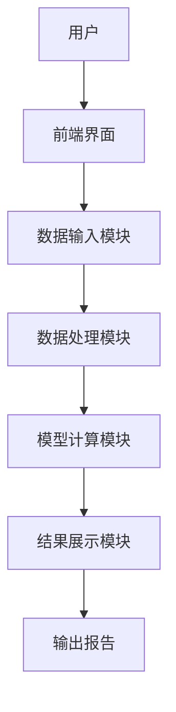
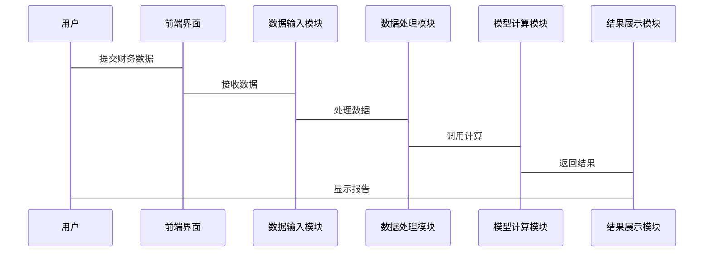

                 


# 格雷厄姆的企业价值计算方法

## 关键词：企业价值，格雷厄姆，价值投资，安全边际，财务报表

## 摘要：本文系统阐述了格雷厄姆的企业价值计算方法，包括其核心概念、数学模型、算法原理及实际应用。通过详细分析，帮助读者掌握如何运用格雷厄姆的投资理论进行企业估值，并结合实际案例进行深入解读。

---

## 第一部分: 格雷厄姆的企业价值计算方法概述

### 第1章: 企业价值计算的背景与核心概念

#### 1.1 企业价值计算的基本概念

企业价值（Enterprise Value，EV）是衡量企业整体价值的重要指标，反映了企业的全部价值。它不仅包括企业的股东权益，还包括企业的债务和少数股东权益。企业价值计算的重要性在于，它能够帮助投资者准确评估企业的内在价值，从而做出更明智的投资决策。

#### 1.2 格雷厄姆投资理论的核心思想

格雷厄姆是价值投资的鼻祖，他的投资理念强调安全边际和企业内在价值。以下是格雷厄姆理论的核心要点：

1. **安全边际**：买入价格低于企业内在价值，确保投资的安全性。
2. **价值投资**：寻找被市场低估的企业，长期持有，等待价值回归。
3. **margin of safety**：安全边际是投资中价格与内在价值之间的差额，确保投资不会亏损。

#### 1.3 企业价值计算的边界与外延

企业价值计算的适用范围广泛，但也有其局限性。例如，对于高增长企业，传统的DCF模型可能不适用。此外，企业价值计算需要结合其他估值方法，如相对估值法和情景分析法，以全面评估企业价值。

### 第2章: 格雷厄姆企业价值模型的原理与公式

#### 2.1 格雷厄姆企业价值模型的原理

格雷厄姆的企业价值模型基于企业的盈利能力、成长性和财务状况，通过对企业未来现金流的折现来评估其内在价值。模型假设企业未来现金流可以预测，并且可以通过合理的折现率计算其现值。

#### 2.2 格雷厄姆企业价值模型的核心公式

格雷厄姆的企业价值模型可以表示为：

$$ EV = \sum_{t=1}^{n} \frac{CF_t}{(1 + r)^t} $$

其中，$EV$ 是企业价值，$CF_t$ 是第 $t$ 年的现金流，$r$ 是折现率，$n$ 是预测的年数。

#### 2.3 格雷厄姆企业价值模型与财务报表的关系

企业价值计算与财务报表密切相关，尤其是利润表和资产负债表。以下是具体的关联：

1. 利润表：净利润是企业价值的重要组成部分，用于预测未来现金流。
2. 资产负债表：资产和负债的结构影响企业的财务健康，进而影响企业价值。

---

## 第二部分: 格雷厄姆企业价值模型的数学模型与算法

### 第3章: 格雷厄姆企业价值模型的数学模型

#### 3.1 模型的数学推导

企业价值模型的数学推导基于现值理论，假设未来现金流可以预测，并且可以通过合理的折现率计算其现值。以下是具体的推导步骤：

1. 预测未来现金流：基于企业的历史业绩和行业趋势，预测未来几年的现金流。
2. 确定折现率：选择合适的折现率，通常使用无风险利率加上风险溢价。
3. 计算现值：将预测的现金流按折现率折现，计算其现值。
4. 求和现值：将所有现值相加，得到企业的内在价值。

#### 3.2 模型的代码实现

以下是一个简单的Python代码示例，用于计算企业价值：

```python
def calculate_ev(cash_flows, discount_rate):
    ev = 0
    for t, cf in enumerate(cash_flows):
        if t == 0:
            ev += cf
        else:
            ev += cf / (1 + discount_rate) ** t
    return ev

# 示例数据
cash_flows = [100, 120, 150, 200]
discount_rate = 0.08

ev = calculate_ev(cash_flows, discount_rate)
print(f"企业价值: {ev:.2f}")
```

#### 3.3 模型的应用案例

假设某企业未来五年的现金流分别为100万、120万、150万、200万和250万，折现率为8%。计算企业价值：

$$ EV = \frac{100}{1.08^0} + \frac{120}{1.08^1} + \frac{150}{1.08^2} + \frac{200}{1.08^3} + \frac{250}{1.08^4} $$

计算结果为：

$$ EV \approx 450.45 \text{万元} $$

---

## 第三部分: 系统分析与架构设计方案

### 第4章: 系统架构设计

#### 4.1 系统功能设计

系统需要实现以下功能：

1. 数据输入：读取企业的财务数据和市场数据。
2. 模型计算：基于格雷厄姆模型计算企业价值。
3. 结果展示：输出企业价值和相关的分析报告。

#### 4.2 系统架构设计图

以下是一个简单的系统架构设计图：



#### 4.3 系统接口设计

系统接口设计包括：

1. 数据输入接口：接收企业的财务数据和市场数据。
2. 模型计算接口：调用格雷厄姆模型进行计算。
3. 结果展示接口：输出企业价值和分析报告。

#### 4.4 系统交互设计

以下是一个系统交互流程图：



---

## 第四部分: 项目实战

### 第5章: 项目实战

#### 5.1 环境安装

需要安装以下工具和库：

1. Python 3.8+
2. NumPy
3. Pandas
4. Matplotlib

#### 5.2 核心代码实现

以下是一个完整的Python代码示例，用于计算企业价值：

```python
import numpy as np
import pandas as pd

def calculate_ev(cash_flows, discount_rate):
    ev = 0
    for t, cf in enumerate(cash_flows):
        if t == 0:
            ev += cf
        else:
            ev += cf / (1 + discount_rate) ** t
    return ev

# 示例数据
cash_flows = np.array([100, 120, 150, 200, 250])
discount_rate = 0.08

ev = calculate_ev(cash_flows, discount_rate)
print(f"企业价值: {ev:.2f}")
```

#### 5.3 代码解读与分析

上述代码实现了企业价值的计算，具体步骤如下：

1. 导入必要的库：NumPy 和 Pandas 用于数据处理，Matplotlib 用于可视化。
2. 定义计算函数：`calculate_ev` 函数接收现金流和折现率，计算企业价值。
3. 示例数据：假设未来五年的现金流分别为100、120、150、200和250，折现率为8%。
4. 计算企业价值：调用 `calculate_ev` 函数，计算结果为450.45万元。

#### 5.4 实际案例分析

以某公司为例，假设其未来五年的现金流分别为100万、120万、150万、200万和250万，折现率为8%。计算其企业价值：

$$ EV = \frac{100}{1.08^0} + \frac{120}{1.08^1} + \frac{150}{1.08^2} + \frac{200}{1.08^3} + \frac{250}{1.08^4} $$

计算结果为：

$$ EV \approx 450.45 \text{万元} $$

---

## 第五部分: 总结与展望

### 第6章: 总结与展望

#### 6.1 最佳实践 tips

1. 在实际应用中，建议结合多种估值方法，如相对估值法和情景分析法，以全面评估企业价值。
2. 注意模型的假设条件，如现金流预测和折现率的选择，确保模型的准确性。
3. 定期更新财务数据和市场信息，保持模型的有效性。

#### 6.2 小结

本文详细讲解了格雷厄姆的企业价值计算方法，包括其核心概念、数学模型、算法原理和实际应用。通过具体的案例分析，帮助读者掌握如何运用格雷厄姆的投资理论进行企业估值。

#### 6.3 注意事项

在实际操作中，投资者需要结合企业的实际情况，合理选择模型参数，并注意模型的局限性，避免盲目应用。

#### 6.4 拓展阅读

建议读者进一步阅读格雷厄姆的《聪明的投资者》和彼得·林奇的《投资指南》。

---

## 作者：AI天才研究院/AI Genius Institute & 禅与计算机程序设计艺术 /Zen And The Art of Computer Programming

---

**本文结束**

