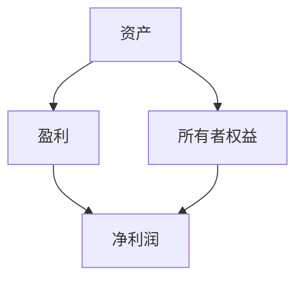
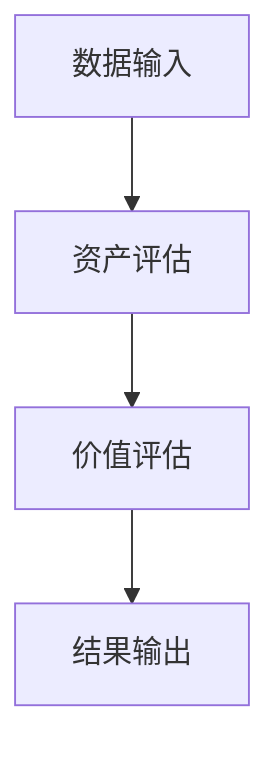
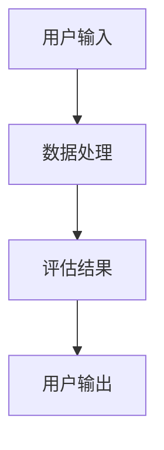

                 

# 格雷厄姆的企业价值评估方法：资产还是盈利？

## 关键词：企业价值评估、格雷厄姆、资产、盈利、价值投资、投资策略

## 摘要：  
本文深入探讨了格雷厄姆的企业价值评估方法，重点分析了资产与盈利在企业价值评估中的重要性。通过详细阐述资产与盈利的定义、评估方法及其在价值投资中的应用，本文旨在帮助投资者更好地理解和运用格雷厄姆的价值评估体系。通过对比分析和实际案例，本文揭示了资产与盈利在企业价值评估中的协同作用，并提出了优化企业价值的实践策略。

---

## 第1章: 格雷厄姆投资理念的背景与核心思想

### 1.1 格雷厄姆的生平与投资理念的形成  
- 1.1.1 格雷厄姆的生平简介  
- 1.1.2 价值投资理念的起源与核心思想  
- 1.1.3 格雷厄姆对企业价值评估的贡献  

### 1.2 价值投资的核心理念  
- 1.2.1 价值投资的定义与特征  
- 1.2.2 企业价值评估的逻辑与目标  
- 1.2.3 格雷厄姆价值评估方法的现代意义  

---

## 第2章: 企业价值评估的核心概念与方法

### 2.1 企业价值评估的基本概念  
- 2.1.1 企业价值的定义与构成  
- 2.1.2 格雷厄姆对企业价值的定义  
- 2.1.3 资产与盈利在企业价值中的作用  

### 2.2 资产与盈利的定义与对比  
- 2.2.1 资产的定义与分类  
- 2.2.2 盈利的定义与分类  
- 2.2.3 资产与盈利的对比分析  

### 2.3 格雷厄姆的资产评估模型  
- 2.3.1 资产的重置成本模型  
- 2.3.2 资产的公允价值模型  
- 2.3.3 资产的账面价值与市场价  

---

## 第3章: 资产与盈利的评估方法

### 3.1 资产评估方法与模型  
- 3.1.1 资产评估的基本方法  
- 3.1.2 市场法  
- 3.1.3 成本法  
- 3.1.4 收益法  

### 3.2 盈利评估方法与模型  
- 3.2.1 盈利能力的衡量指标  
- 3.2.2 净利润的计算与分析  
- 3.2.3 盈利的可持续性与成长性  

### 3.3 资产与盈利的综合评估  
- 3.3.1 资产与盈利的协同效应  
- 3.3.2 资产与盈利的权衡与优化  
- 3.3.3 资产与盈利的动态评估  

---

## 第4章: 格雷厄姆价值评估方法的系统架构设计

### 4.1 价值评估系统的基本架构  
- 4.1.1 价值评估系统的核心功能  
- 4.1.2 价值评估系统的数据流图  

### 4.2 资产评估与盈利分析的系统模块  
- 4.2.1 资产评估模块  
- 4.2.2 盈利分析模块  
- 4.2.3 综合评估模块  

### 4.3 系统架构与交互设计  
- 4.3.1 系统功能模块之间的关系  
- 4.3.2 系统交互流程图  

---

## 第5章: 价值评估的数学模型与算法实现

### 5.1 资产评估的数学模型  
- 5.1.1 资产的重置成本公式  
- 5.1.2 资产的公允价值公式  
- 5.1.3 资产评估的加权平均模型  

### 5.2 盈利分析的数学模型  
- 5.2.1 净利润计算公式  
- 5.2.2 盈利能力分析模型  
- 5.2.3 盈利增长预测模型  

### 5.3 资产与盈利的综合评估模型  
- 5.3.1 综合评估公式  
- 5.3.2 综合评估的权重分配  

---

## 第6章: 价值投资实战与案例分析

### 6.1 价值投资的环境安装与数据准备  
- 6.1.1 数据源的选择与获取  
- 6.1.2 数据清洗与预处理  

### 6.2 价值评估模型的实现  
- 6.2.1 资产评估模块的实现  
- 6.2.2 盈利分析模块的实现  
- 6.2.3 综合评估模块的实现  

### 6.3 实战案例分析  
- 6.3.1 案例背景与目标  
- 6.3.2 数据分析与模型实现  
- 6.3.3 结果解读与投资决策  

---

## 第7章: 价值投资的最佳实践与小结

### 7.1 格雷厄姆价值评估方法的总结  
- 7.1.1 资产与盈利的核心作用  
- 7.1.2 格雷厄姆方法的优缺点  

### 7.2 价值投资的最佳实践  
- 7.2.1 数据质量的重要性  
- 7.2.2 模型的适用性与局限性  
- 7.2.3 投资决策中的风险管理  

### 7.3 小结与展望  
- 7.3.1 本文的总结  
- 7.3.2 未来研究的方向  

---

## 作者：AI天才研究院 & 禅与计算机程序设计艺术

