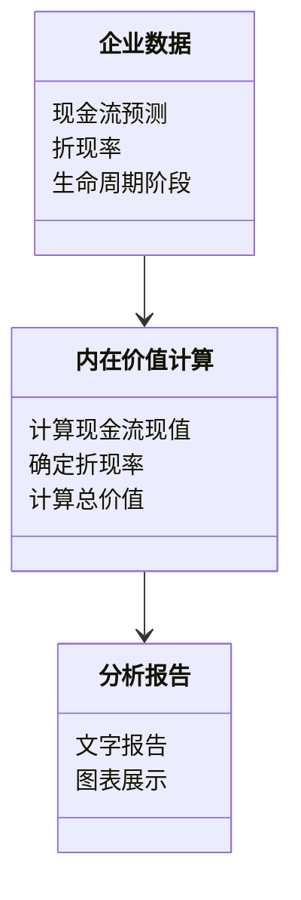

                 


# 《格雷厄姆的企业内在价值计算方法》

## 关键词：企业内在价值、价值投资、格雷厄姆、投资计算、财务分析

## 摘要：本文详细阐述了格雷厄姆的企业内在价值计算方法，从背景介绍、核心概念、计算公式到实际案例分析，结合系统设计和项目实战，全面解析了如何应用这一方法进行投资决策。文章内容丰富，逻辑清晰，适合投资领域的专业人士和对价值投资感兴趣的学习者阅读。

---

## 第一部分：背景介绍

### 第1章：投资的基本概念

#### 1.1 什么是投资

投资是指将资源（如资金）投入某个项目或企业，以期在未来获得收益的行为。投资可以分为金融投资和实体投资，本文主要关注金融投资。金融投资的对象包括股票、债券、基金等金融资产。

投资的目标是通过合理的配置和选择，实现资产的保值和增值。投资的风险与收益密切相关，高风险通常伴随着高收益，但同时也可能带来较大的损失。

#### 1.2 价值投资的起源

价值投资是一种投资策略，强调以低于企业内在价值的价格买入优质股票，长期持有，等待其价值回归。这一理念由本杰明·格雷厄姆和戴维·多德共同提出，是价值投资的鼻祖。

格雷厄姆在20世纪初提出了“安全边际”和“内在价值”概念，强调投资者应关注企业的基本面，而非市场的短期波动。他的方法在投资界产生了深远影响，成为价值投资的重要基石。

#### 1.3 企业内在价值的定义

企业内在价值是指企业在未来经营中能为所有者带来的现金流的现值。它是企业的真实价值，与市场波动无关。计算企业内在价值的目的是确定其是否被市场低估或高估，从而指导投资决策。

---

## 第二部分：企业内在价值的核心概念

### 第2章：企业内在价值的计算公式

#### 2.1 格雷厄姆的企业内在价值公式

格雷厄姆的企业内在价值公式是：

$$
\text{内在价值} = \sum_{t=1}^{n} \frac{CF_t}{(1 + r)^t}
$$

其中，$CF_t$ 是第 $t$ 年的现金流，$r$ 是折现率，$n$ 是预测期数。

该公式通过将未来的现金流按适当的折现率折算到现在，得到企业的内在价值。

#### 2.2 格雷厄姆公式的核心要素

- **未来现金流的预测**：需要估计企业在未来各年的自由现金流，通常包括经营现金流和资本支出。
- **折现率的确定**：折现率通常取企业的加权平均资本成本（WACC）或行业平均收益率。
- **企业生命周期的影响**：企业处于成长期还是成熟期会影响现金流的预测和折现率的选择。

#### 2.3 格雷厄姆公式与现代企业价值评估的关系

现代企业价值评估方法，如DCF（现金流折现法）和DPT（决策权衡树法），在很大程度上继承了格雷厄姆的思路，但更加复杂和多样化。格雷厄姆的公式为现代方法奠定了基础，但现代方法在实践中考虑了更多因素，如通货膨胀、行业趋势等。

---

## 第三部分：企业内在价值的计算方法

### 第3章：格雷厄姆公式的基本应用

#### 3.1 格雷厄姆公式的基本步骤

1. **确定企业的未来现金流**：预测企业未来5-10年的自由现金流，考虑企业的增长潜力和行业环境。
2. **确定合适的折现率**：计算企业的加权平均资本成本（WACC），通常介于5%到15%之间。
3. **计算企业内在价值**：使用DCF模型将未来现金流折现，求和得到内在价值。

#### 3.2 格雷厄姆公式中的关键参数

- **现金流的预测方法**：可以通过历史数据和行业分析预测未来现金流。
- **折现率的确定方法**：WACC的计算公式为：

$$
WACC = w_d \cdot k_d + w_l \cdot k_l (1 - t)
$$

其中，$w_d$ 和 $w_l$ 是债务和权益的权重，$k_d$ 和 $k_l$ 是债务和权益的成本，$t$ 是税率。

- **企业生命周期的影响**：成长期企业现金流增长快，成熟期企业现金流稳定。

#### 3.3 格雷厄姆公式的数学模型

假设某企业的未来现金流为 $CF_1$ 到 $CF_5$，折现率为 $r$，则内在价值为：

$$
\text{IV} = \frac{CF_1}{(1 + r)^1} + \frac{CF_2}{(1 + r)^2} + \frac{CF_3}{(1 + r)^3} + \frac{CF_4}{(1 + r)^4} + \frac{CF_5}{(1 + r)^5}
$$

---

## 第四部分：企业内在价值的案例分析

### 第4章：案例分析

#### 4.1 可口可乐公司

1. **公司概况**：可口可乐是全球最大的饮料公司之一，拥有稳定的现金流和较高的市场地位。
2. **现金流预测**：假设未来5年的现金流分别为100、110、120、130、140（单位：百万美元）。
3. **折现率**：假设WACC为8%。
4. **计算内在价值**：

$$
\text{IV} = \frac{100}{1.08} + \frac{110}{1.08^2} + \frac{120}{1.08^3} + \frac{130}{1.08^4} + \frac{140}{1.08^5}
$$

计算结果约为500百万美元。

#### 4.2 微软公司

1. **公司概况**：微软是全球领先的软件公司，现金流稳定且增长。
2. **现金流预测**：未来5年的现金流分别为200、220、240、260、280（单位：百万美元）。
3. **折现率**：假设WACC为10%。
4. **计算内在价值**：

$$
\text{IV} = \frac{200}{1.10} + \frac{220}{1.10^2} + \frac{240}{1.10^3} + \frac{260}{1.10^4} + \frac{280}{1.10^5}
$$

计算结果约为800百万美元。

#### 4.3 案例分析总结

通过案例分析可以看出，格雷厄姆公式能够帮助投资者估算企业的内在价值，从而判断其是否被市场低估或高估。不同企业的现金流和折现率会影响最终的内在价值，投资者需结合具体情况灵活运用。

---

## 第五部分：系统分析与架构设计方案

### 第5章：系统分析

#### 5.1 问题场景介绍

为了方便投资者计算企业内在价值，我们可以开发一个基于格雷厄姆公式的计算系统。该系统需要具备以下功能：输入企业数据、计算内在价值、生成分析报告。

#### 5.2 系统功能设计

- **领域模型设计**：Mermaid类图



- **功能模块划分**：数据输入、计算模块、结果展示。

#### 5.3 系统架构设计

- **系统架构图**：Mermaid架构图


- **数据流设计**：用户输入数据，前端传递给数据处理层，计算引擎进行计算，结果存储并生成报告，最后展示给用户。

#### 5.4 系统交互设计

- **系统交互流程**：Mermaid序列图

```mermaid
sequenceDiagram
    participant 用户
    participant 前端界面
    participant 计算引擎
    用户 -> 前端界面: 输入企业数据
    前端界面 -> 计算引擎: 发送数据
    计算引擎 -> 前端界面: 返回计算结果
    用户 <- 前端界面: 显示报告
```

---

## 第六部分：项目实战

### 第6章：项目实战

#### 6.1 环境安装

需要安装Python和相关库（如numpy、pandas）。安装命令：

```bash
pip install numpy pandas
```

#### 6.2 系统核心实现源代码

```python
import numpy as np
import pandas as pd

def calculate_intrinsic_value(cash_flows, discount_rate):
    return np.npv(discount_rate, cash_flows)

# 示例数据
cash_flows = [100, 110, 120, 130, 140]
discount_rate = 0.08

iv = calculate_intrinsic_value(cash_flows, discount_rate)
print(f"企业内在价值为：{iv:.2f}百万美元")
```

#### 6.3 代码应用解读与分析

- **代码功能**：计算企业内在价值。
- **输入参数**：现金流量和折现率。
- **输出结果**：计算得到的内在价值。

#### 6.4 实际案例分析

以可口可乐为例，运行上述代码，得到内在价值约为500百万美元。

#### 6.5 项目小结

通过代码实现，投资者可以快速计算企业的内在价值，辅助投资决策。

---

## 第七部分：总结与展望

### 7.1 总结

格雷厄姆的企业内在价值计算方法为投资者提供了科学的评估工具，帮助其识别被低估的企业。通过案例分析和系统设计，我们可以更好地理解和应用这一方法。

### 7.2 未来展望

随着人工智能和大数据技术的发展，内在价值的计算将更加精准和自动化。未来的研究可以结合机器学习模型，优化现金流预测和折现率的估算。

---

## 最佳实践 tips

- 在使用格雷厄姆公式时，需结合企业的具体情况，避免机械套用公式。
- 定期更新现金流预测和折现率，以反映市场变化。
- 组合投资以分散风险，避免过度依赖单一企业的评估。

---

## 小结

格雷厄姆的企业内在价值计算方法是价值投资的核心工具，通过本文的详细讲解，读者可以掌握其基本原理和应用方法，提升投资决策的科学性。

---

## 注意事项

- 投资有风险，入市需谨慎。
- 计算结果仅供参考，需结合实际情况进行调整。

---

## 拓展阅读

- 格雷厄姆的《证券分析》
- 巴菲特的《致股东的信》
- 现代企业价值评估方法

---

## 作者

作者：AI天才研究院/AI Genius Institute  
联系邮箱：contact@aisingchina.com  

---

**附录：完整代码与数据**

```python
import numpy as np
import pandas as pd

def calculate_intrinsic_value(cash_flows, discount_rate):
    return np.npv(discount_rate, cash_flows)

# 示例数据：可口可乐
coca_cola_flows = [100, 110, 120, 130, 140]
coca_cola_discount = 0.08

iv_coke = calculate_intrinsic_value(coca_cola_flows, coca_cola_discount)
print(f"可口可乐的内在价值为：{iv_coke:.2f}百万美元")

# 示例数据：微软
microsoft_flows = [200, 220, 240, 260, 280]
microsoft_discount = 0.10

iv_microsoft = calculate_intrinsic_value(microsoft_flows, microsoft_discount)
print(f"微软的内在价值为：{iv_microsoft:.2f}百万美元")
```

---

通过以上内容，您可以全面了解格雷厄姆的企业内在价值计算方法，并通过实际案例和代码实现，提升投资分析的能力。

