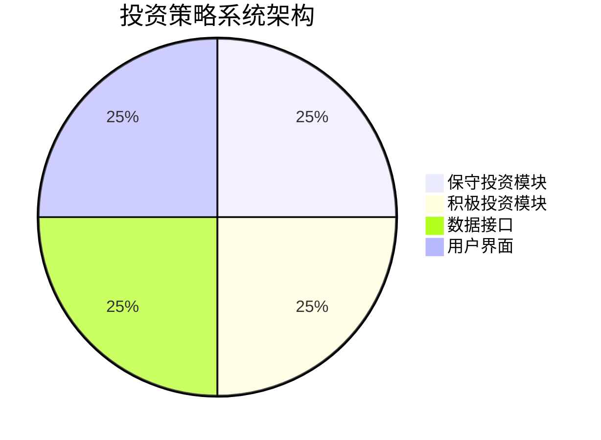
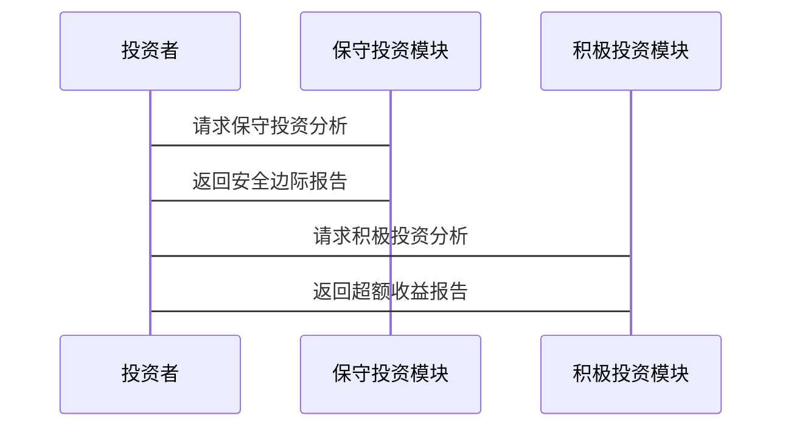

                 


# 格雷厄姆的保守投资策略vs积极投资策略

> 关键词：格雷厄姆，保守投资，积极投资，投资策略，价值投资，风险控制

> 摘要：本文详细探讨了格雷厄姆提出的保守投资策略与积极投资策略的异同，通过数学模型、系统架构和实际案例分析，帮助读者理解两种策略的核心思想、适用场景及优劣势。文章还结合了技术语言的特点，用图表和公式深入剖析了投资策略的内在逻辑，为投资者提供了理论与实践相结合的指导。

---

# 第一部分: 投资策略概述

## 第1章: 投资策略的基本概念

### 1.1 投资的定义与分类

#### 1.1.1 投资的定义与分类
投资是指将资金投入某种资产或项目，以期获得未来收益的行为。根据风险和收益的不同，投资可以分为保守投资和积极投资两大类。

#### 1.1.2 保守投资与积极投资的背景
保守投资强调安全性和稳定性，适合风险承受能力较低的投资者；积极投资则追求超额收益，适合风险承受能力较高的投资者。

#### 1.1.3 格雷厄姆投资理念的核心思想
格雷厄姆是价值投资的鼻祖，他强调以低于内在价值的价格购买优质资产，注重安全边际和长期稳健的收益。

### 1.2 保守投资与积极投资的定义

#### 1.2.1 保守投资的定义与特点
保守投资以稳健为主，注重风险控制，追求稳定的收益。其特点包括低风险、低波动、注重安全边际。

#### 1.2.2 积极投资的定义与特点
积极投资以追求超额收益为主，注重市场时机和资产选择。其特点包括高风险、高波动、注重市场敏感性。

#### 1.2.3 两种策略的适用场景
保守投资适合风险厌恶型投资者，如退休基金、保险资金；积极投资适合风险偏好型投资者，如成长型基金、投机者。

### 1.3 两种投资策略的优劣势对比

#### 1.3.1 保守投资的优势与劣势
优势：风险低、收益稳定、抗跌性强。劣势：收益相对较低，难以在牛市中获得超额收益。

#### 1.3.2 积极投资的优势与劣势
优势：潜在收益高、适合市场上涨周期。劣势：风险高、波动大、需要较强的操作能力。

#### 1.3.3 两种策略的风险与收益分析
保守投资的风险较低，收益较为稳定；积极投资的风险较高，收益波动较大。

---

## 第2章: 保守投资策略的深度分析

### 2.1 保守投资的核心理念

#### 2.1.1 安全边际的概念
安全边际是指购买资产的价格低于其内在价值的部分，确保在市场波动中仍能获得收益。

#### 2.1.2 质值投资的定义
质值投资是指选择具有高质量资产并以合理价格买入的投资策略，注重资产的安全性和稳定性。

#### 2.1.3 避免过度波动的原则
保守投资通过分散投资、选择低波动资产来降低整体风险。

### 2.2 保守投资策略的步骤

#### 2.2.1 确定投资目标
明确投资的目的是为了保值还是增值，设定合理的收益目标和风险承受能力。

#### 2.2.2 选择优质资产
筛选具有稳定现金流、良好财务状况和高分红率的资产。

#### 2.2.3 构建稳健的组合
通过分散投资、平衡资产配置来降低整体风险，确保在市场波动中仍能保持稳定收益。

### 2.3 保守投资的数学模型

#### 2.3.1 安全边际的计算公式
$$ \text{安全边际} = \text{内在价值} - \text{市场价格} $$

#### 2.3.2 资产配置的优化模型
$$ \text{最优资产配置} = \argmin_w \left( \sigma^2 w^T \Sigma w - \lambda \mu^T w \right) $$

其中，$\Sigma$ 是协方差矩阵，$\mu$ 是收益向量，$\lambda$ 是风险偏好系数，$w$ 是资产权重向量。

#### 2.3.3 风险控制的数学分析
$$ \text{风险调整后收益} = \text{预期收益} - \text{风险溢价} \times \text{波动率} $$

---

## 第3章: 积极投资策略的理论基础

### 3.1 积极投资的核心理念

#### 3.1.1 追求超额收益的目标
积极投资通过精选资产和精准的市场时机选择来实现超额收益。

#### 3.1.2 市场有效性的假设
积极投资基于市场存在 inefficiency 的假设，认为通过技术分析和基本面分析可以捕捉超额收益。

#### 3.1.3 投资者情绪的影响
积极投资注重市场情绪的波动，通过逆向思维在市场恐慌时买入，市场狂热时卖出。

### 3.2 积极投资的策略分类

#### 3.2.1 股票选择策略
通过基本面分析和技术分析筛选具有成长性和低估的股票。

#### 3.2.2 市场时机选择
根据市场周期和宏观经济指标选择最佳的买入和卖出时机。

#### 3.2.3 技术分析与基本面分析的结合
结合技术指标和财务数据进行综合判断，提高投资决策的准确性。

### 3.3 积极投资的风险管理

#### 3.3.1 仓位控制的数学模型
$$ \text{最优仓位} = \frac{\text{预期收益}}{\text{波动率}^2} $$

#### 3.3.2 交易成本的优化
通过降低交易频率和选择低佣金交易平台来优化交易成本。

#### 3.3.3 市场波动的应对策略
采用止盈止损策略，设定合理的止损点，避免重大损失。

---

## 第4章: 保守投资与积极投资的对比分析

### 4.1 核心概念对比

#### 4.1.1 投资目标的差异
保守投资注重保值和稳定收益，积极投资注重增值和超额收益。

#### 4.1.2 投资策略的差异
保守投资注重安全边际和分散投资，积极投资注重资产选择和市场时机。

#### 4.1.3 风险承受能力的差异
保守投资适合低风险承受能力的投资者，积极投资适合高风险承受能力的投资者。

### 4.2 数学模型对比

#### 4.2.1 保守策略的风险调整收益模型
$$ \text{风险调整收益} = \frac{\text{预期收益} - \text{无风险利率}}{\text{波动率}} $$

#### 4.2.2 积极策略的超额收益模型
$$ \text{超额收益} = \text{实际收益} - \text{市场收益} $$

#### 4.2.3 不同策略的收益-风险曲线分析
通过收益-风险曲线（Risk-Return Curve）可以直观比较两种策略的风险收益比。

### 4.3 实际场景中的策略选择

#### 4.3.1 不同市场环境下的策略适用性
在熊市中，保守投资更为适合；在牛市中，积极投资更为适合。

#### 4.3.2 投资者心理与策略选择
投资者的风险偏好和心理承受能力是选择策略的重要因素。

---

# 第五部分: 系统分析与架构设计

## 第5章: 投资策略的系统架构

### 5.1 系统功能设计

#### 5.1.1 保守投资模块
- 安全边际计算
- 资产筛选
- 资产配置优化

#### 5.1.2 积极投资模块
- 超额收益计算
- 市场时机选择
- 资产选择优化

### 5.2 系统架构设计



### 5.3 系统接口设计



---

# 第六部分: 项目实战

## 第6章: 项目实战与案例分析

### 6.1 环境安装

#### 6.1.1 安装Python环境
使用Anaconda安装Python 3.9及以上版本。

#### 6.1.2 安装必要的库
安装numpy、pandas、matplotlib等库。

### 6.2 核心代码实现

#### 6.2.1 保守投资模块

```python
import numpy as np
import pandas as pd

def calculate_margin_of_safety(fair_value, market_price):
    return fair_value - market_price

# 示例数据
fair_values = [100, 150, 200]
market_prices = [80, 120, 180]

margins = [calculate_margin_of_safety(fv, mp) for fv, mp in zip(fair_values, market_prices)]
print("安全边际:", margins)
```

#### 6.2.2 积极投资模块

```python
def calculate_excess_return(active_return, market_return):
    return active_return - market_return

# 示例数据
active_returns = [15, 20, 25]
market_returns = [10, 15, 20]

excess_returns = [calculate_excess_return(ar, mr) for ar, mr in zip(active_returns, market_returns)]
print("超额收益:", excess_returns)
```

### 6.3 案例分析

#### 6.3.1 保守投资案例
假设某股票的内在价值为100元，市场价格为80元，安全边际为20元。投资者选择买入该股票，预期在市场回归内在价值时获得20%的收益。

#### 6.3.2 积极投资案例
某股票过去三年的超额收益分别为5%、10%、15%，平均超额收益为10%，高于市场平均水平。

### 6.4 项目小结

#### 6.4.1 核心代码实现总结
通过Python代码实现保守投资和积极投资的核心计算，验证了数学模型的可行性。

#### 6.4.2 案例分析总结
通过实际案例分析，展示了两种策略在不同市场环境下的表现和适用性。

---

## 第7章: 投资策略的最佳实践

### 7.1 最佳实践 tips

#### 7.1.1 定期审视投资组合
根据市场变化和个人财务状况，定期调整投资策略。

#### 7.1.2 保持分散投资
避免过度集中于某一种资产或策略，降低整体风险。

#### 7.1.3 长期投资
投资不是短期交易，而是长期价值的积累。

### 7.2 小结

#### 7.2.1 投资策略的选择
保守投资适合稳健型投资者，积极投资适合风险偏好型投资者。

#### 7.2.2 风险控制的重要性
无论选择何种策略，风险控制都是投资成功的关键。

---

# 结论

本文通过详细分析格雷厄姆的保守投资策略和积极投资策略，探讨了两种策略的核心思想、适用场景及优劣势。通过数学模型、系统架构和实际案例分析，为投资者提供了理论与实践相结合的指导。未来，投资者可以根据自身风险偏好和市场环境，灵活运用这两种策略，实现稳健的收益。

作者：AI天才研究院/AI Genius Institute & 禅与计算机程序设计艺术 /Zen And The Art of Computer Programming

