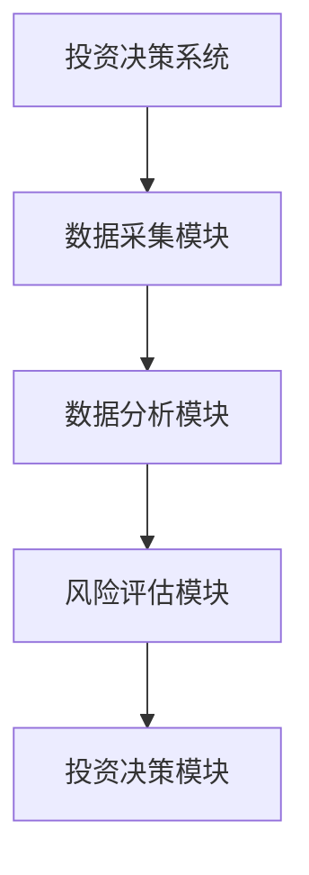

                 


# 格雷厄姆的保守投资者策略

> **关键词**：价值投资、安全边际、风险管理、投资组合、财务分析、长期回报  
> **摘要**：本文深入探讨了本杰明·格雷厄姆的保守投资者策略，从其核心理念、投资方法到现代应用进行了全面分析。通过系统化的技术博客形式，结合逻辑推理和实例分析，为读者揭示了如何在当今复杂多变的市场环境中，运用格雷厄姆的策略实现稳健投资回报。文章还详细介绍了投资决策的系统架构设计和实战案例，帮助读者掌握投资的本质和精髓。

---

## 第一部分: 格雷厄姆的保守投资者策略概述

### 第1章: 投资的基本概念与市场背景

#### 1.1 投资的基本概念
投资是通过将资金投入到能够产生收益的资产中，以实现财富增值的过程。在金融市场中，投资者可以通过购买股票、债券、基金等多种资产类别参与投资。投资的核心在于对资产未来价值的判断和风险管理。

**投资的基本分类**：
- **股票投资**：通过购买公司股份，分享企业成长的收益。
- **债券投资**：通过购买债务工具，获取固定的利息收入。
- **基金投资**：通过购买专业管理的基金产品，分散投资风险。

#### 1.2 资本市场的发展历程
资本市场是现代社会经济发展的重要组成部分。从18世纪的早期股票交易市场到21世纪的数字化交易平台，资本市场经历了巨大的变化。现代资本市场具有高度流动性、信息透明化和全球化的特点，为投资者提供了丰富的投资选择。

**资本市场的核心功能**：
1. **融资功能**：帮助企业筹集发展资金。
2. **价格发现功能**：通过市场交易确定资产的公允价值。
3. **风险管理功能**：通过分散投资降低个体风险。

#### 1.3 投资者与市场的关系
投资者是市场的核心参与者，他们的决策直接影响市场的波动。保守投资者通过长期稳健的投资策略，能够在市场中实现财富的稳定增长。

---

### 第2章: 格雷厄姆的生平与投资理念

#### 2.1 格雷厄姆的生平简介
本杰明·格雷厄姆（Benjamin Graham）是20世纪最伟大的投资思想家之一。他出生于1894年，早年经历了家族破产的挫折，这使他形成了注重安全性和稳健性的投资理念。他在投资领域的主要成就是创立了价值投资理论，并培养了包括沃伦·巴菲特在内的众多投资大师。

#### 2.2 格雷厄姆的投资理念
格雷厄姆的投资理念以“安全边际”为核心，强调以低于内在价值的价格购买优质资产。他认为，投资的本质是寻找“ margin of safety ”，即买入价格与内在价值之间的差距，以降低投资风险。

**格雷厄姆的核心投资原则**：
1. **安全边际**：买入价格低于内在价值。
2. **防御性投资**：选择具有稳定收益和强大财务状况的企业。
3. **长期持有**：避免短期市场波动的影响。

---

### 第3章: 保守投资者的策略与原则

#### 3.1 保守投资者的定义与特征
保守投资者通常具有以下特征：
- 风险厌恶型：对高风险投资持谨慎态度。
- 长期导向：注重长期稳健回报，而非短期收益。
- 价值导向：倾向于购买具有明确内在价值的资产。

#### 3.2 格雷厄姆的保守投资策略
格雷厄姆的保守投资策略强调以下几点：
- **避免过度杠杆**：保持财务稳健，避免过高负债。
- **分散投资**：通过多样化投资降低风险。
- **关注安全边际**：选择价格低于内在价值的资产。

---

## 第二部分: 格雷厄姆的投资分析方法

### 第4章: 格雷厄姆的安全边际计算与投资分析

#### 4.1 安全边际的定义与计算
**安全边际（Margin of Safety）**是格雷厄姆提出的核心概念，指买入价格与资产内在价值之间的差距。通过安全边际，投资者可以降低因市场波动带来的风险。

**安全边际计算公式**：
$$ \text{安全边际} = \text{内在价值} - \text{买入价格} $$

**案例分析**：
假设某公司股票的内在价值为50元，买入价格为40元，则安全边际为10元。

#### 4.2 格雷厄姆的内在价值评估
内在价值是资产在市场中能够持续产生的未来现金流的现值。格雷厄姆认为，内在价值是决定投资价值的关键因素。

**内在价值计算模型**：
$$ \text{内在价值} = \frac{\text{未来现金流}}{\text{折现率}} $$

---

### 第5章: 格雷厄姆策略的现代应用

#### 5.1 现代市场环境的变化
现代市场环境与格雷厄姆时代相比发生了巨大变化：
- **技术进步**：大数据和人工智能技术为投资分析提供了新的工具。
- **全球化**：投资者可以投资全球市场，分散风险。
- **信息透明化**：投资者能够快速获取企业财务信息。

#### 5.2 格雷厄姆策略的优化与调整
在现代市场中，格雷厄姆策略需要结合新的技术手段进行优化：
- **量化分析**：利用大数据和算法进行投资决策。
- **风险管理**：引入现代风险管理工具，如VaR（在险价值）模型。

---

## 第三部分: 投资决策的系统分析与架构设计

### 第6章: 投资决策的系统架构设计

#### 6.1 投资决策系统的总体架构
投资决策系统是一个复杂的系统工程，主要包括以下模块：
1. **数据采集模块**：获取企业财务数据和市场数据。
2. **数据分析模块**：对数据进行清洗和分析。
3. **风险评估模块**：评估投资风险。
4. **投资决策模块**：基于分析结果做出投资决策。

**系统架构图**：


---

### 第7章: 项目实战与案例分析

#### 7.1 项目环境与工具安装
- **工具选择**：使用Python和Pandas进行数据处理。
- **数据来源**：从公开的财务报表中获取企业数据。

#### 7.2 核心代码实现
```python
import pandas as pd

def calculate_margin_of_safety(intrinsic_value, purchase_price):
    return intrinsic_value - purchase_price

# 示例数据
intrinsic_value = 50
purchase_price = 40

# 计算安全边际
margin = calculate_margin_of_safety(intrinsic_value, purchase_price)
print(f"安全边际为：{margin}元")
```

---

## 第四部分: 总结与最佳实践

### 第8章: 总结与最佳实践

#### 8.1 小结
格雷厄姆的保守投资者策略是一种长期有效的投资方法，其核心在于安全边际和内在价值评估。通过合理分散投资和严格的风险管理，投资者可以在复杂多变的市场中实现稳健回报。

#### 8.2 注意事项
- 避免过度杠杆，保持财务稳健。
- 定期复盘投资组合，及时调整。
- 保持对市场的学习和研究。

#### 8.3 拓展阅读
推荐阅读格雷厄姆的经典著作《证券分析》和巴菲特的《巴菲特致股东的信》，深入了解价值投资的精髓。

---

**作者：AI天才研究院/AI Genius Institute & 禅与计算机程序设计艺术 /Zen And The Art of Computer Programming**

