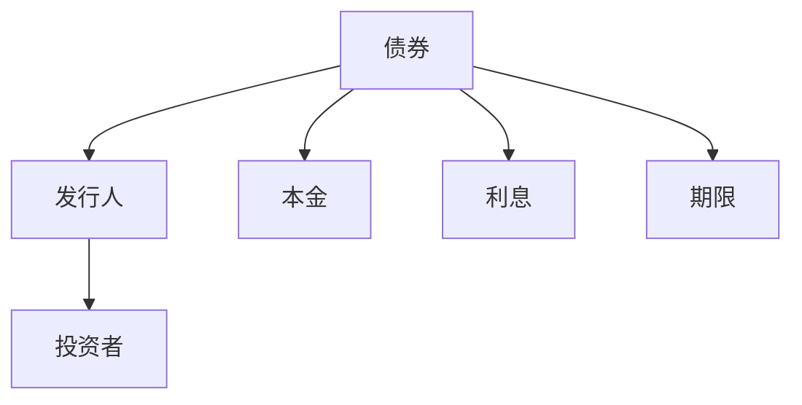
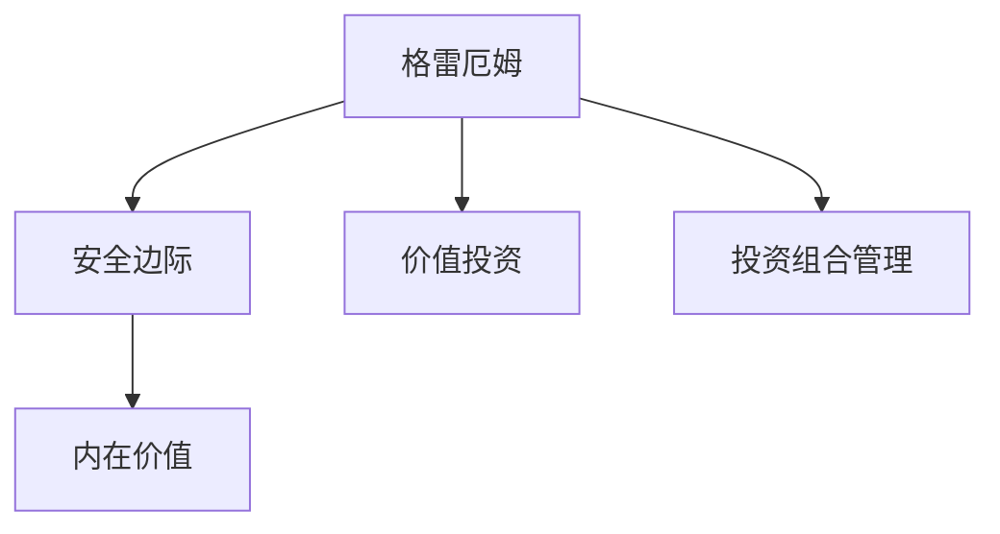

                 

# 格雷厄姆的债券投资原则

## 关键词：
债券投资、格雷厄姆、安全边际、内在价值、投资策略

## 摘要：
本文深入探讨了格雷厄姆的债券投资原则，从基本概念到核心理念，从策略分析到实战案例，系统地解析了格雷厄姆的投资思想及其在现代债券投资中的应用。文章详细阐述了安全边际、内在价值等核心概念，并结合实际案例，分析了如何在债券投资中实现长期稳健收益。通过本文，读者将全面理解格雷厄姆的债券投资原则及其对投资决策的指导意义。

---

## 第一部分：债券投资的基本概念

### 第1章：债券的定义与特点

#### 1.1 债券的定义与特点

债券是一种债务工具，发行人向投资者借款，并承诺在特定时间内支付利息和本金。以下是债券的主要特点：

- **本金保证**：债券的本金通常在到期时由发行人偿还。
- **固定收益**：债券的利息通常在债券存续期内按固定频率支付。
- **期限结构**：债券的期限从短期（如国库券）到长期（如30年期债券）不等。
- **信用风险**：债券的信用风险取决于发行人的信用评级。

#### 1.2 格雷厄姆的生平与投资理念

本节将介绍格雷厄姆的生平及其投资理念，特别是他对债券投资的贡献。

格雷厄姆是价值投资的鼻祖，他的投资理念强调安全边际和内在价值。他认为，投资者应该以低于内在价值的价格买入资产，以确保安全边际的存在。

---

## 第二部分：债券投资的核心原则

### 第2章：安全边际的概念

#### 2.1 安全边际的定义

安全边际是指资产的市场价格低于其内在价值的部分。以下是安全边际的定义和计算方法：

- **定义**：安全边际 = 内在价值 - 市场价格
- **计算公式**：$$ \text{安全边际} = \text{内在价值} - \text{市场价格} $$

#### 2.2 安全边际的重要性

安全边际的重要性体现在以下几个方面：

1. **降低风险**：通过购买价格低于内在价值的债券，投资者可以降低本金损失的风险。
2. **提高收益**：安全边际提供了额外的收益空间，使得投资更加稳健。

#### 2.3 如何计算安全边际

以下是计算安全边际的步骤：

1. 确定债券的内在价值。
2. 计算债券的市场价格。
3. 计算安全边际。

---

### 第3章：内在价值的评估

#### 3.1 内在价值的定义

内在价值是指债券在合理市场条件下应有的价值，通常基于其未来现金流的现值。

#### 3.2 内在价值的计算方法

以下是计算内在价值的步骤：

1. 确定债券的票面利率和期限。
2. 估计债券的信用风险。
3. 计算债券的未来现金流。
4. 使用适当的折现率将未来现金流折现。

#### 3.3 内在价值与市场价的关系

内在价值与市场价的关系如下：

- 当市场价格低于内在价值时，债券具有投资价值。
- 当市场价格高于内在价值时，债券可能被高估。

---

### 第4章：市场先生的概念

#### 4.1 市场先生的定义

市场先生是格雷厄姆提出的一个概念，代表市场的情绪和波动性。

#### 4.2 市场先生的波动性

市场先生的波动性是债券投资中需要考虑的重要因素。

#### 4.3 如何应对市场先生的波动

以下是应对市场先生波动的策略：

1. 长期投资：避免频繁交易，减少市场波动的影响。
2. 价值投资：以内在价值为导向，避免被市场情绪左右。

---

## 第三部分：债券投资的策略与方法

### 第5章：债券定价的原理

#### 5.1 债券价格的决定因素

债券价格的决定因素包括：

- 利率水平
- 信用风险
- 市场供需

#### 5.2 利率对债券价格的影响

利率上升时，债券价格下降；利率下降时，债券价格上涨。

#### 5.3 债券收益率的计算

债券收益率的计算公式为：

$$ \text{收益率} = \frac{\text{利息} + (\text{市场价格} - \text{面值})}{\text{面值}} $$

---

### 第6章：投资组合的构建

#### 6.1 投资组合的概念

投资组合是指投资者持有的多种资产的组合。

#### 6.2 投资组合的风险分散

通过持有多种债券，可以分散单一债券的风险。

#### 6.3 格雷厄姆的债券投资组合策略

格雷厄姆建议投资者分散投资，选择具有较高信用评级的债券。

---

## 第四部分：债券投资的风险管理

### 第7章：债券投资的主要风险

#### 7.1 利率风险

利率风险是指债券价格因利率变化而波动的风险。

#### 7.2 信用风险

信用风险是指债券发行人违约的风险。

#### 7.3 流动性风险

流动性风险是指债券难以快速变现的风险。

---

### 第8章：风险管理的策略

#### 8.1 分散投资

通过持有多种债券，可以分散利率风险和信用风险。

#### 8.2 选择优质债券

选择具有高信用评级的债券，可以降低违约风险。

#### 8.3 定期评估投资组合

定期评估投资组合，及时调整以应对市场变化。

---

## 第五部分：总结与展望

### 第9章：格雷厄姆债券投资原则的总结

#### 9.1 核心理念回顾

格雷厄姆的债券投资原则强调安全边际和内在价值。

#### 9.2 关键原则总结

1. 以低于内在价值的价格买入债券。
2. 选择具有高信用评级的债券。
3. 分散投资以降低风险。

#### 9.3 投资理念的现代意义

格雷厄姆的投资理念在现代债券投资中仍然具有重要的指导意义。

---

## 第六部分：附录

### 附录A：格雷厄姆的经典著作

#### 1. 《证券分析》

《证券分析》是格雷厄姆的经典著作，详细阐述了债券分析的方法。

#### 2. 《聪明的投资者》

《聪明的投资者》是格雷厄姆的另一部经典著作，提出了价值投资的理念。

#### 3. 其他相关书籍

推荐读者阅读以下书籍：

- 《债券入门》
- 《投资学基础》

---

## 作者信息

作者：AI天才研究院/AI Genius Institute & 禅与计算机程序设计艺术 /Zen And The Art of Computer Programming

---

这篇文章全面解析了格雷厄姆的债券投资原则，从基本概念到核心理念，从策略分析到风险管理，为读者提供了系统的知识框架和实用的指导。

