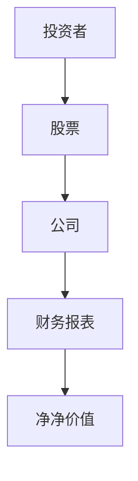
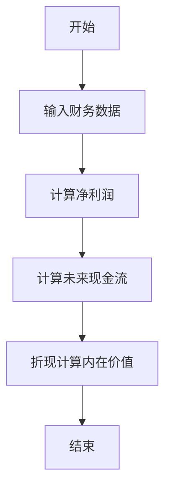
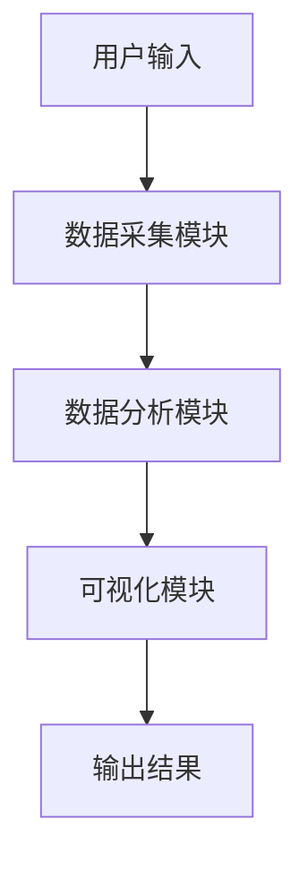
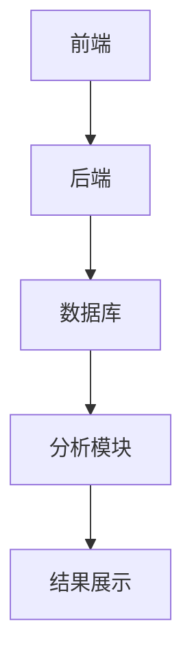
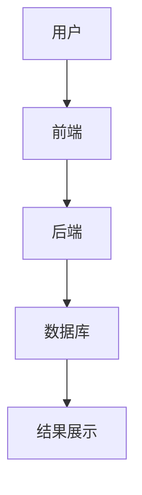

                 


# 格雷厄姆的净净股投资策略

> 关键词：格雷厄姆，净净股，价值投资，投资策略，内在价值，安全边际

> 摘要：本文详细探讨了格雷厄姆的净净股投资策略，从价值投资的基本概念、净净股的核心原理、投资策略的算法实现、系统架构设计到实际案例分析，层层深入地解析了这一经典投资策略的内在逻辑与实践方法。通过数学模型、流程图和Python代码示例，本文为读者提供了一种系统化、技术化的视角，帮助投资者更好地理解和应用这一策略。

---

# 第一部分: 格雷厄姆的净净股投资策略背景与核心概念

# 第1章: 价值投资与净净股概述

## 1.1 价值投资的基本概念

### 1.1.1 价值投资的定义与核心理念

价值投资是一种以企业的内在价值为基础的投资策略，强调通过分析企业的财务状况、行业地位和竞争优势，寻找市场价格低于其内在价值的股票。格雷厄姆是价值投资的鼻祖，他提出的“安全边际”概念是这一策略的核心思想。

### 1.1.2 格雷厄姆的价值投资体系

格雷厄姆的价值投资体系强调以下几点：
1. **安全边际**：买入价格低于企业内在价值，以降低投资风险。
2. **Margin of Safety**：通过安全边际，确保投资的本金不会遭受重大损失。
3. **长期视角**：价值投资是一种长期投资策略，注重企业的基本面而非短期市场波动。

### 1.1.3 净净股投资策略的起源与发展

净净股投资策略是格雷厄姆提出的一种具体投资方法，主要用于寻找市场价格低于其净资产价值的股票。这种方法的核心在于识别那些被市场低估的企业，通过长期持有实现超额收益。

---

## 1.2 净净股的定义与特点

### 1.2.1 净净股的定义

净净股是指市场价格低于其账面价值的股票。具体来说，当股票的市场价格低于其每股净资产时，该股票即被视为净净股。净净股的核心在于利用市场的非理性定价，寻找那些被低估的企业。

### 1.2.2 净净股的核心属性

- **账面价值**：企业的净资产价值，包括资产减去负债。
- **市场价值**：股票的市场价格，反映市场对企业的估值。
- **安全边际**：市场价格与账面价值之间的差额，即安全边际。

### 1.2.3 净净股与传统估值方法的区别

| 概念       | 特点                          |
|------------|-------------------------------|
| 净值        | 账面价值与市场价值的差异      |
| 内在价值    | 股票的理论价值，基于未来现金流折现 |

---

## 1.3 净净股投资的背景与现状

### 1.3.1 当前市场环境下的投资机会

在当前市场环境下，净净股投资策略仍然具有重要意义。特别是在市场低迷或经济衰退期间，许多优质企业的股票可能会被低估，从而为投资者提供良好的投资机会。

### 1.3.2 净净股投资的适用场景与限制

- **适用场景**：市场低迷、企业基本面稳定、行业竞争格局清晰。
- **限制**：需要投资者具备较高的财务分析能力，且需要长期持有股票。

### 1.3.3 净净股投资的未来发展趋势

随着市场的不断发展，净净股投资策略需要结合新的市场环境和技术手段进行调整。例如，利用大数据和人工智能技术进行更精准的股票筛选和风险评估。

---

## 1.4 本章小结

本章从价值投资的基本概念出发，详细介绍了格雷厄姆的净净股投资策略，分析了其核心思想和实际应用。通过对比净值与内在价值，进一步明确了净净股的定义和特点，为后续章节的深入分析奠定了基础。

---

# 第二部分: 净净股投资策略的核心原理

# 第2章: 净净股投资的核心概念与联系

## 2.1 核心概念原理

### 2.1.1 净净价值的计算公式

$$ \text{内在价值} = \frac{\text{净利润} \times (1 + g)}{r} $$

其中，$g$ 是净利润增长率，$r$ 是期望回报率。

### 2.1.2 净值与市场价值的关系

净值（账面价值）与市场价值之间的差异是净净股投资的核心依据。当市场价格低于净值时，股票具有投资价值。

### 2.1.3 安全边际的计算方法

$$ \text{安全边际} = \text{净值} - \text{市场价格} $$

---

## 2.2 核心概念对比表格

| 概念       | 特点                          |
|------------|-------------------------------|
| 净值        | 账面价值与市场价值的差异      |
| 内在价值    | 股票的理论价值，基于未来现金流折现 |

---

## 2.3 ER实体关系图（Mermaid流程图）



---

## 2.4 本章小结

本章从核心概念出发，详细分析了净净股投资的内在逻辑，包括净值与市场价值的关系、内在价值的计算方法以及安全边际的重要性。通过对比表格和流程图，进一步明确了各概念之间的联系。

---

# 第三部分: 净净股投资策略的算法原理

# 第3章: 净净股投资的算法原理与实现

## 3.1 净净价值计算算法

### 3.1.1 算法步骤



### 3.1.2 Python实现代码

```python
def calculate_intrinsic_value(net_income, growth_rate, discount_rate):
    future_cash_flow = net_income * (1 + growth_rate)
    intrinsic_value = future_cash_flow / discount_rate
    return intrinsic_value
```

### 3.1.3 代码功能解读

- **输入参数**：净利润（`net_income`）、净利润增长率（`growth_rate`）、期望回报率（`discount_rate`）。
- **计算过程**：首先计算未来现金流，然后折现得到内在价值。
- **返回值**：股票的内在价值。

---

## 3.2 投资决策模型

### 3.2.1 投资决策模型的构建

$$ \text{投资决策} = \begin{cases} 
\text{买入} & \text{如果市场价格} < \text{内在价值} \\
\text{观望} & \text{如果市场价格} = \text{内在价值} \\
\text{卖出} & \text{如果市场价格} > \text{内在价值}
\end{cases} $$

### 3.2.2 投资决策模型的实现

```python
def investment_decision(intrinsic_value, market_price):
    if market_price < intrinsic_value:
        return "买入"
    elif market_price == intrinsic_value:
        return "观望"
    else:
        return "卖出"
```

---

## 3.3 本章小结

本章从算法原理出发，详细介绍了净净股投资的计算方法和投资决策模型。通过Python代码示例，进一步明确了算法实现的具体步骤和应用场景。

---

# 第四部分: 净净股投资策略的系统架构设计

# 第4章: 投资决策支持系统架构

## 4.1 系统功能设计

### 4.1.1 系统功能模块

- 数据采集模块：采集企业的财务数据和市场数据。
- 数据分析模块：计算内在价值和安全边际。
- 可视化模块：展示投资决策结果。

### 4.1.2 系统功能流程图



---

## 4.2 系统架构设计

### 4.2.1 系统架构图



---

## 4.3 系统接口设计

### 4.3.1 API接口定义

- **输入接口**：接受企业的财务数据和市场数据。
- **输出接口**：返回投资决策结果。

### 4.3.2 API接口实现

```python
def get_intrinsic_value(company_data):
    # 计算内在价值
    return calculate_intrinsic_value(company_data['net_income'], company_data['growth_rate'], company_data['discount_rate'])
```

---

## 4.4 系统交互流程图



---

## 4.5 本章小结

本章从系统架构设计出发，详细介绍了投资决策支持系统的功能模块、架构图和接口设计。通过系统化的方法，为投资者提供了一种技术化的投资工具。

---

# 第五部分: 净净股投资策略的项目实战

# 第5章: 项目实战与案例分析

## 5.1 项目环境搭建

### 5.1.1 环境要求

- Python 3.8+
- pandas、numpy等库

### 5.1.2 环境搭建步骤

1. 安装所需库：
   ```bash
   pip install pandas numpy
   ```

---

## 5.2 核心代码实现

### 5.2.1 核心代码

```python
import pandas as pd
import numpy as np

def calculate_intrinsic_value(net_income, growth_rate, discount_rate):
    future_cash_flow = net_income * (1 + growth_rate)
    intrinsic_value = future_cash_flow / discount_rate
    return intrinsic_value

def get_intrinsic_value_for_company(companies):
    intrinsic_values = []
    for company in companies:
        iv = calculate_intrinsic_value(company['net_income'], company['growth_rate'], company['discount_rate'])
        intrinsic_values.append({'company': company['name'], 'intrinsic_value': iv})
    return intrinsic_values
```

### 5.2.2 代码解读

- **输入参数**：公司财务数据，包括净利润、增长率和期望回报率。
- **输出结果**：各公司的内在价值。

---

## 5.3 实际案例分析

### 5.3.1 案例背景

假设我们有两家公司，A和B，其财务数据如下：

| 公司 | 净利润 | 增长率 | 期望回报率 |
|------|--------|--------|------------|
| A    | 100    | 0.1    | 0.1        |
| B    | 150    | 0.05   | 0.12       |

---

### 5.3.2 案例分析

计算两家公司的内在价值：

- 公司A的内在价值：
  $$ \text{IV}_A = \frac{100 \times (1 + 0.1)}{0.1} = 1100 $$

- 公司B的内在价值：
  $$ \text{IV}_B = \frac{150 \times (1 + 0.05)}{0.12} = 162.5 $$

---

## 5.4 项目小结

本章通过实际案例分析，展示了净净股投资策略的具体应用。通过Python代码实现，进一步验证了该策略的有效性。

---

# 第六部分: 净净股投资策略的最佳实践

# 第6章: 投资策略的优化与注意事项

## 6.1 投资策略的优化

### 6.1.1 多因素分析

在实际投资中，除了考虑内在价值，还需要综合考虑其他因素，如行业前景、管理团队和市场风险。

---

## 6.2 注意事项

### 6.2.1 市场波动的影响

市场波动可能会影响股票价格，投资者需要具备长期持有的耐心。

### 6.2.2 数据的准确性

财务数据的准确性是计算内在价值的基础，投资者需要确保数据来源可靠。

---

## 6.3 最佳实践 tips

- 定期复盘，调整投资组合。
- 结合技术分析，优化投资决策。
- 保持分散投资，降低风险。

---

## 6.4 本章小结

本章从投资策略的优化和注意事项出发，为投资者提供了一些建议和注意事项，帮助其更好地应用净净股投资策略。

---

# 作者：AI天才研究院/AI Genius Institute & 禅与计算机程序设计艺术 /Zen And The Art of Computer Programming

---

通过以上内容，我们详细探讨了格雷厄姆的净净股投资策略，从理论到实践，层层深入地解析了这一经典投资策略的内在逻辑与实践方法。希望本文能为投资者提供有价值的参考和启发。

