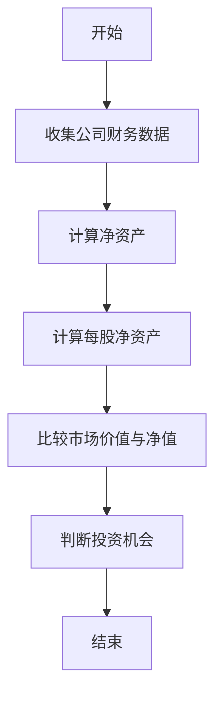

                 


# 格雷厄姆的净净股策略：在高科技股中寻找价值

## 关键词：
- 净净股策略
- 高科技股
- 价值投资
- 股票估值
- 投资策略

## 摘要：
本文详细探讨了本杰明·格雷厄姆提出的净净股策略在高科技股票投资中的应用。通过分析净净股的定义、计算方法及其在高科技股中的具体应用，本文旨在帮助投资者识别具有潜在投资价值的高科技公司。文章结合数学模型、算法流程和实际案例，深入解析了如何利用净净股策略进行有效的投资决策，并提供了系统的架构设计方案和项目实战指南，帮助读者在复杂多变的股市中寻找稳健的投资机会。

---

# 第1章 净净股策略的背景与核心概念

## 1.1 净净股策略的起源与发展

### 1.1.1 净净股策略的定义与历史背景
净净股策略是一种以基本面分析为基础的投资策略，由投资大师本杰明·格雷厄姆提出。该策略的核心在于通过分析公司的净资产价值，寻找那些市场价格低于其内在价值的股票，即“净净股”。净净股的定义可以表示为：
$$ 净值 = 每股净资产 = \frac{净资产}{总股数} $$

净净股策略的起源可以追溯到20世纪30年代的经济大萧条时期，格雷厄姆通过研究市场的波动性和投资者的心理行为，提出了这一策略，以帮助投资者在市场恐慌中寻找低估的投资机会。

### 1.1.2 格雷厄姆的价值投资理念
格雷厄姆的价值投资理念强调以低于公司净资产价值的价格买入股票，以确保投资的安全性和稳定性。他认为，市场先生（市场情绪）经常会提供低于公司内在价值的价格，这是投资者的机会。净净股策略正是这一理念的具体体现。

### 1.1.3 高科技股的特殊性与投资机会
高科技股的特点是成长性强、波动性大、研发投入高。然而，由于其高成长性和高波动性，高科技股往往被市场情绪所左右，这为净净股策略提供了应用空间。通过分析高科技公司的净资产和市场价值之间的差异，投资者可以发现那些被市场低估的潜力股。

## 1.2 净净股策略的核心要素

### 1.2.1 净资产与市场价值的关系
净资产是公司所有资产减去负债后的净值，而市场价值则是公司股票在市场上的交易价格。净净股策略关注的是两者之间的差异，即：
$$ 市场价值 = 股价 \times 总股数 $$
$$ 净值 = 每股净资产 = \frac{净资产}{总股数} $$

当市场价值低于净值时，股票可能被低估，此时是买入的好时机。

### 1.2.2 净净股的计算公式与应用
净净股的计算公式为：
$$ 净值 = \frac{净资产}{总股数} $$

应用净净股策略时，投资者需要比较市场价值与净值，即：
$$ 股价 \times 总股数 < 净资产 $$

如果上述条件成立，则该股票可能被低估，具备投资价值。

### 1.2.3 净净股策略的适用场景与限制
净净股策略适用于那些资产-heavy的行业，如制造业、银行业等，尤其适用于在市场恐慌或衰退时期。然而，对于高科技股而言，由于其无形资产较多，净净股策略的应用需要结合其他指标进行综合判断。

---

# 第2章 净净股策略的数学模型与公式

## 2.1 净净股计算的数学模型

### 2.1.1 净资产的计算公式
$$ 净资产 = 资产 - 负债 $$

### 2.1.2 净值的计算公式
$$ 净值 = 每股净资产 = \frac{净资产}{总股数} $$

### 2.1.3 市场价值与净值的对比
$$ 市场价值 = 股价 \times 总股数 $$

通过比较市场价值与净资产，投资者可以判断股票是否被低估：
$$ 股价 \times 总股数 < 净资产 \quad \text{时，股票可能被低估} $$

## 2.2 净净股策略的数学分析

### 2.2.1 净值与股价的关系图解
以下是一个简单的净值与股价关系的图表：


### 2.2.2 净值与市场价值的差异分析
当市场价值低于净资产时，股票的投资价值较高，此时可能是买入的好时机。

### 2.2.3 净净股策略的数学模型应用
通过以下步骤可以应用净净股策略：
1. 计算公司的净资产。
2. 计算每股净资产。
3. 比较股价与每股净资产，判断是否低估。

---

# 第3章 净净股策略的算法原理与流程

## 3.1 净净股策略的算法步骤

### 3.1.1 数据收集与处理
1. 收集目标公司的财务数据，包括资产、负债、总股数等。
2. 计算净资产：$$ 净资产 = 资产 - 负债 $$
3. 计算每股净资产：$$ 每股净资产 = \frac{净资产}{总股数} $$
4. 获取当前股价。
5. 比较市场价值与净资产：$$ 股价 \times 总股数 < 净资产 $$

### 3.1.2 算法流程图


## 3.2 净净股策略的代码实现

### 3.2.1 Python代码示例
```python
def calculate_net_asset_value(company_data):
    assets = company_data['assets']
    liabilities = company_data['liabilities']
    total_equity = assets - liabilities
    total_shares = company_data['total_shares']
    nav = total_equity / total_shares
    return nav

def is_undervalued(nav, current_price, total_shares):
    market_value = current_price * total_shares
    return market_value < total_equity

# 示例数据
company_data = {
    'assets': 100000000,
    'liabilities': 60000000,
    'total_shares': 10000000
}

nav = calculate_net_asset_value(company_data)
total_equity = company_data['assets'] - company_data['liabilities']
current_price = 10  # 示例股价

if is_undervalued(nav, current_price, company_data['total_shares']):
    print("股票被低估，值得买入")
else:
    print("股票被高估，建议卖出")
```

### 3.2.2 代码解读
1. `calculate_net_asset_value`函数计算公司的净 equity。
2. `is_undervalued`函数判断股票是否被低估。
3. 示例数据展示了如何应用这些函数进行投资决策。

---

# 第4章 净净股策略在高科技股中的应用

## 4.1 高科技股的特殊性

### 4.1.1 高科技股的特点
高科技股通常具有高成长性和高波动性，且无形资产占比高。

### 4.1.2 净净股策略在高科技股中的挑战
由于高科技公司无形资产难以量化，净净股策略的应用需要结合其他指标，如市盈率、市销率等。

---

# 第5章 项目实战：利用净净股策略寻找高科技股投资机会

## 5.1 项目背景
本项目旨在通过净净股策略，筛选出具有投资价值的高科技股。

## 5.2 系统设计

### 5.2.1 系统功能设计
1. 数据采集模块：获取公司财务数据和股价数据。
2. 净资产计算模块：计算净资产和每股净资产。
3. 投资决策模块：判断股票是否被低估。

### 5.2.2 系统架构设计


## 5.3 代码实现

### 5.3.1 环境安装
需要安装Python和相关库，如pandas、numpy等。

### 5.3.2 核心代码
```python
import pandas as pd

def analyze_high_tech_stocks(stocks):
    undervalued_stocks = []
    for stock in stocks:
        nav = calculate_net_asset_value(stock['data'])
        if is_undervalued(nav, stock['price'], stock['total_shares']):
            undervalued_stocks.append(stock['name'])
    return undervalued_stocks

# 示例数据
stocks = [
    {
        'name': 'Apple',
        'data': {'assets': 100000000, 'liabilities': 60000000, 'total_shares': 10000000},
        'price': 100
    },
    # 更多股票数据...
]

undervalued = analyze_high_tech_stocks(stocks)
print(f"被低估的高科技股：{undervalued}")
```

---

# 第6章 最佳实践与小结

## 6.1 投资建议
1. 结合其他估值方法，如市盈率、市销率等，进行综合判断。
2. 定期复盘，调整投资策略。

## 6.2 注意事项
1. 高科技股波动性大，需谨慎操作。
2. 净净股策略在高科技股中的应用需结合行业特点。

## 6.3 拓展阅读
1. 格雷厄姆的《证券分析》
2. 《股票作手回忆录》

---

# 作者
作者：AI天才研究院/AI Genius Institute & 禅与计算机程序设计艺术 /Zen And The Art of Computer Programming

