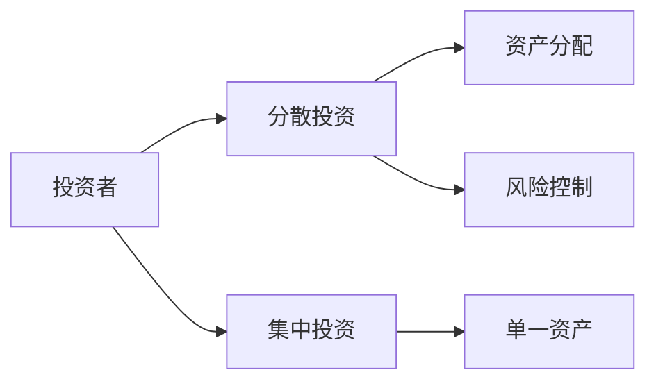
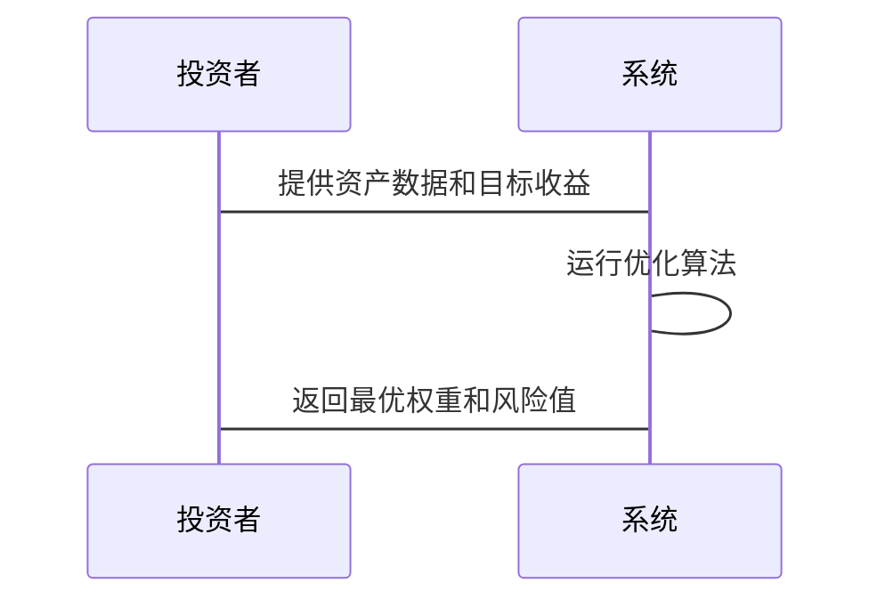

                 


# 《格雷厄姆的分散投资原则》

## 关键词：格雷厄姆、分散投资、投资组合、风险控制、价值投资

## 摘要：  
本文深入探讨了格雷厄姆的分散投资原则，从其核心理念到数学模型，从系统架构到项目实战，结合技术语言进行详细分析。通过本文，读者可以理解分散投资的基本原理、优化方法、系统实现以及实际应用，从而在投资实践中更好地控制风险、提高收益。

---

## 第一部分：分散投资的背景与基础

### 第1章：分散投资的起源与核心理念

#### 1.1 格雷厄姆的生平与投资思想
格雷厄姆（Benjamin Graham）是20世纪最伟大的投资思想家之一，被誉为“价值投资之父”。他提出了许多经典的 investment principles，其中分散投资是其策略的重要组成部分。格雷厄姆的投资理念强调安全边际和长期稳健的收益，而非短期暴利。他的思想深刻影响了巴菲特等一代投资大师。

**问题背景：**  
在金融市场中，投资者常常面临资产价格波动的风险。如何通过科学的方法降低风险、提高收益，是投资领域的重要问题。格雷厄姆提出分散投资的原则，为投资者提供了一种有效的解决方案。

**问题解决：**  
通过分散投资，投资者可以将资金分配到不同的资产类别、行业或地区，从而降低单一资产波动对整体投资组合的影响。这种策略不仅适用于个人投资者，也适用于机构投资者。

**边界与外延：**  
分散投资的边界在于其分散程度和风险控制的平衡。过度分散可能导致收益降低，而分散不足则会面临较高的风险。其外延包括现代投资组合理论（MPT）的进一步发展。

**概念结构与核心要素：**  
分散投资的核心要素包括资产分配、风险评估、收益预期和动态调整。

---

### 第2章：分散投资的核心概念与联系

#### 2.1 核心概念原理
分散投资的核心原理在于通过多样化降低非系统性风险。具体而言，投资组合的总风险可以分解为系统性风险和非系统性风险。通过分散投资，投资者可以降低非系统性风险，而系统性风险则无法通过分散投资消除。

#### 2.2 核心概念属性特征对比表

| 属性           | 分散投资         | 集中投资         |
|----------------|------------------|------------------|
| 风险控制       | 较低            | 较高            |
| 收益稳定性     | 较高            | 较低            |
| 资金分配       | 多样化           | 单一化           |
| 适用场景       | 风险厌恶型投资者 | 高风险偏好者    |

#### 2.3 实体关系图（ER图）
以下是分散投资与集中投资的关系图：



---

## 第二部分：分散投资的核心概念与数学模型

### 第3章：分散投资的数学模型与优化算法

#### 3.1 核心模型原理
分散投资的核心模型是现代投资组合理论（MPT）。MPT的目标是通过优化资产分配，使得在给定风险水平下，投资组合的收益最大化，或者在给定收益下，风险最小化。

#### 3.2 数学公式与模型

**投资组合的期望收益公式：**  
$$ E(r_p) = \sum_{i=1}^{n} w_i E(r_i) $$  
其中，$w_i$ 是资产 $i$ 的权重，$E(r_i)$ 是资产 $i$ 的期望收益。

**投资组合的风险公式：**  
$$ Var(r_p) = \sum_{i=1}^{n} \sum_{j=1}^{n} w_i w_j Cov(r_i, r_j) $$  
其中，$Cov(r_i, r_j)$ 是资产 $i$ 和资产 $j$ 的协方差。

**优化目标函数：**  
$$ \min_{w} Var(r_p) $$  
$$ \text{subject to} \quad E(r_p) = \text{目标收益} $$  

#### 3.3 优化算法与实现

以下是使用Python实现的分散投资优化算法示例：

```python
import numpy as np
import pandas as pd
from scipy.optimize import minimize

# 示例数据：资产的预期收益和协方差矩阵
returns = np.array([0.1, 0.15, 0.08])
cov_matrix = np.array([
    [0.05, 0.02, 0.01],
    [0.02, 0.10, 0.03],
    [0.01, 0.03, 0.08]
])

# 定义优化目标函数
def portfolio_variance(weights, returns, cov_matrix):
    return np.dot(weights.T, np.dot(cov_matrix, weights))

# 定义约束条件
def constraint(weights, target_return):
    return np.dot(weights, returns) - target_return

# 初始化权重（假设初始权重为均匀分布）
n_assets = len(returns)
initial_weights = np.array([1.0 / n_assets] * n_assets)

# 使用 scipy.optimize.minimize 进行优化
target_return = 0.12  # 目标收益
result = minimize(portfolio_variance, initial_weights, args=(returns, cov_matrix), 
                 method='SLSQP', constraints={'type': 'eq', 'fun': lambda w: constraint(w, target_return)})

# 输出优化结果
print("最优权重:", result.x)
print("最优收益:", np.dot(result.x, returns))
print("最优风险:", portfolio_variance(result.x, returns, cov_matrix))
```

#### 3.4 算法流程图（mermaid）


---

## 第三部分：分散投资的系统分析与架构设计

### 第4章：分散投资的系统架构与实现

#### 4.1 系统功能设计
- 数据采集模块：收集资产的预期收益和协方差矩阵。
- 优化计算模块：实现投资组合的优化算法。
- 结果展示模块：输出最优权重和风险。

#### 4.2 系统架构设计（mermaid）


#### 4.3 系统接口设计
- 输入接口：资产数据和目标收益。
- 输出接口：最优权重和风险值。

#### 4.4 系统交互设计（mermaid）



---

## 第四部分：分散投资的项目实战

### 第5章：分散投资的实际案例分析

#### 5.1 项目介绍
假设我们有三个资产，分别为股票、债券和黄金，其预期收益和协方差矩阵如下：

| 资产    | 预期收益 | 协方差矩阵         |
|---------|----------|------------------|
| 股票    | 0.15     | [0.06, 0.02, 0.03] |
| 债券    | 0.10     | [0.02, 0.08, 0.01] |
| 黄金    | 0.08     | [0.03, 0.01, 0.12] |

#### 5.2 核心实现
使用Python代码实现投资组合优化：

```python
import numpy as np
from scipy.optimize import minimize

def portfolio_variance(weights, returns, cov_matrix):
    return np.dot(weights.T, np.dot(cov_matrix, weights))

def constraint(weights, target_return):
    return np.dot(weights, returns) - target_return

returns = np.array([0.15, 0.10, 0.08])
cov_matrix = np.array([
    [0.06, 0.02, 0.03],
    [0.02, 0.08, 0.01],
    [0.03, 0.01, 0.12]
])

initial_weights = np.array([1/3, 1/3, 1/3])
target_return = 0.12

result = minimize(portfolio_variance, initial_weights, args=(returns, cov_matrix), 
                 method='SLSQP', constraints={'type': 'eq', 'fun': lambda w: constraint(w, target_return)})

print("最优权重:", result.x)
print("最优风险:", portfolio_variance(result.x, returns, cov_matrix))
```

#### 5.3 案例分析与解读
通过上述代码，我们可以得到最优的投资组合权重和风险值。这表明分散投资能够在实现目标收益的同时，有效降低投资组合的波动性。

---

## 第五部分：总结与展望

### 第6章：总结与最佳实践

#### 6.1 总结
本文从理论到实践，详细分析了格雷厄姆的分散投资原则。通过数学模型和系统架构的设计，我们展示了如何在实际投资中应用这一原则，以实现风险可控下的最大收益。

#### 6.2 最佳实践 tips
- 定期审查和调整投资组合。
- 避免情绪化决策，坚持分散投资策略。
- 使用技术工具辅助投资组合的优化。

#### 6.3 未来展望
随着人工智能和大数据技术的发展，分散投资将更加智能化和个性化。未来的投资策略可能会更加注重动态调整和实时优化。

---

## 作者：AI天才研究院/AI Genius Institute & 禅与计算机程序设计艺术 /Zen And The Art of Computer Programming

---

**注：** 本文为技术博客文章，内容基于格雷厄姆的分散投资原则，结合现代投资组合理论和优化算法进行深入分析。

