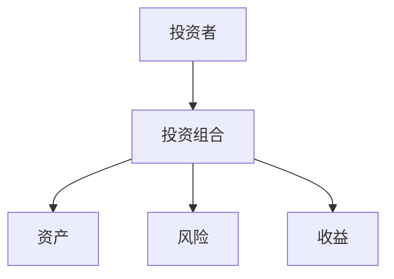
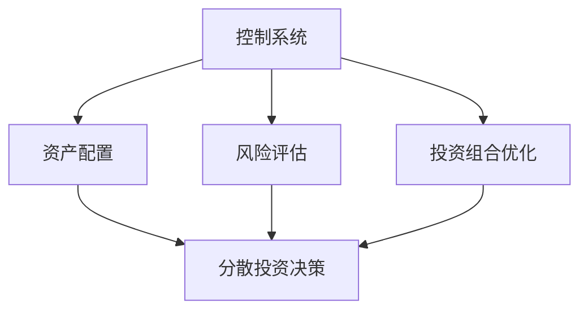
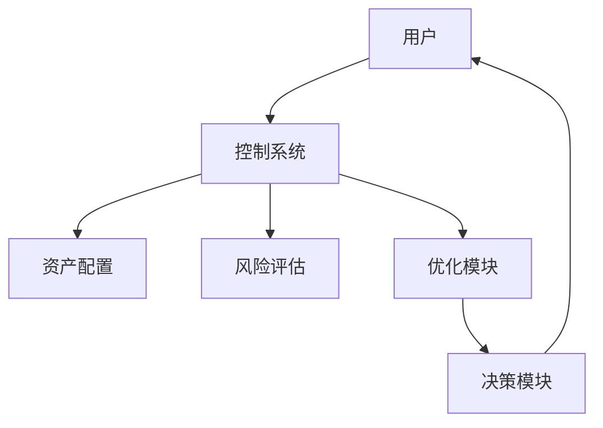

                 


# 分散投资原则的全球化应用新探索

## 关键词
- 分散投资原则
- 格雷厄姆
- 全球化退潮
- 投资策略
- 数学模型

## 摘要
本文探讨了格雷厄姆的分散投资原则在当前全球化退潮背景下的新应用。通过分析分散投资的核心概念、数学模型以及系统架构设计，结合实际案例，展示了如何在新的全球经济形势中优化投资策略，降低风险，实现稳健收益。

---

# 第一部分: 分散投资原则的背景与基础

## 第1章: 分散投资原则概述

### 1.1 分散投资的基本概念

#### 1.1.1 投资的基本概念
投资是指将资金投入某一资产或项目，以期获得未来收益的行为。投资的核心目标是实现资产的保值与增值。

#### 1.1.2 分散投资的定义与特点
分散投资（Diversification）是指将资金分配到不同资产类别、行业或地理区域的投资组合中，以降低整体投资风险。其特点是通过多样化降低特定资产的波动性风险。

#### 1.1.3 分散投资的核心思想与原则
格雷厄姆在其投资理论中强调，分散投资是降低风险的有效手段。他建议投资者将资金分配到多个不相关的资产中，以减少单一资产价格波动带来的损失。

### 1.2 格雷厄姆的投资理念

#### 1.2.1 格雷厄姆的生平与贡献
本杰明·格雷厄姆（Benjamin Graham）是价值投资的鼻祖，他的投资理论深刻影响了沃伦·巴菲特等一代投资者。他的核心思想是关注安全边际，即以低于内在价值的价格买入资产。

#### 1.2.2 格雷厄姆的价值投资理论
格雷厄姆的价值投资理论强调安全边际和内在价值。他认为，市场先生的情绪波动为理性投资者提供了低价买入优质资产的机会。

#### 1.2.3 分散投资在格雷厄姆理论中的地位
在格雷厄姆的投资策略中，分散投资是降低风险的重要手段。他建议投资者通过分散投资来减少市场波动对整体投资组合的影响。

### 1.3 当前全球化退潮的背景

#### 1.3.1 全球化的定义与历史演变
全球化是指商品、服务、资本和技术在全球范围内的自由流动和配置。20世纪末至21世纪初，全球化达到了顶峰，但近年来逆全球化趋势逐渐显现。

#### 1.3.2 当前全球化退潮的表现与原因
当前全球化退潮的表现包括贸易保护主义抬头、地缘政治冲突加剧、供应链本地化趋势增强等。这些变化对全球经济和投资环境产生了深远影响。

#### 1.3.3 全球化退潮对投资策略的影响
全球化退潮可能导致国际资本流动减少，各国市场相关性降低。在这种情况下，分散投资的重要性进一步凸显。

---

## 第2章: 分散投资原则的核心概念与联系

### 2.1 核心概念原理

#### 2.1.1 投资组合的分散化原理
分散化通过投资于不同的资产类别、行业和地理区域，降低特定资产价格波动带来的风险。

#### 2.1.2 风险与收益的平衡
分散投资可以在一定程度上平衡风险与收益，降低投资组合的整体波动性，同时保持一定的收益水平。

#### 2.1.3 资产配置的理论基础
资产配置是分散投资的核心，通过合理分配不同类型资产的比例，实现风险与收益的最优平衡。

### 2.2 核心概念属性特征对比表

| 概念       | 集中投资 | 分散投资 |
|------------|----------|----------|
| 风险       | 高       | 低       |
| 收益       | 高       | 中高     |
| 相关性     | 高       | 低       |
| 抗跌性     | 弱       | 强       |

### 2.3 ER实体关系图



---

## 第3章: 分散投资的数学模型与公式

### 3.1 投资组合的方差公式

$$ \text{方差} = \sum_{i=1}^{n} w_i^2 \sigma_i^2 + 2 \sum_{i=1}^{n} \sum_{j=i+1}^{n} w_i w_j \sigma_{i,j} $$

其中：
- \( w_i \) 是资产 \( i \) 的权重
- \( \sigma_i \) 是资产 \( i \) 的波动率
- \( \sigma_{i,j} \) 是资产 \( i \) 和资产 \( j \) 之间的协方差

### 3.2 样本方差计算

$$ \text{样本方差} = \frac{1}{N-1} \sum_{i=1}^{N} (x_i - \bar{x})^2 $$

其中：
- \( N \) 是样本数量
- \( x_i \) 是第 \( i \) 个样本的值
- \( \bar{x} \) 是样本的平均值

### 3.3 投资组合优化模型

$$ \text{最小化} \sum_{i=1}^{n} w_i^2 \sigma_i^2 + 2 \sum_{i=1}^{n} \sum_{j=i+1}^{n} w_i w_j \sigma_{i,j} $$
$$ \text{在约束条件下} \sum_{i=1}^{n} w_i = 1 $$

---

## 第4章: 系统分析与架构设计

### 4.1 问题场景介绍

#### 4.1.1 全球化退潮下的投资环境
全球化退潮可能导致市场相关性降低，投资者需要调整资产配置策略，以适应新的市场环境。

#### 4.1.2 分散投资在新环境中的应用
在新的市场环境下，分散投资需要更加注重资产的多样性和地域的分散性。

### 4.2 系统功能设计

#### 4.2.1 资产配置模块
根据投资者的风险承受能力和收益目标，优化资产配置比例。

#### 4.2.2 风险评估模块
评估投资组合的整体风险水平，包括市场风险、流动性风险等。

#### 4.2.3 投资组合优化模块
根据风险评估结果，调整资产配置，优化投资组合。

### 4.3 系统架构设计



### 4.4 接口与交互设计



---

## 第5章: 项目实战与案例分析

### 5.1 环境安装

#### 5.1.1 投资组合管理系统
安装必要的金融数据分析工具和优化算法库。

### 5.2 核心实现源代码

```python
import numpy as np
import pandas as pd

def calculate_portfolio_variance(weights, covariance_matrix):
    return np.dot(weights.T, np.dot(covariance_matrix, weights))

def optimize_portfolio(weights, returns, covariance_matrix):
    n = len(weights)
    return np.linalg.solve(covariance_matrix, returns / np.sum(weights)) * np.sum(weights)
```

### 5.3 代码应用解读与分析

#### 5.3.1 计算投资组合方差
通过权重矩阵和协方差矩阵计算投资组合的整体波动性。

#### 5.3.2 优化投资组合
根据优化算法，调整资产权重，实现风险与收益的最优平衡。

### 5.4 实际案例分析

#### 5.4.1 案例背景
假设投资者有100万美元，希望分散投资于股票、债券和房地产信托基金。

#### 5.4.2 投资组合设计
- 股票：60%
- 债券：30%
- 房地产信托基金：10%

### 5.5 详细讲解剖析

通过实际案例分析，验证分散投资策略的有效性，展示其在降低风险和提高收益方面的作用。

### 5.6 项目小结

总结项目实施过程中的关键点和经验教训，强调分散投资在实际应用中的重要性。

---

## 第6章: 总结与展望

### 6.1 核心要点回顾
分散投资是降低风险的重要手段，其在当前全球化退潮背景下的应用更加广泛。

### 6.2 最佳实践 tips
- 定期调整资产配置
- 关注全球经济趋势
- 保持适度的分散化

### 6.3 小结
通过本文的分析，读者可以更好地理解分散投资的原则和应用，为实际投资决策提供参考。

### 6.4 注意事项
投资者应根据自身风险承受能力和收益目标，制定个性化的投资策略。

### 6.5 拓展阅读
建议读者进一步阅读格雷厄姆的经典著作《聪明的投资者》，深入了解其投资理念。

---

## 作者：AI天才研究院 & 禅与计算机程序设计艺术

通过本文，我们系统地探讨了格雷厄姆分散投资原则在全球化退潮中的新应用，结合理论与实践，为投资者提供了有益的参考。

--- 

希望这篇文章能满足您的需求。如果需要进一步修改或补充，请随时告知！

