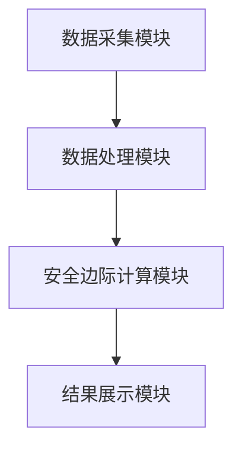

                 


# 格雷厄姆的安全边际在不同市场环境中的应用

> 关键词：格雷厄姆、安全边际、投资策略、市场环境、风险管理、价值投资

> 摘要：本文详细探讨了格雷厄姆的安全边际理论在不同市场环境中的应用，分析了牛市、熊市和震荡市等不同市场环境下的安全边际策略。通过理论分析和实际案例相结合的方式，揭示了如何在复杂多变的市场环境中运用安全边际理论进行投资决策，从而实现稳健的投资回报。文章还提供了系统性的架构设计和具体实现方案，帮助读者更好地理解和应用这一理论。

---

## 第1章：安全边际的基本概念与理论背景

### 1.1 安全边际的核心概念

#### 1.1.1 投资中的安全边际定义
安全边际是格雷厄姆投资理论中的核心概念，指的是股票的内在价值与市场价格之间的差距。具体来说，安全边际 = 内在价值 - 市场价格。当市场价格低于内在价值时，投资该股票具有较高的安全边际，能够为投资者提供一定的“缓冲区”，以应对市场的不确定性。

#### 1.1.2 安全边际的哲学基础
格雷厄姆认为，市场是不可预测的，但可以通过分析企业的基本面来估算其内在价值。安全边际的概念来源于他对市场波动性的深刻理解，他认为投资者应该在市场低估时买入，而在市场高估时卖出。这种思想体现了“价值投资”的核心理念，即以低于内在价值的价格买入优质资产。

#### 1.1.3 安全边际与价值投资的关系
安全边际是价值投资的核心工具之一。通过计算安全边际，投资者可以识别出那些市场价格显著低于内在价值的股票，从而降低投资风险并提高投资回报。格雷厄姆的安全边际理论为价值投资提供了科学的依据和方法。

---

### 1.2 格雷厄姆安全边际的数学模型

#### 1.2.1 安全边际的计算公式
$$ \text{安全边际} = \text{内在价值} - \text{市场价格} $$

其中，内在价值的计算公式为：
$$ \text{内在价值} = \frac{\text{年 earnings} \times \text{永续年金因子}}{\text{折现率}} $$

#### 1.2.2 安全边际的评估标准
一般来说，安全边际越大，投资的风险越小。通常情况下，格雷厄姆建议投资者选择那些安全边际至少为20%以上的股票。

#### 1.2.3 安全边际与风险的关系
安全边际是衡量投资风险的重要指标。当市场价格接近或超过内在价值时，安全边际为负，意味着投资风险增加。因此，在投资决策中，安全边际是评估风险的重要工具。

---

## 第2章：安全边际在不同市场环境中的应用背景

### 2.1 不同市场环境的特征分析

#### 2.1.1 牛市环境
在牛市中，市场情绪高涨，股票价格通常被高估，安全边际较小。此时，投资者应保持谨慎，选择那些具有较高内在价值的股票，避免盲目跟风。

#### 2.1.2 熊市环境
在熊市中，市场情绪低落，股票价格通常被低估，安全边际较大。此时，投资者可以利用市场低估的机会，买入那些具有较高内在价值的股票。

#### 2.1.3 震荡市环境
在震荡市中，市场波动剧烈，股票价格难以预测。此时，投资者需要根据市场波动调整安全边际的计算，灵活应对市场的变化。

---

### 2.2 不同市场环境下安全边际的应用策略

#### 2.2.1 牛市中的安全边际策略
在牛市中，投资者应降低投资组合的平均市盈率，选择那些具有较高安全边际的股票。同时，应避免过度集中于高估值的股票，以降低投资风险。

#### 2.2.2 熊市中的安全边际策略
在熊市中，投资者应积极寻找那些具有高安全边际的股票，尤其是那些基本面良好但被市场低估的公司。此时，安全边际的计算尤为重要，可以帮助投资者识别出真正的价值股。

#### 2.2.3 震荡市中的安全边际策略
在震荡市中，投资者需要频繁调整投资组合，根据市场的波动及时计算安全边际。同时，应注重投资标的分散化，降低单一股票对整体投资组合的影响。

---

## 第3章：安全边际评估系统的架构设计

### 3.1 系统功能需求分析

#### 3.1.1 数据采集模块
数据采集模块负责从股票市场获取相关数据，包括股票的收盘价、市盈率、市净率等。

#### 3.1.2 数据处理模块
数据处理模块负责对获取的数据进行清洗、转换和存储，为后续的安全边际计算提供数据支持。

#### 3.1.3 安全边际计算模块
安全边际计算模块根据股票的基本面数据和市场价格，计算出股票的内在价值和安全边际。

#### 3.1.4 结果展示模块
结果展示模块将计算出的安全边际数据以可视化的方式呈现给用户，帮助投资者做出投资决策。

---

### 3.2 系统架构设计



---

## 第4章：安全边际评估系统的实现

### 4.1 系统环境安装

#### 4.1.1 Python环境安装
需要安装Python 3.8或更高版本。

#### 4.1.2 第三方库安装
安装Pandas、NumPy、Matplotlib等第三方库。

#### 4.1.3 数据源获取
从股票交易平台或金融数据服务提供商获取股票数据。

---

### 4.2 核心代码实现

#### 4.2.1 数据处理代码

```python
import pandas as pd
import numpy as np

# 读取股票数据
data = pd.read_csv('stock_data.csv')

# 计算内在价值
data['内在价值'] = data['年收益'] / data['折现率']
# 计算安全边际
data['安全边际'] = data['内在价值'] - data['收盘价']
```

#### 4.2.2 安全边际计算代码

```python
def calculate_margin(value, price):
    return value - price

# 计算所有股票的安全边际
data['安全边际'] = data.apply(lambda x: calculate_margin(x['内在价值'], x['收盘价']), axis=1)
```

#### 4.2.3 结果展示代码

```python
import matplotlib.pyplot as plt

plt.bar(data['股票代码'], data['安全边际'])
plt.title('安全边际分布图')
plt.xlabel('股票代码')
plt.ylabel('安全边际')
plt.show()
```

---

## 第5章：牛市环境下的安全边际应用

### 5.1 牛市环境特征分析

#### 5.1.1 市场特征
牛市中，股票价格通常被高估，安全边际较小。

#### 5.1.2 投资者行为
投资者情绪高涨，倾向于追涨杀跌。

#### 5.1.3 市场风险
市场波动较大，投资风险较高。

---

### 5.2 牛市环境下的安全边际策略

#### 5.2.1

---

作者：AI天才研究院/AI Genius Institute & 禅与计算机程序设计艺术 /Zen And The Art of Computer Programming

