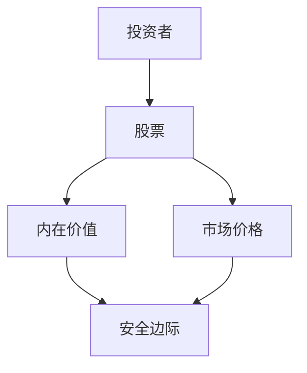
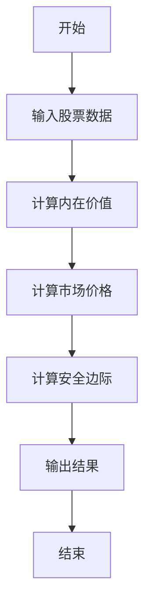
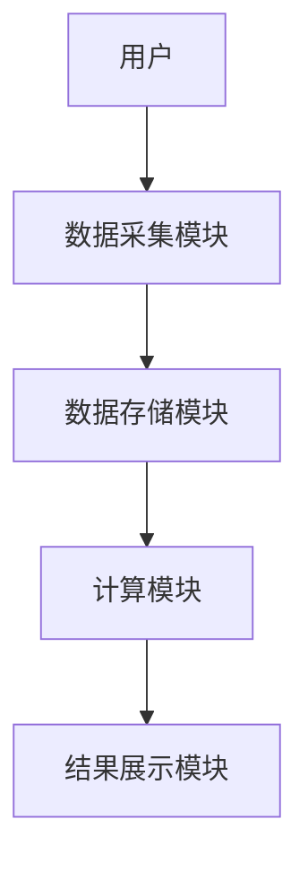

                 


# 格雷厄姆的安全边际概念

> 关键词：安全边际，价值投资，投资策略，风险管理，股票分析，投资决策

> 摘要：格雷厄姆的安全边际概念是价值投资的核心思想之一，它通过分析股票的内在价值和市场价格之间的差异，帮助投资者做出更为稳健的投资决策。本文将从安全边际的基本概念、数学模型、投资策略、风险管理、系统设计等多个维度进行详细阐述，并通过实际案例和代码实现，帮助读者深入理解安全边际的应用和实现过程。

---

## 第1章: 格雷厄姆安全边际概念的基础

### 1.1 格雷厄姆的生平与投资理念

#### 1.1.1 格雷厄姆的生平简介
本杰明·格雷厄姆（Benjamin Graham）是20世纪著名的投资学家，被誉为“价值投资之父”。他出生于1894年，早年在金融领域积累了丰富的投资经验，并在1926年出版了《新数学投资学》一书，奠定了其在投资领域的地位。格雷厄姆在哥伦比亚大学教授投资学，培养了包括沃伦·巴菲特在内的众多知名投资者。

#### 1.1.2 格雷厄姆的价值投资理论
格雷厄姆的价值投资理论强调以低于股票内在价值的价格买入股票，长期持有，等待市场回归其真实价值。他认为市场波动是投资者的机会，而不是风险。

#### 1.1.3 安全边际概念的提出背景
安全边际概念的提出源于格雷厄姆对市场波动和投资者心理的研究。他认为，市场往往过于乐观或悲观，导致股票价格偏离其内在价值。通过安全边际，投资者可以在价格波动中找到可靠的买入点。

### 1.2 安全边际的定义与核心要素

#### 1.2.1 安全边际的定义
安全边际是指股票的内在价值与市场价格之间的差额。具体来说，当市场价格低于内在价值时，两者之间的差额即为安全边际。安全边际越大，投资的风险越小。

#### 1.2.2 安全边际的核心要素
- 内在价值：股票未来现金流的现值，基于对公司基本面的分析。
- 市场价格：当前股票的市场价格。
- 安全边际 = 内在价值 - 市场价格

#### 1.2.3 安全边际与投资风险的关系
安全边际越大，投资风险越小。当市场价格远低于内在价值时，即使市场出现短期波动，投资者也能在价格下跌时获得保护，降低损失。

### 1.3 安全边际的边界与外延

#### 1.3.1 安全边际的应用范围
安全边际主要用于股票投资，尤其适用于那些具有稳定现金流和明确内在价值的公司。

#### 1.3.2 安全边际的局限性
- 适用于长期投资，不适用于短期交易。
- 依赖于对公司内在价值的准确评估。

#### 1.3.3 安全边际与其他投资策略的对比
与技术分析相比，安全边际更注重基本面分析；与成长型投资相比，安全边际更注重估值的合理性。

---

## 第2章: 安全边际的核心概念与联系

### 2.1 安全边际的原理

#### 2.1.1 安全边际的计算方法
安全边际的计算公式为：
$$ \text{安全边际} = \text{内在价值} - \text{市场价格} $$

#### 2.1.2 安全边际与内在价值的关系
内在价值是安全边际的基础。只有准确评估内在价值，才能确定安全边际的大小。

#### 2.1.3 安全边际与市场波动的互动
市场波动会影响市场价格，从而影响安全边际的大小。当市场价格偏离内在价值时，安全边际会扩大或缩小。

### 2.2 核心概念的属性特征对比

#### 2.2.1 表格对比：安全边际与其它投资概念的属性差异
| 投资概念     | 定义                          | 计算公式                  | 优缺点                              |
|--------------|-------------------------------|---------------------------|-------------------------------------|
| 安全边际     | 内在价值 - 市场价格          | V - P                     | 降低投资风险，提高收益稳定性      |
| 技术分析     | 通过价格和成交量预测趋势    | -                         | 短期交易有效，长期效果有限          |
| 基本面分析   | 通过财务数据评估公司价值    | -                         | 长期投资有效，但需要大量数据支持    |

#### 2.2.2 图表分析：安全边际在投资决策中的位置
图表展示：将内在价值、市场价格和安全边际的位置进行对比，突出安全边际的重要性。

### 2.3 ER实体关系图

#### 2.3.1 Mermaid流程图：安全边际的实体关系架构


---

## 第3章: 安全边际的数学模型与算法原理

### 3.1 安全边际的计算公式

#### 3.1.1 内在价值的计算公式
$$ V = \frac{CF}{r - g} $$
其中：
- \( CF \)：公司未来现金流
- \( r \)：折现率
- \( g \)：现金流增长率

#### 3.1.2 安全边际的计算公式
$$ \text{安全边际} = \text{内在价值} - \text{市场价格} $$

### 3.2 算法原理

#### 3.2.1 Mermaid流程图：安全边际计算流程


#### 3.2.2 Python代码实现
```python
def calculate_intrinsic_value(CF, r, g):
    return CF / (r - g)

def calculate_margin_of_safety(intrinsic_value, market_price):
    return intrinsic_value - market_price

# 示例
CF = 1000
r = 0.1
g = 0.05
market_price = 50

intrinsic_value = calculate_intrinsic_value(CF, r, g)
margin_of_safety = calculate_margin_of_safety(intrinsic_value, market_price)

print(f"内在价值: {intrinsic_value:.2f}")
print(f"市场价格: {market_price}")
print(f"安全边际: {margin_of_safety:.2f}")
```

---

## 第4章: 安全边际的投资策略与风险管理

### 4.1 安全边际在投资策略中的应用

#### 4.1.1 股票筛选
通过计算股票的安全边际，筛选出具有较大安全边际的股票进行投资。

#### 4.1.2 买入与卖出时机
- 买入时机：市场价格远低于内在价值时。
- 卖出时机：市场价格接近或超过内在价值时。

#### 4.1.3 组合管理
通过分散投资，降低单一股票的风险，同时提高整体组合的安全边际。

### 4.2 安全边际的风险管理

#### 4.2.1 避免常见错误
- 避免过度依赖技术分析，忽视基本面分析。
- 避免追涨杀跌，盲目跟风。

#### 4.2.2 处理估值错误
- 定期重新评估股票的内在价值和市场价格，调整安全边际。

#### 4.2.3 应对市场波动
- 在市场恐慌时，寻找具有较大安全边际的股票进行投资。

---

## 第5章: 安全边际的系统设计与实现

### 5.1 系统设计

#### 5.1.1 系统功能设计
- 数据采集：获取股票的财务数据和市场价格。
- 内在价值计算：基于财务数据计算股票的内在价值。
- 安全边际计算：计算安全边际，并筛选出符合条件的股票。

#### 5.1.2 系统架构设计


#### 5.1.3 系统接口设计
- 数据接口：与数据源（如Yahoo Finance）对接，获取股票数据。
- 计算接口：提供内在价值和安全边际的计算功能。
- 展示接口：以图表形式展示安全边际和股票走势。

---

## 第6章: 项目实战

### 6.1 环境安装

#### 6.1.1 安装Python和必要的库
```bash
pip install numpy pandas matplotlib
```

### 6.2 核心代码实现

#### 6.2.1 计算内在价值和安全边际
```python
import pandas as pd
import numpy as np

def calculate_intrinsic_value(CF, r, g):
    return CF / (r - g)

def calculate_margin_of_safety(intrinsic_value, market_price):
    return intrinsic_value - market_price

# 示例数据
data = {
    '公司': ['可口可乐', 'IBM'],
    'CF': [1000, 1500],
    'r': [0.1, 0.12],
    'g': [0.05, 0.03],
    '市场价格': [50, 60]
}

df = pd.DataFrame(data)

# 计算内在价值和安全边际
df['内在价值'] = df.apply(lambda x: calculate_intrinsic_value(x['CF'], x['r'], x['g']), axis=1)
df['安全边际'] = df.apply(lambda x: calculate_margin_of_safety(x['内在价值'], x['市场价格']), axis=1)

print(df)
```

### 6.3 案例分析与解读

#### 6.3.1 案例分析
以可口可乐和IBM为例，计算其安全边际，并分析投资价值。

#### 6.3.2 项目总结
通过代码实现，我们可以快速计算出股票的安全边际，为投资决策提供数据支持。

---

## 第7章: 总结与展望

### 7.1 核心要点回顾
- 安全边际的定义与计算方法。
- 安全边际在投资策略中的应用。
- 系统设计与实现。

### 7.2 最佳实践 tips
- 选择具有稳定现金流和明确内在价值的公司。
- 长期持有，避免频繁交易。
- 定期评估和调整投资组合。

### 7.3 注意事项
- 安全边际的计算依赖于对公司内在价值的准确评估。
- 市场波动可能会影响安全边际的有效性。

### 7.4 拓展阅读
- 《聪明的投资者》——本杰明·格雷厄姆
- 《投资学原理》——查尔斯·埃利森

---

## 作者：AI天才研究院 & 禅与计算机程序设计艺术

---

通过本文的详细阐述，我们深入探讨了格雷厄姆的安全边际概念，从理论到实践，从算法到系统设计，为读者提供了全面的指导。希望读者能够通过本文，更好地理解和应用安全边际概念，做出更为稳健的投资决策。

