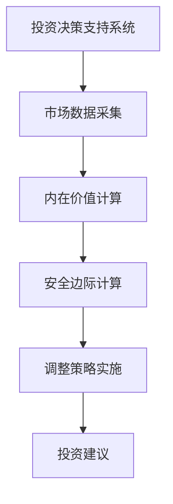

                 


# 格雷厄姆的安全边际理论在高估值市场中的调整

> **关键词**：安全边际理论，高估值市场，投资策略，调整策略，数学模型，实际案例分析

> **摘要**：本文详细探讨了格雷厄姆的安全边际理论在高估值市场中的应用与调整。通过对当前市场环境的分析，本文提出了对安全边际计算公式进行调整的方法，并结合实际案例进行分析，为投资者在高估值市场中提供实用的投资策略。

---

## 第一章：背景介绍

### 1.1 格雷厄姆安全边际理论的核心概念

安全边际是格雷厄姆投资理论中的核心概念，指的是在投资时，以低于资产内在价值的价格购买资产，从而降低投资风险。其核心思想是：安全边际 = 内在价值 - 市场价格。

#### 核心概念对比表

| 概念       | 定义与特点                           |
|------------|------------------------------------|
| 内在价值    | 资产未来现金流的现值，反映其真实价值 |
| 市场价格    | 当前市场上的交易价格               |
| 安全边际    | 内在价值与市场价格的差值，反映投资风险 |

### 1.2 高估值市场的现状与挑战

当前市场环境下，许多资产的价格远高于其内在价值，这使得传统的安全边际理论面临挑战。在高估值市场中，传统的安全边际计算方法可能无法有效降低投资风险，因此需要进行调整。

#### 高估值市场与传统市场的区别

| 市场类型      | 市场特点               | 投资风险      |
|---------------|------------------------|---------------|
| 高估值市场    | 资产价格远高于内在价值 | 高            |
| 传统市场      | 资产价格接近内在价值   | 中等           |

### 1.3 安全边际理论在高估值市场的适用性

在高估值市场中，安全边际理论的核心思想仍然适用，但需要对计算公式和调整策略进行优化，以适应当前市场环境。

---

## 第二章：安全边际理论的数学模型与公式

### 2.1 格雷厄姆安全边际的数学模型

#### 内在价值的计算公式

$$ V = \frac{E}{(1 + r)^n} $$

其中：
- \( V \) 表示内在价值
- \( E \) 表示未来现金流的现值
- \( r \) 表示折现率
- \( n \) 表示时间跨度

#### 安全边际的计算公式

$$ \text{安全边际} = V - P $$

其中：
- \( V \) 表示内在价值
- \( P \) 表示市场价格

### 2.2 高估值市场中安全边际的调整模型

#### 调整后的内在价值计算公式

$$ V' = V \times (1 - \alpha) $$

其中：
- \( \alpha \) 表示市场高估程度的调整系数（0 < \( \alpha \) < 1）

#### 调整后的安全边际计算公式

$$ \text{安全边际}' = V' - P $$

---

## 第三章：高估值市场中安全边际的调整策略

### 3.1 调整策略的核心思想

在高估值市场中，为了降低投资风险，需要对安全边际的计算公式进行调整，引入市场高估程度的调整系数 \( \alpha \)，以反映当前市场的高估值情况。

### 3.2 实际案例分析

#### 案例一：某高科技企业的安全边际计算

假设某高科技企业的内在价值 \( V \) 为 $100，市场价格 \( P \) 为 $150，市场高估程度的调整系数 \( \alpha \) 为 0.3。

调整后的内在价值：

$$ V' = 100 \times (1 - 0.3) = 70 $$

调整后的安全边际：

$$ \text{安全边际}' = 70 - 150 = -80 $$

由于安全边际为负数，说明当前市场价格远高于调整后的内在价值，投资风险较大，应谨慎考虑。

#### 案例二：某传统制造业的安全边际调整

假设某传统制造业的内在价值 \( V \) 为 $50，市场价格 \( P \) 为 $60，市场高估程度的调整系数 \( \alpha \) 为 0.2。

调整后的内在价值：

$$ V' = 50 \times (1 - 0.2) = 40 $$

调整后的安全边际：

$$ \text{安全边际}' = 40 - 60 = -20 $$

由于安全边际为负数，说明当前市场价格高于调整后的内在价值，投资风险较高，应考虑减少投资或寻找其他投资机会。

---

## 第四章：系统架构设计与实现

### 4.1 系统功能设计

为了实现安全边际理论在高估值市场中的调整，我们可以构建一个投资决策支持系统。该系统的主要功能包括：

1. **市场数据采集**：获取资产的市场价格、未来现金流等数据。
2. **内在价值计算**：根据公式 \( V = \frac{E}{(1 + r)^n} \) 计算资产的内在价值。
3. **安全边际计算**：根据公式 \( \text{安全边际} = V - P \) 计算安全边际。
4. **调整策略实施**：引入调整系数 \( \alpha \)，计算调整后的内在价值和安全边际。
5. **投资决策支持**：根据调整后的安全边际结果，提供投资建议。

### 4.2 系统架构设计

#### 系统架构图



#### 数据流图


---

## 第五章：项目实战与代码实现

### 5.1 环境安装

为了实现安全边际理论的调整，我们需要以下环境：

- Python 3.8 或更高版本
- 数据分析库：Pandas、NumPy
- 可视化库：Matplotlib、Seaborn

### 5.2 核心代码实现

#### 内在价值计算函数

```python
def calculate_intrinsic_value(E, r, n):
    return E / (1 + r) ** n
```

#### 安全边际计算函数

```python
def calculate_margin_of_safety(V, P):
    return V - P
```

#### 调整后的内在价值计算函数

```python
def calculate_adjusted_intrinsic_value(V, alpha):
    return V * (1 - alpha)
```

#### 调整后的安全边际计算函数

```python
def calculate_adjusted_margin_of_safety(V, P, alpha):
    V_adjusted = V * (1 - alpha)
    return V_adjusted - P
```

### 5.3 实际案例分析与代码实现

#### 案例一：某高科技企业的安全边际计算

```python
E = 100  # 未来现金流的现值
r = 0.1  # 折现率
n = 5    # 时间跨度
alpha = 0.3  # 市场高估程度的调整系数
P = 150  # 市场价格

V = calculate_intrinsic_value(E, r, n)
V_adjusted = calculate_adjusted_intrinsic_value(V, alpha)
margin_of_safety = calculate_adjusted_margin_of_safety(V, P, alpha)

print(f"内在价值: {V}")
print(f"调整后的内在价值: {V_adjusted}")
print(f"安全边际: {margin_of_safety}")
```

#### 案例二：某传统制造业的安全边际调整

```python
E = 50
r = 0.1
n = 5
alpha = 0.2
P = 60

V = calculate_intrinsic_value(E, r, n)
V_adjusted = calculate_adjusted_intrinsic_value(V, alpha)
margin_of_safety = calculate_adjusted_margin_of_safety(V, P, alpha)

print(f"内在价值: {V}")
print(f"调整后的内在价值: {V_adjusted}")
print(f"安全边际: {margin_of_safety}")
```

---

## 第六章：最佳实践与总结

### 6.1 小结

通过本文的分析与实践，我们可以得出以下结论：

1. 在高估值市场中，传统的安全边际理论需要进行调整，以反映当前市场环境的高估程度。
2. 引入市场高估程度的调整系数 \( \alpha \) 是一种有效的调整方法。
3. 投资者在实际操作中，应结合市场环境和资产特性，灵活调整安全边际的计算公式。

### 6.2 注意事项

- 在实际投资中，应结合其他因素（如宏观经济环境、行业趋势等）进行综合判断。
- 调整后的安全边际计算公式仅供参考，具体投资决策需根据实际情况进行调整。
- 投资有风险，入市需谨慎。

### 6.3 拓展阅读

- 格雷厄姆的《 Intelligent Investor》
- 现代投资组合理论
- 其他投资策略与风险管理方法

---

**作者：AI天才研究院/AI Genius Institute & 禅与计算机程序设计艺术/Zen And The Art of Computer Programming**

