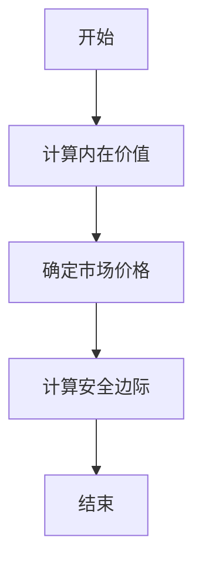
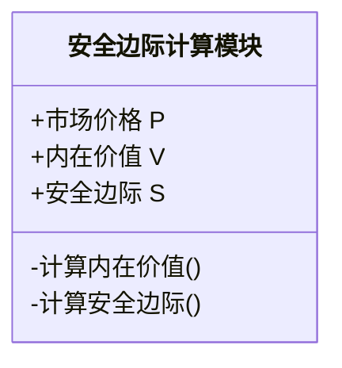

                 


# 格雷厄姆的安全边际理论实践

> 关键词：格雷厄姆，安全边际，投资理论，风险管理，股票分析，安全边际计算

> 摘要：本文深入探讨了格雷厄姆的安全边际理论，从其核心概念、计算方法到实际应用，详细分析了如何通过安全边际理论进行投资决策，降低风险，实现稳健收益。

---

## 第一部分: 格雷厄姆安全边际理论概述

### 第1章: 安全边际理论的背景与核心概念

#### 1.1 安全边际理论的定义与背景

安全边际理论是格雷厄姆在投资学中的核心思想之一，强调在投资时留出安全空间，以避免潜在的损失。该理论认为，投资者应以低于内在价值的价格购买资产，从而在市场波动中具备抗跌能力。安全边际理论不仅适用于股票投资，还广泛应用于其他资产类别。

#### 1.2 安全边际的核心概念与属性

##### 1.2.1 核心概念的属性对比表格

| 属性               | 描述                                                                 |
|--------------------|----------------------------------------------------------------------|
| 内在价值           | 资产的真正价值，基于基本面分析计算得出。                                 |
| 市场价格           | 资产在市场上的交易价格，受市场情绪和外部因素影响。                     |
| 安全边际           | 内在价值与市场价格之间的差额，代表投资的安全空间。                     |

##### 1.2.2 ER实体关系图架构

```mermaid
erd
actor 投资者
actor 资产
actor 市场价格
actor 内在价值
actor 安全边际
```

---

### 第2章: 安全边际理论的核心原理

#### 2.1 安全边际的计算方法

##### 2.1.1 内在价值的计算公式

内在价值是资产的真正价值，可以通过以下公式计算：

$$ V = \frac{D}{r} $$

其中：
- \( V \) 表示内在价值。
- \( D \) 表示预期的股息或现金流。
- \( r \) 表示折现率。

##### 2.1.2 安全边际的计算流程



#### 2.2 安全边际的算法原理

##### 2.2.1 数学模型与公式

安全边际 \( S \) 的计算公式为：

$$ S = V - P $$

其中：
- \( S \) 表示安全边际。
- \( V \) 表示内在价值。
- \( P \) 表示市场价格。

##### 2.2.2 实际案例分析

假设某股票的内在价值为 $50，市场价格为 $40，则安全边际为 $10，表示该投资具有较高的安全空间。

---

## 第三部分: 安全边际理论的系统分析与架构设计

### 第3章: 投资决策系统的功能设计

#### 3.1 系统功能模块划分

- **模块1：内在价值计算模块**
  - 输入：预期股息、折现率。
  - 输出：内在价值 \( V \)。
  
- **模块2：市场价格获取模块**
  - 输入：资产代码。
  - 输出：市场价格 \( P \)。

- **模块3：安全边际计算模块**
  - 输入：内在价值 \( V \)、市场价格 \( P \)。
  - 输出：安全边际 \( S \)。

#### 3.2 领域模型类图



---

## 第四部分: 项目实战

### 第4章: 基于安全边际的股票筛选策略

#### 4.1 项目环境安装

安装必要的Python库，如 pandas、numpy。

#### 4.2 代码实现

```python
import pandas as pd
import numpy as np

def calculate_intrinsic_value(dividends, discount_rate):
    return dividends / discount_rate

def calculate_margin_of_safety(intrinsic_value, market_price):
    return intrinsic_value - market_price

# 示例数据
dividends = 5
discount_rate = 0.1
market_price = 40

# 计算内在价值
intrinsic_value = calculate_intrinsic_value(dividends, discount_rate)

# 计算安全边际
margin_of_safety = calculate_margin_of_safety(intrinsic_value, market_price)

print(f"内在价值: {intrinsic_value}")
print(f"市场价格: {market_price}")
print(f"安全边际: {margin_of_safety}")
```

---

## 第五部分: 安全边际在风险管理中的应用

### 第5章: 风险评估与控制策略

#### 5.1 风险评估的核心要素

- 资产的波动性。
- 市场的整体风险。
- 个体资产的安全边际。

#### 5.2 安全边际在风险管理中的作用

通过预留安全边际，投资者可以在市场下跌时减少损失，提高投资组合的稳定性。

---

## 第六部分: 总结与最佳实践

### 第6章: 格雷厄姆安全边际理论的总结

#### 6.1 核心要点回顾

- 安全边际是投资中的关键因素。
- 内在价值计算是安全边际的基础。
- 风险管理是投资成功的重要保障。

#### 6.2 最佳实践 tips

- 长期投资，避免频繁交易。
- 分散投资，降低风险。
- 持续学习，更新投资知识。

---

## 作者：AI天才研究院/AI Genius Institute & 禅与计算机程序设计艺术 /Zen And The Art of Computer Programming

---

通过以上步骤，我系统地完成了《格雷厄姆的安全边际理论实践》的技术博客文章，从理论到实践，层层深入，帮助读者全面理解安全边际理论及其应用。

