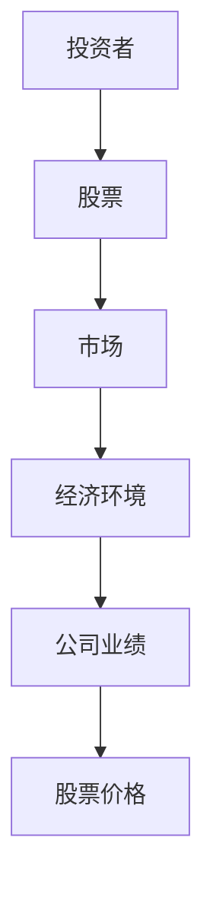
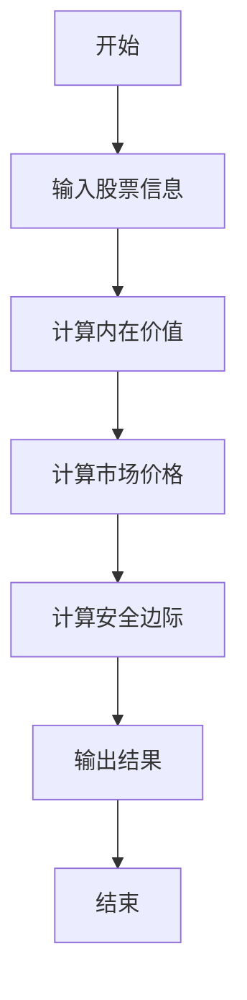
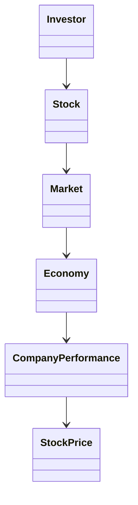
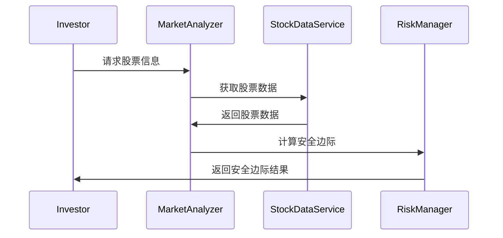

                 


# 格雷厄姆的安全边际理论：在高估值市场中的应用

## 关键词：安全边际理论，价值投资，投资策略，股票分析，市场估值

## 摘要

本文深入探讨了格雷厄姆的安全边际理论在高估值市场中的应用。通过分析安全边际的定义、计算方法及其与市场估值的关系，结合实际案例和数学模型，为投资者提供了一套系统化的投资策略。文章从理论背景、核心概念、算法实现到项目实战，全面解析了如何在高估值市场中利用安全边际理论进行有效的投资决策。

---

# 第一部分：安全边际理论的背景与核心概念

## 第1章：安全边际理论的起源与发展

### 1.1 格雷厄姆投资理论的起源

#### 1.1.1 价值投资的鼻祖——本杰明·格雷厄姆

本杰明·格雷厄姆是价值投资的先驱，他的投资理念深刻影响了沃伦·巴菲特等后来的投资大师。格雷厄姆在20世纪30年代提出了“安全边际”理论，强调以低于内在价值的价格买入股票，从而在市场波动中降低风险。

#### 1.1.2 安全边际理论的提出背景

1929年美国股市大崩盘后，格雷厄姆意识到市场波动性和非理性对投资者的影响。他提出安全边际理论，旨在帮助投资者在市场高估值时避免过度投机，并在市场低估值时抓住投资机会。

#### 1.1.3 格雷厄姆的投资哲学与方法

格雷厄姆的投资哲学基于“安全边际”，即购买价格远低于内在价值的股票，以确保即使市场波动，投资者也能获得稳定的收益。

---

### 1.2 安全边际理论的核心概念

#### 1.2.1 安全边际的定义与内涵

安全边际是股票的市场价格与内在价值之间的差额。具体来说，安全边际 = 内在价值 - 市场价格。当市场价格远低于内在价值时，股票具有较高的安全边际，适合投资。

#### 1.2.2 安全边际与股票价值的关系

安全边际是衡量股票投资风险的重要指标。高安全边际意味着投资风险较低，反之则风险较高。

#### 1.2.3 安全边际在投资决策中的作用

安全边际为投资者提供了在市场波动中保护资本的能力。通过选择具有高安全边际的股票，投资者可以在市场下跌时减少损失，并在市场上涨时获得超额收益。

---

### 1.3 安全边际理论的现代发展

#### 1.3.1 现代投资组合理论与安全边际

现代投资组合理论（MPT）强调分散投资和风险控制。结合安全边际理论，投资者可以在构建投资组合时，优先选择具有高安全边际的股票，从而降低整体投资组合的风险。

#### 1.3.2 行为金融学视角下的安全边际

行为金融学研究表明，市场波动和投资者情绪会影响股票价格。安全边际理论在行为金融学中提供了理性决策的框架，帮助投资者在非理性市场中做出明智的投资决策。

#### 1.3.3 技术分析与安全边际的结合

技术分析通过研究股票价格走势，帮助投资者识别潜在的买入和卖出信号。结合安全边际理论，投资者可以在技术分析的基础上，选择具有高安全边际的股票进行投资。

---

## 第2章：安全边际理论的核心概念与联系

### 2.1 核心概念的原理

#### 2.1.1 内在价值的计算方法

内在价值是基于公司基本面分析得出的股票真实价值。计算内在价值的方法包括股利折现模型（DDM）和现金流折现模型（DCF）。

#### 2.1.2 安全边际的计算公式

安全边际 = 内在价值 - 市场价格

#### 2.1.3 安全边际与市场波动的关系

市场波动会影响股票价格，从而影响安全边际。在市场高估值时，安全边际较低；在市场低估值时，安全边际较高。

---

### 2.2 核心概念的属性特征对比

#### 表2-1：安全边际与市盈率的对比

| 指标 | 定义 | 用途 |
|------|------|------|
| 安全边际 | 内在价值 - 市场价格 | 评估投资风险 |
| 市盈率 | 市场价格 / 每股收益 | 评估股票估值 |

#### 表2-2：安全边际与市净率的对比

| 指标 | 定义 | 用途 |
|------|------|------|
| 安全边际 | 内在价值 - 市场价格 | 评估投资风险 |
| 市净率 | 市场价格 / 每股净资产 | 评估股票估值 |

#### 表2-3：安全边际与股息率的对比

| 指标 | 定义 | 用途 |
|------|------|------|
| 安全边际 | 内在价值 - 市场价格 | 评估投资风险 |
| 股息率 | 每股股息 / 市场价格 | 评估股息收益 |

---

### 2.3 ER实体关系图



---

# 第二部分：安全边际理论的数学模型与算法

## 第3章：安全边际的数学模型与公式

### 3.1 内在价值的计算公式

$$ V = \frac{E}{k} $$

其中，\( V \) 是内在价值，\( E \) 是预期收益，\( k \) 是折现率。

### 3.2 安全边际的计算公式

$$ \text{安全边际} = V - P $$

其中，\( V \) 是内在价值，\( P \) 是市场价格。

### 3.3 安全边际与市场估值的关系

$$ \text{安全边际} = 1 - \frac{P}{V} $$

---

## 第4章：安全边际的算法实现

### 4.1 算法流程图



### 4.2 Python代码实现

```python
def calculate_intrinsic_value(earnings, discount_rate):
    return earnings / discount_rate

def calculate_market_price(stock):
    return stock['market_price']

def calculate_margin_of_safety(intrinsic_value, market_price):
    return intrinsic_value - market_price

# 示例
earnings = 100
discount_rate = 0.1
market_price = 50

intrinsic_value = calculate_intrinsic_value(earnings, discount_rate)
market_price = calculate_market_price({'market_price': 50})
margin_of_safety = calculate_margin_of_safety(intrinsic_value, market_price)

print(f"内在价值: {intrinsic_value}")
print(f"市场价格: {market_price}")
print(f"安全边际: {margin_of_safety}")
```

---

# 第三部分：系统分析与架构设计方案

## 第5章：系统设计与架构

### 5.1 项目介绍

本项目旨在开发一个基于安全边际理论的投资分析系统，帮助投资者在高估值市场中识别具有高安全边际的股票。

---

### 5.2 系统功能设计

#### 5.2.1 领域模型（Mermaid类图）



---

### 5.3 系统架构设计（Mermaid架构图）

```mermaid
docker
    service InvestorService
    service StockDataService
    service MarketAnalyzer
    service RiskManager

    InvestorService --> StockDataService
    StockDataService --> MarketAnalyzer
    MarketAnalyzer --> RiskManager
```

---

### 5.4 系统接口设计

#### 5.4.1 接口描述

| 接口 | 输入 | 输出 |
|------|------|------|
| calculate_margin_of_safety | intrinsic_value, market_price | margin_of_safety |
| get_stock_info | stock ticker | stock data |

---

### 5.5 系统交互设计（Mermaid序列图）



---

## 第6章：项目实战

### 6.1 环境安装

安装必要的Python库：

```bash
pip install pandas numpy matplotlib
```

---

### 6.2 核心实现源代码

```python
import pandas as pd
import numpy as np

def calculate_margin_of_safety(df):
    df['内在价值'] = df['收益'] / df['折现率']
    df['安全边际'] = df['内在价值'] - df['市场价格']
    return df

# 示例数据
data = {
    '收益': [100, 150, 200],
    '折现率': [0.1, 0.1, 0.1],
    '市场价格': [50, 75, 100]
}

df = pd.DataFrame(data)
result = calculate_margin_of_safety(df)
print(result)
```

---

### 6.3 案例分析

假设我们有一个股票的收益为 $100，折现率为 10%，市场价格为 $50。计算其安全边际：

$$ \text{内在价值} = \frac{100}{0.1} = 1000 $$
$$ \text{安全边际} = 1000 - 50 = 950 $$

该股票具有较高的安全边际，适合投资。

---

## 第7章：最佳实践、小结、注意事项、拓展阅读

### 7.1 最佳实践

1. **定期更新数据**：市场波动频繁，需定期更新股票数据以确保计算结果准确。
2. **分散投资**：避免将所有资金投入单一股票，降低风险。
3. **结合技术分析**：将安全边际理论与技术分析结合，提高投资决策的准确性。

---

### 7.2 小结

本文深入探讨了格雷厄姆的安全边际理论，并结合实际案例和数学模型，展示了如何在高估值市场中应用该理论进行投资决策。通过系统设计和项目实战，为投资者提供了一套实用的投资策略。

---

### 7.3 注意事项

1. **数据准确性**：数据质量直接影响计算结果，需确保数据来源可靠。
2. **市场风险**：即使具有高安全边际，市场波动仍可能带来损失。
3. **长期投资**：安全边际理论更适合长期投资，需耐心持有优质股票。

---

### 7.4 拓展阅读

1. **《格雷厄姆投资经典》**：深入理解安全边际理论的经典著作。
2. **《巴菲特的投资组合管理》**：学习如何将安全边际理论应用于实际投资组合管理。
3. **《技术分析实战》**：探索如何将技术分析与安全边际理论结合。

---

# 结语

通过本文的分析，读者可以掌握格雷厄姆的安全边际理论，并在实际投资中灵活运用。无论市场环境如何变化，安全边际理论始终为投资者提供了一种理性决策的框架，帮助他们在复杂多变的市场中稳步前行。

---

# 作者

作者：AI天才研究院/AI Genius Institute & 禅与计算机程序设计艺术 /Zen And The Art of Computer Programming

