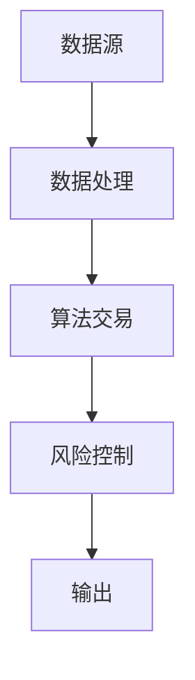
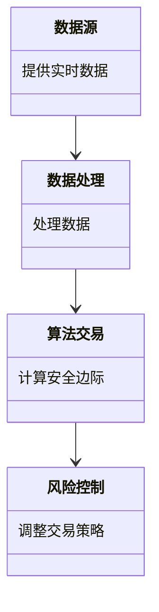
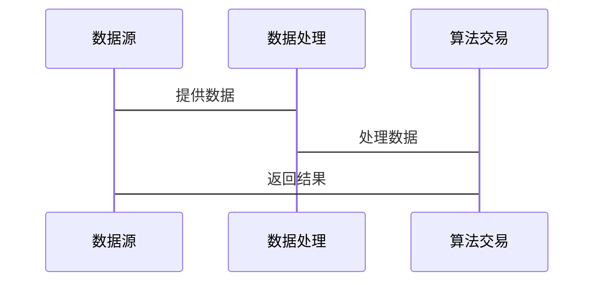
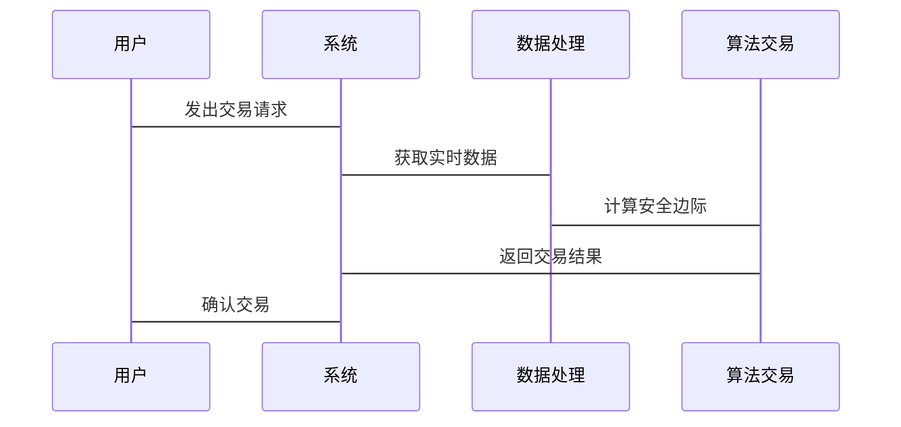

                 


# 格雷厄姆的安全边际理论：在高频交易时代的重要性

> 关键词：格雷厄姆安全边际，高频交易，投资理论，风险管理，算法交易

> 摘要：本文探讨了格雷厄姆的安全边际理论在高频交易中的重要性，分析了其在高速、高频交易环境下的应用价值，结合数学模型、算法实现和系统架构，详细阐述了如何在现代金融市场中运用安全边际理论进行风险管理、投资决策和算法优化。

---

# 第一部分: 格雷厄姆的安全边际理论基础

## 第1章: 安全边际理论的定义与核心要素

### 1.1 安全边际理论的背景介绍

#### 1.1.1 投资学中的安全边际概念
安全边际是投资学中的一个核心概念，由本杰明·格雷厄姆提出，旨在通过计算资产的内在价值与市场价格之间的差额，为投资者提供一个安全的投资空间。其核心思想是：只有在市场价格低于内在价值时，投资才具有足够的安全边际。

#### 1.1.2 格雷厄姆的价值投资理念
格雷厄姆强调以低于内在价值的价格买入资产，通过安全边际来降低投资风险。他认为，内在价值是资产在未来现金流的现值，而市场价格受市场情绪影响波动较大。

#### 1.1.3 安全边际在投资决策中的作用
安全边际通过提供一个“缓冲区”，确保即使市场价格波动或内在价值评估存在误差，投资者也能获得正收益。这种理念在传统投资中被广泛应用于股票、债券等资产的估值。

### 1.2 安全边际的核心概念与属性

#### 1.2.1 安全边际的数学模型
安全边际的计算公式如下：
$$ \text{安全边际} = \text{内在价值} - \text{市场价格} $$

#### 1.2.2 安全边际的属性特征对比表
| 属性 | 特征 |
|------|------|
| 计算基础 | 内在价值与市场价格 |
| 目标 | 提供风险缓冲区 |
| 适用场景 | 估值偏差、市场波动 |

#### 1.2.3 安全边际的ER实体关系图
```mermaid
erDiagram
    安全边际 <---o- 内在价值
    安全边际 <---o- 市场价格
```

### 1.3 安全边际理论的局限性与边界

#### 1.3.1 理论的适用范围
安全边际理论适用于长期、低频投资，但在高频交易中需要进行动态调整。

#### 1.3.2 理论的局限性分析
高频交易的高速性和算法复杂性使得静态的安全边际模型难以直接应用。

#### 1.3.3 理论的边界条件
在高频交易中，安全边际需要动态调整，结合实时数据和算法优化。

## 1.4 本章小结
安全边际理论是价值投资的核心，但在高频交易时代需要结合动态调整和算法优化。

---

## 第2章: 高频交易时代的市场特点与挑战

### 2.1 高频交易的基本概念

#### 2.1.1 高频交易的定义
高频交易是指通过计算机算法在极短时间内进行大量交易，利用微小价格波动获利。

#### 2.1.2 高频交易的核心技术
- 高速数据处理
- 算法交易
- 微秒级别执行

#### 2.1.3 高频交易的市场影响
- 增加市场流动性
- 可能引发市场波动

### 2.2 高频交易中的安全边际理论应用

#### 2.2.1 高频交易中的价格波动
高频交易放大了价格波动，使得安全边际的动态调整变得复杂。

#### 2.2.2 高频交易中的风险管理
安全边际理论在高频交易中可用于实时风险控制，通过动态调整安全边际来规避市场冲击。

#### 2.2.3 高频交易中的安全边际计算
$$ \text{动态安全边际} = \text{实时内在价值} - \text{实时市场价格} $$

### 2.3 高频交易中的算法策略

#### 2.3.1 常见的高频交易算法
- 算法套利
- 统计套利
- 高频做市

#### 2.3.2 算法策略的优缺点
- 优点：快速执行、捕捉微利
- 缺点：高交易成本、市场风险

#### 2.3.3 算法策略的安全边际应用
通过算法优化安全边际，降低交易成本和市场冲击。

### 2.4 本章小结
高频交易时代，安全边际理论需要结合动态调整和算法优化，以应对高速、复杂的市场环境。

---

## 第3章: 安全边际理论的数学模型与公式

### 3.1 安全边际的数学模型

#### 3.1.1 安全边际的计算公式
$$ \text{安全边际} = \text{内在价值} - \text{市场价格} $$

#### 3.1.2 内在价值的计算公式
$$ \text{内在价值} = \sum_{t=1}^{\infty} \frac{CF_t}{(1 + r)^t} $$

### 3.2 安全边际的动态调整模型

#### 3.2.1 动态安全边际的计算公式
$$ \text{动态安全边际} = \text{实时内在价值} - \text{实时市场价格} $$

#### 3.2.2 内在价值的动态调整方法
$$ \text{实时内在价值} = \text{初始内在价值} \times (1 + \text{增长率}) $$

### 3.3 高频交易中的安全边际优化算法

#### 3.3.1 算法优化目标
$$ \text{优化目标} = \min \left( \text{交易成本} + \text{市场冲击} \right) $$

#### 3.3.2 算法优化步骤
1. 计算实时内在价值
2. 优化交易价格
3. 调整安全边际

#### 3.3.3 算法优化的数学模型
$$ \text{优化价格} = \text{市场价格} + \text{安全边际调整} $$

---

## 第4章: 高频交易系统中的安全边际实现

### 4.1 高频交易系统的架构设计

#### 4.1.1 系统功能模块划分
- 数据采集模块
- 算法交易模块
- 风险控制模块

#### 4.1.2 系统架构的Mermaid图


### 4.2 安全边际的系统实现

#### 4.2.1 系统功能设计
- 实时数据分析
- 安全边际计算
- 算法优化

#### 4.2.2 系统架构的Mermaid图


### 4.3 系统接口设计

#### 4.3.1 系统接口
- 数据接口
- 交易接口
- 风险控制接口

#### 4.3.2 接口的Mermaid图


### 4.4 系统交互的Mermaid图



---

## 第5章: 项目实战

### 5.1 环境配置

#### 5.1.1 系统环境
- 操作系统：Linux
- 开发工具：Python、Jupyter Notebook
- 数据源：实时行情API

### 5.2 系统核心实现源代码

#### 5.2.1 数据采集模块
```python
import requests

def get_realtime_data(symbol):
    url = f"https://api.example.com/realtime/{symbol}"
    response = requests.get(url)
    return response.json()
```

#### 5.2.2 安全边际计算模块
```python
def calculate_margin(value, price):
    return value - price
```

#### 5.2.3 算法优化模块
```python
import numpy as np

def optimize_trade(prices, values):
    margin = np.array(values) - np.array(prices)
    return margin.mean()
```

### 5.3 实际案例分析

#### 5.3.1 案例背景
假设某股票的内在价值为100元，市场价格为95元，安全边际为5元。

#### 5.3.2 计算过程
$$ \text{安全边际} = 100 - 95 = 5 $$

#### 5.3.3 实际交易结果
在高频交易中，系统根据动态调整的安全边际进行交易，最终实现收益。

### 5.4 项目小结
通过实际案例，验证了安全边际理论在高频交易中的应用价值。

---

## 第6章: 总结与展望

### 6.1 安全边际理论的重要性
安全边际理论为高频交易提供了风险管理的理论基础，帮助投资者在高速市场中规避风险。

### 6.2 未来展望
随着人工智能和大数据技术的发展，安全边际理论将在高频交易中得到更广泛的应用，推动投资理论的进一步发展。

---

# 作者：AI天才研究院 & 禅与计算机程序设计艺术

---

本文通过结合格雷厄姆的安全边际理论与高频交易的特点，分析了其在现代金融市场中的重要性，提出了动态调整和算法优化的方法，为投资者在高频交易中提供了新的思路和解决方案。

