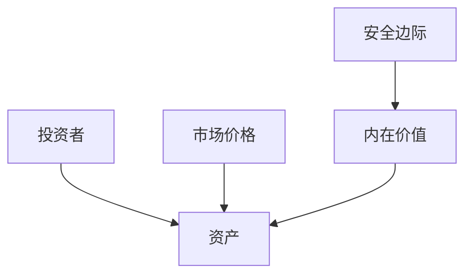
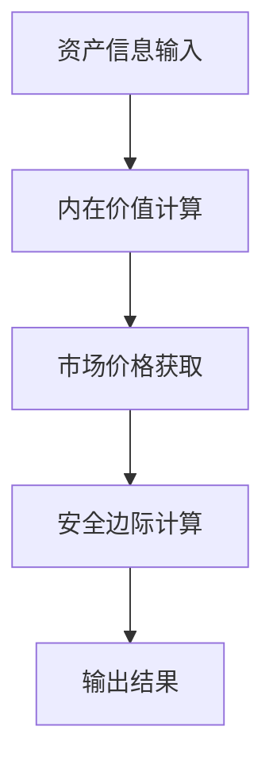

                 


# 格雷厄姆的安全边际：如何在投资中留有余地

> 关键词：安全边际、投资决策、价值评估、风险管理、投资策略、价值投资

> 摘要：本文详细探讨了格雷厄姆提出的“安全边际”概念，分析了其在投资决策中的重要性。通过定义、计算方法、应用场景和实际案例，展示了如何利用安全边际降低投资风险，实现稳健收益。文章还结合技术分析，提出了安全边际的算法实现和系统架构设计方案。

---

# 引言：投资的基石与风险管理

## 1.1 投资的基本概念

### 1.1.1 什么是投资
投资是通过购买资产以期在未来获得收益或资本增值的行为。资产可以是股票、债券、房地产等多种形式，而投资的本质在于通过分析资产的内在价值，做出明智的决策。

### 1.1.2 投资的分类与特点
投资可以分为短期投资和长期投资，其中长期投资更注重资产的内在价值。投资的特点包括高风险、高回报、时间和信息的敏感性。

### 1.1.3 投资的基本原则
格雷厄姆强调，投资应基于安全边际和价值评估，而非市场波动或短期趋势。投资者应保持理性，避免情绪化决策。

## 1.2 安全边际的背景与重要性

### 1.2.1 安全边际的定义
安全边际是指资产的市场价格低于其内在价值的部分，是投资者在决策时留有的“安全空间”。

### 1.2.2 安全边际的历史背景
20世纪初，格雷厄姆提出安全边际概念，强调在投资中留有余地，以应对市场的不确定性。

### 1.2.3 格雷厄姆的价值投资理念
格雷厄姆认为，市场先生的行为是不可预测的，因此投资者应以安全边际为核心，寻找被市场低估的资产。

---

# 核心概念：安全边际的原理与应用

## 2.1 安全边际的核心思想

### 2.1.1 安全边际的哲学意义
安全边际体现了“买便宜货”的投资理念，要求投资者在购买资产时，价格远低于其内在价值。

### 2.1.2 安全边际与投资风险
通过安全边际，投资者可以降低因市场价格波动带来的风险，确保投资的稳健性。

### 2.1.3 安全边际的数学模型
$$ \text{安全边际} = \frac{\text{内在价值} - \text{市场价格}}{\text{市场价格}} $$

## 2.2 安全边际的属性特征对比

| 属性 | 特征 |
|------|------|
| 计算方式 | 相对值计算 |
| 适用范围 | 适用于股票、债券等金融资产 |
| 变化趋势 | 随市场价格波动而变化 |

## 2.3 安全边际的ER实体关系图



---

# 算法原理：安全边际的计算与实现

## 3.1 安全边际的计算流程

1. **确定内在价值**：通过基本面分析估算资产的内在价值。
2. **计算市场价格**：获取资产的当前市场价格。
3. **计算安全边际**：使用公式 $$ \text{安全边际} = \frac{\text{内在价值} - \text{市场价格}}{\text{市场价格}} $$

## 3.2 安全边际的Python实现

```python
def calculate_margin_of_safety(intrinsic_value, market_price):
    return (intrinsic_value - market_price) / market_price

# 示例：某股票的内在价值为100，市场价格为80
iv = 100
mp = 80
margin = calculate_margin_of_safety(iv, mp)
print(f"安全边际为：{margin * 100}%")
```

## 3.3 安全边际的数学模型与公式

$$ \text{安全边际} = \frac{\text{内在价值} - \text{市场价格}}{\text{市场价格}} $$

---

# 系统分析：安全边际的系统架构设计

## 4.1 投资决策系统的架构设计

### 4.1.1 系统功能设计
- 资产信息输入模块
- 内在价值计算模块
- 市场价格获取模块
- 安全边际计算模块

### 4.1.2 系统架构图



---

# 项目实战：安全边际的实际应用

## 5.1 安全边际的案例分析

### 5.1.1 案例背景
某公司股票的内在价值为120元，市场价格为100元。

### 5.1.2 计算安全边际
$$ \text{安全边际} = \frac{120 - 100}{100} = 0.2 \text{或} 20\% $$

### 5.1.3 投资决策
由于安全边际为20%，投资者可以以较低风险买入该股票。

## 5.2 系统实现与代码解读

### 5.2.1 环境安装
需要安装Python和相关数据处理库。

### 5.2.2 核心代码实现

```python
def calculate_margin_of_safety(intrinsic_value, market_price):
    return (intrinsic_value - market_price) / market_price

# 示例运行
iv = 120
mp = 100
margin = calculate_margin_of_safety(iv, mp)
print(f"安全边际为：{margin * 100}%")
```

---

# 总结：安全边际的投资策略与未来展望

## 6.1 核心要点回顾
- 安全边际是价值投资的核心工具。
- 计算安全边际需结合内在价值和市场价格。
- 高安全边际意味着低风险和高收益潜力。

## 6.2 投资策略建议
1. **长期投资**：选择具备稳定内在价值的资产。
2. **分散投资**：降低单一资产的风险。
3. **持续学习**：更新投资知识，应对市场变化。

## 6.3 未来展望
随着人工智能的发展，安全边际的计算将更加精准和自动化，帮助投资者做出更明智的决策。

---

# 作者：AI天才研究院 / AI Genius Institute  
禅与计算机程序设计艺术 / Zen And The Art of Computer Programming

