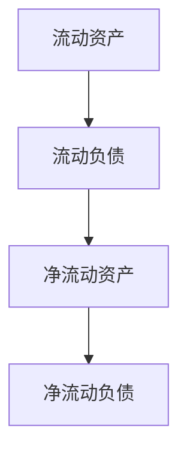
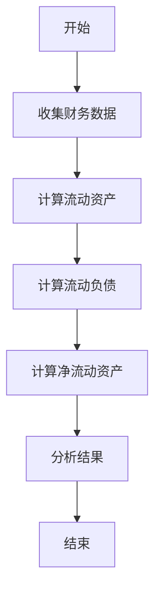
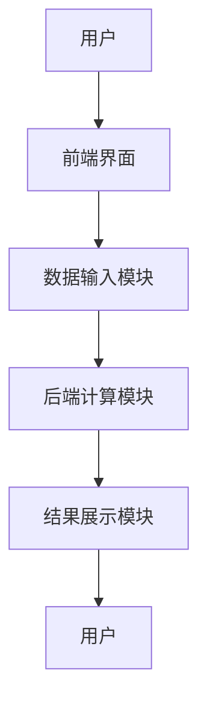

                 


# 格雷厄姆的工作资本分析方法

> 关键词：格雷厄姆、工作资本分析、财务分析、投资策略、企业估值

> 摘要：本文深入探讨了格雷厄姆的工作资本分析方法，从背景介绍、核心概念、数学模型到系统设计和项目实战，全面解析了这一经典投资分析方法的内在逻辑和实际应用。通过详细的技术分析和案例研究，揭示了如何利用工作资本分析来评估企业财务健康状况，优化投资决策，并实现长期稳健的投资收益。

---

## 第一章: 工作资本分析的背景与核心概念

### 1.1 工作资本分析的定义与重要性

#### 1.1.1 工作资本的定义
工作资本（Working Capital）是指企业在日常经营活动中可以迅速转化为现金的资产，主要包括流动资产减去流动负债的部分。它是衡量企业短期偿债能力和运营效率的重要指标。

#### 1.1.2 工作资本分析的重要性
工作资本分析能够帮助企业评估其短期财务健康状况，判断企业在应对突发资金需求时的灵活性。对于投资者来说，工作资本分析是评估企业价值和投资风险的重要工具。

#### 1.1.3 工作资本分析与其他财务分析方法的区别
与整体资本分析、盈利能力分析等其他财务分析方法相比，工作资本分析更关注企业的短期偿债能力和运营效率，侧重于流动资产和流动负债的管理。

### 1.2 格雷厄姆的投资理念

#### 1.2.1 格雷厄姆的投资哲学
格雷厄姆是价值投资的鼻祖，他强调以低于内在价值的价格买入优质股票，注重安全边际和长期稳健的投资回报。

#### 1.2.2 格雷厄姆的“安全边际”概念
“安全边际”是指股票的内在价值与其市场价格之间的差距，确保投资者在市场波动中能够获得超额收益。

#### 1.2.3 格雷厄姆与现代投资理论的联系与区别
格雷厄姆的估值方法注重企业基本面分析，而现代投资理论更关注市场整体波动和资产配置。两者相辅相成，共同构成了完整的投资分析体系。

---

## 第二章: 工作资本分析的核心概念与联系

### 2.1 工作资本的核心要素

#### 2.1.1 流动资产
流动资产是指企业在一年内可以转化为现金的资产，包括现金、应收账款、存货等。

#### 2.1.2 流动负债
流动负债是指企业在一年内需要偿还的债务，包括应付账款、短期贷款等。

#### 2.1.3 净流动资产
净流动资产 = 流动资产 - 流动负债

### 2.2 核心概念的属性特征对比

| 概念        | 属性特征                       |
|-------------|--------------------------------|
| 流动资产     | 可流动性高，周转速度快         |
| 流动负债     | 短期偿债压力大                 |
| 净流动资产   | 衡量企业短期财务健康状况的指标 |

### 2.3 ER实体关系图


---

## 第三章: 工作资本分析的数学模型与公式

### 3.1 净流动资产的计算公式
$$ \text{净流动资产} = \text{流动资产} - \text{流动负债} $$

### 3.2 流动资产周转率的计算公式
$$ \text{流动资产周转率} = \frac{\text{营业收入}}{\text{平均流动资产}} $$

### 3.3 工作资本分析的流程图


---

## 第四章: 系统分析与架构设计方案

### 4.1 问题场景介绍

#### 4.1.1 企业财务健康评估
通过分析企业的净流动资产，判断其短期偿债能力和运营效率。

#### 4.1.2 投资决策支持
投资者可以根据企业的净流动资产状况，评估其投资风险和潜在收益。

### 4.2 系统功能设计

#### 4.2.1 财务数据输入模块
允许用户输入企业的流动资产和流动负债数据。

#### 4.2.2 自动计算模块
根据输入数据，自动计算净流动资产和流动资产周转率。

#### 4.2.3 分析结果展示模块
以图表形式展示分析结果，便于用户理解和决策。

### 4.3 系统架构设计



---

## 第五章: 项目实战

### 5.1 环境安装

#### 5.1.1 安装Python
```bash
python --version
pip install numpy pandas matplotlib
```

#### 5.1.2 安装数据可视化库
```bash
pip install plotly
```

### 5.2 核心代码实现

#### 5.2.1 计算净流动资产
```python
# 计算净流动资产
流动资产 = 1000000  # 示例数据
流动负债 = 800000    # 示例数据
净流动资产 = 流动资产 - 流动负债
print(f"净流动资产: {净流动资产}")
```

#### 5.2.2 计算流动资产周转率
```python
营业收入 = 500000  # 示例数据
平均流动资产 = (流动资产 + 流动资产) / 2
流动资产周转率 = 营业收入 / 平均流动资产
print(f"流动资产周转率: {流动资产周转率}")
```

### 5.3 案例分析

#### 5.3.1 案例背景
假设某企业流动资产为150万元，流动负债为100万元，营业收入为80万元，平均流动资产为125万元。

#### 5.3.2 计算步骤
1. 净流动资产 = 150万元 - 100万元 = 50万元
2. 流动资产周转率 = 80万元 / 125万元 = 0.64

#### 5.3.3 结果分析
净流动资产为正，说明企业短期偿债能力较强；流动资产周转率较低，可能表明企业资金利用效率有待提高。

---

## 第六章: 最佳实践与小结

### 6.1 最佳实践

#### 6.1.1 数据准确性
确保财务数据的准确性，避免因数据错误导致分析结果偏差。

#### 6.1.2 结合其他分析方法
将工作资本分析与其他财务分析方法结合，全面评估企业价值。

### 6.2 小结

通过本文的详细讲解，读者可以掌握格雷厄姆的工作资本分析方法，并将其应用于实际投资分析中。这种方法不仅能够帮助投资者评估企业的短期财务健康状况，还能提供重要的投资决策支持。

### 6.3 注意事项

- 数据来源的可靠性
- 分析模型的适用性
- 市场环境的变化影响

### 6.4 拓展阅读

- 格雷厄姆的《证券分析》
- 现代投资组合理论

---

## 附录

### A. 术语表

- 工作资本：流动资产减去流动负债。
- 净流动资产：衡量企业短期财务健康状况的指标。
- 流动资产周转率：反映企业资金利用效率的指标。

### B. 工具推荐

- Python：数据分析和可视化的首选工具。
- Pandas：数据处理库。
- Matplotlib：数据可视化库。

### C. 参考文献

1. 格雷厄姆，本杰明. 《证券分析》.
2. 现代投资组合理论的相关文献.

---

作者：AI天才研究院/AI Genius Institute & 禅与计算机程序设计艺术 /Zen And The Art of Computer Programming

