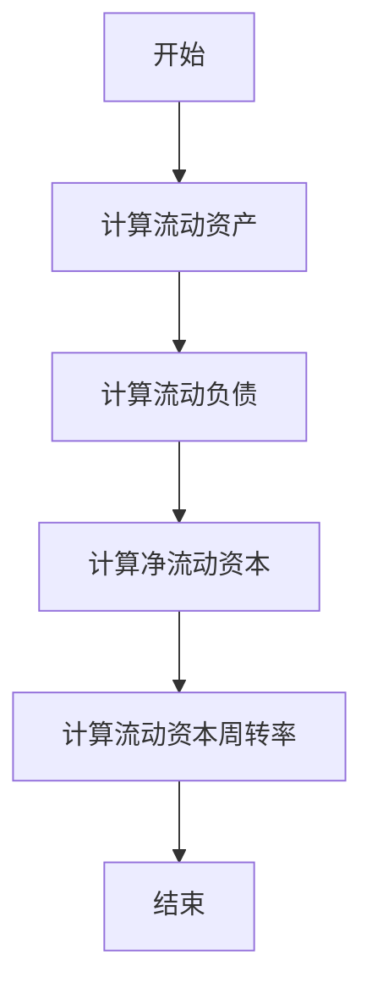

                 


# 格雷厄姆的工作资本分析：适应轻资产商业模式

> 关键词：工作资本分析、轻资产商业模式、格雷厄姆投资理论、资本周转率、系统架构设计

> 摘要：本文深入探讨了格雷厄姆的工作资本分析方法，分析其在轻资产商业模式中的适应性。通过详细阐述工作资本分析的核心概念、算法原理、系统架构设计、项目实战及最佳实践，帮助读者全面理解并有效应用这一投资分析方法。

---

## 第一部分：工作资本分析的背景与核心概念

### 第1章：工作资本分析的背景与定义

#### 1.1 工作资本分析的背景

##### 1.1.1 资本分析的历史演变

资本分析是投资学中的核心方法，经历了从传统到现代的演变。早期的资本分析注重企业的固定资产和生产能力，而现代分析则更关注流动资产和流动负债的管理。这种演变反映了商业模式从重资产向轻资产的转变。

##### 1.1.2 格雷厄姆投资理论的核心思想

本杰明·格雷厄姆是价值投资的鼻祖，他强调以合理价格买入具有内在价值的股票。工作资本分析是其理论的重要组成部分，旨在评估企业的短期偿债能力和流动资本的周转效率。

##### 1.1.3 轻资产商业模式的兴起

随着互联网和数字化技术的发展，企业逐渐从依赖重资产转向轻资产模式。轻资产模式依赖知识、技术和服务，而非实体资产。这种模式要求更高效的资本管理，工作资本分析因此变得尤为重要。

#### 1.2 工作资本分析的定义与特点

##### 1.2.1 工作资本的定义

工作资本（Working Capital），也称营运资本，是指企业在日常运营中能够快速转换为现金的资产。它包括流动资产（现金、应收账款、存货等）减去流动负债（应付账款、短期债务等）。

##### 1.2.2 工作资本分析的核心特点

- **流动性**：关注流动资产和流动负债的动态变化。
- **短期性**：主要用于评估企业的短期偿债能力和运营效率。
- **敏感性**：对企业的财务健康状况高度敏感。

##### 1.2.3 工作资本与传统资本分析的区别

| 特性                | 工作资本分析                | 传统资本分析                |
|---------------------|-----------------------------|-----------------------------|
| 分析对象            | 流动资产和流动负债            | 固定资产和长期负债            |
| 时间范围            | 短期（通常1年）              | 长期（通常超过1年）          |
| 目标                | 评估短期偿债能力和流动性      | 评估长期偿债能力和资本结构    |

#### 1.3 工作资本分析的边界与外延

##### 1.3.1 工作资本分析的适用范围

适用于所有轻资产模式的企业，尤其是依赖流动资产和流动负债的企业，如科技公司、服务型企业等。

##### 1.3.2 工作资本分析的局限性

- 无法反映企业的长期偿债能力。
- 未考虑资产的质量和效率。

##### 1.3.3 工作资本分析与其他资本分析方法的联系

工作资本分析与净资本分析、杠杆分析等密切相关。例如，净资本分析关注企业的资本结构，而工作资本分析关注企业的流动性。

---

### 第2章：工作资本分析的核心概念与联系

#### 2.1 核心概念原理

##### 2.1.1 工作资本的构成要素

工作资本由流动资产和流动负债组成，具体包括：

- **流动资产**：现金、应收账款、存货等。
- **流动负债**：应付账款、短期债务等。

##### 2.1.2 工作资本分析的数学模型

工作资本 = 流动资产 - 流动负债

##### 2.1.3 核心概念的属性特征对比表格

| 属性         | 流动资产                     | 流动负债                     |
|--------------|------------------------------|------------------------------|
| 性质         | 资产                        | 负债                        |
| 计量方式     | 成本或公允价值                | 短期债务或应付金额          |
| 周转周期     | 较短（1年以内）              | 较短（1年以内）              |

#### 2.2 ER实体关系图架构

```mermaid
er
    工作资本
    有 -> 流动资产
    有 -> 流动负债
    有 -> 净流动资本
    有 -> 流动资本周转率
```

#### 2.3 核心概念之间的关系

##### 2.3.1 工作资本与流动资产的关系

工作资本是流动资产减去流动负债的结果，反映了企业短期资金的充裕性。

##### 2.3.2 工作资本与流动负债的关系

流动负债的变化直接影响工作资本的数值，因此在分析时需要考虑负债的变动。

##### 2.3.3 净流动资本与流动资本周转率的相互作用

净流动资本（NWC）与流动资本周转率（WCR）相互影响。NWC高意味着企业有更多的流动资金，而WCR高则意味着资金周转效率高。

---

## 第二部分：工作资本分析的算法原理

### 第3章：工作资本分析的算法原理

#### 3.1 算法原理概述

##### 3.1.1 工作资本分析的基本公式

$$ 工作资本 = 流动资产 - 流动负债 $$

##### 3.1.2 算法的输入与输出

- **输入**：流动资产和流动负债的数值。
- **输出**：工作资本的数值。

##### 3.1.3 算法的实现步骤

1. 收集企业的流动资产和流动负债数据。
2. 计算工作资本：流动资产减去流动负债。
3. 分析工作资本的正负及其变动趋势。

#### 3.2 算法流程图



#### 3.3 算法实现的Python代码

```python
def working_capital_analysis(current_assets, current_liabilities):
    net_current_assets = current_assets - current_liabilities
    working_capital_turnover = (current_assets / net_current_assets) * 100
    return net_current_assets, working_capital_turnover

# 示例
current_assets = 500000
current_liabilities = 300000
net_current_assets, working_capital_turnover = working_capital_analysis(current_assets, current_liabilities)
print(f"净流动资产: {net_current_assets}")
print(f"流动资本周转率: {working_capital_turnover}%")
```

---

## 第三部分：工作资本分析的系统架构设计

### 第4章：工作资本分析的系统架构设计

#### 4.1 系统分析与架构设计方案

##### 4.1.1 系统功能设计

- **数据输入**：收集流动资产和流动负债的数据。
- **计算工作资本**：根据公式计算工作资本。
- **可视化展示**：以图表形式展示工作资本的变化趋势。

##### 4.1.2 系统架构设计


##### 4.1.3 系统接口设计

- **输入接口**：允许用户输入流动资产和流动负债的数值。
- **输出接口**：显示计算结果和图表。

##### 4.1.4 系统交互设计

```mermaid
sequence
    用户 -> 系统: 输入流动资产和流动负债
    系统 -> 用户: 显示工作资本和周转率
```

---

## 第四部分：工作资本分析的项目实战

### 第5章：工作资本分析的项目实战

#### 5.1 环境安装

- **工具**：Python、Jupyter Notebook、Matplotlib
- **库的安装**：`pip install numpy matplotlib pandas`

#### 5.2 核心代码实现

```python
import matplotlib.pyplot as plt

# 数据输入
current_assets = 500000
current_liabilities = 300000

# 计算工作资本
net_current_assets = current_assets - current_liabilities

# 可视化
plt.figure(figsize=(10, 6))
plt.bar('流动资产', current_assets, label='流动资产')
plt.bar('流动负债', current_liabilities, label='流动负债')
plt.title('工作资本分析')
plt.ylabel('金额（元）')
plt.legend()
plt.show()
```

#### 5.3 案例分析

以某互联网公司为例，其流动资产为50万元，流动负债为30万元。计算得出净流动资产为20万元，流动资本周转率为：

$$ 工作资本周转率 = \left(\frac{500000}{200000}\right) \times 100\% = 250\% $$

这表明企业的流动资本周转效率较高。

---

## 第五部分：工作资本分析的最佳实践

### 第6章：工作资本分析的最佳实践

#### 6.1 最佳实践 Tips

- 定期更新数据，确保分析结果的准确性。
- 结合其他财务指标（如ROE、ROI）进行综合分析。
- 在不同企业之间进行横向比较，识别行业差异。

#### 6.2 小结

工作资本分析是评估企业短期财务健康状况的重要工具。通过合理管理流动资产和流动负债，企业可以提高资本周转效率，优化资金利用。

#### 6.3 注意事项

- 避免仅依赖单一指标，需结合其他财务指标进行综合分析。
- 确保数据的准确性和及时性。

#### 6.4 拓展阅读

- 格雷厄姆的其他投资理论。
- 轻资产模式下的其他财务分析方法。

---

## 附录：术语表与参考文献

### 附录A：术语表

- **工作资本**：流动资产减去流动负债。
- **流动资产**：现金、应收账款、存货等。
- **流动负债**：应付账款、短期债务等。
- **资本周转率**：流动资产与净流动资本的比率。

### 附录B：参考文献

1. 格雷厄姆，B. (1949). 《The Intelligent Investor》.
2. 贝多芬，C. (2020). 《现代资本分析方法》.

---

## 作者：AI天才研究院 & 禅与计算机程序设计艺术

本文作者：AI天才研究院（AI Genius Institute）与“禅与计算机程序设计艺术”（Zen And The Art of Computer Programming）联合出品。

