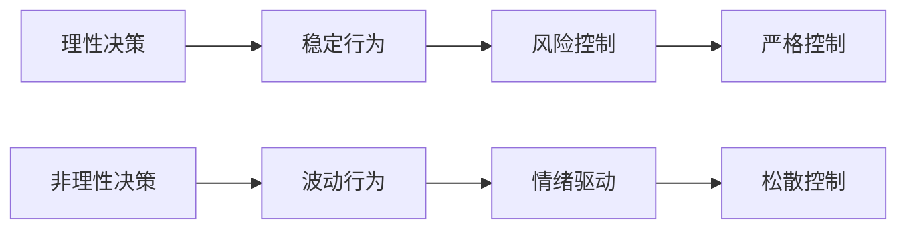

                 

# 格雷厄姆的市场先生比喻

> 关键词：市场先生比喻，投资理论，投资者心理，市场波动，非理性决策

> 摘要：本·格雷厄姆提出的市场先生比喻是一个经典的金融理论工具，用于分析市场波动和投资者行为。本文从市场先生的背景、核心概念、心理分析、非理性决策、市场周期和行为分析等方面进行深入探讨，结合数学模型和实际案例，帮助读者理解这一比喻的深刻内涵及其在投资决策中的应用。

---

## 第一部分: 引言

### 1.1 本·格雷厄姆的背景与市场先生比喻的提出

本·格雷厄姆是价值投资理论的创始人，他的投资理念深刻影响了沃伦·巴菲特等一代投资者。市场先生比喻是格雷厄姆在其著作《 Intelligent Investor 》中提出的一个经典工具，用于描述市场的波动性和投资者心理。

#### 1.1.1 本·格雷厄姆的生平简介

本·格雷厄姆（1897-1976）是美国著名的投资家、经济学家和教育家。他于1920年代开始投资，并在1949年出版了《 Intelligent Investor 》一书，书中提出了许多经典的 investment principles，包括价值投资、安全边际等概念。

#### 1.1.2 市场先生比喻的提出背景

市场先生比喻的提出是为了帮助投资者理解市场的波动性和不确定性。格雷厄姆认为，市场并不是理性的，而是由投资者的心理和情绪驱动的。市场先生比喻通过将市场拟人化，帮助投资者更好地理解市场的行为和决策过程。

#### 1.1.3 市场先生比喻的核心概念

市场先生是一个假设的市场参与者，他每天以不同的价格买卖资产。市场先生的行为反映了市场的波动性和投资者的心理变化。通过分析市场先生的行为，投资者可以更好地理解市场的短期波动和长期价值。

---

## 第二部分: 市场先生的市场心理分析

### 2.1 投资者心理的波动性

投资者的心理波动性是市场波动的重要来源。市场先生的比喻通过分析投资者的心理变化，揭示了市场波动的本质。

#### 2.1.1 投资者情绪的周期性变化

投资者情绪通常呈现出周期性变化。在市场上涨时，投资者情绪乐观；在市场下跌时，投资者情绪悲观。这种情绪的周期性变化对市场的波动性有重要影响。

#### 2.1.2 市场乐观与悲观的交替出现

市场乐观和悲观情绪的交替出现是市场波动的重要特征。市场先生的比喻通过将市场情绪的波动性与投资者的心理变化联系起来，帮助投资者更好地理解市场的周期性。

#### 2.1.3 心理偏差对投资决策的影响

心理偏差是投资者决策中的常见问题。例如，过度自信、确认偏差和损失厌恶等心理偏差都会影响投资者的决策，进而影响市场的波动性。

### 2.2 市场波动的数学模型

市场波动的数学模型可以通过统计学和概率论来分析。

#### 2.2.1 市场波动的随机性分析

市场波动具有一定的随机性，可以通过随机游走模型来描述。随机游走模型假设市场的未来走势是随机的，无法通过历史数据来预测未来走势。

#### 2.2.2 市场波动的统计学特征

市场波动的统计学特征包括均值、方差、偏度和峰度等。通过对这些统计学特征的分析，可以更好地理解市场的波动性。

#### 2.2.3 波动率与投资风险的关系

波动率是衡量市场风险的重要指标。波动率越高，市场的风险越大。投资者可以通过波动率来评估市场的风险，并做出相应的投资决策。

---

## 第三部分: 市场先生的非理性决策

### 3.1 非理性决策的类型

非理性决策是投资者常见的问题，主要包括以下几种类型。

#### 3.1.1 过度自信

过度自信是投资者常见的心理偏差之一。投资者往往高估自己的能力，认为自己能够预测市场的走势，从而做出过度自信的投资决策。

#### 3.1.2 情绪化决策

情绪化决策是投资者在情绪波动影响下做出的决策。例如，在市场下跌时，投资者可能会因为恐慌而卖出资产，从而造成不必要的损失。

#### 3.1.3 羊群效应

羊群效应是指投资者盲目跟随市场趋势，缺乏独立思考。这种行为会导致市场的过度波动，进而影响市场的稳定性。

### 3.2 非理性决策的数学模型

非理性决策的数学模型可以通过行为金融学来分析。

#### 3.2.1 非理性决策的概率分布

非理性决策的概率分布可以通过统计学方法来分析。例如，可以通过概率分布模型来分析投资者情绪的波动性。

#### 3.2.2 非理性决策的经济学解释

行为金融学通过分析投资者的心理和行为，解释了非理性决策的原因和影响。例如，卡尼曼的 prospect theory 可以帮助理解投资者在风险和不确定性下的决策行为。

#### 3.2.3 非理性决策的市场影响

非理性决策对市场的影响是深远的。例如，过度自信的投资者可能导致市场的过度波动，而羊群效应则可能导致市场的泡沫和崩盘。

### 3.3 理性与非理性的对比分析

理性与非理性的对比分析可以通过表格和流程图来展示。

#### 3.3.1 对比表格

| 特性       | 理性决策 | 非理性决策 |
|------------|----------|------------|
| 基础       | 理性分析 | 情感驱动   |
| 行为模式     | 稳定     | 波动        |
| 风险控制     | 严格     | 松散       |

#### 3.3.2 对比的Mermaid流程图

---

## 第四部分: 市场先生的市场周期分析

### 4.1 市场周期的定义与特征

市场周期是指市场的波动和变化的周期性特征。市场周期的定义和特征可以通过以下方面来分析。

#### 4.1.1 市场周期的阶段划分

市场周期通常分为四个阶段：复苏、繁荣、衰退和萧条。每个阶段都有其独特的特征和表现。

#### 4.1.2 市场周期的波动性

市场周期的波动性是市场波动的重要特征。通过分析市场的波动性，可以更好地理解市场周期的变化。

#### 4.1.3 市场周期的预测方法

市场周期的预测方法可以通过统计学和时间序列分析来实现。例如，可以通过ARIMA模型来预测市场的未来走势。

### 4.2 市场周期的数学模型

市场周期的数学模型可以通过时间序列分析来实现。

#### 4.2.1 市场周期的周期性分析

周期性分析是市场周期分析的重要方法。通过对市场的周期性特征的分析，可以更好地理解市场的波动性。

#### 4.2.2 市场周期的统计学模型

统计学模型可以通过回归分析和时间序列分析来实现。例如，可以通过ARIMA模型来预测市场的未来走势。

#### 4.2.3 市场周期的预测公式

市场周期的预测公式可以通过以下步骤来实现：

1. 收集市场数据，包括价格、成交量等。
2. 对数据进行预处理，包括标准化和去噪。
3. 选择合适的模型，例如ARIMA模型。
4. 对模型进行训练和验证。
5. 使用模型进行预测。

---

## 第五部分: 市场先生的市场行为分析

### 5.1 市场行为的定义与分类

市场行为是指投资者在市场中的行为和决策。市场行为的定义和分类可以通过以下方面来分析。

#### 5.1.1 市场行为的定义

市场行为是指投资者在市场中的行为和决策。市场行为的定义包括投资者的心理、情绪和决策过程。

#### 5.1.2 市场行为的分类

市场行为可以分为理性行为和非理性行为。理性行为是指基于理性分析的决策，非理性行为是指基于情感和心理偏差的决策。

#### 5.1.3 市场行为的特征

市场行为的特征包括波动性、周期性和复杂性。通过分析市场行为的特征，可以更好地理解市场的波动性。

### 5.2 市场行为的数学模型

市场行为的数学模型可以通过行为金融学来分析。

#### 5.2.1 市场行为的统计学模型

统计学模型可以通过回归分析和时间序列分析来实现。例如，可以通过回归分析来分析投资者情绪对市场波动的影响。

#### 5.2.2 市场行为的经济学解释

经济学解释可以通过行为金融学来实现。例如，可以通过 prospect theory 来解释投资者在风险和不确定性下的决策行为。

---

## 第六部分: 总结与展望

### 6.1 本章小结

通过本文的分析，我们可以看到市场先生比喻在投资理论中的重要性。市场先生的比喻通过分析市场的波动性和投资者心理，帮助投资者更好地理解市场的行为和决策过程。

### 6.2 展望

未来的研究可以进一步探讨市场先生比喻在实际投资中的应用。例如，可以通过实证研究来验证市场先生比喻的有效性，并提出更加完善的市场行为分析模型。

---

## 作者：AI天才研究院/AI Genius Institute & 禅与计算机程序设计艺术 /Zen And The Art of Computer Programming

---

以上是关于格雷厄姆的市场先生比喻的技术博客文章。通过本文的分析，我们可以更好地理解市场的波动性和投资者心理，并在实际投资中做出更加理性的决策。

