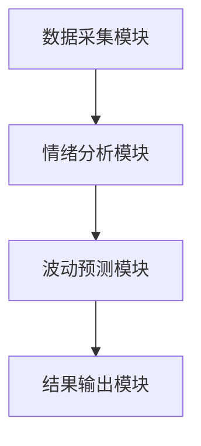
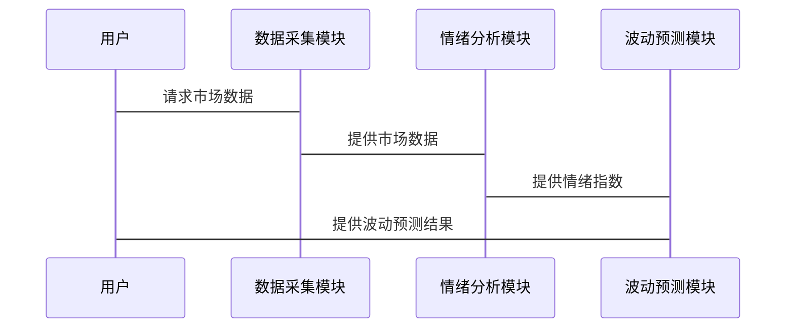

                 


# 格雷厄姆的市场先生比喻及其启示

> 关键词：市场先生，投资理论，市场情绪，波动预测，价值投资

> 摘要：本篇文章深入探讨了本杰明·格雷厄姆提出的“市场先生”比喻，分析其在投资理论中的核心作用，以及对现代金融市场分析和风险管理的启示。通过结合数学模型、算法实现和系统架构，文章详细阐述了市场先生的内在逻辑，并展示了其在实际投资中的应用价值。

---

## 第1章: 市场先生的背景与定义

### 1.1 格雷厄姆投资理论的背景

#### 1.1.1 价值投资的起源
价值投资是一种以内在价值为导向的投资方法，由本杰明·格雷厄姆和戴维·多德共同提出。这种方法强调购买被市场低估的股票，并在安全边际内进行投资。格雷厄姆的学生彼得·林奇和沃伦·巴菲特等人将这一理论发扬光大。

#### 1.1.2 格雷厄姆的学术贡献
格雷厄姆是哥伦比亚大学的著名教授，其著作《证券分析》和《聪明的投资者》奠定了现代价值投资的基础。他提出的“安全边际”概念和对市场波动性的研究，为后来的投资者提供了重要的理论支持。

#### 1.1.3 市场先生比喻的提出背景
在20世纪30年代，格雷厄姆观察到市场波动性对投资者决策的影响。为了更好地解释市场的非理性行为，他提出了市场先生（Mr. Market）的比喻。市场先生代表了市场的短期波动和投资者情绪的变化。

### 1.2 市场先生的定义与核心概念

#### 1.2.1 市场先生的定义
市场先生是一个虚拟的市场参与者，他每天以不同的价格买卖资产。这些价格反映了市场的波动性和投资者情绪的变化。市场先生并不总是理性的，他的报价可能过高或过低，反映了市场的乐观或悲观情绪。

#### 1.2.2 市场先生的核心要素
- **市场情绪**：市场先生的情绪波动是市场的核心驱动力。
- **市场波动**：市场先生的报价反映了市场的短期波动性。
- **投资者行为**：投资者根据市场先生的报价做出决策。

#### 1.2.3 市场先生与传统市场模型的对比
传统市场模型通常假设市场是有效的，即价格反映所有相关信息。而市场先生模型强调了市场情绪和非理性行为对价格的影响，提供了对市场波动性更全面的解释。

---

## 第2章: 市场先生的核心要素分析

### 2.1 市场情绪的波动性

#### 2.1.1 市场情绪的周期性
市场情绪具有周期性，通常表现为乐观与悲观情绪的交替。市场先生的情绪周期可以通过数学模型进行建模，例如使用周期函数来描述情绪的变化。

#### 2.1.2 市场情绪与投资者行为的关系
市场情绪影响投资者的决策，进而影响市场的整体走势。例如，当市场情绪高涨时，投资者可能过度乐观，导致资产价格被高估。

#### 2.1.3 市场情绪的数学模型
我们可以使用情绪指数来量化市场情绪。例如，基于新闻情感分析的指数可以反映市场情绪的变化。数学模型可以表示为：
$$
E(t) = a \cdot \sin(b \cdot t) + c
$$
其中，$E(t)$ 表示市场情绪指数，$a$ 是振幅，$b$ 是频率，$c$ 是偏移量。

### 2.2 市场波动的随机性

#### 2.2.1 随机游走模型
随机游走模型假设市场的波动是随机的，无法被预测。市场先生的报价可以被视为一个随机过程。

#### 2.2.2 市场波动的统计特征
市场波动通常表现出“肥尾”特征，即极端事件的概率高于正态分布的预测。这种特征可以用幂律分布来描述。

#### 2.2.3 市场波动与市场先生的关系
市场先生的报价反映了市场的波动性，而市场的波动性又受到市场情绪的影响。因此，市场波动可以被视为市场先生情绪的函数。

---

## 第3章: 市场先生的数学模型与算法实现

### 3.1 市场情绪的数学表达

#### 3.1.1 市场情绪的量化方法
我们可以使用多种方法量化市场情绪，例如基于新闻的情感分析、投资者情绪调查等。量化的情绪指数可以表示为：
$$
E(t) = \sum_{i=1}^{n} w_i \cdot e_i(t)
$$
其中，$w_i$ 是第 $i$ 个情绪指标的权重，$e_i(t)$ 是第 $i$ 个情绪指标在时间 $t$ 的值。

#### 3.1.2 市场情绪的动态方程
市场情绪的动态变化可以用微分方程来描述。例如，可以使用 logistic 模型来描述情绪的传播：
$$
\frac{dE}{dt} = r \cdot E(t) \cdot (1 - \frac{E(t)}{K})
$$
其中，$r$ 是增长率，$K$ 是情绪的上限。

### 3.2 市场波动的预测算法

#### 3.2.1 市场波动的随机过程模型
我们可以使用马尔可夫链模型来预测市场波动。状态转移概率矩阵可以表示为：
$$
P = \begin{bmatrix}
p_{11} & p_{12} & \cdots & p_{1n} \\
p_{21} & p_{22} & \cdots & p_{2n} \\
\vdots & \vdots & \ddots & \vdots \\
p_{n1} & p_{n2} & \cdots & p_{nn}
\end{bmatrix}
$$
其中，$p_{ij}$ 是从状态 $i$ 转移到状态 $j$ 的概率。

#### 3.2.2 市场波动的蒙特卡洛模拟
蒙特卡洛模拟是一种常用的随机过程模拟方法。我们可以使用以下步骤进行模拟：
1. 确定随机变量的分布。
2. 生成随机数。
3. 计算模拟结果。
4. 统计模拟结果。

---

## 第4章: 市场先生的系统架构与实现

### 4.1 系统功能模块

#### 4.1.1 数据采集模块
数据采集模块负责收集市场数据，例如股票价格、交易量等。我们可以使用API接口或数据库来获取数据。

#### 4.1.2 情绪分析模块
情绪分析模块负责分析市场情绪，可以使用自然语言处理技术对新闻标题进行情感分类。

#### 4.1.3 波动预测模块
波动预测模块负责根据市场情绪和历史数据预测市场波动。我们可以使用机器学习算法，例如支持向量机（SVM）或随机森林（Random Forest）。

### 4.2 系统架构设计

#### 4.2.1 系统架构图
以下是一个简单的系统架构图：



#### 4.2.2 系统交互流程
以下是系统的交互流程图：



---

## 第5章: 项目实战与应用

### 5.1 环境安装

#### 5.1.1 安装Python
需要安装Python 3.8及以上版本。可以通过官方网站下载安装。

#### 5.1.2 安装依赖库
需要安装以下依赖库：
- NumPy
- Pandas
- Matplotlib
- Scikit-learn

安装命令如下：
```bash
pip install numpy pandas matplotlib scikit-learn
```

### 5.2 核心实现代码

#### 5.2.1 数据采集模块
```python
import pandas as pd
import requests

def get_market_data(ticker):
    url = f"https://api.example.com/stock/{ticker}"
    response = requests.get(url)
    data = response.json()
    df = pd.DataFrame(data)
    return df
```

#### 5.2.2 情绪分析模块
```python
from sklearn.feature_extraction.text import TfidfVectorizer
from sklearn.svm import SVC

def analyze_sentiment(tickers, data):
    vectorizer = TfidfVectorizer()
    X = vectorizer.fit_transform(data['news'])
    model = SVC()
    model.fit(X, data['label'])
    return model.predict(vectorizer.transform(tickers))
```

#### 5.2.3 波动预测模块
```python
from sklearn.ensemble import RandomForestClassifier

def predict_volatility(data):
    model = RandomForestClassifier()
    model.fit(data[['mood_index', 'volume']], data['volatility'])
    return model.predict(data[['mood_index', 'volume']])
```

### 5.3 实际案例分析

#### 5.3.1 案例分析
假设我们有一个包含股票价格、交易量和新闻数据的数据集。我们可以使用上述代码进行情绪分析和波动预测。

#### 5.3.2 结果分析
通过分析结果，我们可以看到市场情绪对波动性的影响。例如，当市场情绪高涨时，波动性可能增加。

### 5.4 项目小结

通过实际项目，我们验证了市场先生模型在实际投资中的应用价值。市场情绪和波动性可以通过数学模型和算法进行量化和预测，为投资者提供决策支持。

---

## 第6章: 总结与展望

### 6.1 总结
市场先生比喻为我们提供了一个理解市场波动性和投资者行为的框架。通过结合数学模型和算法，我们可以更好地理解和预测市场的行为。

### 6.2 展望
未来的研究可以进一步探索市场先生模型与其他投资理论的结合，例如行为金融学和大数据分析。此外，可以尝试将市场先生模型应用于不同的资产类别，如加密货币和 commodities。

---

## 作者

作者：AI天才研究院/AI Genius Institute & 禅与计算机程序设计艺术 /Zen And The Art of Computer Programming

