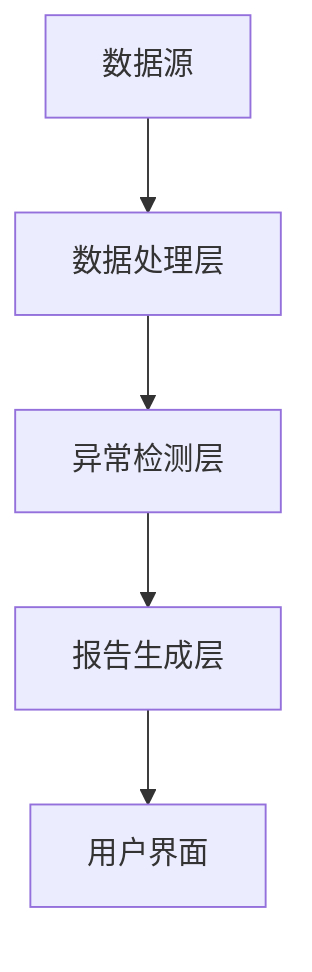
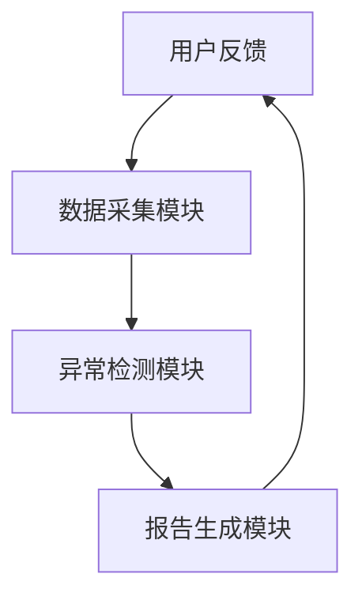

                 


# 格雷厄姆的市场异常理论

## 关键词：价值投资，市场异常，市盈率，市净率，Z-score模型，投资策略

## 摘要

本文详细探讨了格雷厄姆的市场异常理论，从理论背景到数学模型，从系统设计到项目实战，全面解析了如何识别和利用市场中的定价错误。通过实际案例和代码实现，帮助读者掌握市场异常的识别方法，并制定有效的投资策略。

---

## 第1章: 市场异常理论的背景与核心概念

### 1.1 市场异常理论的定义与背景

#### 1.1.1 价值投资的起源与发展

价值投资是一种以内在价值为导向的投资策略，由本杰明·格雷厄姆和他的学生戴维·多德共同提出。该理论强调购买低于其内在价值的股票，长期持有以实现收益。格雷厄姆认为市场并非总是理性的，价格波动为投资者提供了低价买入优质资产的机会。

#### 1.1.2 市场异常理论的提出背景

在20世纪20年代，格雷厄姆观察到市场中经常出现股票价格与其内在价值不符的情况。他认为这些异常现象为投资者提供了套利机会，可以通过分析识别低估的股票。

#### 1.1.3 格雷厄姆投资理念的核心要素

格雷厄姆的价值投资理念包括以下核心要素：

- **安全边际**：购买价格远低于内在价值的股票，以降低风险。
- **逆向投资**：在市场恐慌时买入，在市场狂热时卖出。
- **长期持有**：避免频繁交易，降低交易成本。

### 1.2 市场异常的分类与特征

#### 1.2.1 低市盈率效应

低市盈率效应是指股票的市盈率低于行业平均水平的现象。这种股票通常被认为被市场低估，具有较大的上升空间。

| 异常类型 | 定义 | 特征 | 例子 |
|----------|------|------|------|
| 低市盈率效应 | 市盈率低于行业平均水平 | 股价低于内在价值 | 高端制造业 |

#### 1.2.2 小盘股溢价现象

小盘股溢价现象指小盘股的市盈率通常高于大盘股的现象。这可能源于市场对小盘股增长潜力的高预期。

#### 1.2.3 其他市场异常类型

包括市净率异常、股息率异常等，每种异常都有其独特的定义和特征。

### 1.3 格雷厄姆市场异常理论的核心要素

格雷厄姆的市场异常理论认为，市场中的异常现象是由于投资者情绪波动导致的，可以通过分析识别这些异常并利用它们获取超额收益。

---

## 第2章: 格雷厄姆市场异常理论的数学模型

### 2.1 市场异常的识别方法

#### 2.1.1 市盈率计算公式

市盈率（P/E）是衡量股票价值的重要指标，计算公式为：

$$
\text{P/E} = \frac{\text{股价}}{\text{每股收益}}
$$

例如，如果一只股票的股价为20元，每股收益为5元，则其市盈率为4倍。

#### 2.1.2 市净率计算公式

市净率（P/B）是股价与每股净资产的比率，计算公式为：

$$
\text{P/B} = \frac{\text{股价}}{\text{每股净资产}}
$$

市净率低于1通常被视为低估的信号。

### 2.2 市场异常的统计检测方法

#### 2.2.1 Z-score模型

Z-score模型用于检测数据点是否异常，计算公式为：

$$
Z = \frac{X - \mu}{\sigma}
$$

其中，X为观测值，μ为均值，σ为标准差。通常，绝对值大于3的Z值被视为异常。

---

## 第3章: 系统分析与架构设计

### 3.1 系统功能设计

#### 3.1.1 数据采集模块

数据采集模块负责从股票市场获取实时数据，包括股价、市盈率、市净率等。

#### 3.1.2 异常检测模块

异常检测模块基于数学模型对数据进行分析，识别市场异常。

#### 3.1.3 报告生成模块

报告生成模块将检测结果整理成报告，供投资者参考。

### 3.2 系统架构设计

系统架构采用分层设计，包括数据采集层、异常检测层和用户界面层。



### 3.3 系统接口设计

系统通过API接口与其他系统进行数据交互，确保数据的实时性和准确性。

### 3.4 系统交互设计

系统交互流程包括数据采集、异常检测、报告生成和用户反馈。



---

## 第4章: 项目实战

### 4.1 环境安装与数据准备

#### 4.1.1 安装Python与相关库

安装Python和Pandas、NumPy等库：

```bash
pip install pandas numpy
```

#### 4.1.2 数据准备

从Yahoo Finance获取股票数据：

```python
import pandas as pd
import numpy as np

# 下载股票数据
data = pd.read_csv('stock_data.csv')
```

### 4.2 系统核心实现源代码

#### 4.2.1 异常检测代码

计算市盈率并识别异常：

```python
# 计算市盈率
data['PE'] = data['股价'] / data['每股收益']

# 使用Z-score模型识别异常
mu = data['PE'].mean()
sigma = data['PE'].std()
data['Z_score'] = (data['PE'] - mu) / sigma

# 确定异常
data['异常'] = data['Z_score'].apply(lambda x: '是' if abs(x) > 3 else '否')
```

### 4.3 代码应用解读与分析

通过上述代码，我们可以计算每只股票的市盈率，并使用Z-score模型识别异常情况。异常值为市盈率显著偏离正常范围的股票。

### 4.4 实际案例分析

以具体股票为例，分析其市盈率是否异常，判断是否低估。

### 4.5 项目小结

通过项目实战，读者可以掌握如何利用Python代码识别市场异常，并制定相应的投资策略。

---

## 总结

格雷厄姆的市场异常理论为投资者提供了识别低估股票的工具和方法。通过理论学习、模型构建和项目实战，读者可以掌握市场异常的识别方法，并在实际投资中应用这些策略。未来，随着市场环境的变化，投资者需要不断学习和调整策略，以应对新的挑战。

---

## 作者

作者：AI天才研究院/AI Genius Institute  
联系邮箱：contact@aigenius.org  
个人网站：https://aigenius.org

---

# END

