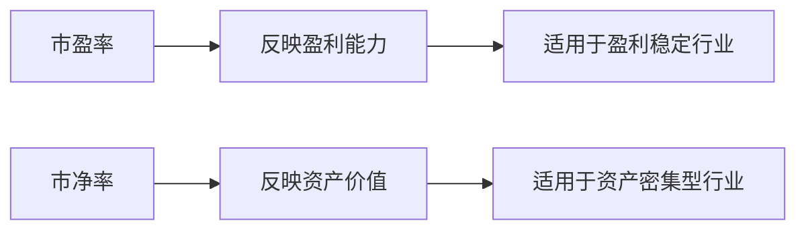
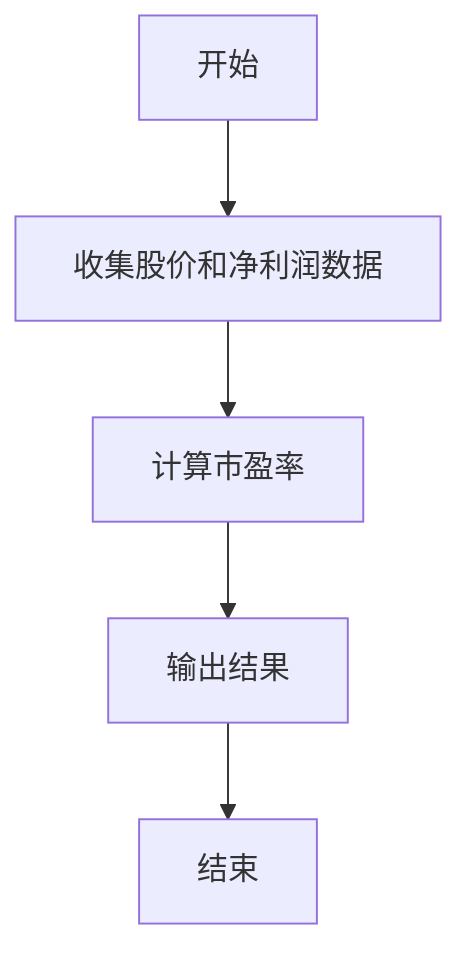
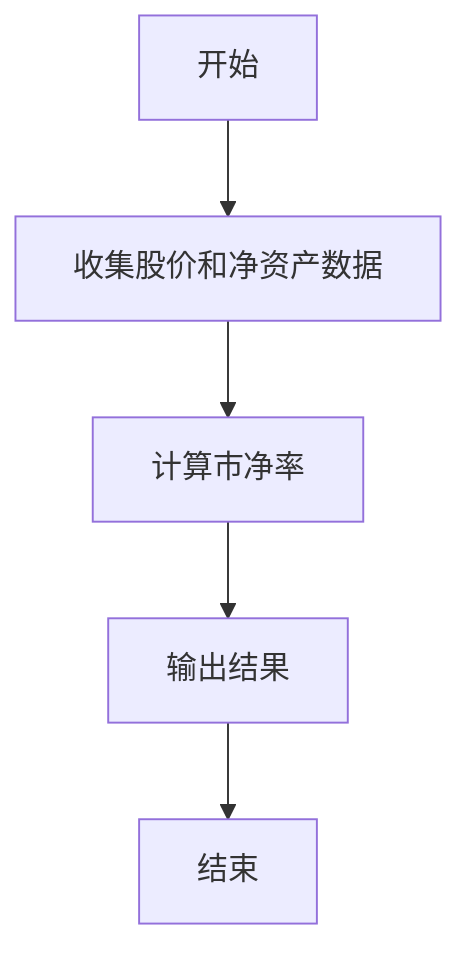
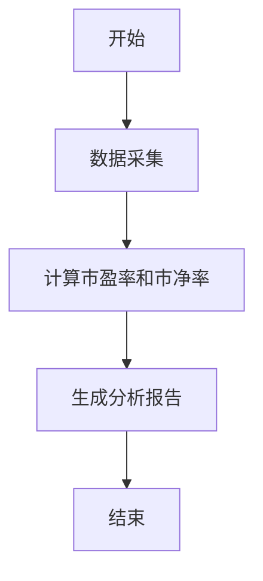
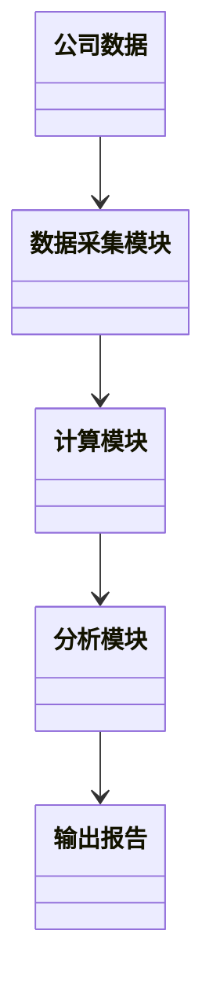

                 


# 格雷厄姆的市盈率和市净率使用指南

## 关键词：市盈率、市净率、投资估值、价值投资、格雷厄姆、股票分析

## 摘要：本文系统地介绍了格雷厄姆的市盈率和市净率的使用方法，从基本概念、计算公式、优缺点到实际应用，结合实例分析，帮助读者掌握如何利用这两个指标进行股票估值和投资决策。

---

# 第1章: 投资基础与估值指标概述

## 1.1 投资的基本概念

### 1.1.1 投资的定义与分类
- 投资是指将资金投入到某个项目或资产中，以期望在未来获得收益或资本增值。
- 投资可以分为实物投资（如房地产、制造业）和金融投资（如股票、债券）。

### 1.1.2 估值指标在投资中的重要性
- 估值指标是衡量资产价值的重要工具，能够帮助投资者判断资产是否被高估或低估。
- 常见的估值指标包括市盈率（P/E）、市净率（P/B）、股息率等。

### 1.1.3 市盈率和市净率的起源与演变
- 市盈率和市净率是格雷厄姆在《证券分析》中提出的重要概念，至今仍然是价值投资的核心工具。

---

## 1.2 市盈率和市净率的定义与计算

### 1.2.1 市盈率的定义
- 市盈率（P/E）= 股价 / 每股净利润
- 用于衡量投资者为每股净利润愿意支付的价格。

### 1.2.2 市净率的定义
- 市净率（P/B）= 股价 / 每股净资产
- 用于衡量投资者为每股净资产愿意支付的价格。

### 1.2.3 市盈率和市净率的计算公式
- 市盈率公式：
  $$ P/E = \frac{\text{股价}}{\text{每股净利润}} $$
- 市净率公式：
  $$ P/B = \frac{\text{股价}}{\text{每股净资产}} $$

### 1.2.4 市盈率和市净率的优缺点
| 指标 | 优点 | 缺点 |
|------|------|------|
| 市盈率 | 反映盈利能力，适用于盈利稳定的公司 | 不适合亏损公司，行业差异大 |
| 市净率 | 反映资产价值，适用于净资产为重的行业 | 不反映盈利能力，行业适用性有限 |

---

## 1.3 市盈率和市净率的适用场景

### 1.3.1 市盈率适用的行业
- 利润稳定的行业，如公用事业、消费品行业。

### 1.3.2 市净率适用的行业
- 资产密集型行业，如银行、房地产。

### 1.3.3 市盈率和市净率的综合使用
- 结合行业特点和公司具体情况，综合使用市盈率和市净率进行估值。

---

## 1.4 本章小结
- 介绍了市盈率和市净率的基本概念、计算公式、优缺点及其适用场景，为后续分析打下基础。

---

# 第2章: 市盈率和市净率的核心概念与联系

## 2.1 市盈率与市净率的原理分析

### 2.1.1 市盈率的原理
- 市盈率反映了市场对公司盈利能力的预期，低市盈率可能意味着公司被低估。

### 2.1.2 市净率的原理
- 市净率反映了市场对公司资产价值的评估，低市净率可能意味着公司资产被低估。

### 2.1.3 市盈率与市净率的内在联系
- 市盈率关注收益，市净率关注资产，两者共同衡量公司的整体价值。

---

## 2.2 市盈率与市净率的对比分析

### 2.2.1 市盈率与市净率的属性对比
| 指标 | 基础 | 适用性 | 优劣 |
|------|------|------|------|
| 市盈率 | 净利润 | 盈利稳定的公司 | 反映盈利能力，但不适合亏损公司 |
| 市净率 | 净资产 | 资产密集型行业 | 反映资产价值，但不反映盈利能力 |

### 2.2.2 市盈率与市净率的对比图


---

## 2.3 市盈率与市净率的ER实体关系图
```mermaid
erDiagram
    公司 --> 市盈率
    公司 --> 市净率
    市盈率 --> 股价
    市净率 --> 股价
```

---

## 2.4 本章小结
- 分析了市盈率和市净率的原理及其内在联系，帮助读者更好地理解两者的区别与应用场景。

---

# 第3章: 市盈率和市净率的算法原理

## 3.1 市盈率的计算与分析

### 3.1.1 市盈率的计算步骤
1. 收集公司股价和每股净利润数据。
2. 使用公式 $$ P/E = \frac{\text{股价}}{\text{每股净利润}} $$ 计算市盈率。

### 3.1.2 市盈率的算法流程图


---

## 3.2 市净率的计算与分析

### 3.2.1 市净率的计算步骤
1. 收集公司股价和每股净资产数据。
2. 使用公式 $$ P/B = \frac{\text{股价}}{\text{每股净资产}} $$ 计算市净率。

### 3.2.2 市净率的算法流程图


---

## 3.3 市盈率和市净率的数学模型

### 3.3.1 市盈率的数学模型
$$ P/E = \frac{\text{股价}}{\text{每股净利润}} $$

### 3.3.2 市净率的数学模型
$$ P/B = \frac{\text{股价}}{\text{每股净资产}} $$

---

## 3.4 本章小结
- 详细讲解了市盈率和市净率的计算方法及其数学模型，帮助读者掌握如何进行实际计算。

---

# 第4章: 市盈率和市净率的系统架构设计

## 4.1 系统功能设计

### 4.1.1 功能模块
- 数据采集模块：收集公司股价、净利润、净资产等数据。
- 计算模块：计算市盈率和市净率。
- 分析模块：生成分析报告。

### 4.1.2 功能流程图


---

## 4.2 系统架构设计

### 4.2.1 系统架构图


---

## 4.3 系统接口设计

### 4.3.1 接口描述
- 数据输入接口：接收公司股价、净利润、净资产等数据。
- 数据输出接口：输出市盈率和市净率的计算结果。

---

## 4.4 本章小结
- 描述了系统架构设计和功能模块，为实际应用提供了参考。

---

# 第5章: 市盈率和市净率的项目实战

## 5.1 环境安装与配置

### 5.1.1 工具选择
- 使用Python和相关库（如Pandas、Matplotlib）进行数据处理和可视化。

### 5.1.2 环境配置
- 安装Python和必要的库：
  ```bash
  pip install pandas matplotlib
  ```

---

## 5.2 核心代码实现

### 5.2.1 数据采集
```python
import pandas as pd

# 假设我们有一个包含股价、净利润和净资产的数据框
data = pd.DataFrame({
    '股价': [100, 80, 120],
    '净利润': [20, 15, 30],
    '净资产': [50, 40, 60]
})
```

### 5.2.2 计算市盈率和市净率
```python
data['市盈率'] = data['股价'] / data['净利润']
data['市净率'] = data['股价'] / data['净资产']
print(data)
```

### 5.2.3 可视化分析
```python
import matplotlib.pyplot as plt

plt.plot(data['公司名称'], data['市盈率'], label='市盈率')
plt.plot(data['公司名称'], data['市净率'], label='市净率')
plt.legend()
plt.show()
```

---

## 5.3 实际案例分析

### 5.3.1 案例背景
- 某公司股价为100元，净利润为20元，净资产为50元。
- 计算市盈率和市净率：
  $$ P/E = 100 / 20 = 5 $$
  $$ P/B = 100 / 50 = 2 $$

### 5.3.2 分析结果
- 市盈率为5，市净率为2，表明该公司可能被低估。

---

## 5.4 本章小结
- 通过实际案例分析，展示了如何利用Python代码计算和分析市盈率和市净率。

---

# 第6章: 市盈率和市净率的最佳实践与总结

## 6.1 最佳实践

### 6.1.1 结合行业特点
- 不同行业适用不同的估值指标，如银行行业更关注市净率。

### 6.1.2 长期投资视角
- 格雷厄姆倡导长期投资，市盈率和市净率应结合长期业绩分析。

### 6.1.3 定期复盘
- 定期检查投资组合的市盈率和市净率，及时调整投资策略。

---

## 6.2 小结

### 6.2.1 核心要点回顾
- 市盈率反映盈利能力，市净率反映资产价值。
- 结合行业特点和公司具体情况，综合使用市盈率和市净率。

### 6.2.2 注意事项
- 市盈率和市净率仅是估值工具，需结合其他因素（如管理团队、行业趋势）进行综合判断。

---

## 6.3 拓展阅读

### 6.3.1 推荐书籍
- 《证券分析》——本杰明·格雷厄姆
- 《投资学原理》——加尔曼·西蒙斯

### 6.3.2 在线资源
- 网络课程：Coursera上的《投资学基础》
- 专业论坛：雪球、东方财富网

---

# 作者：AI天才研究院 & 禅与计算机程序设计艺术

