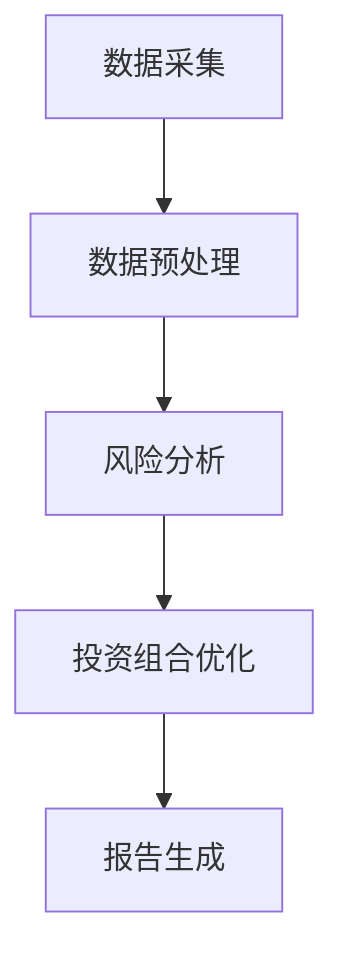
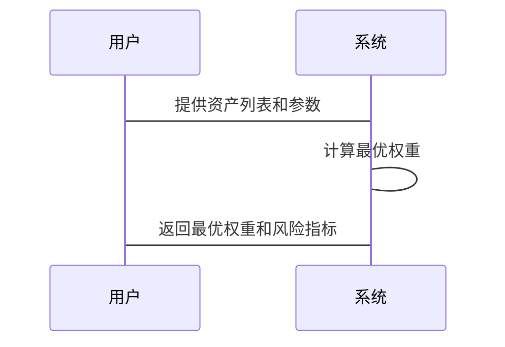

                 


# 格雷厄姆的投资组合管理

> 关键词：投资组合管理，风险控制，均值-方差模型，VaR，CVaR，投资组合优化

> 摘要：本文深入探讨了投资组合管理的理论基础、数学模型、系统架构以及实战案例。从格雷厄姆的投资理念出发，分析了投资组合管理的核心概念、优化算法、风险度量方法，并通过系统设计和实际案例，展示了如何在实践中应用这些理论。

---

# 第一部分: 投资组合管理的背景与基本概念

## 第1章: 投资组合管理概述

### 1.1 投资组合管理的定义与目标

#### 1.1.1 投资组合管理的定义
投资组合管理是指通过科学的方法对投资组合进行构建、调整和监控，以实现投资目标的过程。其核心在于在风险可控的前提下，最大化投资收益。

#### 1.1.2 投资组合管理的目标
- **收益最大化**：在给定风险下，实现收益的最大化。
- **风险最小化**：在给定收益下，实现风险的最小化。
- **资产配置优化**：通过合理分配资产类别，降低投资组合的整体风险。

#### 1.1.3 投资组合管理的核心要素
- **资产选择**：选择适合的资产类别和个券。
- **权重分配**：确定每种资产的投资比例。
- **风险控制**：通过分散投资、对冲策略等方法降低风险。

### 1.2 投资组合管理的背景与重要性

#### 1.2.1 投资组合管理的历史发展
投资组合管理的理论起源于20世纪50年代，以Harry Markowitz的均值-方差模型为开端，后来发展出现代投资组合理论（MPT）等重要理论。

#### 1.2.2 投资组合管理在现代金融中的重要性
- **分散风险**：通过投资不同资产降低特定风险。
- **提高收益**：通过优化资产配置实现收益最大化。
- **降低波动性**：通过科学的组合管理减少投资的波动性。

#### 1.2.3 投资组合管理与风险管理的关系
投资组合管理不仅仅是构建组合，还包括持续的风险监控和调整，确保组合在市场变化中的稳定性。

### 1.3 本章小结
本章介绍了投资组合管理的基本概念、目标和核心要素，强调了其在现代金融中的重要性。

---

# 第二部分: 投资组合管理的数学模型与算法

## 第2章: 投资组合优化的数学模型

### 2.1 投资组合优化的基本原理

#### 2.1.1 均值-方差模型的原理
均值-方差模型由Markowitz提出，旨在在给定风险下找到收益最大的组合，或在给定收益下找到风险最小的组合。

#### 2.1.2 数学公式与模型构建
目标函数：
$$ \text{目标函数: } \min \sigma^2 \text{ 在给定 } \mu \text{ 下} $$

约束条件：
$$ \sum w_i = 1, w_i \geq 0 $$

其中，\( w_i \) 是第i个资产的权重，\( \mu \) 是预期收益，\( \sigma^2 \) 是收益的方差。

#### 2.1.3 示例分析
假设我们有两只资产A和B，其预期收益分别为10%和15%，方差分别为20%和30%，相关系数为0.5。计算最优投资组合的权重。

---

### 2.2 投资组合优化的算法实现

#### 2.2.1 均值-方差模型的求解方法
使用拉格朗日乘数法求解优化问题：

目标函数：
$$ \min \sum_{i=1}^n \sum_{j=1}^n w_i w_j \sigma_{ij} $$

约束条件：
$$ \sum_{i=1}^n w_i = 1 $$

#### 2.2.2 使用拉格朗日乘数法优化投资组合
构造拉格朗日函数：
$$ L = \sum_{i=1}^n \sum_{j=1}^n w_i w_j \sigma_{ij} + \lambda \left( \sum_{i=1}^n w_i - 1 \right) $$

对每个\( w_k \)求导并令导数为零：
$$ 2 \sum_{j=1}^n w_j \sigma_{kj} + \lambda = 0 $$

解得权重向量\( w \)。

#### 2.2.3 算法实现的代码示例

```python
import numpy as np

def optimize_portfolio(cov_matrix, returns):
    n = cov_matrix.shape[0]
    cov = cov_matrix
    inv_cov = np.linalg.inv(cov)
    weights = inv_cov.dot(returns) / (np.ones(n).dot(inv_cov.dot(returns)))
    return weights

# 示例数据
returns = np.array([0.1, 0.15])
cov_matrix = np.array([[0.2, 0.05], [0.05, 0.3]])

weights = optimize_portfolio(cov_matrix, returns)
print("Optimal weights:", weights)
```

---

## 第3章: 投资组合风险的度量与管理

### 3.1 风险度量的常见方法

#### 3.1.1 方差与标准差的定义
方差衡量收益的波动性，标准差是方差的平方根。

#### 3.1.2 VaR（在险价值）的定义与计算
VaR是在给定置信水平下，投资组合可能遭受的最大损失。

#### 3.1.3 CVaR（条件在险价值）的定义与计算
CVaR是VaR在超出 VaR 水平的平均损失。

---

### 3.2 风险管理的策略

#### 3.2.1 投资组合的风险对冲策略
使用衍生品对冲特定风险。

#### 3.2.2 投资组合的风险分散策略
通过投资不同类型资产降低非系统性风险。

#### 3.2.3 投资组合的风险调整策略
调整权重以适应市场变化。

---

### 3.3 本章小结
本章介绍了投资组合风险的度量方法和管理策略，强调了风险管理在投资组合管理中的重要性。

---

# 第三部分: 投资组合管理的系统架构与实现

## 第4章: 投资组合管理系统的设计

### 4.1 系统架构设计

#### 4.1.1 系统模块划分
- 数据采集模块
- 风险分析模块
- 投资组合优化模块
- 报告生成模块

#### 4.1.2 系统功能设计
- 数据清洗与预处理
- 风险评估与分析
- 投资组合优化与模拟
- 报告生成与可视化

#### 4.1.3 系统架构图



---

## 第5章: 投资组合管理的接口与交互设计

### 5.1 系统接口设计

#### 5.1.1 输入接口设计
- 输入资产列表
- 输入预期收益
- 输入协方差矩阵

#### 5.1.2 输出接口设计
- 输出最优权重
- 输出风险指标
- 输出投资组合报告

#### 5.1.3 接口交互流程图



---

## 第6章: 投资组合管理的实战案例

### 6.1 实战案例介绍

#### 6.1.1 案例背景与目标
假设我们有三只股票，目标是构建一个风险可控、收益最大的投资组合。

#### 6.1.2 案例数据准备
- 预期收益：10%, 12%, 8%
- 协方差矩阵：
  ```
  [[0.05, 0.02, 0.01],
   [0.02, 0.08, 0.03],
   [0.01, 0.03, 0.06]]
  ```

#### 6.1.3 案例分析与解决方
使用均值-方差模型优化权重。

---

### 6.2 代码实现与分析

#### 6.2.1 投资组合优化的代码实现

```python
def optimize_portfolio(cov_matrix, returns):
    n = cov_matrix.shape[0]
    inv_cov = np.linalg.inv(cov_matrix)
    weights = inv_cov.dot(returns) / (np.ones(n).dot(inv_cov.dot(returns)))
    return weights

cov_matrix = np.array([[0.05, 0.02, 0.01],
                        [0.02, 0.08, 0.03],
                        [0.01, 0.03, 0.06]])
returns = np.array([0.1, 0.12, 0.08])

weights = optimize_portfolio(cov_matrix, returns)
print("Optimal weights:", weights)
```

#### 6.2.2 系统功能测试与验证
测试优化后的权重是否满足约束条件，并验证风险和收益是否最优。

---

## 第7章: 投资组合管理的最佳实践

### 7.1 小结
投资组合管理是一个复杂而重要的过程，需要结合理论、算法和实际操作。

### 7.2 注意事项
- 定期调整组合
- 严格控制风险
- 充分利用数据

### 7.3 拓展阅读
推荐阅读《投资学》（CFA教材）和《Python金融计算》等书籍。

---

# 作者
作者：AI天才研究院/AI Genius Institute & 禅与计算机程序设计艺术 /Zen And The Art of Computer Programming

---

**本文是基于格雷厄姆的投资组合管理理论，结合现代金融数学方法，详细分析了投资组合管理的理论基础、优化算法、系统设计和实战案例。通过本文的分析，读者可以掌握投资组合管理的核心思想，并能够将其应用于实际投资中。**

