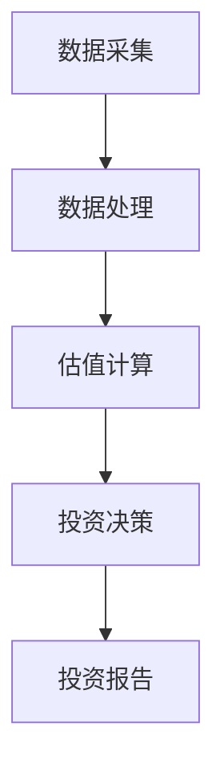

                 


# 《格雷厄姆的投资者教育理念》

## 关键词：价值投资，格雷厄姆，内在价值，安全边际，投资策略，投资系统

## 摘要：  
本文深入探讨了格雷厄姆的投资者教育理念，分析了价值投资的核心概念、算法原理和系统架构。文章从背景介绍、核心理念、投资策略、数学模型、系统设计、项目实战到最佳实践，全面解析了格雷厄姆的投资方法。通过实际案例和代码实现，帮助读者理解如何将价值投资理念应用于实践，并总结了投资成功的关键要素。

---

## 第一部分: 投资背景与核心理念

### 第1章: 投资的基本概念与背景介绍

#### 1.1 投资的基本概念  
投资是通过将资金投入资产或项目，以期望在未来获得超过初始投入的收益。投资的基本原则包括分散投资、长期持有和风险管理。  

#### 1.2 价值投资的起源与背景  
价值投资是一种以低于资产内在价值的价格买入资产的投资策略。其创始人本杰明·格雷厄姆通过分析市场的非理性波动，提出了以基本面分析为基础的投资方法。  

#### 1.3 价值投资的核心要素  
价值投资的核心要素包括：  
- **安全边际**：买入价格低于内在价值的部分，以降低风险。  
- **内在价值**：资产在未来现金流的现值，是投资决策的基础。  
- **市场先生**：市场情绪波动对投资机会的影响。  

### 第2章: 价值投资的核心理念与方法  

#### 2.1 价值投资的核心理念  
价值投资强调以低于内在价值的价格买入资产，并长期持有，等待市场回归理性。  

#### 2.2 价值投资的具体方法  
- **低市盈率法**：寻找市盈率低于行业平均水平的股票。  
- **低市净率法**：寻找市净率低于行业平均水平的股票。  
- **高股息率法**：寻找股息率高于行业平均水平的股票。  

---

## 第二部分: 格雷厄姆的投资策略与实践

### 第3章: 格雷厄姆的投资策略与实践  

#### 3.1 格雷厄姆的投资策略  
- **买入并持有策略**：长期持有优质资产，避免频繁交易。  
- **逆向投资策略**：在市场恐慌时买入，在市场狂热时卖出。  
- **安全边际策略**：确保买入价格远低于内在价值。  

#### 3.2 格雷厄姆的选股方法  
- **质量投资**：选择具有强大财务实力和竞争优势的公司。  
- **数量投资**：通过数量化指标筛选出低估的资产。  
- **投资组合管理**：分散投资以降低风险。  

---

## 第三部分: 价值投资的数学模型与算法原理

### 第4章: 价值投资的数学模型与算法原理  

#### 4.1 价值投资的数学模型  
内在价值的计算公式为：  
$$ V = \frac{E}{1 + r} $$  
其中，\( V \) 表示内在价值，\( E \) 表示企业未来现金流，\( r \) 表示折现率。  

#### 4.2 格雷厄姆的估值方法  
- **市盈率法**：  
  $$ PE = \frac{P}{E} $$  
  其中，\( P \) 为股票价格，\( E \) 为每股收益。  

- **市净率法**：  
  $$ PB = \frac{P}{B} $$  
  其中，\( P \) 为股票价格，\( B \) 为每股净资产。  

---

## 第四部分: 价值投资的系统架构与实现

### 第5章: 价值投资的系统架构与实现  

#### 5.1 投资分析系统的功能设计  
- **数据采集模块**：获取股票的财务数据和市场数据。  
- **估值计算模块**：计算内在价值和估值指标。  
- **投资决策模块**：根据估值结果生成投资建议。  

#### 5.2 系统架构设计  


---

## 第五部分: 项目实战与案例分析

### 第6章: 项目实战与案例分析  

#### 6.1 环境安装与配置  
- 安装Python和相关库（如Pandas、NumPy）。  
- 获取股票数据源（如Yahoo Finance）。  

#### 6.2 核心代码实现  
```python
def calculate_intrinsic_value(E, r):
    return E / (1 + r)
```

#### 6.3 案例分析  
以某公司为例，计算其内在价值，并与市场价格进行对比，判断是否为低估资产。  

---

## 第六部分: 最佳实践与总结

### 第7章: 最佳实践与总结  

#### 7.1 成功要素总结  
- 保持耐心和纪律，避免情绪化决策。  
- 持续学习和改进，优化投资策略。  

#### 7.2 投资风险管理  
- 分散投资以降低风险。  
- 定期复盘和调整投资组合。  

#### 7.3 拓展阅读  
推荐阅读格雷厄姆的《聪明的投资者》和彼得·林奇的《战胜市场的艺术》。  

---

## 作者：AI天才研究院/AI Genius Institute & 禅与计算机程序设计艺术 /Zen And The Art of Computer Programming

