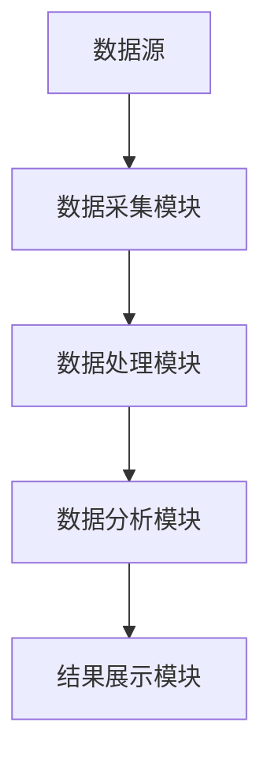

                 


# 格雷厄姆的特殊情况投资：寻找套利机会

> 关键词：格雷厄姆，特殊情况投资，套利机会，价值投资，数学模型，系统架构，量化分析

> 摘要：本文深入探讨了格雷厄姆的特殊情况投资理念，结合现代量化分析方法，系统性地介绍了如何识别和利用套利机会。通过数学模型、系统架构设计和实战案例分析，为读者提供了从理论到实践的完整指南。

---

## 第一部分：特殊情况投资与套利机会概述

### 第1章：特殊情况投资的定义与特点

#### 1.1 什么是特殊情况投资
特殊情况投资是指在市场中寻找那些因特殊事件或市场失灵导致价格偏离内在价值的投资机会。这种投资策略的核心在于识别市场中的非效率性，并利用这些机会获取超额收益。

#### 1.2 特殊情况投资的核心特点
- **低效性**：市场价格与内在价值的偏离。
- **短期性**：套利机会通常在较短时间内出现。
- **风险可控性**：通过分析和对冲，降低投资风险。

#### 1.3 与传统投资的区别
- 传统投资注重长期价值，而特殊情况投资注重短期机会。
- 传统投资依赖市场趋势，而特殊情况投资依赖于市场失灵。

---

### 第2章：套利机会的基本概念

#### 2.1 套利的定义与类型
套利是指利用市场中的价格差异，通过同时买入低估资产和卖出高估资产，从中获利的行为。常见的套利类型包括：
- **跨市场套利**：利用不同市场之间的价格差异。
- **跨期套利**：利用同一资产在不同时间点的价格差异。
- **统计套利**：基于统计模型寻找价格偏差。

#### 2.2 套利机会的来源
- 市场分割：不同市场间的价格差异。
- 信息不对称：部分投资者掌握更多信息。
- 市场情绪：投资者情绪波动导致的价格偏差。

#### 2.3 套利的风险与收益
- **收益**：套利机会通常带来超额收益。
- **风险**：市场回归、交易成本、流动性风险等。

---

## 第二部分：格雷厄姆的价值投资理念

### 第3章：格雷厄姆的价值投资哲学

#### 3.1 格雷厄姆的投资哲学
格雷厄姆是价值投资的鼻祖，他认为市场价格经常偏离内在价值，而这种偏离正是投资机会的来源。

#### 3.2 安全边际的概念
安全边际是指资产的市场价格低于其内在价值的部分。通过安全边际，投资者可以在价格波动中降低风险。

#### 3.3 股票分析的三要素
- **基本面分析**：关注公司的财务状况、盈利能力。
- **市场分析**：关注市场价格与价值的偏离。
- **心理分析**：关注市场情绪对价格的影响。

---

### 第4章：格雷厄姆的特殊情况投资策略

#### 4.1 什么是特殊情况投资
特殊情况投资是指在市场中寻找那些因特殊事件（如公司重组、诉讼等）导致价格严重偏离内在价值的投资机会。

#### 4.2 格雷厄姆的特殊案例分析
格雷厄姆通过分析具体案例，展示了如何识别和利用特殊情况投资机会。

#### 4.3 特殊情况投资的适用场景
- 市场分割：不同市场间的套利机会。
- 信息不对称：利用信息优势进行投资。

---

## 第三部分：套利机会的数学模型与量化分析

### 第5章：套利机会的量化评估

#### 5.1 套利机会的数学模型
套利机会的量化评估需要构建数学模型，通过概率论和统计学方法，分析价格偏离的可能性和收益。

#### 5.2 套利机会的风险评估公式
$$ \text{风险} = \text{标准差} \times \text{概率} $$

#### 5.3 套利机会的收益预测公式
$$ \text{收益} = \text{买入价} - \text{卖出价} $$

### 第6章：套利机会的统计分析

#### 6.1 套利机会的概率分布
通过统计分析，可以确定套利机会的概率分布，从而评估其可行性。

#### 6.2 套利机会的历史数据分析
通过对历史数据的分析，可以识别套利机会的周期性特征。

#### 6.3 套利机会的市场周期性分析
套利机会往往出现在市场周期的特定阶段。

---

## 第四部分：套利机会的系统架构设计

### 第7章：系统架构概述

#### 7.1 系统功能模块划分
- 数据采集模块：采集市场数据。
- 数据处理模块：清洗和转换数据。
- 数据分析模块：构建数学模型并进行分析。
- 结果展示模块：输出分析结果。

#### 7.2 系统数据流图


#### 7.3 系统交互流程图


---

## 第五部分：项目实战与案例分析

### 第8章：项目实战

#### 8.1 项目环境配置
- 系统环境要求：Python 3.8及以上版本。
- 软件工具安装：安装numpy、pandas、matplotlib等库。
- 数据源获取：从金融数据提供商获取市场数据。

#### 8.2 核心代码实现
```python
import numpy as np
import pandas as pd

def calculate_profit(price_data):
    profit = price_data['收盘价'].diff().iloc[1:]
    return profit[profit > 0].mean()

data = pd.read_csv('market_data.csv')
print(calculate_profit(data))
```

#### 8.3 实际案例分析
通过具体案例分析，展示如何利用数学模型和系统架构设计识别套利机会。

---

## 结论

格雷厄姆的特殊情况投资理念结合现代量化分析方法，为投资者提供了新的视角。通过数学模型和系统架构设计，可以更有效地识别和利用套利机会，实现超额收益。

---

## 作者

作者：AI天才研究院/AI Genius Institute & 禅与计算机程序设计艺术 /Zen And The Art of Computer Programming

