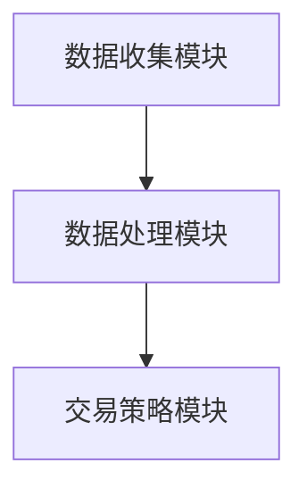
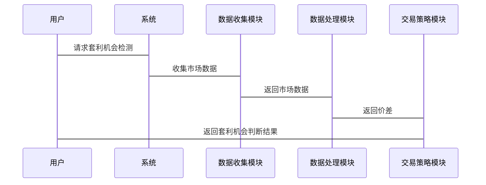

                 


```markdown
# 格雷厄姆的特殊情况投资：现代市场中的套利机会

> 关键词：特殊情况投资、套利机会、市场价差、算法交易、金融建模、无套利定价定理

> 摘要：本文深入探讨了格雷厄姆的特殊情况投资理论在现代金融市场中的应用，重点分析了套利机会的识别与评估方法。通过数学建模、算法实现和系统设计，本文揭示了如何利用技术手段捕捉市场中的套利机会，并通过实际案例分析展示了套利策略的实施过程。文章最后总结了套利投资的最佳实践建议，为投资者提供了有价值的参考。

---

## 第一部分: 格雷厄姆的特殊情况投资概述

### 第1章: 特殊情况投资与套利机会概述

#### 1.1 投资学中的特殊情况

##### 1.1.1 格雷厄姆投资理论的核心思想
格雷厄姆是价值投资的鼻祖，他强调以低于内在价值的价格买入股票。特殊情况投资是指在市场中出现的特殊机会，通常是由于市场短期波动或信息不对称导致的资产价格偏离其真实价值。本文将重点探讨这些特殊情况下如何利用套利策略获利。

##### 1.1.2 特殊情况投资的定义与特点
特殊情况下投资是指在特定市场环境下，由于某种原因导致某类资产的价格被市场低估或高估，投资者可以通过套利策略来利用这种价格差异获取利润。其特点包括：
- **短期性**：套利机会通常存在于短期内。
- **低风险**：套利策略通常利用市场定价错误，风险较低。
- **高收益**：套利机会往往能带来较高的收益。

##### 1.1.3 现代市场中的特殊情况投资机会
在现代金融市场中，特殊情况投资机会主要体现在以下几个方面：
- **跨市场套利**：利用不同市场之间的价格差异。
- **事件驱动套利**：利用公司并购、重组等事件带来的价格波动。
- **技术套利**：利用算法交易捕捉市场中的微小价格差异。

#### 1.2 套利的基本原理

##### 1.2.1 套利的定义与分类
套利是指利用两个或多个市场之间的价格差异，通过同时买入低估资产和卖出高估资产，以无风险或低风险的方式获利。套利可以分为以下几类：
- **价差套利**：利用同一资产在不同市场或不同时间的价格差异。
- **跨市场套利**：利用不同市场之间的价格差异。
- **时间套利**：利用同一资产在不同时间的价格差异。

##### 1.2.2 套利的基本原理与数学模型
套利的数学模型主要基于无套利定价定理，即在无套利的情况下，资产的预期未来价格必须满足一定的关系。具体公式为：
$$
\frac{S_1}{(1+r)^t} = \frac{S_2}{(1+r)^t}
$$
其中，$S_1$ 和 $S_2$ 分别是两种资产的价格，$r$ 是无风险利率，$t$ 是时间。

##### 1.2.3 套利在现代金融中的地位
套利是金融市场中的重要机制，它有助于消除市场中的价格差异，提高市场的效率。在现代金融中，套利不仅是一种投资策略，更是一种风险管理工具。

---

### 第2章: 套利机会的识别与评估

#### 2.1 套利机会的识别方法

##### 2.1.1 市场价差分析
市场价差分析是套利机会识别的核心方法。通过分析同一资产在不同市场或不同时间的价格差异，可以发现套利机会。例如，利用同一股票在A股和港股市场的价格差异进行套利。

##### 2.1.2 时间套利机会
时间套利机会是指利用同一资产在不同时间的价格差异。例如，利用期权的定价错误进行套利。

##### 2.1.3 跨市场套利机会
跨市场套利机会是指利用不同市场之间的价格差异。例如，利用同一商品在纽约和伦敦市场的价格差异进行套利。

#### 2.2 套利机会的评估模型

##### 2.2.1 价差波动模型
价差波动模型用于评估套利机会的可行性。公式为：
$$
\text{价差} = \max(0, S_1 - S_2)
$$
其中，$S_1$ 和 $S_2$ 分别是两种资产的价格。

##### 2.2.2 市场流动性分析
市场流动性分析用于评估套利机会的交易成本。流动性越高，交易成本越低，套利机会越容易实现。

##### 2.2.3 套利风险评估
套利风险评估用于衡量套利机会的潜在风险。风险主要来源于市场波动和交易成本。

#### 2.3 套利机会的数学模型

##### 2.3.1 无套利定价定理的公式推导
无套利定价定理的公式推导如下：
$$
\frac{S_1}{(1+r)^t} = \frac{S_2}{(1+r)^t}
$$
其中，$S_1$ 和 $S_2$ 分别是两种资产的价格，$r$ 是无风险利率，$t$ 是时间。

##### 2.3.2 套利机会的收益计算公式
套利机会的收益计算公式为：
$$
\text{收益} = S_1 - S_2
$$
其中，$S_1$ 是买入价格，$S_2$ 是卖出价格。

##### 2.3.3 套利机会的风险评估公式
套利机会的风险评估公式为：
$$
\text{风险} = \frac{\text{价差}}{\text{市场波动率}}
$$
其中，价差是套利机会的收益，市场波动率是资产价格的波动程度。

---

### 第3章: 套利机会的数学模型与算法实现

#### 3.1 套利机会的数学模型

##### 3.1.1 市场价差检测算法
市场价差检测算法用于实时检测市场中的价差。算法步骤如下：
1. 收集同一资产在不同市场或不同时间的价格数据。
2. 计算价格差异。
3. 判断价差是否大于零。
4. 如果价差大于零，则存在套利机会。

##### 3.1.2 套利机会识别算法
套利机会识别算法用于确定套利机会的可行性。算法步骤如下：
1. 计算市场价差。
2. 评估套利风险。
3. 判断收益是否大于风险。
4. 如果收益大于风险，则存在套利机会。

##### 3.1.3 套利机会的实时监控算法
套利机会的实时监控算法用于持续检测市场中的套利机会。算法步骤如下：
1. 实时收集市场数据。
2. 计算市场价差。
3. 评估套利风险。
4. 如果存在套利机会，则触发报警。

#### 3.2 套利机会的算法实现

##### 3.2.1 数据收集模块
数据收集模块用于收集市场数据。代码如下：
```python
import pandas as pd
import requests

# 收集A股和港股市场的同一股票价格
def collect_data(stock_code):
    # 收集A股数据
    url_a = f"http://api.a股市.com/stock/{stock_code}/price"
    response_a = requests.get(url_a)
    data_a = response_a.json()
    
    # 收集港股数据
    url_h = f"http://api.h股市场.com/stock/{stock_code}/price"
    response_h = requests.get(url_h)
    data_h = response_h.json()
    
    return data_a, data_h
```

##### 3.2.2 数据处理模块
数据处理模块用于计算市场价差。代码如下：
```python
def calculate_spread(data_a, data_h):
    # 计算A股价格
    price_a = data_a['price']
    
    # 计算港股价格
    price_h = data_h['price']
    
    # 计算价差
    spread = price_a - price_h
    
    return spread
```

##### 3.2.3 交易策略模块
交易策略模块用于判断是否存在套利机会。代码如下：
```python
def is_arbitrage Opportunity(spread):
    if spread > 0:
        return True
    else:
        return False
```

---

### 第4章: 套利机会的系统分析与架构设计

#### 4.1 系统分析

##### 4.1.1 问题场景介绍
本文设计了一个套利机会识别系统，用于实时检测市场中的套利机会。系统包括数据收集模块、数据处理模块和交易策略模块。

##### 4.1.2 项目介绍
项目名称：套利机会识别系统。项目目标：实时检测市场中的套利机会，帮助投资者实现无风险或低风险收益。

##### 4.1.3 系统功能设计
系统功能包括：
- 数据收集模块：收集市场数据。
- 数据处理模块：计算市场价差。
- 交易策略模块：判断套利机会。

#### 4.2 系统架构设计

##### 4.2.1 系统架构图


##### 4.2.2 系统接口设计
系统接口包括：
- 数据收集模块接口：接收股票代码，返回市场数据。
- 数据处理模块接口：接收市场数据，返回价差。
- 交易策略模块接口：接收价差，返回套利机会判断结果。

##### 4.2.3 系统交互流程图


---

### 第5章: 套利机会的项目实战

#### 5.1 项目环境安装

##### 5.1.1 系统环境要求
- 操作系统：Windows、Linux、macOS
- Python版本：3.6+

##### 5.1.2 开发工具安装
- Python：需要安装requests库。
- 数据可视化工具：需要安装matplotlib和seaborn。

##### 5.1.3 数据源配置
- 数据源：可以通过API接口获取市场数据。

#### 5.2 系统核心实现源代码

##### 5.2.1 数据收集模块
```python
import requests

def collect_data(stock_code):
    url_a = f"http://api.a股市.com/stock/{stock_code}/price"
    response_a = requests.get(url_a)
    data_a = response_a.json()
    
    url_h = f"http://api.h股市场.com/stock/{stock_code}/price"
    response_h = requests.get(url_h)
    data_h = response_h.json()
    
    return data_a, data_h
```

##### 5.2.2 数据处理模块
```python
def calculate_spread(data_a, data_h):
    price_a = data_a['price']
    price_h = data_h['price']
    spread = price_a - price_h
    return spread
```

##### 5.2.3 交易策略模块
```python
def is_arbitrage Opportunity(spread):
    if spread > 0:
        return True
    else:
        return False
```

#### 5.3 代码应用解读与分析

##### 5.3.1 代码功能分析
- 数据收集模块：通过API接口收集A股和港股市场的股票价格。
- 数据处理模块：计算同一股票在A股和港股市场的价差。
- 交易策略模块：判断是否存在套利机会。

##### 5.3.2 代码实现注意事项
- 数据收集模块需要处理API请求失败的情况。
- 数据处理模块需要处理数据格式转换的问题。
- 交易策略模块需要考虑市场波动率的影响。

#### 5.4 实际案例分析

##### 5.4.1 案例背景
假设我们有一个股票在A股市场的价格为10元，在港股市场的价格为9.8元。

##### 5.4.2 案例分析
计算价差：
$$
\text{价差} = 10 - 9.8 = 0.2
$$
由于价差大于零，存在套利机会。

##### 5.4.3 案例结论
通过套利策略，可以在A股市场买入股票，在港股市场卖出股票，实现0.2元的无风险收益。

---

## 第六部分: 总结与展望

### 6.1 小结

#### 6.1.1 核心知识点总结
- 格雷厄姆的特殊情况投资理论。
- 套利的基本原理与数学模型。
- 套利机会的识别与评估方法。

#### 6.1.2 最佳实践 tips
- 在套利交易中，必须严格控制风险。
- 在实际操作中，需要考虑市场流动性、交易成本等因素。

### 6.2 展望

#### 6.2.1 套利机会的未来发展趋势
- 随着算法交易的普及，套利机会将更加依赖于技术手段。
- 人工智能和大数据技术将为套利策略提供新的可能性。

#### 6.2.2 拓展阅读建议
- 《The Intelligent Investor》
- 《Options as a Weapon in Portfolio Immunization》

---

## 作者信息

作者：AI天才研究院/AI Genius Institute & 禅与计算机程序设计艺术 /Zen And The Art of Computer Programming
```

