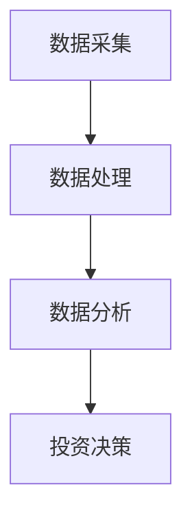

                 

# 格雷厄姆的股息投资理念：稳定现金流的重要性

> 关键词：格雷厄姆，股息投资，现金流，稳定收益，风险管理，价值投资，股息收益率

> 摘要：本文将深入探讨格雷厄姆的股息投资理念，分析稳定现金流在投资中的重要性。通过系统的理论分析、数学模型构建、实际案例解读以及投资策略设计，帮助读者理解如何通过股息投资实现长期稳定的收益。文章内容涵盖股息投资的核心概念、算法原理、系统架构设计以及实战案例分析，为投资者提供全面的指导。

---

## 第1章: 股息投资的基础与格雷厄姆的投资理念

### 1.1 投资的基本概念与背景介绍

#### 1.1.1 什么是投资
投资是指将资金投入某一项目或资产，以期在未来获得超过初始投入的收益。投资的核心在于通过合理的资源配置，实现资产增值。投资可以分为实物投资（如房地产、基础设施）和金融投资（如股票、债券）。

#### 1.1.2 投资的目的与意义
投资的主要目的是为了实现资产的保值和增值。通过投资，个人或机构可以分散风险、优化资产配置，并在经济波动中保持财务稳定。投资的意义在于通过时间的复利效应，实现财富的长期增长。

#### 1.1.3 投资的基本分类
- **股票投资**：通过购买公司股份，成为股东，分享公司收益。
- **债券投资**：通过购买政府或企业发行的债券，获取固定的利息收入。
- **房地产投资**：通过购买房地产，获得租金收入和资本增值。
- **货币市场投资**：通过投资短期金融工具，保持资金流动性。

---

### 1.2 股票投资的基本原理

#### 1.2.1 股票的定义与特征
股票是公司发行的股份凭证，代表持有者对公司的一部分所有权。股票的特征包括流动性、收益性、风险性和永久性。

#### 1.2.2 股票市场的运作机制
股票市场是买卖股票的场所，分为一级市场（新股发行）和二级市场（股票交易）。股票价格受市场供需、公司业绩、宏观经济等因素的影响。

#### 1.2.3 股票价格的波动规律
股票价格波动受多种因素影响，包括公司基本面、市场情绪、宏观经济政策等。投资者需要通过基本面分析和技术分析来判断股票的买卖时机。

---

### 1.3 格雷厄姆的生平与投资理念

#### 1.3.1 本杰明·格雷厄姆的简介
本杰明·格雷厄姆（1894-1976）是美国著名的投资家、经济学家，被誉为“价值投资之父”。他是巴菲特的导师，其投资理念奠定了价值投资的基础。

#### 1.3.2 格雷厄姆的投资哲学
格雷厄姆强调以低于内在价值的价格购买优质股票，注重安全边际和长期价值。他认为，投资的本质是寻找市场价格与内在价值的差异，通过长期持有实现收益。

#### 1.3.3 格雷厄姆与巴菲特的师徒关系
格雷厄姆是巴菲特的老师，巴菲特继承并发扬了格雷厄姆的价值投资理念，将其运用于实践，并取得了巨大成功。

---

## 第2章: 股息投资的核心概念与原理

### 2.1 股息的基本概念

#### 2.1.1 什么是股息
股息是公司分配给股东的利润部分，通常以现金形式发放，也可以是股票或实物。股息的分配取决于公司的盈利能力和董事会的决策。

#### 2.1.2 股息的分类与计算方式
股息可以分为普通股股息、优先股股息、累积股息和非累积股息。股息的计算方式为：
$$ 股息 = 净利润 - 优先股股息 - 留存收益 $$

#### 2.1.3 股息收益率的定义与计算公式
股息收益率是衡量股票投资回报的重要指标，计算公式为：
$$ 股息收益率 = \frac{每股股息}{股票价格} \times 100\% $$

---

### 2.2 稳定现金流的重要性

#### 2.2.1 现金流在投资中的作用
现金流是企业或个人在一定时期内现金的流入和流出。稳定的现金流能够保障企业的运营和发展，为股东提供持续的股息回报。

#### 2.2.2 稳定现金流对投资者的意义
稳定的现金流意味着企业具有较强的盈利能力和发展潜力，能够为投资者提供稳定的股息收入和资本增值。

#### 2.2.3 现金流与投资风险的关系
现金流的稳定性与投资风险密切相关。稳定的现金流能够降低投资风险，提高投资的安全性。

---

### 2.3 股息投资的核心理念

#### 2.3.1 格雷厄姆的股息投资策略
格雷厄姆强调选择具有稳定股息收益的股票，注重企业的盈利能力和财务健康状况。

#### 2.3.2 股息投资与长期收益的关系
股息投资通过长期持有优质股票，能够实现稳定的股息收入和资本增值。

#### 2.3.3 股息投资的风险管理
投资者需要关注企业的财务状况、行业前景和宏观经济环境，合理分散投资风险。

---

## 第3章: 股息投资的数学模型与算法原理

### 3.1 股息收益率的计算公式

#### 3.1.1 股息收益率的定义
股息收益率是衡量股票投资回报的重要指标，计算公式为：
$$ 股息收益率 = \frac{每股股息}{股票价格} \times 100\% $$

#### 3.1.2 股票内在价值的计算公式
股票的内在价值是基于未来现金流的现值，计算公式为：
$$ 内在价值 = \sum_{t=1}^{\infty} \frac{CF_t}{(1 + r)^t} $$

#### 3.1.3 股息折现模型（DDM）
股息折现模型用于评估股票的内在价值，假设股息以恒定增长率增长，计算公式为：
$$ P = \frac{D_1}{r - g} $$
其中：
- \( P \)：股票价格
- \( D_1 \)：第一期股息
- \( r \)：折现率
- \( g \)：股息增长率

---

### 3.2 股票内在价值的评估

#### 3.2.1 股票内在价值的定义
股票的内在价值是基于企业未来现金流的现值，反映了股票的真实价值。

#### 3.2.2 股票内在价值的计算公式
$$ 内在价值 = \sum_{t=1}^{\infty} \frac{CF_t}{(1 + r)^t} $$

#### 3.2.3 股票内在价值的评估步骤
1. 确定企业的未来现金流。
2. 选择合适的折现率。
3. 计算现金流的现值。
4. 与股票市场价格进行比较。

---

### 3.3 股息折现模型（DDM）的实现

#### 3.3.1 DDM模型的定义
股息折现模型是一种用于评估股票内在价值的数学模型，假设股息以恒定增长率增长。

#### 3.3.2 DDM模型的假设条件
1. 股息以恒定增长率增长。
2. 折现率保持不变。
3. 企业永续经营。

#### 3.3.3 DDM模型的计算步骤
1. 确定股息增长率 \( g \) 和折现率 \( r \)。
2. 计算第一期股息 \( D_1 \)。
3. 代入公式计算股票的内在价值。

---

## 第4章: 股息投资的系统分析与架构设计

### 4.1 投资决策系统的模块划分

#### 4.1.1 数据采集模块
数据采集模块负责收集股票的财务数据，包括股息、股价、净利润等。

#### 4.1.2 数据分析模块
数据分析模块对收集的数据进行清洗、处理和分析，计算股息收益率和内在价值。

#### 4.1.3 投资决策模块
投资决策模块根据分析结果，生成投资建议，包括买入、持有或卖出的决策。

---

### 4.2 系统架构设计

#### 4.2.1 系统功能设计
1. 数据采集：从股票市场获取实时数据。
2. 数据分析：计算股息收益率和内在价值。
3. 投资决策：生成投资建议。

#### 4.2.2 系统架构设计

---

## 第5章: 股息投资的项目实战

### 5.1 项目背景与目标
通过分析可口可乐和强生公司等高股息率股票，验证格雷厄姆的股息投资理念。

---

### 5.2 数据采集与处理

#### 5.2.1 数据来源
从Yahoo Finance获取股票的历史数据，包括股价和股息。

#### 5.2.2 数据清洗
对数据进行缺失值处理和异常值处理。

---

### 5.3 算法实现

#### 5.3.1 股息收益率计算
$$ 股息收益率 = \frac{每股股息}{股票价格} \times 100\% $$

#### 5.3.2 内在价值评估
使用DDM模型计算股票的内在价值。

---

### 5.4 案例分析

#### 5.4.1 可口可乐公司
分析可口可乐公司的股息收益率和内在价值，验证其投资价值。

#### 5.4.2 强生公司
分析强生公司的股息收益率和内在价值，验证其投资价值。

---

## 第6章: 股息投资的最佳实践与注意事项

### 6.1 投资策略
1. 选择具有稳定股息收益的股票。
2. 关注企业的财务状况和行业前景。
3. 长期持有优质股票。

### 6.2 风险管理
1. 分散投资，降低风险。
2. 定期评估投资组合，及时调整。

### 6.3 投资建议
1. 保持耐心，长期持有优质股票。
2. 定期再投资，复利增长财富。

---

## 结语

格雷厄姆的股息投资理念强调稳定现金流的重要性，通过选择具有稳定股息收益的股票，实现长期稳定的收益。投资者需要结合理论与实践，合理配置资产，分散风险，以实现财富的稳健增长。

---

## 作者：AI天才研究院/AI Genius Institute & 禅与计算机程序设计艺术 /Zen And The Art of Computer Programming

--- 

本文通过系统的理论分析、数学模型构建、实际案例解读以及投资策略设计，帮助读者理解格雷厄姆的股息投资理念，实现稳定现金流和长期收益。

