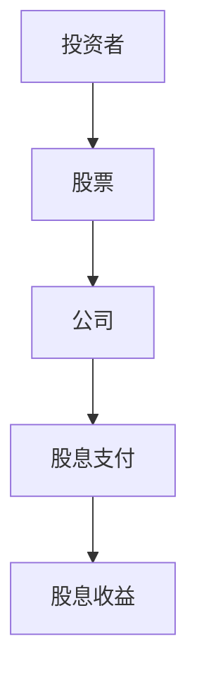
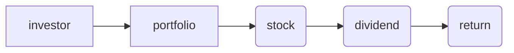

                 


# 格雷厄姆的股息投资策略：稳定收益的来源

## 关键词：股息投资，本杰明·格雷厄姆，股息率，股息支付率，数学模型，投资策略

## 摘要：本文系统地介绍了格雷厄姆的股息投资策略，从理论基础到数学模型，再到系统架构，最后通过实战案例分析，深入剖析了如何利用股息投资实现稳定收益。文章内容涵盖股息投资的核心概念、算法原理、系统设计、项目实现和最佳实践，为读者提供了全面的指导。

---

## 第一部分：股息投资的背景与基础

### 第1章：股息投资的基本概念

#### 1.1 股息投资的定义与特点
- **股息的定义**：股息是公司分配给股东的利润部分，通常以每股形式发放。
- **股息投资的核心特点**：
  - 稳定性：股息收入提供稳定的现金流。
  - 抗风险性：在市场波动中，高股息率股票往往表现更优。
  - 长期性：股息投资注重长期收益，而非短期波动。
- **股息投资与资本增值的对比**：
  - 股息投资注重现金流，资本增值投资注重股价上涨。

#### 1.2 股息投资的历史与发展
- **股息投资的起源**：18世纪末，英国公司开始普遍发放股息。
- **股息投资在现代金融中的地位**：股息投资已成为机构和个人投资者的重要策略。
- **股息投资的演变与现状**：随着金融市场的成熟，股息投资策略不断优化。

#### 1.3 格雷厄姆投资理论的背景
- **本杰明·格雷厄姆的生平简介**：格雷厄姆是价值投资的鼻祖，其理论深刻影响了巴菲特等投资者。
- **格雷厄姆投资理论的核心思想**：买入被市场低估的股票，注重安全边际。
- **股息投资在格雷厄姆理论中的地位**：股息投资是实现安全边际的重要手段。

### 第2章：股息投资的核心概念与联系

#### 2.1 核心概念原理
- **股息支付率的计算公式**：
  $$ 股息支付率 = \frac{每股股息}{每股收益} \times 100\% $$
- **股息率的定义与计算**：
  $$ 股息率 = \frac{每股股息}{股票价格} \times 100\% $$
- **股息增长模型的原理**：假设股息每年以固定增长率增长，股票价值为永续年金的现值。

#### 2.2 核心概念对比表格
| 概念       | 定义                                   | 计算公式                          |
|------------|--------------------------------------|-----------------------------------|
| 股息支付率  | 股东获得的股息与公司净利润的比例       | $$\frac{每股股息}{每股收益} \times 100\%$$ |
| 股息率      | 股息与股票价格的比率                  | $$\frac{每股股息}{股票价格} \times 100\%$$ |
| 股息增长模型| 假设股息每年以固定速率增长，计算股票价值 | $$P = \frac{D_1}{r - g}$$         |

#### 2.3 ER实体关系图


### 第3章：股息投资的数学模型与算法

#### 3.1 股息率计算公式
$$股息率 = \frac{每股股息}{股票价格} \times 100\%$$

#### 3.2 股息增长模型
$$P = \frac{D_1}{r - g}$$
其中：
- \(P\) 为股票价
- \(D_1\) 为第一年的股息
- \(r\) 为折现率
- \(g\) 为股息增长率

#### 3.3 股息支付率与股息率的对比
通过对比股息支付率和股息率，可以帮助投资者更好地选择股票。例如，如果某股票的股息支付率为50%，股息率为5%，则该股票具有较高的分红能力。

---

## 第二部分：系统分析与架构设计

### 第4章：股息投资的系统分析

#### 4.1 系统功能设计
- **领域模型**：投资者选择股息率高、股息支付率稳定的股票。
- **系统架构设计**：
  ```mermaid
  graph LR
      Investor(investor) --> Portfolio(portfolio)
      Portfolio --> Stock(stock)
      Stock --> Dividend(dividend)
      Dividend --> Return(return)
  ```

#### 4.2 系统架构图


---

## 第三部分：项目实战

### 第5章：股息投资的实战分析

#### 5.1 环境安装
- **Python环境**：安装Python 3.8以上版本。
- **依赖库**：安装pandas、numpy、matplotlib。

#### 5.2 核心实现源代码
```python
import pandas as pd
import numpy as np

# 示例数据
data = {
    '股票': ['A', 'B', 'C'],
    '股价': [100, 80, 120],
    '每股股息': [2, 3, 4]
}

df = pd.DataFrame(data)

# 计算股息率
df['股息率'] = (df['每股股息'] / df['股价']) * 100

print(df)
```

#### 5.3 案例分析
以某公司为例，计算其股息率和股息支付率，评估其投资价值。

---

## 第四部分：总结与展望

### 第6章：总结与最佳实践

#### 6.1 小结
格雷厄姆的股息投资策略强调安全边际和长期稳定收益，适合稳健型投资者。

#### 6.2 注意事项
- 避免过度依赖股息率，需结合股息支付率和公司基本面。
- 股票市场波动较大，需定期调整投资组合。

#### 6.3 拓展阅读
推荐阅读《股票作手回忆录》和《投资学原理》。

---

## 附录

### A. 术语表
- **股息支付率**：股息与净利润的比率。
- **股息率**：股息与股价的比率。

### B. 参考文献
- 本杰明·格雷厄姆：《证券分析》。
- 巴菲特：《巴菲特致股东的信》。

---

## 作者：AI天才研究院 & 禅与计算机程序设计艺术

---

通过以上目录和内容设计，您可以根据需要进一步扩展每个章节的具体内容，确保文章逻辑清晰、内容详实，同时保持专业性和可读性。

