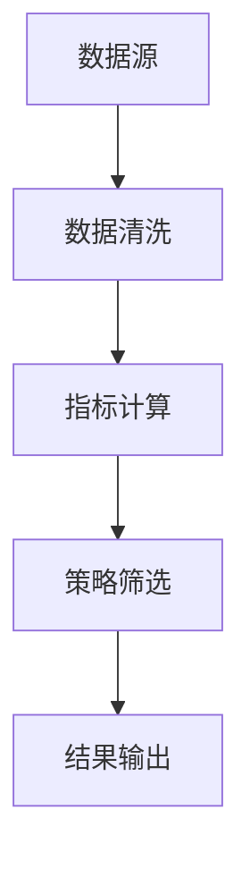
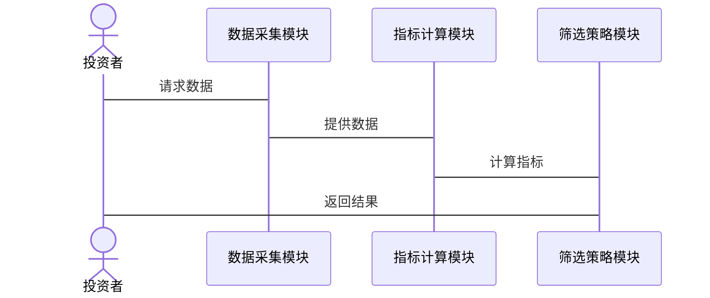

                 


# 格雷厄姆的股票选择公式

> 关键词：价值投资、股票选择、内在价值、安全边际、防御性股票、投资策略、数学模型

> 摘要：本文详细介绍了格雷厄姆的股票选择公式，探讨了其背后的数学原理、系统架构和实际应用。通过分析股票的内在价值、安全边际和防御性特征，本文为投资者提供了一套科学的股票筛选方法，并通过实际案例展示了如何将这些理论应用于投资实践中。

---

# 第一部分: 格雷厄姆的股票选择公式概述

## 第1章: 价值投资与股票选择的背景

### 1.1 价值投资的起源与发展

#### 1.1.1 价值投资的定义与核心理念

价值投资是一种投资策略，强调通过分析企业的基本面，寻找市场价格低于其内在价值的股票进行投资。其核心理念是“买入低于价值的股票并长期持有”。

- **定义**: 价值投资是一种长期投资策略，强调安全边际和内在价值的计算。
- **核心理念**:
  - 股票价格与内在价值之间的差异创造了投资机会。
  - 投资者应关注企业的财务健康状况，而非市场的短期波动。

#### 1.1.2 格雷厄姆与巴菲特的价值投资体系

- **格雷厄姆**: 本杰明·格雷厄姆是价值投资的鼻祖，提出了“安全边际”和“内在价值”等核心概念。
- **巴菲特**: 巴菲特师承格雷厄姆，将价值投资的理念发扬光大，并结合自己的投资实践形成了独特的投资体系。

#### 1.1.3 股票选择公式的历史意义

格雷厄姆的股票选择公式为现代价值投资奠定了基础，其核心思想至今仍被广泛应用于股票筛选和投资决策中。

### 1.2 格雷厄姆的投资哲学

#### 1.2.1 格雷厄姆的生平简介

- **生平**: 本杰明·格雷厄姆（1897-1975）是英国裔美国经济学家和投资大师，被誉为“价值投资之父”。
- **著作**: 《证券分析》（与戴维·多德合著）和《聪明的投资者》。

#### 1.2.2 安全边际的概念与重要性

- **安全边际**: 安全边际 = 内在价值 - 市场价格。
- **重要性**: 安全边际提供了缓冲空间，降低了投资的风险。

#### 1.2.3 避免情绪化投资的原则

- **情绪化投资**: 投资者因市场情绪波动而做出的非理性决策。
- **格雷厄姆的建议**: 投资者应避免情绪化，坚持基于基本面分析的投资决策。

### 1.3 股票市场的基本特性

#### 1.3.1 股票市场的波动性与周期性

- **波动性**: 股票价格的短期波动往往与市场情绪相关。
- **周期性**: 股票市场存在周期性波动，投资者应关注长期趋势。

#### 1.3.2 投资者心理与市场行为

- **投资者心理**: 恐慌和贪婪是市场波动的主要驱动因素。
- **市场行为**: 市场参与者的行为往往偏离理性，为价值投资者提供了机会。

#### 1.3.3 价值与价格的长期关系

- **内在价值**: 股票的真正价值由其盈利能力、资产质量和行业地位决定。
- **市场价格**: 受市场情绪和短期因素影响，可能偏离内在价值。

---

## 第2章: 格雷厄姆股票选择公式的理论基础

### 2.1 股票内在价值的计算方法

#### 2.1.1 股票内在价值的定义

- **内在价值**: 股票基于其基本面分析的真正价值，与市场价格无关。

#### 2.1.2 格雷厄姆的内在价值公式

$$
V = \frac{E}{1 + g}
$$

其中：
- \( V \) 表示股票的内在价值
- \( E \) 表示企业未来现金流的现值
- \( g \) 表示股息增长率

#### 2.1.3 现金流量折现法的简化应用

- **现金流量折现法**: 将未来现金流折现到当前时点的现值之和，作为股票的内在价值。

### 2.2 安全边际的数学模型

#### 2.2.1 安全边际的计算公式

$$
\text{安全边际} = \frac{\text{内在价值} - \text{市场价格}}{\text{市场价格}} \times 100\%
$$

- **安全边际公式**: 计算安全边际的百分比，安全边际越高，投资风险越小。

#### 2.2.2 安全边际与股价波动的关系

- **关系**: 安全边际提供了股价波动的缓冲空间，确保在市场价格波动时，内在价值依然高于市场价格。

#### 2.2.3 安全边际的动态调整方法

- **动态调整**: 根据市场环境和企业基本面的变化，定期调整安全边际的计算。

### 2.3 防御性股票的筛选标准

#### 2.3.1 防御性股票的定义

- **防御性股票**: 在市场下跌时，价格波动较小的股票，通常来自稳定行业。

#### 2.3.2 防御性股票的财务指标筛选

- **市盈率**: 低于行业平均水平。
- **市净率**: 低于行业平均水平。
- **股息率**: 高于行业平均水平。

#### 2.3.3 防御性股票的行业特征分析

- **行业稳定性**: 选择具有稳定收益和低波动性的行业。

---

## 第3章: 格雷厄姆股票选择公式的数学模型

### 3.1 内在价值计算公式

$$
V = \frac{E}{1 + g}
$$

其中：
- \( V \) 表示股票的内在价值
- \( E \) 表示企业未来现金流的现值
- \( g \) 表示股息增长率

### 3.2 安全边际计算公式

$$
\text{安全边际} = \frac{\text{内在价值} - \text{市场价格}}{\text{市场价格}} \times 100\%
$$

### 3.3 股票筛选的综合公式

$$
\text{综合评分} = \frac{\text{市盈率} + \text{市净率} + \text{股息率}}{3}
$$

---

## 第4章: 格雷厄姆股票选择公式的系统架构

### 4.1 系统功能设计

#### 4.1.1 数据采集模块

- **功能**: 采集股票的财务数据和市场数据。

#### 4.1.2 指标计算模块

- **功能**: 计算市盈率、市净率、股息率等财务指标。

#### 4.1.3 筛选策略模块

- **功能**: 根据格雷厄姆公式筛选出符合条件的股票。

### 4.2 系统架构设计



### 4.3 系统接口设计

#### 4.3.1 数据接口

- **接口**: 从数据源获取股票数据。

#### 4.3.2 策略接口

- **接口**: 根据筛选策略返回符合条件的股票列表。

#### 4.3.3 输出接口

- **接口**: 输出筛选结果和分析报告。

### 4.4 系统交互流程



---

## 第5章: 格雷厄姆股票选择公式的项目实战

### 5.1 环境安装

- **工具**: Python、Pandas、NumPy、Matplotlib。

### 5.2 核心实现

```python
def calculate_intrinsic_value(e, g):
    return e / (1 + g)

def calculate_margin_of_safety(v, p):
    return ((v - p) / p) * 100

# 示例计算
e = 1000
g = 0.05
p = 800
v = calculate_intrinsic_value(e, g)
mos = calculate_margin_of_safety(v, p)
print(f"内在价值: {v:.2f}, 安全边际: {mos:.2f}%")
```

### 5.3 实际案例分析

- **案例**: 某公司财务数据计算其内在价值和安全边际。

### 5.4 项目小结

- **总结**: 通过实际案例分析，验证了格雷厄姆公式的有效性和实用性。

---

## 第6章: 格雷厄姆股票选择公式的最佳实践

### 6.1 投资策略的注意事项

- **分散投资**: 不将所有资金投入单一股票。
- **长期持有**: 避免频繁交易，降低交易成本。

### 6.2 小结

- **总结**: 格雷厄姆的股票选择公式为投资者提供了一套科学的股票筛选方法，帮助投资者找到具有安全边际的优质股票。

---

## 作者

作者：AI天才研究院/AI Genius Institute & 禅与计算机程序设计艺术 /Zen And The Art of Computer Programming

