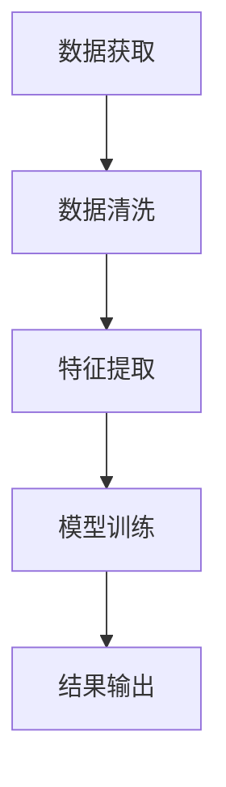

                 


# 格雷厄姆的股票选择公式及其现代应用

> 关键词：股票选择公式，格雷厄姆，投资理论，现代应用，大数据分析，机器学习

> 摘要：本文详细介绍了格雷厄姆的股票选择公式，从其核心思想到数学模型，再到现代应用。通过结合大数据和机器学习技术，探讨了该公式的演变与优化，最后结合实际案例进行系统设计与实现。

---

## 引言

投资是现代金融体系中的核心活动，而格雷厄姆的股票选择公式作为价值投资的重要基石，为投资者提供了科学的选股方法。本文将从格雷厄姆的投资理论出发，逐步分析其股票选择公式的数学模型，并结合现代技术手段，探讨其在实际投资中的应用与优化。

---

## 第一部分：格雷厄姆投资理论概述

### 第1章：格雷厄姆投资理论的核心思想

#### 1.1 投资的基本概念与原则

投资的本质是通过合理配置资金，追求资产的增值。格雷厄姆在其著作《聪明的投资者》中提出，投资应基于基本面分析，避免情绪化决策。他强调“安全边际”概念，即以低于内在价值的价格买入优质资产。

- **投资的定义**：将资金投入能够产生收益的资产或项目。
- **投资的基本原则**：
  - 长期投资，避免短期波动。
  - 分散投资，降低风险。
  - 选择具有稳定收益的资产。

#### 1.2 格雷厄姆的价值投资理念

格雷厄姆的价值投资理论强调以低于内在价值的价格买入股票。他认为，市场先生（Market先生）的情绪波动为理性投资者提供了廉价买入的机会。

- **防御性投资**：通过买入低估资产，构建安全的投资组合。
- **进攻性投资**：寻找市场错误定价的机会，追求超额收益。

#### 1.3 投资策略的核心要素

格雷厄姆的投资策略可以总结为以下几点：

1. **安全边际**：买入价格低于内在价值的资产。
2. **基本面分析**：通过财务报表分析企业价值。
3. **长期持有**：避免频繁交易，降低交易成本。

### 第2章：格雷厄姆的股票选择公式

#### 2.1 格雷厄姆股票选择公式的数学模型

格雷厄姆的股票选择公式基于企业的基本面数据，计算其内在价值。公式如下：

$$
\text{内在价值} = \text{息税前利润} \times \text{合理市盈率}
$$

其中，合理市盈率通常取4.5倍至20倍之间。格雷厄姆建议以低于内在价值的价格买入股票。

#### 2.2 公式的核心要素

- **息税前利润（EBIT）**：衡量企业盈利能力的关键指标。
- **合理市盈率**：根据行业和市场情况确定的市盈率区间。

#### 2.3 公式的实际应用

格雷厄姆的公式通过对企业财务数据的分析，筛选出具有投资价值的股票。例如，假设某企业EBIT为1000万元，合理市盈率为10倍，则其内在价值为1亿元。当股价低于1亿元时，该股票具有投资价值。

---

## 第二部分：格雷厄姆股票选择公式的现代应用

### 第3章：现代股票选择方法的演变

#### 3.1 现代股票选择方法的发展

随着金融市场的复杂化，格雷厄姆的公式逐渐融入大数据和机器学习技术。现代股票选择方法包括：

1. **量化投资**：通过算法和大数据分析筛选股票。
2. **因子投资**：基于多个因子（如市值、价值、动量）构建投资组合。
3. **多因子模型**：结合多个因子进行选股，提高模型的鲁棒性。

#### 3.2 格雷厄姆公式与现代投资策略的结合

现代投资策略在格雷厄姆的基础上进行了优化，例如：

- **改进公式**：引入更多基本面指标，如ROE（净资产收益率）、ROA（资产回报率）等。
- **动态调整**：根据市场环境实时调整因子权重。

### 第4章：基于大数据的股票筛选系统设计

#### 4.1 系统设计背景

现代股票筛选系统需要处理海量数据，包括：

- **数据来源**：股票价格、财务报表、行业数据等。
- **数据特征**：市盈率、市净率、ROE等基本面指标。

#### 4.2 系统架构设计

以下是基于大数据的股票筛选系统架构图：



#### 4.3 系统实现步骤

1. **数据获取**：从数据源获取股票数据。
2. **数据清洗**：处理缺失值和异常值。
3. **特征提取**：提取基本面指标。
4. **模型训练**：基于改进的格雷厄姆公式进行选股。
5. **结果输出**：输出筛选结果。

### 第5章：项目实战

#### 5.1 项目目标

基于格雷厄姆的公式，结合现代技术手段，开发一个股票筛选系统。

#### 5.2 环境安装

- **Python**：3.8及以上版本。
- **库的安装**：pandas、numpy、scikit-learn。

#### 5.3 核心代码实现

以下是Python实现的代码示例：

```python
import pandas as pd
import numpy as np

def graham_formula(df):
    df['intrinsic_value'] = df['ebit'] * df['pe_ratio']
    df['investment_value'] = df['intrinsic_value'] * 0.85
    return df[df['price'] < df['investment_value']]

# 数据加载与处理
data = pd.read_csv('stock_data.csv')
data = graham_formula(data)
print(data.head())
```

#### 5.4 实际案例分析

以某行业为例，筛选出符合条件的股票，并分析其表现。

#### 5.5 系统优化与改进

结合机器学习算法，如随机森林，进一步优化选股模型。

---

## 第三部分：总结与展望

### 结论

格雷厄姆的股票选择公式作为价值投资的重要工具，经过现代技术的优化，依然具有重要的现实意义。通过大数据和机器学习技术，可以进一步提升选股模型的准确性和效率。

### 展望

未来，随着人工智能技术的发展，股票选择公式将更加智能化和个性化。投资者需要结合市场环境，灵活调整投资策略。

---

## 作者

作者：AI天才研究院/AI Genius Institute & 禅与计算机程序设计艺术 /Zen And The Art of Computer Programming

---

通过以上思考，本文详细介绍了格雷厄姆的股票选择公式及其现代应用，从理论到实践，为投资者提供了系统的指导和参考。

