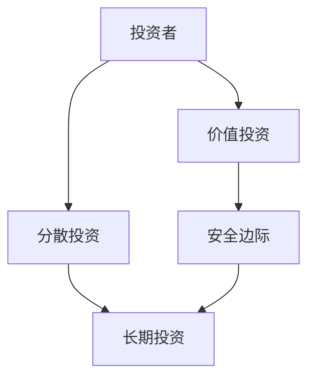
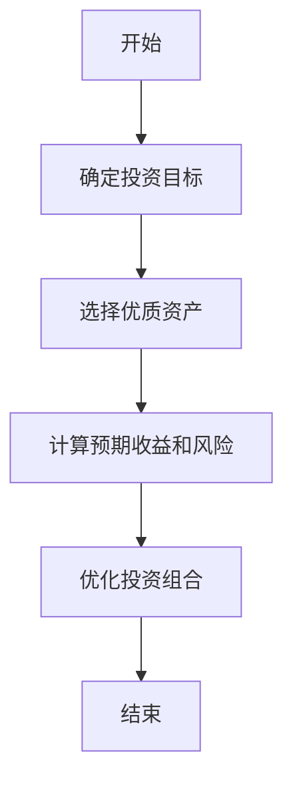
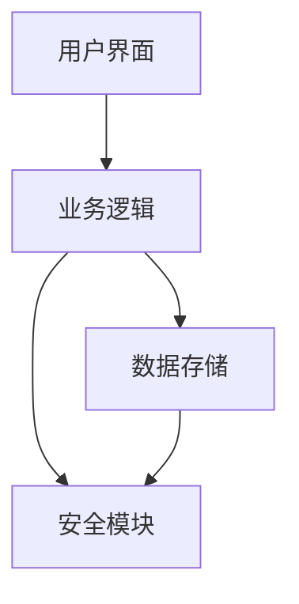

                 


# 防御型投资者策略：格雷厄姆的投资智慧

## 关键词：防御型投资，价值投资，风险管理，投资组合优化，资产配置策略，投资心理

## 摘要：  
本文深入探讨了格雷厄姆的防御型投资者策略，分析其核心概念、算法原理、数学模型以及系统架构。通过实际案例和项目实战，展示了如何将防御型投资策略应用于实际投资中，强调风险管理的重要性，并提供了最佳实践建议。

---

# 引言

## 1. 防御型投资的重要性  
在金融市场中，投资者面临的风险和不确定性无处不在。格雷厄姆的防御型投资策略为投资者提供了一种稳健的投资方法，旨在在市场波动中保护资本并实现长期稳定的收益。

## 2. 本文结构  
本文将从背景介绍、核心概念、算法原理、数学模型、系统分析、项目实战到小结，全面解析防御型投资策略。

---

# 第1章: 防御型投资策略的背景与核心概念

## 1.1 投资市场的背景介绍  
### 1.1.1 投资市场的定义与分类  
投资市场分为股票、债券、基金等多种类型，每种类型都有其独特的风险和收益特征。  
### 1.1.2 防御型投资策略的起源  
防御型投资策略起源于20世纪，由本杰明·格雷厄姆提出，强调安全边际和长期稳健的收益。  
### 1.1.3 防御型投资策略的特点  
防御型投资策略注重风险控制、价值投资和分散投资，旨在在市场波动中保护资本。

## 1.2 防御型投资策略的核心概念  
### 1.2.1 价值投资  
价值投资是防御型策略的核心，强调以低于内在价值的价格买入优质资产。  
### 1.2.2 安全边际  
安全边际是投资中的“安全垫”，确保即使市场价格波动，投资者仍能获得正收益。  
### 1.2.3 分散投资  
通过分散投资于不同资产类别和行业，降低特定资产或市场的风险。  
### 1.2.4 长期投资  
长期投资避免了频繁交易的高成本和高风险，利用复利效应实现财富增长。

---

# 第2章: 防御型投资策略的核心概念与联系

## 2.1 核心概念与联系  
防御型投资策略的核心概念包括价值投资、安全边际、分散投资和长期投资。通过对比分析，可以看出这些概念如何相互作用，共同构建一个稳健的投资组合。

## 2.2 核心概念对比表  
| 概念         | 描述                                   | 关键特征                   |
|--------------|--------------------------------------|--------------------------|
| 价值投资     | 以低于内在价值的价格买入资产         | 强调安全边际               |
| 分散投资     | 投资于不同资产和行业                  | 降低特定风险               |
| 长期投资     | 长期持有优质资产                     | 利用复利效应               |

## 2.3 Mermaid 实体关系图  


---

# 第3章: 防御型投资策略的算法原理

## 3.1 算法原理概述  
防御型投资策略的算法基于现代投资组合理论，通过优化风险和收益的平衡来构建最优投资组合。

## 3.2 算法步骤  
1. **确定投资目标和风险偏好**  
2. **选择优质资产**  
3. **计算资产的预期收益和风险**  
4. **优化投资组合以最小化风险或最大化收益**

## 3.3 Mermaid 流程图  


## 3.4 Python 实现  
```python
import numpy as np
import pandas as pd

def calculate_risk_return/assets:
    returns = pd.DataFrame(...)
    var = returns.std() ** 2
    return var, returns.mean()
```

---

# 第4章: 数学模型与公式

## 4.1 均值-方差模型  
防御型投资策略常用均值-方差模型来优化投资组合。  
$$ \text{目标：最小化风险} \quad \text{在给定收益下} $$  
$$ \text{或最大化收益} \quad \text{在给定风险下} $$  

## 4.2 优化公式  
$$ \text{优化问题：} \quad \min_w \quad w^T \Sigma w $$  
$$ \text{约束条件：} \quad w^T \mu = R, \quad \sum w_i = 1 $$  

## 4.3 示例计算  
假设三种资产，计算其协方差矩阵并求最优投资组合权重。

---

# 第5章: 系统分析与架构设计

## 5.1 系统架构图  


## 5.2 功能模块设计  
1. 用户输入投资目标  
2. 系统计算最优投资组合  
3. 系统展示结果并提供风险提示

## 5.3 接口设计  
- 输入接口：用户输入风险偏好和投资期限  
- 输出接口：显示优化后的投资组合及风险收益分析

---

# 第6章: 项目实战与案例分析

## 6.1 环境安装  
- 安装Python、Pandas、NumPy等工具

## 6.2 核心代码实现  
```python
def optimize_portfolio(returns, risk厌恶系数):
    # 实现均值-方差优化算法
    return optimal_weights
```

## 6.3 案例分析  
分析一个具体的投资组合，展示防御型策略的实际效果。

---

# 第7章: 最佳实践与小结

## 7.1 小结  
防御型投资策略强调安全边际、分散投资和长期持有，是稳健投资者的理想选择。

## 7.2 注意事项  
- 定期调整投资组合以适应市场变化  
- 保持纪律性，避免情绪化决策  

## 7.3 拓展阅读  
推荐阅读格雷厄姆的经典著作《投资的艺术》和《证券分析》。

---

# 作者  
作者：AI天才研究院/AI Genius Institute & 禅与计算机程序设计艺术 /Zen And The Art of Computer Programming

