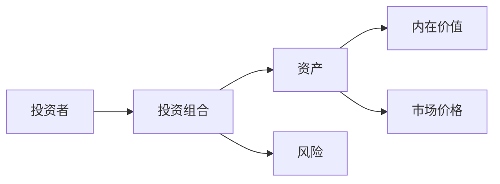
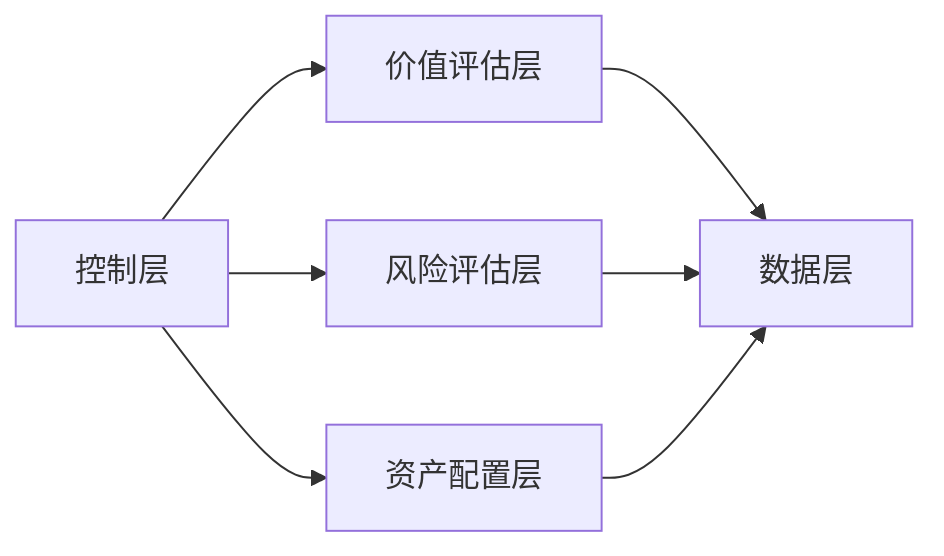

                 


# 格雷厄姆的防御型投资者策略：稳健致胜

> **关键词**：防御型投资、格雷厄姆、价值投资、安全边际、资产配置、风险管理

> **摘要**：  
> 本文深入解析了格雷厄姆的防御型投资者策略，从其核心理念、数学模型到系统架构，全面探讨了如何通过稳健的投资策略实现长期收益。文章结合理论与实践，通过丰富的案例分析，揭示了防御型投资的科学性与实用性，为投资者提供了切实可行的操作指南。

---

## 第一部分：防御型投资的背景与基础

### 第1章：防御型投资的背景与核心理念

#### 1.1 格雷厄姆与防御型投资的起源

- 1.1.1 格雷厄姆的生平简介  
  Benjamin Graham 是价值投资的鼻祖，被誉为“价值投资之父”。他出生于 19 世纪末，经历了大萧条时期，这使他对风险管理有了深刻的理解。他强调安全边际和长期稳健的投资策略。

- 1.1.2 防御型投资的起源与发展  
  防御型投资理念起源于 20 世纪 30 年代，格雷厄姆在《证券分析》中首次系统提出了防御型投资策略。这一策略在大萧条时期表现出了极强的稳健性，为投资者提供了在市场波动中保护本金的方法。

- 1.1.3 格雷厄姆投资理念的核心思想  
  格雷厄姆认为，投资的本质是通过分析企业的内在价值，以低于内在价值的价格买入优质资产。防御型投资强调安全边际，即买入价格低于内在价值，从而在市场波动中保护投资者的本金。

---

#### 1.2 防御型投资的基本原则

- 1.2.1 投资的本质与目标  
  投资的目的是通过资产配置和风险管理，实现长期稳健的收益。防御型投资强调安全性和稳定性，而非短期收益的最大化。

- 1.2.2 防御型投资的核心原则  
  - **安全第一**：优先考虑本金的安全性，避免高风险投资。  
  - **价值投资**：基于企业的内在价值进行投资，而非市场的短期波动。  
  - **分散投资**：通过多元化配置降低风险，避免过度集中于单一资产。

- 1.2.3 防御型投资与进攻型投资的区别  
  防御型投资注重长期稳健，追求稳定收益；进攻型投资注重短期高回报，风险较高。防御型投资适合保守型投资者，而进攻型投资适合风险承受能力较高的投资者。

---

#### 1.3 安全边际的概念与重要性

- 1.3.1 安全边际的定义  
  安全边际是指买入价格与内在价值之间的差额，即：$$安全边际 = 内在价值 - 市场价格$$

- 1.3.2 安全边际在投资中的作用  
  安全边际提供了缓冲区，能够在市场下跌时保护本金。例如，如果一只股票的内在价值为 100 元，市场价格为 80 元，安全边际为 20%，能够在市场下跌 20% 时仍保持本金不变。

- 1.3.3 安全边际的计算方法  
  通过分析企业的财务数据，估算其内在价值，再与市场价格进行比较。例如，假设某公司未来现金流的现值为 100 元，当前股价为 80 元，安全边际为 20%。

---

## 第二部分：防御型投资的核心概念与联系

### 第2章：防御型投资者的决策模型

#### 2.1 核心概念原理

- **价值评估模型**  
  通过分析企业的盈利能力、现金流、资产质量等指标，估算其内在价值。例如，使用市盈率（P/E）和市净率（P/B）等指标进行估值。

- **风险控制机制**  
  防御型投资通过分散投资、选择低波动性资产等方式，降低投资组合的风险。

- **资产配置策略**  
  根据投资者的风险承受能力和投资目标，合理配置股票、债券、现金等资产。

---

#### 2.2 核心概念属性对比表格

| **核心概念** | **防御型投资** | **进攻型投资** |
|--------------|----------------|----------------|
| **目标**      | 稳定收益       | 高收益         |
| **风险承受**  | 低             | 高             |
| **投资期限**  | 长期           | 短期           |
| **资产选择**  | 低波动性       | 高波动性       |

---

#### 2.3 实体关系图（ER图）



---

## 第三部分：防御型投资的算法原理

### 第3章：防御型投资的数学模型与公式

#### 3.1 价值评估的数学模型

- 内在价值的计算公式：  
  $$\text{内在价值} = \frac{\text{预期现金流}}{\text{折现率}}$$  
  例如，假设某公司未来现金流为 100 元，折现率为 10%，则内在价值为 $$100 / 1.1 = 90.91$$ 元。

- 安全边际的计算公式：  
  $$\text{安全边际} = \text{内在价值} - \text{市场价格}$$  
  例如，内在价值为 100 元，市场价格为 80 元，则安全边际为 20%。

---

#### 3.2 风险调整后的资产配置模型

- 风险调整后的资产配置比例：  
  $$\text{资产配置比例} = \frac{\text{风险承受能力}}{\text{总资金}}$$  
  例如，假设风险承受能力为 50%，总资金为 100 万元，则股票配置比例为 50%，债券配置比例为 30%，现金配置比例为 20%。

---

### 第4章：防御型投资的算法流程

#### 4.1 算法流程图


---

#### 4.2 Python实现代码

```python
def calculate_margin_of_safety(intrinsic_value, market_price):
    return intrinsic_value - market_price

# 示例
intrinsic_value = 100  # 内在价值
market_price = 80       # 市场价格
margin_of_safety = calculate_margin_of_safety(intrinsic_value, market_price)
print(f"安全边际为：{margin_of_safety / intrinsic_value * 100}%")
```

---

## 第四部分：防御型投资的系统分析与架构设计

### 第4章：防御型投资的系统架构

#### 4.1 系统功能设计

- **功能模块**：  
  - **价值评估模块**：计算资产的内在价值。  
  - **风险评估模块**：评估投资组合的风险。  
  - **资产配置模块**：根据风险承受能力配置资产。

- **功能流程**：  
  1. 输入资产信息（财务数据、市场数据）。  
  2. 计算内在价值和市场价格。  
  3. 计算安全边际。  
  4. 根据安全边际和风险评估结果配置资产。

---

#### 4.2 系统架构设计



---

## 第五部分：防御型投资的项目实战

### 第5章：防御型投资的实战分析

#### 5.1 项目背景与目标

- **项目背景**：分析一家公司的内在价值，制定防御型投资策略。  
- **项目目标**：通过计算安全边际，确定是否买入该公司的股票。

---

#### 5.2 项目核心实现

```python
def analyze_company(finance_data, market_price):
    intrinsic_value = calculate_intrinsic_value(finance_data)
    margin_of_safety = intrinsic_value - market_price
    return margin_of_safety

# 示例
finance_data = {
    "预期现金流": 100,
    "折现率": 0.1
}
market_price = 80
result = analyze_company(finance_data, market_price)
print(f"安全边际为：{result}")
```

---

#### 5.3 案例分析与解读

- **案例分析**：假设某公司的内在价值为 100 元，市场价格为 80 元，安全边际为 20%。根据防御型投资策略，投资者可以考虑买入该股票，因为其安全边际较高。

---

## 第六部分：防御型投资的最佳实践

### 第6章：防御型投资的最佳实践

#### 6.1 小结

- 防御型投资的核心是安全边际和内在价值。  
- 通过价值评估和风险控制，实现长期稳健的收益。

---

#### 6.2 注意事项

- **避免过度分散**：分散投资是必要的，但过度分散可能导致收益下降。  
- **定期调整**：根据市场变化和企业基本面，定期调整投资组合。  
- **长期持有**：防御型投资适合长期持有，避免频繁交易。

---

#### 6.3 拓展阅读

- 格雷厄姆的《证券分析》和《聪明的投资者》是防御型投资的经典著作。  
- 进一步学习现代投资组合理论（MPT）和风险管理方法。

---

## 作者：AI天才研究院/AI Genius Institute & 禅与计算机程序设计艺术/Zen And The Art of Computer Programming

