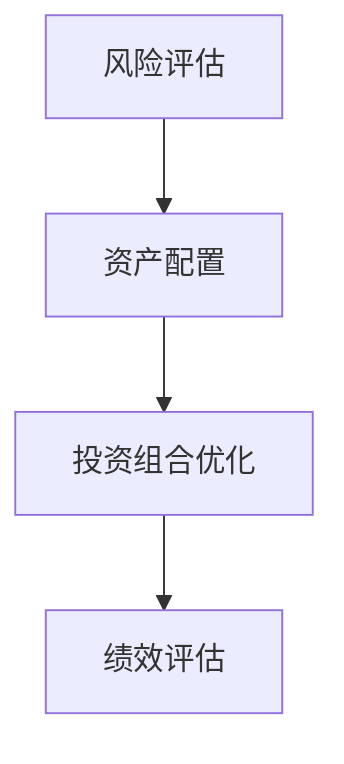
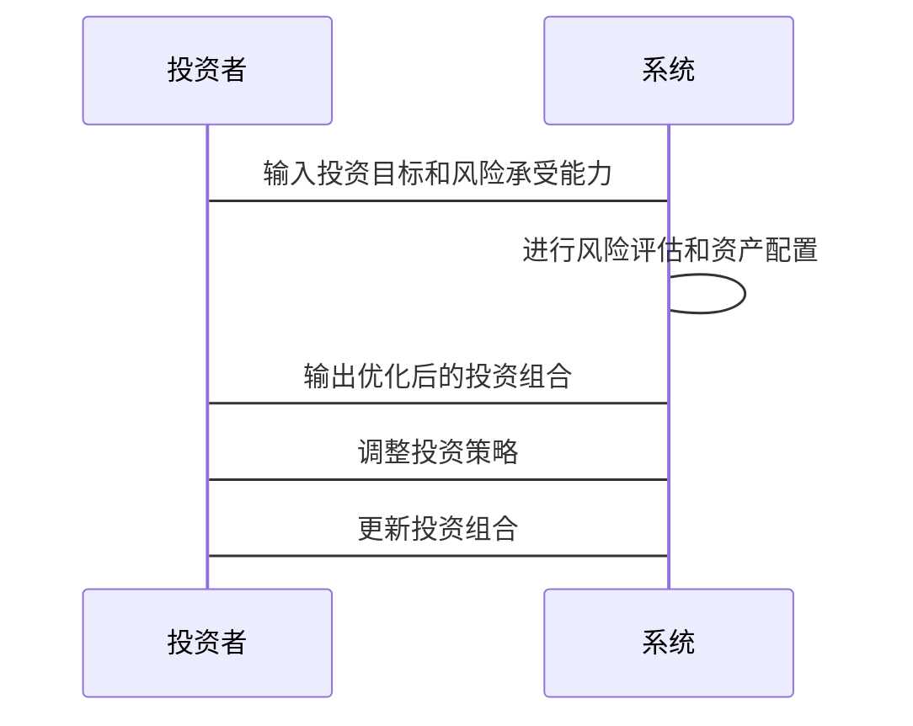

                 


# 格雷厄姆的防御型投资者策略：稳健致胜

## 关键词：
- 防御型投资
- 格雷厄姆
- 稳健投资
- 风险管理
- 长期投资
- 价值投资
- 分散投资

## 摘要：
格雷厄姆的防御型投资者策略是一种以稳健和安全为核心的投资方法，旨在通过长期持有优质资产、分散投资和注重价值来实现稳定的收益。本文将深入分析该策略的核心理念、具体实施方法以及其在不同市场环境中的应用，帮助投资者在复杂多变的市场中实现稳健的投资回报。

---

# 第一部分：防御型投资者策略概述

## 第1章：防御型投资的基本概念

### 1.1 防御型投资的定义
防御型投资是一种以稳健和风险控制为核心的投资策略，旨在通过长期持有优质资产、分散投资和注重价值来实现稳定的收益。与进攻型投资相比，防御型投资更注重资产的安全性和稳定性，而非短期的高收益。

### 1.2 防御型投资的核心理念
防御型投资的核心理念包括以下几点：
- **安全边际**：买入低于其内在价值的资产，以确保投资的安全性。
- **长期视角**：关注长期投资回报，而非短期市场波动。
- **风险管理**：通过分散投资和严格的风险评估来降低投资风险。

### 1.3 防御型投资与进攻型投资的区别
- **目标**：防御型投资注重保本和稳定收益，而进攻型投资追求高收益。
- **风险承受能力**：防御型投资者通常风险承受能力较低，而进攻型投资者愿意承担更高的风险。
- **投资策略**：防御型投资注重稳健和分散，而进攻型投资更倾向于集中投资和高风险高回报的策略。

## 第2章：防御型投资者的特质

### 2.1 心理素质与纪律性
防御型投资者需要具备强大的心理素质和纪律性，能够在市场波动中保持冷静，避免情绪化决策。

### 2.2 风险管理能力
防御型投资者注重风险管理，能够通过分散投资、设定止损点等方法来降低投资风险。

### 2.3 长期投资视野
防御型投资者通常具有长期投资的视野，能够忽略短期市场波动，专注于长期的投资目标。

## 第3章：防御型投资的适用场景

### 3.1 市场波动中的防御策略
在市场波动较大时，防御型投资者可以通过增加债券、黄金等避险资产的比重来降低投资组合的风险。

### 3.2 经济周期中的防御投资
防御型投资在不同的经济周期中表现不同，例如在经济衰退期，防御型资产如公用事业、医疗保健等行业的股票通常表现较为稳定。

### 3.3 不同市场环境下的防御策略选择
根据市场环境的变化，防御型投资者需要灵活调整投资策略，例如在高通胀环境下，选择通胀保值债券或实际资产。

---

# 第二部分：防御型投资的核心策略

## 第4章：价值投资策略

### 4.1 价值投资的定义
价值投资是一种以低于资产内在价值的价格买入资产的投资策略，旨在通过长期持有优质资产来实现超额收益。

### 4.2 格雷厄姆的“安全边际”概念
格雷厄姆提出“安全边际”概念，即买入资产的价格应显著低于其内在价值，以确保投资的安全性。

### 4.3 价值投资的实施步骤
1. 确定资产的内在价值。
2. 寻找价格低于内在价值的资产。
3. 长期持有，等待市场回归理性。

## 第5章：分散投资策略

### 5.1 分散投资的定义
分散投资是通过将资金分配到不同的资产类别、行业或地区，以降低投资组合的整体风险。

### 5.2 分散投资的优势
- **降低风险**：通过分散投资，可以减少单一资产波动对整体投资组合的影响。
- **提高稳定性**：分散投资能够使投资组合在不同市场环境下保持相对稳定。

### 5.3 分散投资的实施方法
1. 选择多个不同的资产类别进行投资。
2. 在不同行业或地区之间分散投资。
3. 定期调整投资组合的资产分配。

## 第6章：长期持有策略

### 6.1 长期持有的意义
长期持有能够避免频繁交易带来的交易成本和税务负担，同时也能减少因短期市场波动导致的决策失误。

### 6.2 长期持有的风险控制
- 定期评估投资组合的资产质量。
- 根据市场变化调整投资策略。

### 6.3 长期持有的心理挑战
- 需要克服短期市场波动带来的心理压力。
- 需要具备长期坚持的纪律性。

---

# 第三部分：防御型投资的数学模型与算法原理

## 第7章：防御型投资的数学模型

### 7.1 投资组合的数学表示
投资组合的收益和风险可以通过以下公式进行量化：
- 收益：$E(r_p) = \sum w_i E(r_i)$
- 风险：$\sigma_p^2 = \sum w_i^2 \sigma_i^2 + 2 \sum_{i < j} w_i w_j \sigma_i \sigma_j \rho_{i,j}$

### 7.2 风险与收益的数学关系
在投资组合中，收益和风险之间存在一种权衡关系，即收益越高，风险也越大。

### 7.3 马科维茨的有效前沿理论
马科维茨的有效前沿理论指出，对于给定的风险水平，存在一种最优的投资组合，能够提供最高的预期收益。

## 第8章：防御型投资的算法原理

### 8.1 风险评估算法
- 计算每种资产的预期收益和风险。
- 评估资产之间的相关性。

### 8.2 资产配置算法
- 根据风险承受能力和投资目标，确定投资组合中各类资产的权重。

### 8.3 投资组合优化算法
- 使用数学优化方法，如均值-方差优化，来确定最优投资组合。

---

# 第四部分：防御型投资的系统架构设计

## 第9章：防御型投资的系统架构设计

### 9.1 系统功能模块划分
- **风险评估模块**：评估每种资产的风险。
- **资产配置模块**：确定投资组合中各类资产的权重。
- **投资组合优化模块**：优化投资组合，使其在风险和收益之间达到最佳平衡。

### 9.2 系统架构设计图


### 9.3 系统交互序列图


---

# 第五部分：防御型投资的实战与总结

## 第10章：防御型投资的实战分析

### 10.1 环境配置
- 确定投资目标和风险承受能力。
- 选择适合的资产类别和投资工具。

### 10.2 核心代码实现
```python
import numpy as np
import pandas as pd
from scipy.optimize import minimize

def portfolio_optimization(returns, covariance):
    n = len(returns)
    # 定义优化目标函数
    def objective(weights):
        return -np.sum(weights * returns)  # 最大化预期收益
    # 约束条件
    constraints = [
        {'type': 'eq', 'fun': lambda w: np.sum(w) - 1},  # 投资权重总和为1
        {'type': 'ineq', 'fun': lambda w: w[i] >= 0 for i in range(n)}  # 权重非负
    ]
    # 初始权重
    initial_weights = np.array([1.0/n]*n)
    # 优化
    result = minimize(objective, initial_weights, constraints=constraints)
    return result.x
```

### 10.3 代码解读与分析
- 该代码通过优化算法，找到在给定风险约束下预期收益最大的投资组合。
- 输入包括资产的预期收益和协方差矩阵，输出最优的投资权重。

### 10.4 案例分析
假设我们有三只股票，其预期收益和协方差矩阵如下：
```python
returns = [0.1, 0.15, 0.08]
covariance = [[0.02, 0.015, 0.01],
              [0.015, 0.03, 0.02],
              [0.01, 0.02, 0.015]]
weights = portfolio_optimization(returns, covariance)
print(weights)
```

### 10.5 总结
通过实战分析，我们可以看到防御型投资策略在实际操作中的具体应用。通过优化算法和分散投资，可以有效降低投资风险，实现稳健的长期收益。

---

# 作者：AI天才研究院/AI Genius Institute & 禅与计算机程序设计艺术 /Zen And The Art of Computer Programming

---

这篇文章通过详细分析格雷厄姆的防御型投资策略，结合数学模型和系统架构设计，为投资者提供了实现稳健收益的方法。希望读者能够通过本文的理解和实践，在复杂多变的市场中实现长期稳定的收益。

