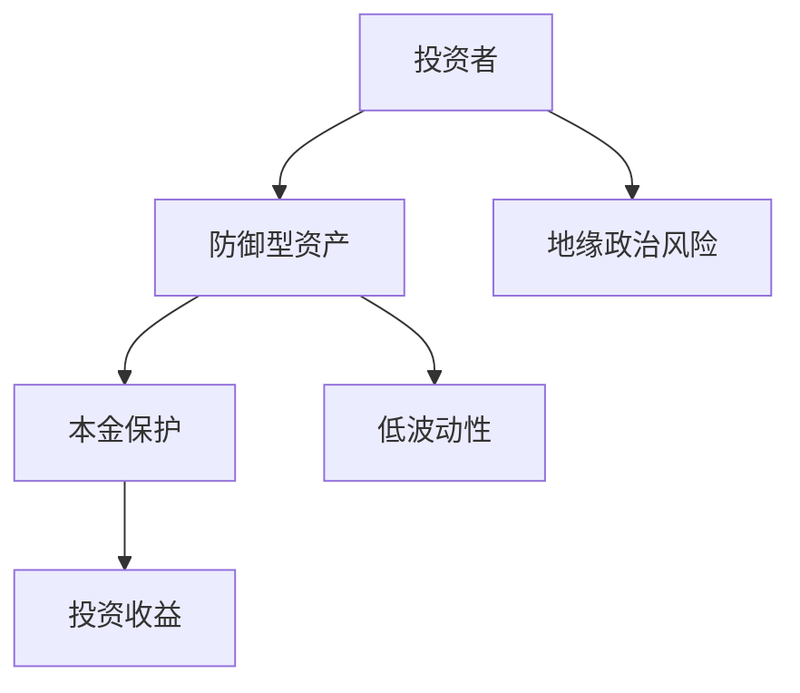
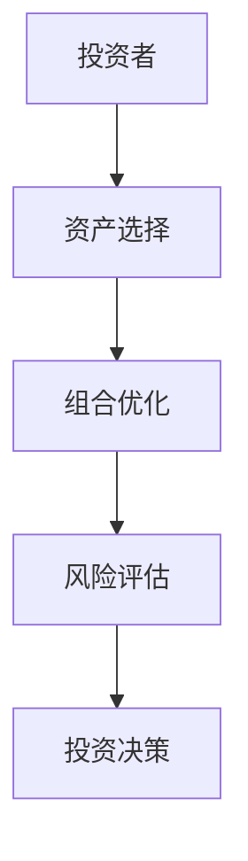

                 


# 防御型投资：在地缘政治不确定性中的重要性

## 关键词：防御型投资, 地缘政治不确定性, 格雷厄姆, 投资策略, 风险管理

## 摘要：防御型投资是一种以稳健和本金保护为核心的投资策略，尤其在地缘政治不确定性增加的背景下显得尤为重要。本文基于格雷厄姆的投资理论，分析了防御型投资的核心概念、算法原理、数学模型，并结合实际案例，探讨了在地缘政治不确定环境下的投资策略优化和风险管理。

---

# 第一部分: 地缘政治不确定性与防御型投资的背景

## 第1章: 地缘政治不确定性与投资环境

### 1.1 地缘政治对全球经济的影响

#### 1.1.1 地缘政治的概念与核心要素
地缘政治是指地理因素对政治格局和国际关系的影响，其核心要素包括地理位置、资源分布、军事力量和国际关系等。当前的地缘政治格局充满了不确定性，如中美关系的紧张、俄乌冲突等地缘政治事件对全球经济和金融市场造成了深远影响。

#### 1.1.2 地缘政治不确定性对经济的冲击
地缘政治事件往往会导致市场波动加剧、供应链中断和经济衰退。例如，俄乌冲突导致能源价格飙升，全球通胀加剧，股市波动性增加。这些不确定性对投资者的决策提出了更高的要求。

#### 1.1.3 投资环境中的地缘政治风险
投资者在地缘政治不确定性下需要考虑的风险包括资产贬值、流动性风险和政策风险等。例如，地缘政治紧张可能导致某些地区的资产被抛售，从而引发市场崩盘。

### 1.2 防御型投资的定义与特点

#### 1.2.1 防御型投资的定义
防御型投资是一种以本金保护为核心的投资策略，强调低风险、低波动性和长期稳定回报。其目标是在不确定的市场环境中保护投资者的资本，同时追求稳健的增长。

#### 1.2.2 防御型投资的核心特点
- 本金保护：优先确保投资本金的安全。
- 低风险：选择风险较低的资产，如债券、黄金和蓝筹股。
- 长期稳定：注重长期回报，而非短期收益。

#### 1.2.3 防御型投资与进攻型投资的对比
| 概念          | 防御型投资       | 进攻型投资       |
|---------------|------------------|------------------|
| 目标          | 本金保护         | 资本增值         |
| 风险承受      | 低风险           | 高风险           |
| 投资期限      | 长期稳定         | 短期高回报       |

### 1.3 格雷厄姆的防御型投资理论

#### 1.3.1 格雷厄姆的投资理念
格雷厄姆是价值投资之父，他强调以低于内在价值的价格买入优质资产，注重安全边际。他认为，投资者应选择那些具有稳定收益和低波动性的资产，以在不确定的市场中实现长期稳健的回报。

#### 1.3.2 防御型投资的核心原则
- 安全边际：购买价格低于内在价值，确保本金的安全。
- 低波动性资产：选择波动小、收益稳定的资产，如债券和黄金。
- 长期持有：避免频繁交易，降低交易成本和风险。

#### 1.3.3 格雷厄姆理论的现代应用
格雷厄姆的理论在现代投资中依然适用，尤其是在地缘政治不确定性增加的情况下。投资者可以通过选择具有稳定收益的资产，如国债、公用事业股和黄金，来构建防御型投资组合。

## 第2章: 防御型投资的核心概念与联系

### 2.1 核心概念原理

#### 2.1.1 安全边际的定义与计算
安全边际是指资产的市场价格低于其内在价值的部分，是防御型投资的核心要素。计算公式为：
$$
\text{安全边际} = \text{内在价值} - \text{市场价格}
$$
例如，如果一只股票的内在价值为100元，市场价格为80元，则安全边际为20元。

#### 2.1.2 防御型资产的选择标准
防御型资产应具备以下特征：
- 收益稳定：如国债、分红稳定的蓝筹股。
- 风险低：如黄金、房地产投资信托基金（REITs）。
- 流动性高：如现金、短期债券。

#### 2.1.3 风险厌恶与收益平衡
防御型投资者通常对风险较为厌恶，愿意牺牲部分收益以换取更高的安全性。这种风险厌恶可以通过资产配置和投资组合优化来实现。

### 2.2 核心概念对比表格
| 概念          | 防御型投资       | 进攻型投资       |
|---------------|------------------|------------------|
| 目标          | 本金保护         | 资本增值         |
| 风险承受      | 低风险           | 高风险           |
| 投资期限      | 长期稳定         | 短期高回报       |

### 2.3 ER实体关系图


## 第3章: 防御型投资的算法原理

### 3.1 安全边际计算算法

#### 3.1.1 计算步骤
1. 确定目标资产的内在价值。
2. 计算资产的市场价格。
3. 计算安全边际：$$\text{安全边际} = \text{内在价值} - \text{市场价格}$$

#### 3.1.2 代码示例
```python
def calculate_margin_of_safety(intrinsic_value, market_price):
    return intrinsic_value - market_price

# 示例
intrinsic_value = 100  # 元
market_price = 80      # 元
margin = calculate_margin_of_safety(intrinsic_value, market_price)
print(f"安全边际为：{margin}元")
```

### 3.2 低波动性资产筛选算法

#### 3.2.1 算法步骤
1. 收集目标资产的历史波动率数据。
2. 计算每种资产的年化波动率。
3. 筛选出波动率低于市场平均水平的资产。

#### 3.2.2 代码示例
```python
import pandas as pd
import numpy as np

def calculate_volatility(returns):
    return np.std(returns)

# 示例数据：过去一年的收益率
returns = [0.01, -0.005, 0.008, 0.012, -0.003, 0.006]
volatility = calculate_volatility(returns)
print(f"波动率为：{volatility:.2f}")
```

### 3.3 数学模型与公式

#### 3.3.1 资产波动率计算
资产的波动率可以通过收益率的标准差来衡量：
$$
\text{波动率} = \sqrt{\frac{1}{n}\sum_{i=1}^{n}(r_i - \bar{r})^2}
$$
其中，$$r_i$$ 是第i个收益率，$$\bar{r}$$ 是平均收益率，$$n$$ 是数据点的数量。

#### 3.3.2 安全边际与投资决策
安全边际为正时，资产具有投资价值。当安全边际越高时，投资风险越低。

## 第4章: 数学模型与公式

### 4.1 防御型投资的数学模型

#### 4.1.1 投资组合优化
防御型投资者可以通过优化投资组合来降低风险。例如，使用最小方差优化模型：
$$
\text{最小化} \sum_{i=1}^{n} w_i^2 \sigma_i^2
$$
其中，$$w_i$$ 是资产i的权重，$$\sigma_i$$ 是资产i的波动率。

#### 4.1.2 投资组合的风险调整后收益
防御型投资者可以通过夏普比率来衡量投资组合的风险调整后收益：
$$
\text{夏普比率} = \frac{\text{投资组合收益} - \text{无风险利率}}{\text{投资组合波动率}}
$$

## 第5章: 系统分析与架构设计

### 5.1 问题场景介绍

#### 5.1.1 地缘政治事件对投资组合的影响
地缘政治事件可能导致某些资产价格暴跌，从而影响投资组合的稳定性。

### 5.1.2 投资者如何应对地缘政治风险
投资者需要通过资产配置、分散投资和风险管理来应对地缘政治风险。

### 5.2 系统功能设计

#### 5.2.1 领域模型


### 5.3 系统架构设计

#### 5.3.1 系统架构图


## 第6章: 项目实战

### 6.1 环境安装

#### 6.1.1 安装必要的Python库
```bash
pip install pandas numpy matplotlib
```

### 6.2 核心实现

#### 6.2.1 安全边际计算
```python
import pandas as pd

# 示例数据
data = {'资产': ['A', 'B', 'C'], '内在价值': [100, 150, 200], '市场价格': [80, 120, 180]}
df = pd.DataFrame(data)

# 计算安全边际
df['安全边际'] = df['内在价值'] - df['市场价格']

print(df)
```

### 6.3 应用解读与分析

#### 6.3.1 案例分析
假设当前地缘政治紧张，投资者选择防御型资产，如国债和黄金。通过计算安全边际，投资者可以确定哪些资产具有较高的安全边际，从而降低投资风险。

## 第7章: 最佳实践

### 7.1 小结

#### 7.1.1 文章总结
防御型投资是一种稳健的投资策略，尤其在地缘政治不确定性增加的情况下显得尤为重要。通过选择低风险、低波动性资产，并计算安全边际，投资者可以在不确定的市场中保护本金并实现稳健的回报。

### 7.2 注意事项

#### 7.2.1 风险提示
防御型投资并不能完全消除风险，但可以显著降低投资组合的波动性。

### 7.3 拓展阅读

#### 7.3.1 进一步阅读
建议读者进一步阅读格雷厄姆的《证券分析》和《聪明的投资者》，以深入了解防御型投资的理论和实践。

---

# 结语

防御型投资是一种以稳健和本金保护为核心的投资策略，尤其在地缘政治不确定性增加的背景下显得尤为重要。通过选择低风险、低波动性资产，并计算安全边际，投资者可以在不确定的市场中保护本金并实现稳健的回报。

作者：AI天才研究院/AI Genius Institute & 禅与计算机程序设计艺术/Zen And The Art of Computer Programming

