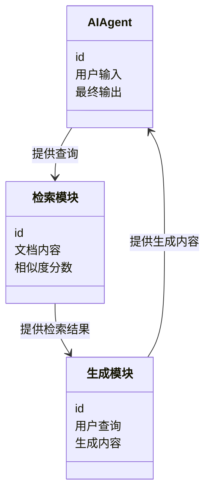
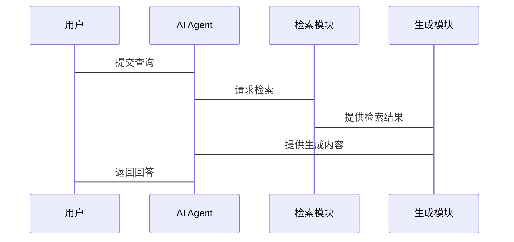

                 


# 检索增强生成：提高AI Agent回答的准确性

## 关键词：
检索增强生成（RAG）、AI Agent、回答准确性、生成式AI、向量数据库、信息检索、自然语言处理

## 摘要：
本文探讨了检索增强生成（RAG）技术如何提高AI Agent的回答准确性。文章从RAG的基本概念、算法原理、系统架构到实际项目实现，全面分析了RAG的核心技术与应用场景。通过向量数据库的构建与检索算法的优化，结合生成式AI的优势，本文展示了如何设计高效的AI Agent系统，并提供了丰富的实战案例和优化建议。

---

# 第一部分: 检索增强生成（RAG）背景与核心概念

## 第1章: 检索增强生成（RAG）概述

### 1.1 检索增强生成的基本概念
#### 1.1.1 生成式AI的局限性
生成式AI（如GPT系列模型）虽然能够生成自然流畅的文本，但在准确性方面存在明显缺陷。由于模型无法直接访问外部知识库，容易生成错误信息或与事实不符的内容。

#### 1.1.2 检索式AI的局限性
检索式AI（如基于关键词匹配的搜索引擎）依赖于预先索引的数据，无法生成连贯的上下文信息，且检索结果可能与用户需求偏差较大。

#### 1.1.3 检索增强生成（RAG）的定义与特点
检索增强生成（RAG）结合了检索和生成的优势，通过从外部知识库中检索相关信息并结合生成式AI进行内容生成，从而提高回答的准确性和相关性。

### 1.2 问题背景与问题描述
#### 1.2.1 AI Agent回答准确性问题的背景
随着AI Agent的广泛应用，用户对回答的准确性要求越来越高。生成式AI的回答虽然流畅，但容易出现事实性错误。

#### 1.2.2 生成式AI的回答准确性问题
生成式AI模型依赖于训练数据，容易受到训练数据偏差的影响，且无法实时更新知识库。

#### 1.2.3 检索增强生成的目标与意义
RAG的目标是通过结合检索和生成技术，提升AI Agent回答的准确性、相关性和实时性。

### 1.3 问题解决与边界
#### 1.3.1 检索增强生成的解决方案
通过向量数据库检索相关文档，结合生成式AI生成高质量回答。

#### 1.3.2 检索增强生成的边界与限制
- 知识库的质量和规模直接影响回答的准确性。
- 检索和生成过程中的计算开销可能影响实时性。

#### 1.3.3 检索增强生成的适用场景与外延
适用于需要高准确性回答的场景，如医疗咨询、法律咨询、技术文档生成等。

### 1.4 核心概念与联系
#### 1.4.1 检索与生成的结合方式
RAG通过检索模块获取相关信息，然后利用生成模块生成最终回答。

#### 1.4.2 检索增强生成的核心要素
- **向量数据库**：用于存储和检索文档。
- **检索算法**：如BM25、DPR等。
- **生成模型**：如GPT系列模型。

#### 1.4.3 检索增强生成与生成式AI的区别与联系
- **区别**：RAG结合了检索和生成，生成式AI仅生成内容。
- **联系**：RAG依赖生成式AI进行最终内容生成。

---

# 第二部分: 检索增强生成（RAG）的算法原理

## 第2章: 向量数据库的构建与检索算法

### 2.1 向量数据库的构建
#### 2.1.1 文本表示与向量化
- 使用语言模型（如BERT）对文本进行编码，生成固定长度的向量表示。

#### 2.1.2 向量数据库的存储与索引
- 将向量表示存储在数据库中，并建立索引以便快速检索。

### 2.2 检索算法的实现
#### 2.2.1 BM25算法
- BM25是一种基于关键词匹配的检索算法，常用于信息检索任务。
- 公式：$$ BM25(score) = \sum_{i=1}^{n} \frac{\text{tf}_i \cdot \log(\text{idf}_i)}{\text{tf}_i + k(1 - \text{b} + \text{b}\cdot \text{dl})} $$
- 其中，tf是词频，idf是逆向文件频率，k和b是调优参数。

#### 2.2.2 基于余弦相似度的检索
- 使用向量的余弦相似度进行检索。
- 公式：$$ \text{similarity} = \frac{\vec{v}_1 \cdot \vec{v}_2}{\|\vec{v}_1\| \|\vec{v}_2\|} $$

### 2.3 向量数据库的实现与优化
#### 2.3.1 向量数据库的选择与实现
- 常见的向量数据库有FAISS、Milvus等。

#### 2.3.2 向量检索的性能优化
- 使用索引优化、量化等技术提升检索效率。

### 2.4 向量检索算法的代码实现
```python
import numpy as np
from sentence_transformers import SentenceTransformer

# 初始化模型
model = SentenceTransformer('all-MiniLM-L6-v2')

# 文本向量化
def get_vector(text):
    return model.encode(text)

# BM25检索函数
def bm25_score(tf, idf, k=1, b=0.75):
    return tf * np.log(idf) / (tf + k * (1 - b + b * len(tf)))

# 余弦相似度检索函数
def cosine_similarity_score(vec1, vec2):
    return np.dot(vec1, vec2) / (np.linalg.norm(vec1) * np.linalg.norm(vec2))
```

---

# 第三部分: 检索增强生成（RAG）的系统分析与架构设计

## 第3章: 系统分析与架构设计

### 3.1 问题场景介绍
AI Agent需要在复杂场景下提供高准确性的回答，如医疗咨询、法律咨询等。

### 3.2 系统功能设计
- **用户输入**：接收用户查询。
- **检索模块**：从知识库中检索相关信息。
- **生成模块**：基于检索结果生成回答。

### 3.3 系统架构设计


### 3.4 系统接口设计
- **输入接口**：接收用户查询。
- **输出接口**：返回最终回答。

### 3.5 系统交互流程


---

# 第四部分: 检索增强生成（RAG）的项目实战

## 第4章: 项目实战

### 4.1 环境安装与配置
```bash
pip install faiss-cpu sentence-transformers transformers
```

### 4.2 系统核心实现
```python
from faiss import IndexFlatL2
import numpy as np

# 初始化向量索引
index = IndexFlatL2(d=300)

# 添加向量到索引
def add_vector(index, vector):
    index.add(np.array([vector], dtype=np.float32))

# 检索向量
def search_vector(index, vector, k=5):
    distances, indices = index.search(np.array([vector], dtype=np.float32), k)
    return indices[0], distances[0]
```

### 4.3 代码实现与解读
- **向量索引的构建**：使用Faiss构建向量索引。
- **检索与生成**：结合生成模型生成最终回答。

### 4.4 实际案例分析
通过实际案例分析，展示如何优化检索和生成过程，提升回答准确性。

### 4.5 项目小结
总结项目实现的关键点，如向量数据库的选择、检索算法的优化等。

---

# 第五部分: 检索增强生成（RAG）的最佳实践与小结

## 第5章: 最佳实践与小结

### 5.1 最佳实践
- **数据质量**：确保知识库的数据质量和相关性。
- **模型选择**：选择合适的生成模型和检索算法。
- **性能优化**：优化向量数据库的检索效率。

### 5.2 小结
检索增强生成（RAG）通过结合检索和生成技术，显著提升了AI Agent的回答准确性。通过合理设计系统架构和优化算法，可以进一步提高系统的性能和用户体验。

### 5.3 注意事项
- 确保知识库的实时更新。
- 注意生成内容的伦理和法律问题。

### 5.4 拓展阅读
推荐相关领域的优秀书籍和论文，供读者深入研究。

---

作者：AI天才研究院/AI Genius Institute & 禅与计算机程序设计艺术 /Zen And The Art of Computer Programming

