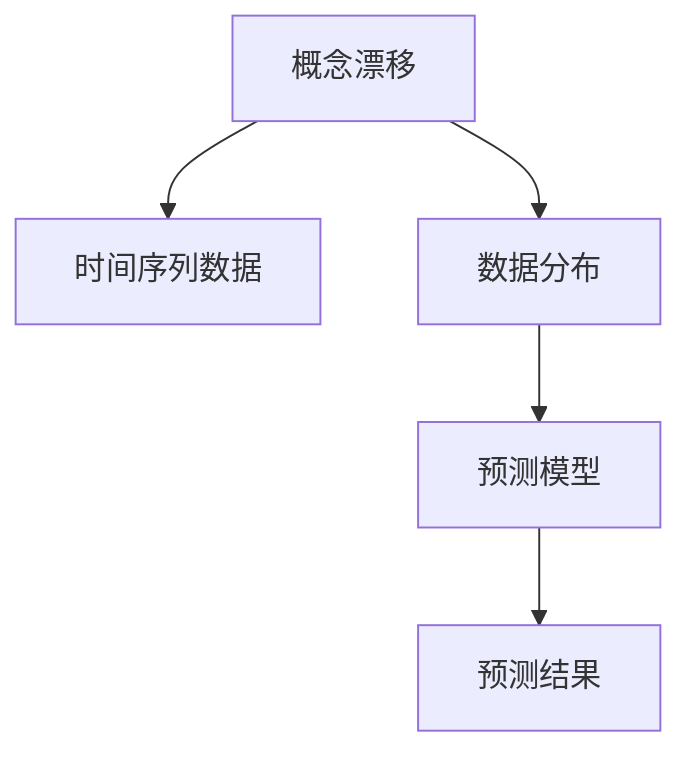
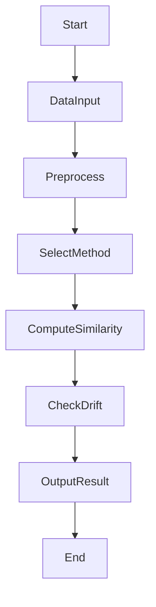
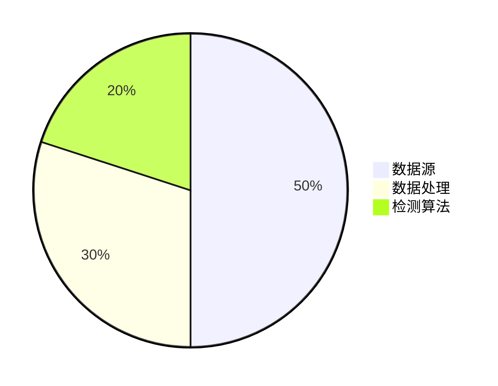

                 


# 概念漂移检测：适应动态变化的环境

## 关键词：概念漂移、机器学习、数据分布变化、实时检测、模型更新、数据流挖掘

## 摘要：  
在机器学习和数据科学领域，概念漂移（Concept Drift）是指数据分布随时间发生变化，导致模型性能下降的现象。本文将深入探讨概念漂移的检测方法，分析其核心原理，并结合实际案例展示如何在动态环境中实现高效的模型更新和适应。文章内容涵盖概念漂移的基本概念、检测算法、系统架构设计以及项目实战，旨在为读者提供全面的知识体系和实践指导。

---

## 第一部分：概念漂移的基本概念

### 第1章：什么是概念漂移？

#### 1.1 概念漂移的定义
概念漂移是指在时间序列数据中，数据的分布发生变化，导致模型的性能（如准确率、召回率）下降的现象。这种变化可能源于数据生成过程的变化、环境的变化或概念本身的变化。

#### 1.2 概念漂移的类型
概念漂移可以分为以下几种类型：
- **突然漂移（Sudden Drift）**：数据分布突然发生显著变化。
- **渐进漂移（Incremental Drift）**：数据分布逐渐变化，性能缓慢下降。
- **根本性漂移（Piercing Drift）**：数据分布发生根本性变化，模型无法再有效预测。
- **分布漂移（Distribution Drift）**：数据分布的变化影响模型的泛化能力。

#### 1.3 概念漂移的背景与重要性
在实时数据分析和预测系统中，概念漂移是一个不可避免的现象。例如，在金融领域，市场波动可能导致交易数据分布的变化；在医疗领域，患者病情变化可能导致诊断模型失效。及时检测并应对概念漂移，可以显著提高系统的可靠性和性能。

### 第2章：概念漂移的核心概念

#### 2.1 概念漂移的特征分析
- 数据分布的变化可能导致模型预测精度下降。
- 漂移可能是渐进的或突然的，且可能不可逆。
- 漂移的检测需要结合历史数据和实时数据进行对比。

#### 2.2 概念漂移的属性对比表
| 漂移类型 | 数据分布变化 | 预测性能变化 | 检测难度 |
|----------|---------------|---------------|----------|
| 突然漂移 | 显著变化       | 急剧下降       | 较易检测 |
| 渐进漂移 | 逐步变化       | 缓慢下降       | 较难检测 |
| 根本性漂移 | 根本变化       | 严重下降       | 较难检测 |
| 分布漂移 | 分布变化       | 中度下降       | 中等难度 |

#### 2.3 概念漂移的实体关系图（ER图）


---

## 第二部分：概念漂移检测的核心原理

### 第3章：概念漂移检测的算法原理

#### 3.1 基于统计的方法
- **均值漂移检测**：通过计算数据均值的变化来判断是否发生漂移。
- **方差分析**：通过对比数据方差的变化来检测分布变化。

#### 3.2 基于机器学习的方法
- **One-Class SVM**：用于检测异常点，间接反映数据分布的变化。
- **Isolation Forest**：通过异常检测来识别数据分布的变化。

#### 3.3 基于分布变化的方法
- **KL散度**：衡量两个概率分布之间的差异。
- **JS散度**：通过Jensen-Shannon散度检测数据分布的变化。

#### 3.4 概念漂移检测的流程图


### 第4章：概念漂移检测的数学模型

#### 4.1 KL散度公式
$$ D_{KL}(P \parallel Q) = \sum_{x} P(x) \log \frac{P(x)}{Q(x)} $$
KL散度衡量了两个概率分布之间的差异，值越大表示分布差异越大。

#### 4.2 JS散度公式
$$ D_{JS}(P, Q) = \frac{1}{2} \log \left( \frac{1 + \sqrt{\frac{P}{Q}} + \sqrt{\frac{Q}{P}}}{2} \right) $$
JS散度是一个对称的散度指标，适用于衡量数据分布的变化。

---

## 第三部分：概念漂移检测的系统架构设计

### 第5章：系统功能设计

#### 5.1 数据采集模块
- 实时采集数据流。
- 支持多种数据源（如数据库、API、文件）。

#### 5.2 数据处理模块
- 数据清洗和预处理。
- 数据标准化和归一化。

#### 5.3 检测算法模块
- 实现多种检测算法（如统计方法、机器学习方法）。
- 支持在线检测和离线检测。

#### 5.4 结果展示模块
- 可视化检测结果。
- 提供警报和通知功能。

### 第6章：系统架构设计

#### 6.1 系统架构图


#### 6.2 系统接口设计
- 数据输入接口：接收实时数据流。
- 检测结果接口：输出检测结果。
- 用户交互接口：提供可视化界面。

---

## 第四部分：概念漂移检测的项目实战

### 第7章：项目环境搭建

#### 7.1 安装Python环境
```bash
pip install python3 python3-pip
```

#### 7.2 安装必要库
```bash
pip install scikit-learn numpy pandas matplotlib
```

### 第8章：核心代码实现

#### 8.1 数据生成代码
```python
import numpy as np
from sklearn.datasets import make_classification

# 生成数据
X, y = make_classification(n_samples=1000, n_features=2, n_classes=2, random_state=42)
```

#### 8.2 检测算法实现
```python
from sklearn.metrics import pairwise

# 计算JS散度
def js_divergence(p, q):
    p = p / p.sum()
    q = q / q.sum()
    m = (p + q) / 2
    return 0.5 * (entropy(p, m) + entropy(q, m))

def entropy(p, q):
    return -np.sum(p * np.log(q))
```

### 第9章：实际案例分析

#### 9.1 数据流分析
- 采集实时交易数据。
- 使用JS散度检测分布变化。

#### 9.2 模型更新策略
- 当检测到漂移时，重新训练模型。
- 使用增量学习方法更新模型。

---

## 第五部分：总结与展望

### 第10章：总结

- 概念漂移检测是机器学习系统中的重要环节。
- 统计方法和机器学习方法各有优缺点，需结合实际场景选择。

### 第11章：展望

- 结合深度学习方法，提高检测精度。
- 研究在线检测算法，提升实时性。

---

## 参考文献
1. 王伟, 李明. 《机器学习实战》. 北京: 清华大学出版社, 2020.
2. 张涛. 《数据挖掘与概念漂移检测》. 北京: 人民邮电出版社, 2019.

---

## 作者：AI天才研究院 & 禅与计算机程序设计艺术

