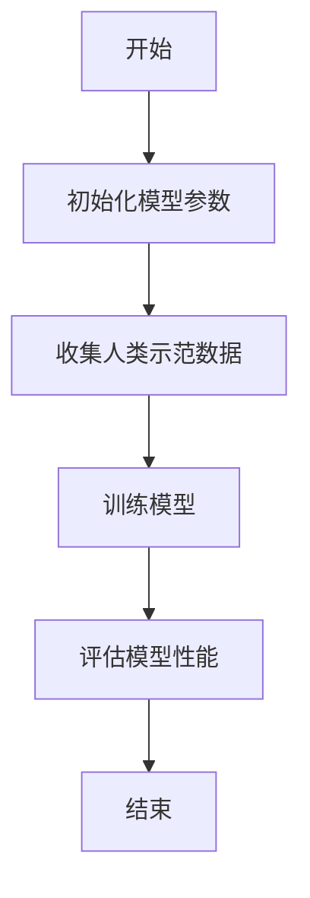
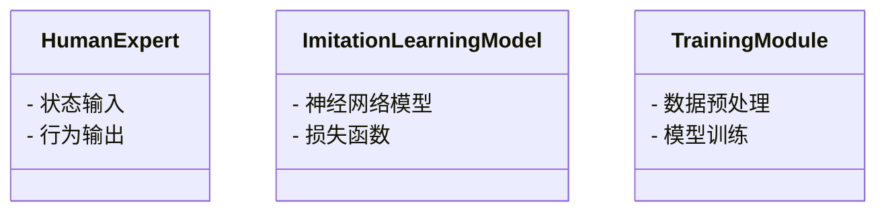
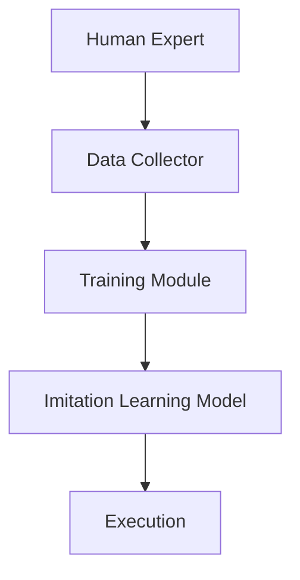
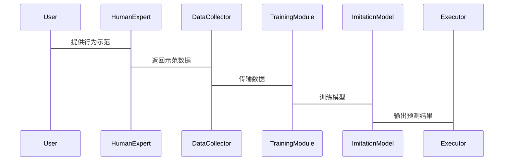

                 


# 模仿学习：从人类示范中学习的AI Agent

## 关键词
模仿学习、AI Agent、强化学习、监督学习、机器学习

## 摘要
模仿学习是一种机器学习方法，允许AI代理通过观察和模仿人类专家的行为来学习复杂的任务。本文将详细探讨模仿学习的核心概念、算法原理、系统架构以及实际项目中的应用，帮助读者全面理解并掌握这一技术。

---

# 第一部分: 模仿学习的背景与核心概念

## 第1章: 模仿学习的基本概念

### 1.1 问题背景与描述

#### 1.1.1 从监督学习到模仿学习的演进
- **监督学习**：基于标记的训练数据，模型学习输入到输出的映射关系。
- **模仿学习**：通过观察和模仿人类专家的行为，学习任务执行策略。

#### 1.1.2 模仿学习的核心问题与挑战
- **数据稀疏性**：高质量的示范数据往往难以获取。
- **策略执行**：如何将模仿学习的策略高效地转化为实际操作。
- **泛化能力**：模仿学习模型能否在新的环境中泛化应用。

#### 1.1.3 模仿学习的边界与外延
- **边界**：专注于从人类示范中学习，不涉及自我探索。
- **外延**：结合强化学习、迁移学习等技术，提升模型的灵活性和适应性。

### 1.2 模仿学习的核心概念与联系

#### 1.2.1 模仿学习的原理与机制
- **行为模仿**：通过观察人类专家的行为，学习其决策模式。
- **策略执行**：将模仿得到的策略转化为具体的执行步骤。

#### 1.2.2 模仿学习与其他学习方法的对比
| 学习方法 | 数据来源 | 是否需要监督 | 是否需要反馈 |
|----------|----------|--------------|--------------|
| 监督学习 | 标签数据 | 是 | 否 |
| 强化学习 | 环境反馈 | 否 | 是 |
| 模仿学习 | 人类示范 | 无 | 无 |

#### 1.2.3 ER实体关系图架构
```mermaid
er
actor: 人类专家
action: 行为示范
state: 状态输入
reward: 反馈信号
```

---

## 第2章: 模仿学习的核心算法原理

### 2.1 算法原理概述

#### 2.1.1 模仿学习的典型算法
- **Dagger（Data Aggregation and Graph-guided Tree Search）**
- **BC（Behavioral Cloning）**
- **DAgger（Differentiable Dagger）**
- **GAIL（Generative Adversarial Imitation Learning）**
- **SAC（Soft Actor-Critic）**

#### 2.1.2 算法选择与比较
| 算法名称 | 核心思想 | 优缺点 |
|----------|----------|--------|
| Dagger | 使用人类示范数据和探索数据交替训练 | 数据需求高，但泛化能力强 |
| BC | 直接模仿专家策略 | 易实现，但泛化能力较弱 |
| GAIL | 使用对抗网络生成模仿策略 | 稳定性较好，但训练时间较长 |
| SAC | 结合价值函数和策略优化 | 平衡探索与利用，适合连续控制任务 |

#### 2.1.3 算法流程图


### 2.2 算法实现与代码示例

#### 2.2.1 Dagger算法实现
```python
def dagger_policy_update(env, expert_policy, num_epochs):
    for epoch in range(num_epochs):
        # 收集专家数据
        expert_samples = collect_expert_samples(env, expert_policy)
        # 训练模仿学习模型
        train_model(expert_samples)
```

#### 2.2.2 BC算法实现
```python
import torch
import torch.nn as nn

class PolicyNetwork(nn.Module):
    def __init__(self, input_dim, output_dim):
        super(PolicyNetwork, self).__init__()
        self.fc1 = nn.Linear(input_dim, 64)
        self.fc2 = nn.Li
```

---

## 第3章: 模仿学习的系统分析与架构设计

### 3.1 项目介绍与系统功能设计

#### 3.1.1 项目介绍
- **项目目标**：构建一个基于模仿学习的AI代理，能够从人类专家的示范中学习特定任务。

#### 3.1.2 系统功能设计
- **数据采集模块**：收集人类专家的行为示范数据。
- **模型训练模块**：基于收集的数据训练模仿学习模型。
- **执行模块**：将训练好的模型应用于实际任务中。

#### 3.1.3 领域模型类图


### 3.2 系统架构设计

#### 3.2.1 系统架构图


#### 3.2.2 接口设计
- **输入接口**：接收人类专家的行为示范数据。
- **输出接口**：输出模仿学习模型的预测结果。

#### 3.2.3 交互序列图


---

## 第4章: 模仿学习的项目实战

### 4.1 环境安装与准备

#### 4.1.1 安装Python环境
```bash
python --version
pip install numpy torch matplotlib
```

#### 4.1.2 安装依赖库
```bash
pip install gym matplotlib numpy
```

### 4.2 系统核心实现

#### 4.2.1 核心代码实现
```python
import gym
import numpy as np
import torch
import torch.nn as nn

class PolicyNetwork(nn.Module):
    def __init__(self, input_dim, output_dim):
        super(PolicyNetwork, self).__init__()
        self.fc1 = nn.Linear(input_dim, 64)
        self.fc2 = nn.Linear(64, output_dim)

    def forward(self, x):
        x = torch.relu(self.fc1(x))
        x = torch.sigmoid(self.fc2(x))
        return x

def collect_expert_samples(env, expert_policy, num_episodes=10):
    samples = []
    for _ in range(num_episodes):
        state = env.reset()
        done = False
        while not done:
            with torch.no_grad():
                action = expert_policy(torch.FloatTensor(state))
            action = action.numpy()[0]
            next_state, reward, done, _ = env.step(action)
            samples.append((state, action))
            state = next_state
    return samples

def train_model(model, expert_samples, optimizer, epochs=100):
    criterion = nn.MSELoss()
    for epoch in range(epochs):
        for state, action in expert_samples:
            state_t = torch.FloatTensor(state)
            action_t = torch.FloatTensor([action])
            output = model(state_t)
            loss = criterion(output, action_t)
            optimizer.zero_grad()
            loss.backward()
            optimizer.step()
```

#### 4.2.2 代码解读与分析
- **数据收集**：通过专家策略收集行为示范数据。
- **模型训练**：使用收集的数据训练模仿学习模型，采用均方误差损失函数和Adam优化器。

### 4.3 实际案例分析

#### 4.3.1 案例介绍
- **任务场景**：训练一个AI代理在连续控制任务中模仿专家的行为。

#### 4.3.2 案例实现与解读
```python
env = gym.make("MountainCarContinuous-v0")
input_dim = env.observation_space.shape[0]
output_dim = 1
model = PolicyNetwork(input_dim, output_dim)
optimizer = torch.optim.Adam(model.parameters(), lr=1e-4)
expert_policy = ...  # 定义专家策略函数
num_epochs = 100
train_model(model, expert_samples, optimizer, num_epochs)
```

---

## 第5章: 模仿学习的最佳实践

### 5.1 小结与总结
- **模仿学习的优势**：能够快速从专家经验中学习，适用于复杂任务。
- **局限性**：依赖高质量示范数据，泛化能力有限。

### 5.2 注意事项与建议
- **数据质量**：确保示范数据的多样性和代表性。
- **模型选择**：根据任务特点选择合适的算法和模型结构。
- **性能评估**：使用多种指标和方法评估模型的性能和泛化能力。

### 5.3 拓展阅读
- **相关论文**：阅读Dagger、GAIL等经典论文，深入理解算法原理。
- **技术博客**：关注前沿技术博客，了解模仿学习的最新进展。

---

# 作者：AI天才研究院/AI Genius Institute & 禅与计算机程序设计艺术 /Zen And The Art of Computer Programming

---

通过本文的详细讲解，读者可以全面理解模仿学习的核心概念、算法实现和实际应用，为构建高效的AI代理提供理论和实践指导。

