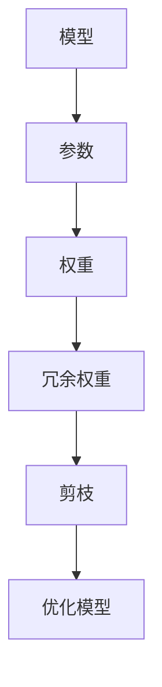
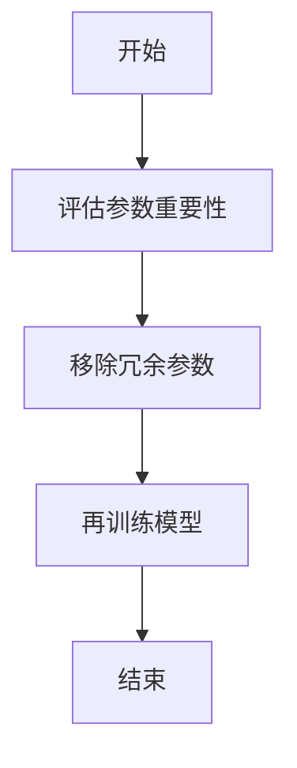
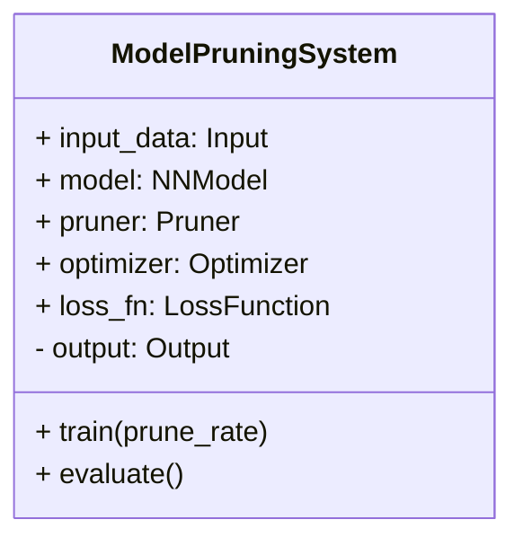
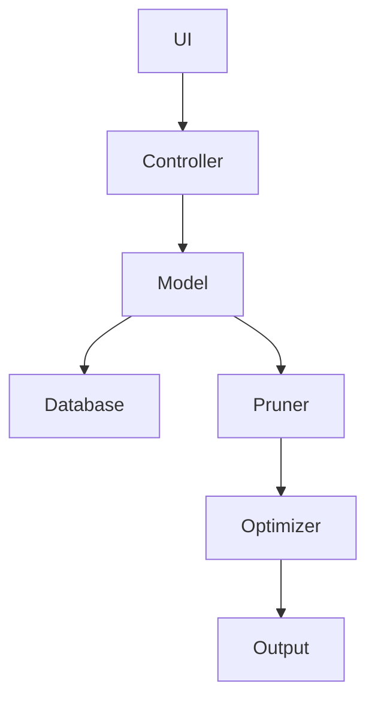
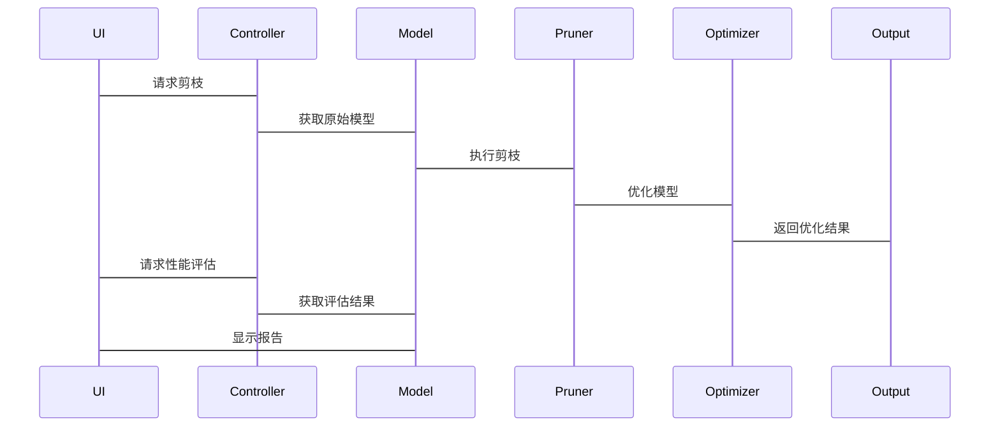

                 


# 模型剪枝：精简AI Agent的参数规模

> 关键词：模型剪枝，参数优化，AI Agent，计算效率，深度学习

> 摘要：模型剪枝是一种通过减少模型参数数量来精简AI Agent规模的技术，旨在提高计算效率、降低资源消耗并保持性能。本文详细探讨模型剪枝的背景、原理、算法实现、系统设计及应用案例，帮助读者全面理解并掌握这一技术。

---

## 第一部分：模型剪枝背景与核心概念

### 第1章：模型剪枝背景介绍

#### 1.1 问题背景
- **大模型的参数规模与计算成本**：现代AI模型参数量巨大，如GPT-3有1750亿参数，训练和推理成本高昂。
- **模型部署的现实挑战**：在资源受限的环境下（如移动设备、边缘计算），大模型难以高效运行。
- **模型剪枝的提出与意义**：通过减少冗余参数，降低计算成本，提高部署灵活性，同时保持模型性能。

#### 1.2 问题描述
- **模型参数冗余的现状**：许多参数在训练中未被充分利用，导致模型体积过大，计算效率低下。
- **模型剪枝的目标与边界**：通过移除冗余参数或权重，降低模型规模，同时保持或提升性能。
- **模型剪枝的核心要素与组成**：包括剪枝策略、剪枝算法、剪枝后的模型重建等。

#### 1.3 问题解决
- **模型剪枝的基本思路**：识别冗余参数，移除或合并，再通过再训练恢复性能。
- **模型剪枝的关键步骤**：参数重要性评估、剪枝、模型重建与微调。
- **模型剪枝的实现路径**：从简单到复杂，逐步优化模型结构。

#### 1.4 模型剪枝的边界与外延
- **模型剪枝的适用场景**：资源受限环境、实时推理需求、边缘计算等。
- **模型剪枝的限制条件**：过度剪枝可能导致性能下降，需平衡模型大小与性能。
- **模型剪枝与其他优化技术的关系**：与模型压缩、知识蒸馏等技术互补，形成完整的模型优化体系。

---

## 第二部分：模型剪枝的核心概念与联系

### 第2章：核心概念与联系

#### 2.1 核心概念原理
- **剪枝方法**：包括基于权重重要性评估的贪心剪枝、基于结构优化的剪枝（如剪枝层）。
- **剪枝策略**：固定剪枝比例或动态调整，根据任务需求选择。
- **剪枝步骤**：评估权重重要性，移除冗余权重，再训练恢复性能。

#### 2.2 核心概念的属性特征对比
| 对比维度 | 贪心剪枝 | 结构化剪枝 | 非结构化剪枝 |
|----------|----------|------------|--------------|
| 剪枝对象 | 权重层   | 网络层     | 模型参数     |
| 适用场景 | 参数优化 | 结构优化   | 细粒度优化   |
| 剪枝效率 | 高       | 中等       | 低           |
| 重建成本 | 高       | 低         | 中           |

#### 2.3 ER实体关系图架构


---

## 第三部分：模型剪枝的算法原理

### 第3章：算法原理讲解

#### 3.1 算法流程图


#### 3.2 核心算法实现
```python
def prune_model(model, prune_rate=0.5):
    # 评估参数重要性
    importance = torch.abs(model.parameters())
    # 排序并剪枝
    sorted_importance, _ = torch.sort(importance, descending=True)
    threshold = sorted_importance[int(len(importance) * prune_rate)]
    # 移除冗余参数
    pruned_params = [p for p in model.parameters() if p.abs() > threshold]
    # 创建新模型并加载剪枝后的参数
    new_model = model.__class__(input_dim=model.input_dim, output_dim=model.output_dim)
    with torch.no_grad():
        for p, new_p in zip(model.parameters(), new_model.parameters()):
            new_p.data = p.data if p.abs() > threshold else torch.zeros_like(p.data)
    return new_model
```

#### 3.3 数学模型
优化目标函数：
$$ \min_{\theta} \frac{1}{2}||X\theta - y||^2 + \lambda ||\theta||_0 $$

---

## 第四部分：模型剪枝的系统分析与架构设计

### 第4章：系统分析与架构设计

#### 4.1 问题场景
- **应用场景**：图像分类、自然语言处理等任务中，剪枝技术用于优化模型部署。

#### 4.2 系统功能设计


#### 4.3 系统架构设计


#### 4.4 系统接口设计
- 输入接口：接受原始模型、剪枝率等参数。
- 输出接口：返回优化后的模型、性能报告。

#### 4.5 系统交互流程图


---

## 第五部分：模型剪枝的项目实战

### 第5章：项目实战

#### 5.1 环境安装
```bash
pip install torch torchvision
```

#### 5.2 核心代码实现
```python
import torch
import torch.nn as nn
import torch.optim as optim

class SimpleNet(nn.Module):
    def __init__(self, input_dim, output_dim):
        super().__init__()
        self.fc1 = nn.Linear(input_dim, 128)
        self.fc2 = nn.Linear(128, 64)
        self.fc3 = nn.Linear(64, output_dim)

def train_model(model, train_loader, criterion, optimizer, epochs=10):
    for epoch in range(epochs):
        for inputs, labels in train_loader:
            outputs = model(inputs)
            loss = criterion(outputs, labels)
            optimizer.zero_grad()
            loss.backward()
            optimizer.step()
```

#### 5.3 代码解读与分析
- **模型定义**：定义一个简单的前馈神经网络。
- **训练过程**：使用PyTorch进行模型训练，包括前向传播、计算损失、反向传播和优化。

#### 5.4 实际案例分析
- **案例选择**：图像分类任务，使用CIFAR-10数据集。
- **剪枝过程**：对全连接层进行剪枝，降低参数数量。

#### 5.5 性能评估与分析
- **原始模型**：参数数量多，计算时间长。
- **剪枝后模型**：参数减少，计算效率提升，性能基本保持。

#### 5.6 项目小结
- 剪枝技术有效降低模型规模，提升计算效率，适用于资源受限场景。

---

## 第六部分：模型剪枝的最佳实践

### 第6章：最佳实践

#### 6.1 小结
- 模型剪枝是优化AI模型的重要技术，需结合任务需求选择合适策略。

#### 6.2 注意事项
- 剪枝比例不宜过大，避免性能显著下降。
- 剪枝后需进行再训练，恢复模型性能。

#### 6.3 拓展阅读
- 建议阅读《Deep Learning》和《Neural Networks and Deep Learning》。

---

## 作者

作者：AI天才研究院/AI Genius Institute & 禅与计算机程序设计艺术 /Zen And The Art of Computer Programming

