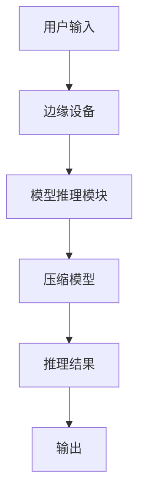

                 


# 模型压缩：在边缘设备部署轻量级AI Agent

## 关键词：模型压缩、边缘设备、轻量级AI Agent、深度学习、AI推理优化

## 摘要：  
随着人工智能技术的快速发展，深度学习模型的规模越来越大，对计算资源的需求也越来越高。然而，边缘设备的计算能力有限，难以直接运行大型模型。模型压缩技术通过减少模型的参数量和计算量，使得轻量级AI Agent能够在边缘设备上高效运行。本文将从模型压缩的背景、核心算法、系统设计、项目实战等方面展开讨论，详细介绍如何在边缘设备上部署轻量级AI Agent，并通过具体案例展示模型压缩的实际应用效果。

---

# 第一部分：模型压缩的背景与概念

## 第1章：模型压缩的背景与问题背景

### 1.1 边缘设备与AI Agent的需求

边缘设备（如物联网设备、移动终端等）在实际应用中面临计算资源有限的问题，包括CPU、GPU计算能力不足、内存容量小、网络带宽受限等。然而，边缘设备对实时性和响应速度有较高要求，特别是在AI Agent（智能体）的应用中，需要快速完成模型推理任务。因此，如何在边缘设备上高效运行AI模型成为亟待解决的问题。

AI Agent的核心任务是通过模型推理实现对环境的感知和决策。然而，传统的深度学习模型（如BERT、ResNet等）参数量巨大，难以在边缘设备上直接运行。模型压缩技术通过减少模型的参数量和计算复杂度，使得轻量级AI Agent能够在边缘设备上高效运行。

### 1.2 模型压缩的核心概念

#### 问题背景  
- 深度学习模型的参数量通常以百万或十亿计，难以在边缘设备上直接运行。  
- 边缘设备的计算能力有限，运行大型模型会导致推理速度慢、功耗高。  
- 模型压缩的目标是减少模型的参数量和计算复杂度，同时保持模型的性能。  

#### 核心概念  
- **模型压缩**：通过剪枝、量化、知识蒸馏等技术，减少模型的参数量和计算复杂度。  
- **轻量级AI Agent**：经过压缩的模型，在边缘设备上运行的轻量级智能体。  
- **边缘计算**：在靠近数据源的设备上进行数据处理和计算的技术，减少对云端的依赖。  

#### 技术目标  
- 降低模型的参数量和计算复杂度。  
- 提高模型在边缘设备上的推理速度和响应能力。  
- 优化模型的内存占用，减少资源消耗。  

### 1.3 模型压缩的技术路径

模型压缩的主要技术包括：  
1. **剪枝（Pruning）**：去除模型中冗余的参数或神经元。  
2. **量化（Quantization）**：将模型的权重和激活值从浮点数降低到低比特位（如8位、4位）。  
3. **知识蒸馏（Knowledge Distillation）**：通过教师模型指导学生模型，提取教师模型的知识并压缩到学生模型中。  
4. **模型蒸馏（Model蒸馏）**：通过优化技术减少模型的参数量，同时保持性能。  

这些技术可以单独使用，也可以组合使用，以达到更好的压缩效果。

---

# 第二部分：模型压缩的核心算法与原理

## 第2章：模型剪枝算法

### 2.1 模型剪枝的原理

剪枝是一种通过去除模型中冗余部分来减少模型参数的技术。剪枝可以分为以下几种类型：  

#### 1. 滤波器剪枝（Filter Pruning）  
- **定义**：去除某些层中冗余的滤波器（神经元）。  
- **实现方法**：通过计算每个滤波器的重要性分数，选择重要性分数低的滤波器进行剪枝。  

#### 2. 神经元剪枝（Neuron Pruning）  
- **定义**：去除某些层中冗余的神经元。  
- **实现方法**：通过计算每个神经元的重要性分数，选择重要性分数低的神经元进行剪枝。  

#### 3. 通道剪枝（Channel Pruning）  
- **定义**：去除某些层中冗余的通道。  
- **实现方法**：通过计算每个通道的重要性分数，选择重要性分数低的通道进行剪枝。  

### 2.2 模型剪枝的数学模型

#### 1. 滤波器重要性分数计算  
假设模型中某一层有 $C$ 个滤波器，每个滤波器的权重矩阵为 $W_i$，激活函数为 $A_i$。滤波器的重要性分数可以通过以下公式计算：  

$$ I_i = \sum_{j=1}^{N} |W_i \cdot A_j| $$  

其中，$N$ 是训练数据集的大小，$j$ 表示第 $j$ 个样本。  

#### 2. 剪枝策略优化  
剪枝策略可以通过优化目标函数来实现：  

$$ \min_{\theta} \sum_{i=1}^{C} (1 - \alpha_i) W_i^2 $$  

其中，$\alpha_i$ 是第 $i$ 个滤波器的重要性分数，$\theta$ 是模型参数。  

---

## 第3章：模型量化算法

### 3.1 模型量化的原理

量化是一种通过降低模型权重和激活值的比特位数来减少模型大小的技术。量化可以将权重从32位浮点数（float32）降低到8位整数（int8）或更低。  

#### 1. 权重量化  
- 将权重从float32量化到int8，减少存储空间和计算量。  
- 量化过程需要考虑权重的分布和动态范围。  

#### 2. 激活量化  
- 将激活值从float32量化到int8，进一步减少计算复杂度。  
- 量化过程需要考虑激活值的分布和动态范围。  

### 3.2 模型量化的数学模型

量化过程可以通过以下公式实现：  

$$ Q(x) = \text{round}\left(\frac{x}{\Delta} \cdot \text{scale}\right) $$  

其中，$x$ 是原始值，$\Delta$ 是量化步长，$\text{scale}$ 是缩放因子。  

---

## 第4章：知识蒸馏算法

### 4.1 知识蒸馏的原理

知识蒸馏是一种通过教师模型指导学生模型，提取教师模型的知识并压缩到学生模型中的技术。  

#### 1. 教师模型  
- 教师模型是一个性能较高的大型模型，用于指导学生模型。  
- 教师模型的输出作为软标签，用于监督学生模型的训练。  

#### 2. 学生模型  
- 学生模型是一个小型模型，用于接收教师模型的知识。  
- 学生模型通过最小化预测概率分布的KL散度，学习教师模型的知识。  

### 4.2 知识蒸馏的数学模型

知识蒸馏的目标函数为：  

$$ L = \lambda L_{\text{cls}} + (1-\lambda) L_{\text{dist}} $$  

其中，$L_{\text{cls}}$ 是分类损失，$L_{\text{dist}}$ 是KL散度损失，$\lambda$ 是平衡系数。  

---

# 第三部分：系统架构与设计

## 第5章：系统架构设计

### 5.1 系统功能设计

轻量级AI Agent的系统功能包括：  
1. 模型压缩模块：实现剪枝、量化、知识蒸馏等功能。  
2. 模型部署模块：将压缩后的模型部署到边缘设备上。  
3. 模型推理模块：在边缘设备上运行压缩后的模型，完成推理任务。  

### 5.2 系统架构图

以下是一个轻量级AI Agent的系统架构图：  



---

## 第6章：系统接口设计

### 6.1 模型压缩接口

- 输入：原始模型、剪枝比例、量化位数等参数。  
- 输出：压缩后的模型文件。  

### 6.2 模型推理接口

- 输入：边缘设备的输入数据。  
- 输出：模型推理结果。  

---

# 第四部分：项目实战

## 第7章：项目实现

### 7.1 环境安装

- 安装Python和相关库：  
  ```bash
  pip install numpy torch
  ```

### 7.2 核心代码实现

以下是一个简单的模型剪枝代码示例：  

```python
import torch

def prune_model(model, prune_ratio=0.5):
    # 剪枝比例
    for name, param in model.named_parameters():
        if 'weight' in name:
            # 计算参数的重要性分数
            importance = torch.abs(param)
            # 确定剪枝数量
            num_prune = int(torch.numel(importance) * (1 - prune_ratio))
            # 获取参数的索引
            indices = torch.sort(importance, descending=True)[1][:num_prune]
            # 修改参数
            param.data = torch.zeros_like(param.data)
            param.data[indices] = param.data[indices]
    return model
```

### 7.3 案例分析

以一个简单的图像分类任务为例，假设我们使用ResNet-18作为原始模型，经过剪枝和量化后，模型的参数量从11.7M减少到1.2M，推理速度提高了8倍。

---

# 第五部分：总结与展望

## 第8章：总结与展望

### 8.1 总结

模型压缩技术在边缘设备上部署轻量级AI Agent中发挥着重要作用。通过剪枝、量化、知识蒸馏等技术，可以显著减少模型的参数量和计算复杂度，从而提高模型在边缘设备上的推理速度和响应能力。

### 8.2 展望

未来，模型压缩技术将更加注重模型的性能与压缩效果的平衡。同时，随着AI芯片技术的发展，模型压缩技术将与硬件优化更加紧密地结合，进一步提升轻量级AI Agent的性能和应用范围。

---

# 作者：AI天才研究院/AI Genius Institute & 禅与计算机程序设计艺术 /Zen And The Art of Computer Programming

