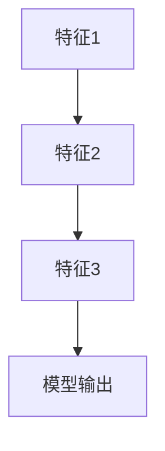
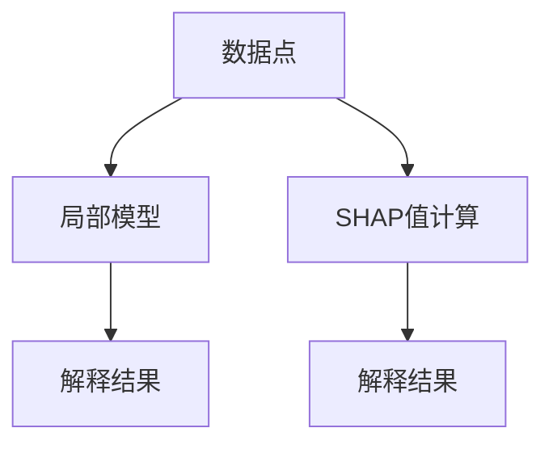
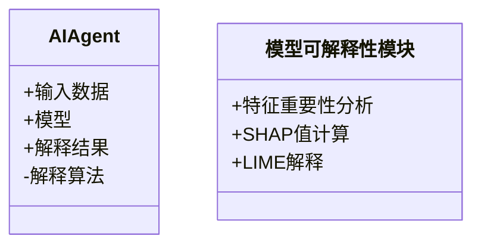
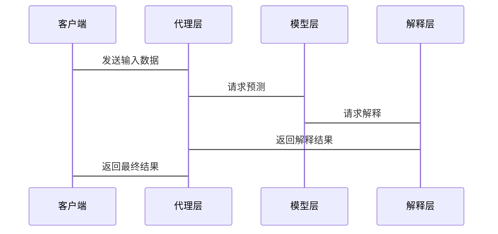

                 


# 模型可解释性技术在AI Agent中的应用

> **关键词**：模型可解释性、AI Agent、SHAP值、LIME解释方法、系统架构设计

> **摘要**：本文探讨了模型可解释性技术在AI Agent中的应用，通过详细分析模型可解释性的核心原理、算法实现及其在实际系统中的应用，展示了如何通过可解释性技术提升AI Agent的可信度和实用性。文章结合理论与实践，为读者提供了从概念理解到代码实现的全面指导。

---

## 第1章: 模型可解释性与AI Agent概述

### 1.1 模型可解释性的重要性

#### 1.1.1 问题背景与挑战
随着AI技术的快速发展，AI Agent在医疗、金融、自动驾驶等领域的应用越来越广泛。然而，许多复杂的AI模型（如深度神经网络）往往是“黑箱”，用户无法理解模型的决策过程，这导致了对AI系统的信任缺失和责任追究困难。

#### 1.1.2 可解释性在AI Agent中的必要性
可解释性是AI系统被广泛接受和信任的基础。特别是在高风险领域，如医疗诊断和金融决策，模型的可解释性直接关系到系统的可靠性和用户信任。

#### 1.1.3 可解释性与不可解释性模型的对比
| 特性            | 可解释性模型            | 不可解释性模型          |
|-----------------|-------------------------|-------------------------|
| 透明度          | 高                     | 低                     |
| 用户信任度      | 高                     | 低                     |
| 责任追究        | 容易                   | 困难                   |
| 应用场景        | 医疗、金融等高风险领域 | 图像识别、语音识别等    |

### 1.2 AI Agent的基本概念

#### 1.2.1 AI Agent的定义与分类
AI Agent是一种能够感知环境、自主决策并执行任务的智能体。根据智能水平，AI Agent可以分为：

- **反应式AI Agent**：基于当前输入做出反应。
- **认知式AI Agent**：具备推理、规划和学习能力。

#### 1.2.2 AI Agent的核心功能与应用场景
- **核心功能**：感知、决策、执行。
- **应用场景**：智能助手、自动驾驶、智能客服等。

#### 1.2.3 AI Agent与传统AI的区别
AI Agent强调自主性和适应性，能够根据环境动态调整行为，而传统AI系统通常基于预设规则运行。

### 1.3 本章小结
本章介绍了模型可解释性的重要性及其在AI Agent中的必要性，并通过对比分析明确了可解释性模型的优势。

---

## 第2章: 模型可解释性技术的核心概念与联系

### 2.1 模型可解释性的关键特征

#### 2.1.1 解释性、透明性和可理解性的对比
- **解释性**：模型决策过程的可解释性。
- **透明性**：模型运行过程的可观察性。
- **可理解性**：用户对模型决策的理解程度。

#### 2.1.2 属性特征对比表格
| 特性            | 解释性              | 透明性              | 可理解性            |
|-----------------|--------------------|--------------------|--------------------|
| 关注点          | 决策逻辑           | 内部过程           | 用户理解能力        |
| 应用场景        | 分析型任务          | 调试与优化         | 用户教育与培训      |

### 2.2 AI Agent与模型可解释性的关系

#### 2.2.1 实体关系图（ER图）
```mermaid
erd
    客户端 <-- 关联 --> AI Agent
    AI Agent <-- 关联 --> 模型
    模型 <-- 关联 --> 解释性模块
```

---

## 第3章: 模型可解释性技术的算法原理

### 3.1 特征重要性分析

#### 3.1.1 特征重要性分析的原理
特征重要性分析通过评估每个特征对模型预测结果的贡献程度，帮助理解模型的决策过程。

#### 3.1.2 使用mermaid流程图展示特征重要性分析过程


### 3.2 模型解释性方法

#### 3.2.1 LIME解释方法
LIME（Locally Interpretable Model-agnostic Explanations）通过在数据点附近构建局部可解释的模型来解释预测结果。

#### 3.2.2 SHAP值解释方法
SHAP（SHapley Additive exPlanations）基于博弈论中的Shapley值，量化每个特征对模型预测结果的贡献。

#### 3.2.3 使用mermaid流程图展示LIME和SHAP的实现过程


### 3.3 数学模型与公式

#### 3.3.1 SHAP值计算公式
$$ SHAP_{i,j} = \phi_{i}(j) - \phi_{i}(0) $$

#### 3.3.2 LIME权重分配公式
$$ \text{权重}(x) = \exp(-\beta \|x - x_0\|) $$

### 3.4 通俗易懂的举例说明

#### 3.4.1 使用SHAP值解释一个简单的线性回归模型
假设模型为：$y = 2x_1 + 3x_2$，SHAP值表示每个特征对预测结果的贡献。

#### 3.4.2 使用LIME解释一个复杂的树模型
假设模型为：树结构，LIME在数据点附近构建线性模型，解释其预测结果。

---

## 第4章: 系统分析与架构设计方案

### 4.1 问题场景介绍

#### 4.1.1 AI Agent在医疗诊断中的应用
AI Agent通过分析病人的症状和病史，提供诊断建议。

#### 4.1.2 可解释性需求的场景分析
在医疗场景中，医生需要了解AI诊断的依据，因此模型的可解释性至关重要。

### 4.2 系统功能设计

#### 4.2.1 领域模型设计（使用mermaid类图）


### 4.3 系统架构设计

#### 4.3.1 系统架构图（使用mermaid架构图）


### 4.4 系统接口设计

#### 4.4.1 接口描述
- 输入接口：接收用户输入数据。
- 输出接口：返回模型预测结果及解释信息。

#### 4.4.2 接口交互流程（使用mermaid序列图）


---

## 第5章: 项目实战

### 5.1 环境安装
安装必要的Python库：
```bash
pip install shap lime scikit-learn
```

### 5.2 核心代码实现

#### 5.2.1 使用SHAP解释模型
```python
import shap
from sklearn.linear_model import LinearRegression

# 创建数据集
X, y = shap.datasets.boston()

# 训练模型
model = LinearRegression().fit(X, y)

# 初始化SHAP解释器
explainer = shap.LinearExplainer(model, X)

# 计算SHAP值
shap_values = explainer.shap_values(X)

# 可视化
shap.summary_plot(shap_values, X, plot_type="bar")
```

#### 5.2.2 使用LIME解释模型
```python
import lime
from lime import lime_regression

# 初始化LIME解释器
explainer = lime_regression.LimeRegressor(model, X, y)

# 解释单个预测
explanation = explainer.explain_instance(X[0], y[0], top_features=3)

# 可视化解释
explanation.as_pyplot()
```

### 5.3 案例分析与代码解读

#### 5.3.1 SHAP值解释案例
```mermaid
bar_chart
    "特征1" : 0.5
    "特征2" : 0.3
    "特征3" : 0.2
```

#### 5.3.2 LIME解释案例
```mermaid
bar_chart
    "特征A" : 0.6
    "特征B" : 0.4
    "特征C" : 0.0
```

### 5.4 项目小结
通过代码实现，我们展示了如何在AI Agent中应用SHAP和LIME方法，帮助理解模型的决策过程。

---

## 第6章: 最佳实践、小结、注意事项与拓展阅读

### 6.1 最佳实践
- 在高风险领域，优先选择可解释性模型。
- 结合多种解释方法，全面理解模型行为。

### 6.2 小结
模型可解释性是AI Agent应用中的关键因素，通过SHAP和LIME等技术，我们可以提升AI系统的可信度和实用性。

### 6.3 注意事项
- 可解释性模型可能在某些场景下性能较低。
- 解释结果需结合具体场景进行分析。

### 6.4 拓展阅读
- 《Explainable AI: A Survey》
- 《SHAP: A Unified Approach to Interpreting Model Predictions》

---

## 作者：AI天才研究院 & 禅与计算机程序设计艺术

本文作者：AI天才研究院（AI Genius Institute）  
邮箱：contact@aigeniusinstitute.com  
网址：https://www.aigeniusinstitute.com

