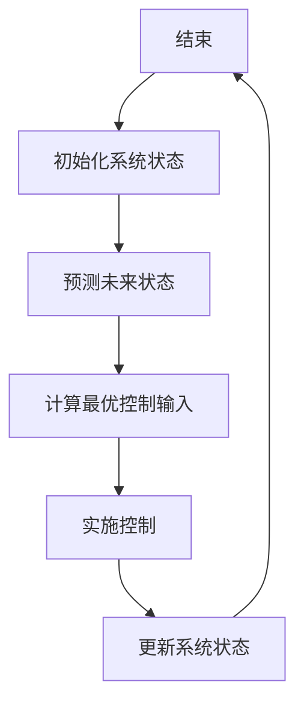

                 


# 模型预测控制：提高AI Agent的决策质量

## 关键词：模型预测控制，AI Agent，决策质量，优化算法，智能系统设计，系统架构，预测模型

## 摘要：模型预测控制（MPC）是一种通过预测未来状态来优化当前决策的控制策略，广泛应用于AI Agent的决策优化。本文将深入探讨MPC的核心原理、算法实现、系统架构设计以及实际应用案例，展示如何利用MPC技术显著提升AI Agent的决策质量。

---

# 第一部分: 模型预测控制（MPC）基础

## 第1章: 模型预测控制（MPC）概述

### 1.1 问题背景与定义

MPC（Model Predictive Control）是一种基于动态系统模型的优化控制方法，通过在每个时间步预测未来状态，并选择最优控制输入以实现目标。AI Agent在复杂环境中需要实时做出决策，MPC能够帮助其在有限时间内找到最优解决方案。

### 1.2 核心概念与优势

- **预测模型**：MPC依赖于系统的动态模型，用于预测未来状态。
- **优化目标**：通过优化目标函数，找到最优控制输入。
- **实时性**：MPC能够在每个时间步内做出决策，适合实时控制系统。

### 1.3 应用场景与边界

- **应用场景**：工业自动化、机器人控制、自动驾驶等领域。
- **边界**：MPC适用于动态系统，但需考虑模型的准确性及计算资源的限制。

## 第2章: AI Agent的决策优化

### 2.1 AI Agent的决策机制

AI Agent通过感知环境、分析信息、制定策略并执行动作来实现目标。MPC通过优化决策过程，提升决策质量。

### 2.2 决策质量的衡量标准

- **准确性**：决策是否符合预期。
- **实时性**：决策是否及时。
- **鲁棒性**：决策在不确定性环境中的适应能力。

### 2.3 MPC在AI Agent中的应用

通过预测未来状态，MPC帮助AI Agent做出更优决策，减少试错成本，提升系统性能。

---

# 第二部分: 模型预测控制的核心算法

## 第3章: MPC的核心算法原理

### 3.1 预测模型的构建

动态系统模型是MPC的基础，通常包括状态方程和输出方程。

### 3.2 优化目标的设定

目标函数通常包括状态误差、控制输入的惩罚项，以及约束条件。

### 3.3 算法实现步骤

1. 预测未来状态。
2. 计算最优控制输入。
3. 实施最优控制，并更新系统状态。

## 第4章: MPC的数学模型与公式

### 4.1 系统动态方程

状态方程：x_{k+1} = f(x_k, u_k) + w_k  
输出方程：y_k = h(x_k) + v_k

### 4.2 优化目标函数

J = Σ (x_i - x_{ref})^2 + λ(u_i - u_{ref})^2

### 4.3 约束条件

u_min ≤ u_i ≤ u_max  
x_min ≤ x_i ≤ x_max

## 第5章: MPC算法的实现

### 5.1 算法流程图



### 5.2 Python代码实现

```python
import numpy as np

def mpc_control(x_current, reference, model_params, constraints):
    # 预测未来状态
    x_predicted = model_predict(x_current, reference, model_params)
    # 计算最优控制输入
    u_optimal = optimize_control(x_predicted, constraints)
    return u_optimal

def model_predict(x, ref, params):
    # 使用系统模型预测未来状态
    pass

def optimize_control(x_pred, constraints):
    # 优化控制输入
    pass
```

---

# 第三部分: 基于模型预测控制的系统架构设计

## 第6章: 系统架构设计

### 6.1 系统功能设计

- **输入处理**：接收环境信息和目标。
- **状态预测**：基于模型预测未来状态。
- **控制优化**：计算最优控制输入。
- **输出执行**：实施控制并反馈结果。

### 6.2 系统架构图


### 6.3 系统接口设计

- 输入接口：接收环境数据和目标。
- 输出接口：发送控制信号。

## 第7章: 系统实现与优化

### 7.1 系统实现步骤

1. 系统初始化。
2. 实时状态预测。
3. 控制优化计算。
4. 输出控制信号。

### 7.2 系统优化技巧

- 算法优化：减少计算量。
- 模型优化：提高预测精度。

---

# 第四部分: 项目实战与案例分析

## 第8章: 项目实战

### 8.1 项目背景与需求分析

设计一个AI Agent，使用MPC技术优化其在复杂环境中的决策能力。

### 8.2 系统设计与实现

- **环境建模**：构建动态模型。
- **控制算法**：实现MPC算法。
- **系统测试**：验证算法效果。

### 8.3 代码实现

```python
def main():
    x_current = initialize_state()
    while True:
        u_optimal = mpc_control(x_current, reference, model_params, constraints)
        x_current = update_state(x_current, u_optimal)
```

### 8.4 实验结果与分析

通过实验验证MPC在提升决策质量方面的优势。

## 第9章: 案例分析

### 9.1 案例背景

在机器人导航中应用MPC优化路径规划。

### 9.2 系统设计与实现

- **环境建模**：构建机器人运动模型。
- **算法实现**：实现MPC算法进行路径规划。

### 9.3 实验结果

展示MPC在路径规划中的优势。

---

# 第五部分: 高级主题与未来展望

## 第10章: 高级主题

### 10.1 强化学习与MPC的结合

通过强化学习优化MPC的预测模型和优化目标。

### 10.2 多智能体协作

研究MPC在多智能体协作中的应用。

## 第11章: 未来展望

### 11.1 研究方向

- 更高效的优化算法。
- 更准确的预测模型。
- 更广泛的应用场景。

---

# 第六部分: 总结与小结

## 第12章: 总结

### 12.1 核心内容回顾

总结MPC在提升AI Agent决策质量中的应用和优势。

### 12.2 注意事项与建议

- 注意模型的准确性。
- 确保算法的实时性。
- 考虑系统的鲁棒性。

## 第13章: 未来展望

继续研究和改进MPC算法，探索更多应用场景。

---

# 作者：AI天才研究院/AI Genius Institute & 禅与计算机程序设计艺术 /Zen And The Art of Computer Programming

