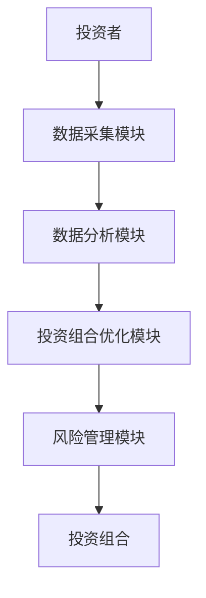
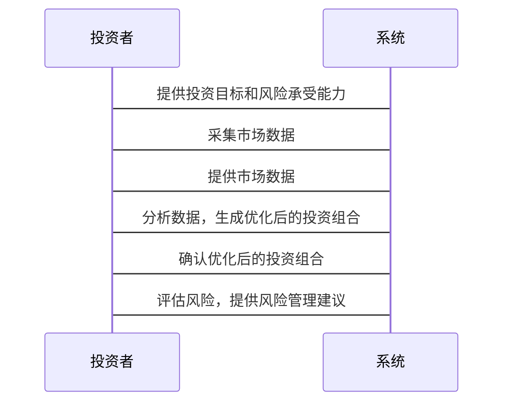

                 


# 每年更新投资组合的重要性

## 关键词：投资组合、资产配置、风险管理、投资策略、动态调整

## 摘要：投资组合的更新是保持投资收益和控制风险的重要手段。本文详细探讨了每年更新投资组合的必要性，介绍了核心概念、算法原理、系统架构设计、项目实战和最佳实践，帮助投资者更好地进行投资组合管理。

---

# 第一部分：投资组合管理的背景与基础

## 第1章：投资组合的基本概念

### 1.1 投资组合的定义与特点
#### 1.1.1 投资组合的定义
投资组合是指将多种资产（如股票、债券、房地产等）按照一定比例组合在一起，以实现投资目标的过程。

#### 1.1.2 投资组合的核心特点
- **分散性**：通过多样化投资降低风险。
- **流动性**：资产易于变现。
- **收益性**：通过合理配置资产实现较高的预期收益。

#### 1.1.3 投资组合与单一资产投资的区别
- 单一资产投资风险高，波动性大。
- 投资组合通过分散化降低风险，同时平衡收益。

### 1.2 投资组合管理的重要性
#### 1.2.1 投资组合管理的目标
- 实现投资收益最大化。
- 降低投资风险，保护资本。
- 确保投资目标与财务计划一致。

#### 1.2.2 投资组合管理的必要性
- 市场环境不断变化，需要动态调整。
- 投资者需求变化，需要及时优化。
- 资产配置失衡，需要定期调整。

#### 1.2.3 投资组合管理的常见误区
- 过度集中于某类资产。
- 忽视市场波动和经济周期变化。
- 低估风险管理的重要性。

---

## 第2章：投资组合更新的背景与问题背景

### 2.1 投资环境的变化
#### 2.1.1 经济周期的影响
- 经济周期波动导致资产价格变化。
- 不同周期阶段适合不同的资产配置。

#### 2.1.2 市场波动的加剧
- 股票、债券等资产价格波动加剧。
- 市场波动影响投资组合的收益与风险。

#### 2.1.3 政治与政策变化的影响
- 政策变化影响市场环境。
- 政治事件引发市场不确定性。

### 2.2 投资者需求的变化
#### 2.2.1 投资目标的变化
- 短期目标与长期目标的变化。
- 投资目标的调整需要动态优化。

#### 2.2.2 风险承受能力的变化
- 风险承受能力随时间和财务状况变化。
- 需要根据风险承受能力调整资产配置。

#### 2.2.3 投资期限的变化
- 投资期限的延长或缩短影响资产选择。
- 长期投资适合更高风险资产，短期投资适合低风险资产。

---

## 第3章：投资组合更新的必要性

### 3.1 投资组合失效的原因
#### 3.1.1 市场环境变化导致的失效
- 资产价格波动导致原配置失效。
- 市场环境变化影响预期收益与风险。

#### 3.1.2 投资者目标变化导致的失效
- 投资目标调整后，原配置不再适合。
- 风险承受能力或投资期限变化。

#### 3.1.3 资产配置失衡导致的失效
- 单一资产类别比例过大，风险过高。
- 资产类别比例过低，收益不足。

### 3.2 定期更新投资组合的意义
#### 3.2.1 提高投资收益的潜力
- 根据市场变化调整资产配置，捕捉更多收益机会。
- 优化投资组合，提升整体收益。

#### 3.2.2 降低投资风险的有效性
- 通过动态调整降低集中风险。
- 根据市场变化及时规避风险。

#### 3.2.3 确保投资目标的实现
- 定期调整投资组合，确保目标与现实相符。
- 及时应对市场变化，避免偏离目标。

---

## 第4章：投资组合更新的核心概念

### 4.1 资产配置的动态调整
#### 4.1.1 资产配置的基本原理
- 根据市场变化和个人目标调整资产比例。

#### 4.1.2 动态调整的必要性
- 市场波动需要动态调整。
- 个人需求变化需要及时响应。

#### 4.1.3 资产配置的常见策略
- 定期再平衡：按固定时间间隔调整资产比例。
- 目标导向调整：根据目标变化调整配置。
- 风险导向调整：根据风险变化调整配置。

### 4.2 风险管理与投资组合更新
#### 4.2.1 风险管理的基本概念
- 识别、评估和应对投资风险。

#### 4.2.2 投资组合更新中的风险管理
- 定期评估投资组合风险。
- 根据风险变化调整资产配置。

#### 4.2.3 风险调整后的投资策略
- 调整资产类别比例，降低整体风险。
- 选择风险可控的资产类别。

### 4.3 投资组合更新的数学模型

---

## 第5章：投资组合更新的算法原理

### 5.1 现代投资组合理论（MPT）基础
#### 5.1.1 MPT的核心思想
- 通过优化资产配置，实现风险与收益的最优平衡。

#### 5.1.2 投资组合优化的数学模型
$$
\text{Minimize } \sigma^2 \quad \text{Subject to } \mathbb{E}[r_p] = \text{Target Return}
$$
其中，$\sigma^2$是投资组合的方差，$\mathbb{E}[r_p]$是投资组合的期望收益。

#### 5.1.3 MPT的局限性
- 假设市场有效，实际情况可能有偏差。
- 忽略交易成本和税收等现实因素。

### 5.2 均值-方差优化模型
#### 5.2.1 均值-方差优化的定义
- 在给定收益下，最小化投资组合的方差。
- 在给定风险下，最大化投资组合的收益。

#### 5.2.2 均值-方差优化的数学公式
$$
\text{Minimize } \sigma^2 \quad \text{Subject to } \mathbb{E}[r_p] = \mu_p
$$
其中，$\mu_p$是目标投资组合的期望收益。

#### 5.2.3 均值-方差优化的实现步骤
1. 确定各资产的期望收益和协方差矩阵。
2. 使用优化算法求解最优权重。
3. 根据最优权重调整资产配置。

### 5.3 风险平价投资策略
#### 5.3.1 风险平价的定义
- 将投资组合的总风险在各资产类别之间平均分配。

#### 5.3.2 风险平价的数学模型
$$
\sum_{i=1}^n w_i^2 \sigma_i^2 = \text{Constant}
$$
其中，$w_i$是资产$i$的权重，$\sigma_i$是资产$i$的波动率。

#### 5.3.3 风险平价与传统投资策略的对比
- 风险平价更注重风险的均衡分配。
- 传统投资策略更注重收益的均衡分配。

---

## 第6章：投资组合更新的系统分析与架构设计

### 6.1 投资组合管理系统的功能需求
#### 6.1.1 数据采集模块
- 收集市场数据（如股票价格、债券收益率等）。
- 收集投资者信息（如风险承受能力、投资目标等）。

#### 6.1.2 数据分析模块
- 计算各资产的期望收益和风险。
- 评估投资组合的当前状态。

#### 6.1.3 投资组合优化模块
- 根据优化算法调整资产配置。
- 生成优化后的投资组合。

#### 6.1.4 风险管理模块
- 评估优化后的投资组合风险。
- 提供风险管理建议。

### 6.2 系统架构设计
#### 6.2.1 系统功能模块
- 数据采集模块。
- 数据分析模块。
- 投资组合优化模块。
- 风险管理模块。

#### 6.2.2 系统架构图


### 6.3 系统交互设计
#### 6.3.1 投资者与系统交互流程
1. 投资者输入投资目标和风险承受能力。
2. 系统采集市场数据。
3. 系统分析数据，生成优化后的投资组合。
4. 系统评估风险，提供风险管理建议。

#### 6.3.2 系统交互流程图


---

## 第7章：投资组合更新的项目实战

### 7.1 环境安装
- 安装Python和相关库（如NumPy、Pandas、Scipy）。
- 安装优化算法库（如Pyomo或CVXOPT）。

### 7.2 系统核心实现源代码
#### 7.2.1 数据采集模块
```python
import pandas as pd
import numpy as np

# 采集股票数据
def get_stock_data(tickers, start_date, end_date):
    data = pd.DataFrame()
    for ticker in tickers:
        data[ticker] = pd.read_csv(f'data/{ticker}.csv')['Close']
    return data
```

#### 7.2.2 数据分析模块
```python
import numpy as np

def calculate_return_and_risk(data):
    returns = data.pct_change()
    covariance_matrix = returns.cov()
    return returns.mean(), covariance_matrix
```

#### 7.2.3 投资组合优化模块
```python
from scipy.optimize import minimize

def optimize_portfolio(returns, covariance_matrix, target_return):
    n = len(returns.columns)
    # 初始化权重向量
    initial_guess = np.array([1/n]*n)
    # 约束条件：权重之和为1
    constraints = [{'type': 'eq', 'fun': lambda w: np.sum(w) - 1}]
    # 目标函数：最小化方差
    def objective_function(weights):
        return np.dot(weights.T, np.dot(covariance_matrix, weights))
    # 使用SLSQP求解器优化
    result = minimize(objective_function, initial_guess, constraints)
    return result.x
```

#### 7.2.4 风险管理模块
```python
def assess-risk(optimized_portfolio, returns, covariance_matrix):
    # 计算投资组合的波动率
    portfolio_variance = np.dot(optimized_portfolio.T, np.dot(covariance_matrix, optimized_portfolio))
    portfolio_volatility = np.sqrt(portfolio_variance)
    return portfolio_volatility
```

### 7.3 实际案例分析
#### 7.3.1 案例背景
- 投资者目标：长期资本增值，风险承受能力中等。
- 可用资产：股票、债券、房地产投资信托（REITs）。

#### 7.3.2 数据分析与优化
- 采集过去5年的历史数据。
- 计算各资产的期望收益和协方差矩阵。
- 使用均值-方差优化模型生成最优资产配置。

#### 7.3.3 结果解读
- 优化后的投资组合：股票60%，债券30%，REITs10%。
- 投资组合的预期收益为8%，波动率为12%。

#### 7.3.4 风险管理
- 投资组合的波动率低于市场平均水平，风险可控。
- 定期再平衡投资组合，确保配置与目标一致。

### 7.4 项目小结
- 通过实战项目，掌握了投资组合优化的基本方法。
- 学会了如何使用Python和优化算法实现投资组合管理。
- 理解了风险管理在投资组合更新中的重要性。

---

## 第8章：最佳实践与注意事项

### 8.1 风险管理
- 定期评估投资组合风险。
- 根据市场变化调整风险敞口。

### 8.2 定期审查与调整
- 至少每年审查一次投资组合。
- 根据市场变化和个人目标调整配置。

### 8.3 分散投资
- 避免过度集中于某类资产。
- 通过多样化投资降低风险。

### 8.4 注意事项
- 投资组合更新需要考虑交易成本和税收。
- 避免频繁调整，防止过度交易。
- 投资组合更新需要结合市场环境和个人需求。

---

## 第9章：总结与展望

### 9.1 小结
- 投资组合更新是保持投资收益和控制风险的重要手段。
- 定期更新投资组合能够适应市场变化和投资者需求。
- 科学的投资组合管理需要结合理论、算法和实践。

### 9.2 展望
- 随着人工智能和大数据技术的发展，投资组合管理将更加智能化。
- 更加复杂的优化算法将被应用于投资组合管理。
- 投资者教育和风险管理将在投资组合管理中发挥越来越重要的作用。

---

## 作者：AI天才研究院/AI Genius Institute & 禅与计算机程序设计艺术 /Zen And The Art of Computer Programming

