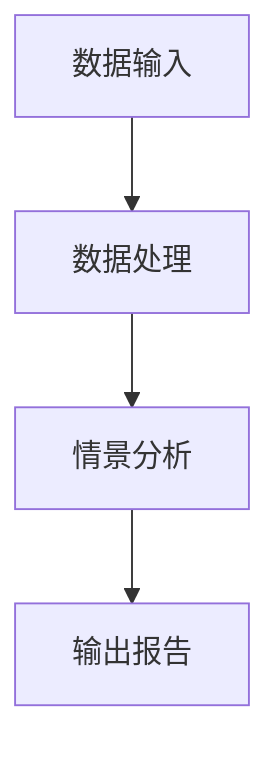
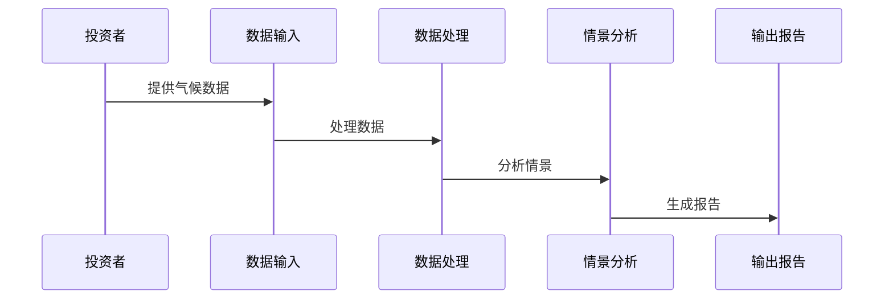

                 


# 气候变化情景分析在投资组合管理中的应用

## 关键词：气候变化情景分析、投资组合管理、风险管理、蒙特卡洛模拟、系统架构设计

## 摘要：本文探讨了气候变化情景分析在投资组合管理中的应用，详细讲解了气候变化情景分析的定义、原理、算法模型、系统架构设计，以及如何通过实际案例实现对投资组合的优化和风险管理。文章结合了理论与实践，旨在帮助读者理解如何将气候变化因素纳入投资决策过程，以应对潜在的气候风险。

---

## 第一部分：气候变化情景分析的背景与基础

### 第1章：气候变化与投资组合管理概述

#### 1.1 气候变化的定义与影响

- 气候变化是指地球气候系统长期的变化，包括温度、降水模式、极端天气事件频率等方面的改变。
- 气候变化对全球经济的影响：农业减产、水资源短缺、自然灾害频发，导致企业收益下降、资产贬值。
- 投资组合管理的基本概念：通过分散投资降低风险，优化资产配置以实现收益最大化。

#### 1.2 气候变化情景分析的必要性

- 气候变化对金融市场的潜在影响：极端天气可能导致企业倒闭，进而影响股价波动。
- 投资组合管理中的风险管理需求：识别和量化气候相关风险，制定应对策略。
- 气候变化情景分析的现实意义：帮助投资者在不确定性中做出更明智的决策。

---

### 第2章：气候变化情景分析的核心概念

#### 2.1 气候变化情景分析的定义

- 气候变化情景分析是通过构建不同气候情景，评估这些情景对经济和投资组合的影响。
- 情景分类：最佳猜测情景、中间情景、最坏情景。
- 情景分析的关键要素：温度上升幅度、极端天气事件频率、政策变化等。

#### 2.2 投资组合管理中的情景分析

- 投资组合管理的基本原理：分散投资以降低风险。
- 情景分析在投资组合管理中的应用：评估不同经济条件下的资产表现。
- 气候变化情景分析的独特性：结合气候数据和经济模型，量化气候风险。

---

## 第二部分：气候变化情景分析的算法原理

### 第3章：气候变化情景分析的数学模型与算法

#### 3.1 气候变化情景分析的数学模型

- 气候变化预测模型：使用时间序列分析（如ARIMA）预测温度变化。
- 投资组合风险评估模型：基于蒙特卡洛模拟评估不同情景下的风险。

#### 3.2 投资组合风险管理的理论框架

- 风险管理的基本理论：VaR（在险价值）和CVaR（条件在险价值）。
- 投资组合风险管理的核心方法：资产分配、风险对冲、情景模拟。

---

## 第三部分：系统分析与架构设计

### 第4章：系统架构设计方案

#### 4.1 问题场景介绍

- 投资者需要在考虑气候变化因素的情况下，优化其投资组合。

#### 4.2 系统功能设计

- 数据输入模块：接收气候数据和市场数据。
- 数据处理模块：清洗和预处理数据。
- 情景分析模块：生成不同气候情景并模拟资产表现。
- 输出模块：生成报告和可视化结果。

#### 4.3 系统架构设计（Mermaid图）



#### 4.4 系统交互设计（Mermaid图）



---

## 第四部分：项目实战

### 第5章：项目实现与案例分析

#### 5.1 环境安装

- 安装Python和相关库（numpy、pandas、scikit-learn、matplotlib）。

#### 5.2 核心代码实现

```python
import numpy as np
import pandas as pd
from sklearn.linear_model import LinearRegression

# 示例数据：气候变化情景下的资产回报
climate情景 = pd.DataFrame({
    '情景1': [0.05, -0.02, 0.03],
    '情景2': [0.02, 0.01, -0.04],
    '情景3': [-0.01, 0.06, 0.02]
})

# 使用蒙特卡洛模拟评估投资组合风险
def monte_carlo_simulation(assets, simulations=1000):
    returns = assets.values.T
    simulations_data = np.random.permutation(returns)
    portfolio_returns = simulations_data.mean(axis=1)
    return portfolio_returns

portfolio_returns = monte_carlo_simulation(climate情景)
```

#### 5.3 案例分析

- 模拟投资组合在不同气候情景下的表现，评估风险和收益。

---

## 第五部分：总结与展望

### 6.1 最佳实践 Tips

- 定期更新气候数据，保持模型的准确性。
- 结合多种情景分析方法，提高决策的稳健性。

### 6.2 小结

气候变化情景分析是投资组合管理中的重要工具，能够帮助投资者更好地应对气候风险。

### 6.3 注意事项

- 数据的准确性和完整性直接影响分析结果。
- 模型的选择应根据实际情况进行调整。

### 6.4 拓展阅读

推荐阅读《气候变化经济学》和《金融风险管理》相关书籍。

---

## 作者

作者：AI天才研究院/AI Genius Institute & 禅与计算机程序设计艺术/Zen And The Art of Computer Programming

