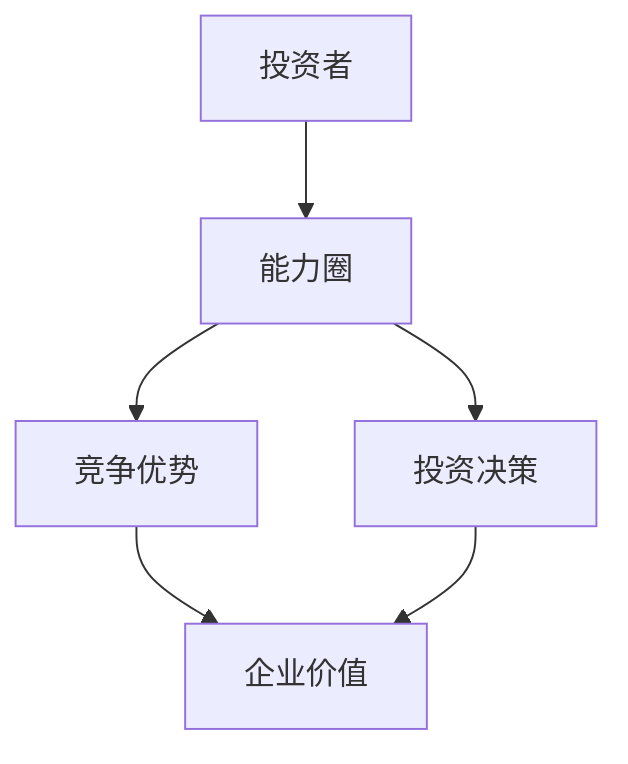
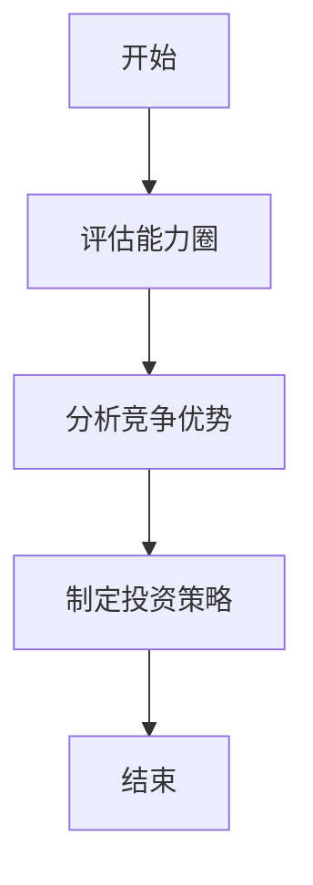
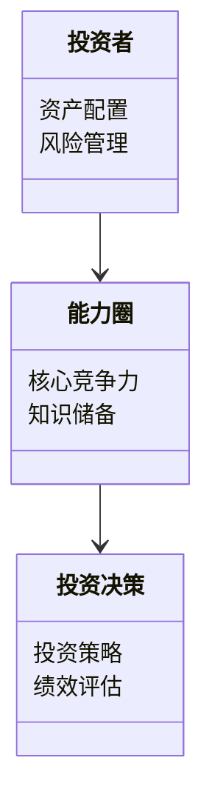

                 


# 沃伦·巴菲特的Circle of Competence理论

## 关键词：沃伦·巴菲特，能力圈，投资哲学，竞争优势，风险管理，价值评估

## 摘要：沃伦·巴菲特的Circle of Competence理论强调投资者应专注于自身熟悉和理解的领域，通过深入分析竞争优势和内在价值，制定合理的投资决策，以降低风险并实现长期收益。本文详细探讨该理论的核心概念、算法原理、系统架构及其在实际投资中的应用，为读者提供从理论到实践的全面指导。

---

## 第1章: 背景介绍：Circle of Competence的核心概念

### 1.1 问题背景与问题描述
#### 1.1.1 投资者面临的不确定性与风险
投资领域充满了不确定性，市场波动、经济变化和企业经营状况的不可预测性使得投资决策变得复杂。投资者在面对众多选择时，常常难以准确评估每个投资对象的潜力和风险。

#### 1.1.2 为什么能力圈对投资至关重要
巴菲特强调，投资者应专注于自己熟悉和理解的领域，即构建自己的“能力圈”。能力圈内的投资更具可控性和可预测性，从而降低风险并提高投资成功率。

#### 1.1.3 能力圈理论的核心问题解决
能力圈理论帮助投资者识别和专注于自己的优势领域，避免盲目投资，从而在复杂多变的市场中做出更明智的决策。

### 1.2 核心概念与边界
#### 1.2.1 能力圈的定义与外延
能力圈是指投资者在知识、经验和资源上的优势领域，能够对该领域内的企业和市场动态进行深入分析和判断。

#### 1.2.2 能力圈的边界与限制
能力圈并非无限扩展，投资者需要明确自己的知识和经验边界，避免超出能力范围的决策。

#### 1.2.3 能力圈与投资决策的关系
能力圈直接影响投资决策的质量和效果，投资者应在能力圈内寻找投资机会，避免盲目进入不熟悉的领域。

---

## 第2章: 核心概念与联系

### 2.1 核心原理
#### 2.1.1 能力圈的形成过程
能力圈的形成依赖于投资者的知识积累、经验总结和持续学习，逐步构建对特定领域深刻的理解和洞察。

#### 2.1.2 能力圈与竞争优势的关系
能力圈内的企业往往具有竞争优势，如成本优势、技术壁垒或市场支配地位，这些因素增强了企业的盈利能力。

#### 2.1.3 能力圈与投资组合管理的结合
通过能力圈理论，投资者可以优化投资组合，集中资源于自己熟悉且具有竞争优势的领域，提高整体投资收益。

### 2.2 概念属性对比表格
| 概念         | 属性                         |
|--------------|------------------------------|
| 能力圈       | 知识深度、经验广度、竞争优势 |
| 投资决策     | 信息处理、风险评估、收益预期 |

### 2.3 实体关系图


---

## 第3章: 算法原理与数学模型

### 3.1 算法流程图


### 3.2 数学模型
$$
\text{投资价值} = \text{内在价值} \times \text{能力圈评估}
$$

---

## 第4章: 系统分析与架构设计

### 4.1 系统功能设计


---

## 第5章: 项目实战

### 5.1 环境配置
#### 5.1.1 安装必要的工具
安装Python、Pandas、NumPy等工具，用于数据分析和处理。

### 5.2 核心代码实现
```python
import pandas as pd

def calculate_intrinsic_value(stock_data):
    # 简单计算内在价值的方法
    return stock_data['Revenue'] * 0.5  # 示例方法，实际应更复杂

# 示例数据
data = {
    'Revenue': [100, 200, 150],
    'NetIncome': [50, 100, 75]
}
df = pd.DataFrame(data)

# 计算内在价值
intrinsic_values = df['Revenue'].apply(lambda x: x * 0.5)

print(intrinsic_values)
```

### 5.3 案例分析与解读
以具体企业为例，分析其竞争优势和内在价值，评估其是否在自己的能力圈内，从而决定是否投资。

---

## 第6章: 总结与展望

### 6.1 总结
能力圈理论为投资者提供了科学的投资框架，强调专注和深入理解，从而在复杂市场中做出明智决策。

### 6.2 最佳实践 Tips
- 持续学习和积累，扩大自己的能力圈。
- 定期评估和调整投资组合，确保符合能力圈的边界。
- 结合定量分析和定性分析，全面评估投资标的。

---

## 作者：AI天才研究院/AI Genius Institute & 禅与计算机程序设计艺术 /Zen And The Art of Computer Programming

---

这篇文章通过系统化的分析和实际案例，深入探讨了沃伦·巴菲特的Circle of Competence理论，为投资者提供了从理论到实践的全面指导。希望读者能够通过本文，更好地理解和应用这一理论，实现稳健的投资收益。

