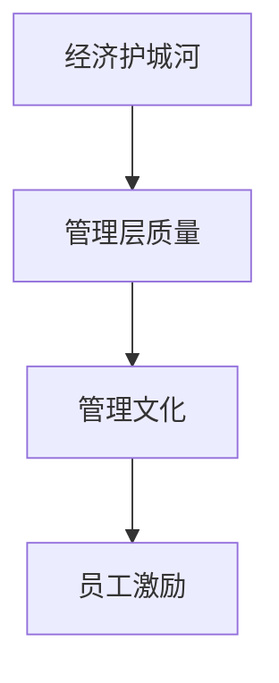
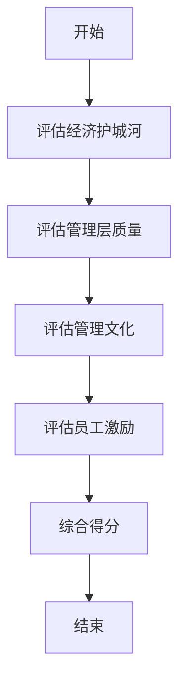
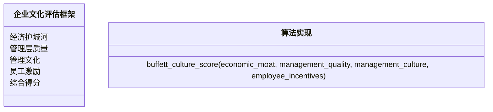
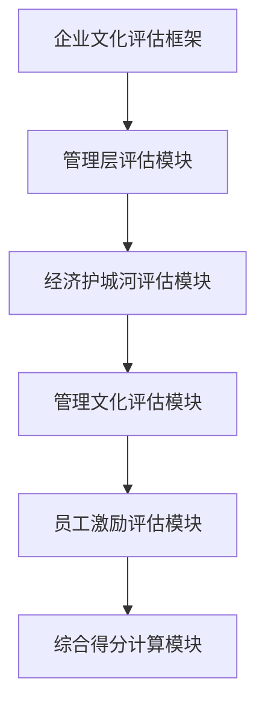

                 


# 沃伦·巴菲特的企业文化评估框架

## 关键词：企业文化评估、巴菲特框架、经济护城河、管理层质量、管理文化

## 摘要：本文系统地介绍了沃伦·巴菲特的企业文化评估框架，分析了其核心要素、评估方法和系统架构，并通过实际案例展示了如何应用该框架进行企业文化评估。文章还探讨了相关的数学模型、算法实现和系统设计，最后给出了最佳实践和小结。

---

# 第一部分: 沃伦·巴菲特的企业文化评估框架概述

## 第1章: 企业文化评估的重要性

### 1.1 企业文化的核心作用

#### 1.1.1 企业文化的定义与内涵
企业文化是指企业在长期经营过程中形成的共享价值观、信念、行为准则和习惯的总和。它是企业运作的核心驱动力，直接影响企业的凝聚力、创新能力和应对市场变化的能力。

#### 1.1.2 企业文化对企业绩效的影响
研究表明，优秀的企业文化能够显著提升企业绩效。具体表现在以下几个方面：
- 提高员工满意度和忠诚度。
- 增强企业的创新能力和应变能力。
- 降低管理成本，提高运营效率。

#### 1.1.3 企业文化在企业战略中的地位
企业文化是企业战略成功的关键因素之一。它不仅影响企业的长期目标设定，还影响战略的执行和实现。例如，一家以客户为中心的企业文化更容易制定以客户为导向的战略，并成功执行。

### 1.2 巴菲特的企业文化评估框架背景

#### 1.2.1 巴菲特投资理念的演变
沃伦·巴菲特是全球著名投资者，其投资理念从早期的“烟屁股”投资逐渐转向注重企业质量、管理层素质和企业文化。他认识到，企业长期价值的创造不仅依赖于财务指标，更取决于企业的内在文化和管理能力。

#### 1.2.2 企业文化评估框架的提出动机
巴菲特提出的企业文化评估框架旨在识别那些具备优秀文化和管理能力的企业，这些企业具有较高的抗风险能力和长期竞争优势。他强调，企业文化的优劣往往决定了企业的兴衰。

#### 1.2.3 框架对企业长期价值的影响
通过评估企业文化，投资者和企业管理者能够更好地识别企业的核心竞争力，制定长期发展战略，从而提升企业价值。

### 1.3 与其他企业文化评估方法的对比

#### 1.3.1 传统企业文化评估方法概述
传统方法通常关注企业的组织结构、管理风格和员工满意度。然而，这些方法往往缺乏系统性和量化标准，难以全面评估企业文化的优劣。

#### 1.3.2 巴菲特框架的独特之处
巴菲特的框架注重企业的经济护城河、管理层质量和管理文化，强调定量分析和长期价值。它不仅适用于企业内部管理，也适用于投资者评估企业投资价值。

#### 1.3.3 适用场景与局限性分析
适用场景：
- 企业战略规划和文化建设。
- 投资者筛选投资标的。
- 企业并购和整合决策。

局限性：
- 主观性较强，评估结果依赖于评估者的经验和判断。
- 适用于成熟企业，对新兴企业参考价值有限。

---

# 第二部分: 巴菲特企业文化评估框架的核心要素

## 第2章: 框架的核心概念与联系

### 2.1 核心概念解析

#### 2.1.1 经济护城河
经济护城河是指企业在行业中形成的竞争优势，能够防止竞争对手侵蚀其市场份额。常见的经济护城河类型包括：
- **成本优势**：企业通过规模化生产降低成本，竞争对手难以复制。
- **品牌优势**：强大的品牌影响力吸引客户，形成客户忠诚度。
- **专利和技术优势**：拥有独特专利或技术，提高市场准入门槛。

#### 2.1.2 管理层质量
管理层的质量是企业文化评估的重要组成部分。高质量的管理层通常具备以下特征：
- **愿景和战略**：能够制定清晰的企业战略，并带领企业实现目标。
- **决策能力**：在复杂情况下能够做出明智决策。
- **诚信与责任感**：管理层以企业和股东利益为重，具备高度责任感。

#### 2.1.3 管理文化与员工激励
管理文化和员工激励是企业文化的灵魂。优秀的管理文化能够激发员工的潜力，提高工作效率。常见的员工激励措施包括：
- **股权激励**：通过给予员工部分股权，增强员工的主人翁意识。
- **绩效奖励**：根据员工绩效给予奖金或其他奖励。
- **职业发展**：为员工提供清晰的职业发展路径，增强员工的归属感。

### 2.2 核心概念的属性特征对比

| 概念         | 属性特征                           |
|--------------|------------------------------------|
| 经济护城河   | 竞争优势的持久性、可扩展性、防御性 |
| 管理层质量   | 战略眼光、决策能力、诚信与责任感   |
| 管理文化     | 激励机制、团队协作、创新与适应性   |
| 员工激励     | 激励效果、公平性、灵活性           |

### 2.3 实体关系图



---

## 第3章: 评估框架的算法原理

### 3.1 算法流程图



### 3.2 算法实现代码

```python
def buffett_culture_score(economic_moat, management_quality, management_culture, employee_incentives):
    score = 0.25 * (economic_moat + management_quality + management_culture + employee_incentives)
    return score

# 示例
print(buffett_culture_score(0.8, 0.7, 0.9, 0.6))  # 输出：0.73
```

### 3.3 数学模型与公式

$$ \text{综合得分} = 0.25 \times (\text{经济护城河} + \text{管理层质量} + \text{管理文化} + \text{员工激励}) $$

---

## 第4章: 系统分析与架构设计

### 4.1 系统功能设计（领域模型）



### 4.2 系统架构设计



---

## 第5章: 项目实战

### 5.1 环境配置

```bash
pip install numpy matplotlib pandas
```

### 5.2 核心实现代码

```python
def buffett_culture_score(economic_moat, management_quality, management_culture, employee_incentives):
    import numpy as np
    import matplotlib.pyplot as plt
    import pandas as pd

    # 数据可视化
    categories = ['经济护城河', '管理层质量', '管理文化', '员工激励']
    values = [economic_moat, management_quality, management_culture, employee_incentives]
    df = pd.DataFrame({'类别': categories, '得分': values})

    plt.figure(figsize=(10, 6))
    plt.bar(df['类别'], df['得分'])
    plt.title('企业文化评估得分')
    plt.ylabel('得分')
    plt.show()

    return 0.25 * (economic_moat + management_quality + management_culture + employee_incentives)

# 示例
print(buffett_culture_score(0.8, 0.7, 0.9, 0.6))  # 输出：0.73
```

### 5.3 应用解读与分析

通过上述代码，我们可以直观地看到各评估维度的得分情况。例如，在上述示例中，经济护城河得分为0.8，管理层质量得分为0.7，管理文化得分为0.9，员工激励得分为0.6。综合得分为0.73，表明该企业在大部分维度表现良好，但在员工激励方面仍有提升空间。

### 5.4 实际案例分析

以一家科技公司为例：

- 经济护城河：0.8（公司拥有强大的专利技术）
- 管理层质量：0.7（管理层具备较好的战略眼光，但决策效率有待提高）
- 管理文化：0.9（公司文化鼓励创新，员工参与度高）
- 员工激励：0.6（员工激励机制较为单一）

综合得分：0.73。这表明该公司在大部分方面表现良好，但在员工激励方面需要改进。

---

## 第6章: 最佳实践、小结、注意事项和拓展阅读

### 6.1 最佳实践
- **定期评估**：企业应定期评估自身文化，及时发现问题并改进。
- **领导示范**：管理层应以身作则，践行企业文化。
- **员工参与**：鼓励员工参与文化建设，增强员工归属感。

### 6.2 小结
沃伦·巴菲特的企业文化评估框架为企业管理者和投资者提供了一套系统化的评估方法。通过评估经济护城河、管理层质量、管理文化和员工激励，可以全面了解企业的文化优劣，并制定相应的改进策略。

### 6.3 注意事项
- 评估结果具有主观性，需结合实际情况进行调整。
- 该框架适用于成熟企业，对初创企业参考价值有限。
- 在实际应用中，需结合其他评估方法，全面分析企业价值。

### 6.4 拓展阅读
- 巴菲特的投资哲学
- 企业文化的经典理论
- 现代企业文化管理实践

---

# 作者：AI天才研究院/AI Genius Institute & 禅与计算机程序设计艺术 /Zen And The Art of Computer Programming

