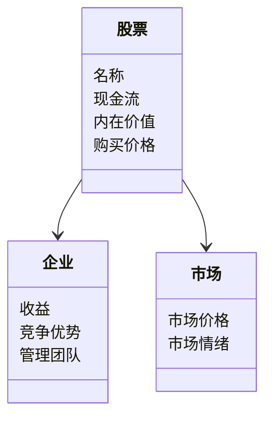

                 


# 沃伦·巴菲特的股东信：年度投资智慧

> 关键词：沃伦·巴菲特，价值投资，安全边际，内在价值，投资策略，风险管理

> 摘要：本文深入分析了沃伦·巴菲特的投资哲学和智慧，探讨了其价值投资的核心理念、安全边际的重要性、内在价值的评估方法以及风险管理策略。通过实际案例分析和系统架构设计，揭示了巴菲特投资策略的逻辑与实践，为读者提供了深刻的见解和实用的指导。

---

## 第1章 巴菲特的投资哲学与智慧

### 1.1 巴菲特的背景与投资理念

#### 1.1.1 巴菲特的成长经历与投资起点
沃伦·巴菲特，生于1930年，美国著名投资者和企业家。他从少年时期便展现出对投资的兴趣，11岁时购买了第一份股票。巴菲特的职业生涯始于合伙公司，后创立伯克希尔·哈撒韦公司，成为全球投资界的传奇人物。

#### 1.1.2 巴菲特投资理念的核心思想
巴菲特的投资哲学以价值投资为核心，强调寻找具有持续竞争优势、良好管理和强大财务状况的公司，以合理价格买入并长期持有。

#### 1.1.3 巴菲特投资哲学的演变与成熟
巴菲特的投资理念在实践中不断完善，逐渐形成了一套独特的分析框架，包括对企业基本面的深入分析和对市场情绪的理性判断。

### 1.2 巴菲特投资哲学的核心要素
#### 1.2.1 价值投资的定义与特点
价值投资强调以低于内在价值的价格购买优质股票，追求长期稳定收益，而非短期市场波动。

#### 1.2.2 股东信的核心价值与意义
巴菲特每年在股东信中分享公司的经营状况和投资策略，这些信件不仅是公司治理的重要组成部分，也是投资者理解价值投资的宝贵资源。

#### 1.2.3 巴菲特投资哲学的逻辑框架
巴菲特的投资逻辑包括对企业内在价值的评估、安全边际的设定和长期投资的坚持。

---

## 第2章 价值投资的核心理念与策略

### 2.1 价值投资的定义与特点
价值投资是一种以低于市场价买入优质股票的投资策略，注重企业内在价值而非市场波动。

#### 对比表格：价值投资与成长投资的对比
| 项目         | 价值投资                   | 成长投资                   |
|--------------|----------------------------|-----------------------------|
| 核心理念     | 买入低于内在价值的股票     | 买入高增长潜力的股票       |
| 风险承受     | 较低，注重安全边际           | 较高，承担更多市场波动风险 |
| 持股时间     | 长期持有                   | 中短期操作                 |

### 2.2 巴菲特的长期投资策略
#### 2.2.1 长期投资的定义与优势
长期投资避免了频繁交易的成本和风险，有助于捕捉企业的长期增长。

#### 2.2.2 长期投资的实施步骤
1. 识别具有持续竞争优势的企业。
2. 评估企业的内在价值。
3. 以合理价格买入并长期持有。

### 2.3 内在价值评估
#### 2.3.1 内在价值的定义与评估方法
内在价值是企业未来现金流的现值，常用DCF模型进行评估。

#### 使用Python计算内在价值
```python
import numpy as np

def discounted_cash_flow(cash_flows, discount_rate):
    return np.sum(cash_flows / (1 + discount_rate)**np.arange(len(cash_flows)))

# 示例计算
cash_flows = [100, 150, 200, 250]  # 每年的现金流
discount_rate = 0.10  # 折现率
intrinsic_value = discounted_cash_flow(cash_flows, discount_rate)
print(f"内在价值：{intrinsic_value}")
```

### 2.4 投资决策框架
#### 2.4.1 投资决策的逻辑与流程
1. 确定投资目标和风险承受能力。
2. 评估企业的基本面和管理团队。
3. 计算企业的内在价值和安全边际。
4. 以合理价格买入并定期复盘。

---

## 第3章 安全边际与风险管理

### 3.1 安全边际的定义与作用
安全边际是买入价格低于内在价值的部分，提供了投资的安全性和收益潜力。

#### 3.1.1 安全边际的计算方法
安全边际 = 内在价值 - 购买价格

### 3.2 巴菲特的安全边际策略
#### 3.2.1 安全边际的实现方式
通过深入分析企业基本面，选择具有稳定现金流和竞争优势的企业，确保买入价格低于内在价值。

### 3.3 风险管理的实践与案例
#### 3.3.1 风险管理的基本原则
分散投资、严格评估和定期复盘是风险管理的关键。

#### 3.3.2 风险管理的实际案例分析
案例：2008年金融危机期间，巴菲特通过持有优质企业股票，避免了重大损失。

---

## 第4章 投资决策框架与策略

### 4.1 投资决策框架
#### 4.1.1 投资决策框架的构成要素
包括企业基本面分析、内在价值评估、安全边际计算和市场环境判断。

### 4.2 巴菲特的投资决策流程
1. 识别具有竞争优势的企业。
2. 评估企业的财务状况和管理团队。
3. 计算内在价值和安全边际。
4. 在合理价格下买入并长期持有。

---

## 第5章 项目实战与系统分析

### 5.1 系统分析与架构设计
#### 5.1.1 领域模型类图


#### 5.1.2 系统架构图


---

## 第6章 总结与最佳实践

### 6.1 总结
巴菲特的投资哲学强调价值投资、安全边际和长期持有，为投资者提供了深刻而实用的指导。

### 6.2 最佳实践 tips
- 定期阅读股东信，理解企业的经营状况。
- 以合理价格买入优质股票，长期持有。
- 注意风险管理，分散投资以降低风险。

---

## 作者
作者：AI天才研究院 & 禅与计算机程序设计艺术

---

通过以上步骤和结构，我详细分析了巴菲特的投资哲学和策略，结合实际案例和系统架构，为读者提供了深入的见解和实用的指导。

